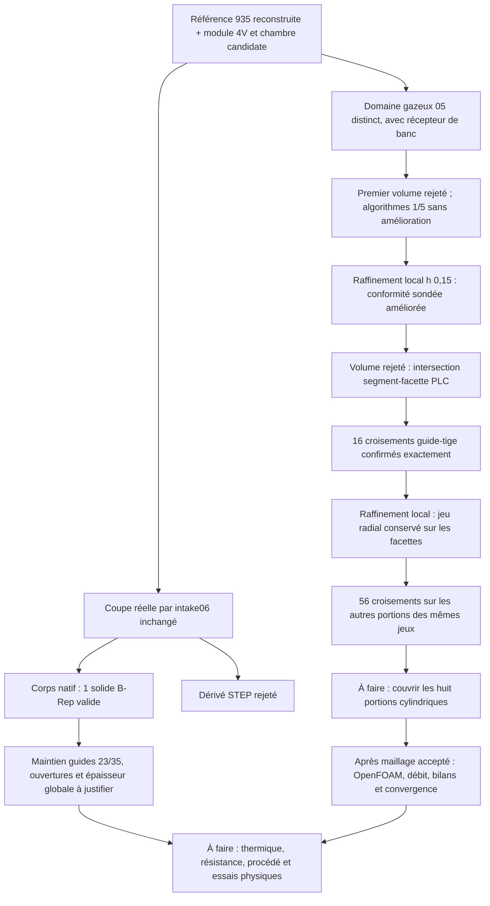

# M64 — corps évidé et maillage d'admission

## Résultat et périmètre

**Suite publiée :** le [lot suivant](M64_VOLUME_REEL_CONTROLES_20260908.md)
couvre les huit portions guide–tige et obtient un volume de 481 189
tétraèdres. OpenFOAM rejette encore sa qualité. Le présent document conserve
la chronologie des essais précédents, sans transformer leurs contrôles locaux
en validation du résultat suivant.

Les conduits d'admission sont désormais **réellement soustraits au corps déjà
pourvu de la chambre candidate**. Le nouvel export natif est un solide B-Rep
valide ; son dérivé STEP est rejeté. En parallèle, un raffinement local améliore
la représentation d'une face du domaine d'air, sans constituer encore un
maillage volumique accepté ni un résultat CFD.

La cible reste une culasse quatre soupapes **M64 biturbo de 700 PS au vilebrequin**,
pas une puissance démontrée. L'enveloppe est issue de la
[référence scannée 935 reconstruite](M64_FOUR_SEAT_BODY_CAD_AUDIT.md), avec
l'hypothèse non étalonnée `1 unité de scan = 1 mm`. Ni les interfaces M64,
ni les charges thermiques ne découlent de cette hypothèse ou des 700 PS.
Les maîtres antérieurs sont préservés ; aucun changement de silhouette
n'est justifié par la seule réussite d'une opération CAO.

## Corps : une coupe effective, deux contrôles en lecture seule

Le [constructeur](../twins/m64-cylinder-head/source/flowbench-intake/build_ported_chamber_candidate.py)
soustrait uniquement le négatif natif `intake06` inchangé. Corps et conduit
étaient déjà dans le même repère : aucun second recalage, aucun récepteur
de banc et aucun prolongement de joint de tige ne sont utilisés comme outil.
Le [reçu du corps](../twins/m64-cylinder-head/evidence/ported-chamber-intake-candidate-20260908.json)
conserve les empreintes d'entrée, de source réellement exécutée et de résultats.

| Contrôle | Constat |
| --- | --- |
| Matière réellement retirée | 173 194,170 unités³ ; distincte du volume de l'outil |
| Corps natif obtenu | 1 solide, volume 1 244 303,586 unités³ ; B-Rep valide avant et après relecture native |
| Échange STEP | Relecture B-Rep invalide : dérivé rejeté, non utilisé pour le rendu |
| Boîte englobante | Écart maximal nul ; ce n'est pas une preuve complète de silhouette préservée |
| Sièges et guides d'échappement | Aires de contact cylindrique nominales conservées |
| Deux guides d'admission | Chacun conserve **23 unités sur 35**, sur une couronne cylindrique complète à 360° |
| Paroi du nouveau conduit | 24 rayons résolus sur **8 des 11** nouvelles faces ; minimum échantillonné **2 unités**, aucun sous le seuil exploratoire de 1,5 |

L'extrémité d'un guide exposée au conduit n'est pas automatiquement un défaut
mécanique. Les 23 unités restantes exigent toutefois une justification du
maintien, des charges et du transfert thermique : les surfaces mesurées ne
sont ni une pression d'emmanchement ni une tenue à chaud. Le statut conservé
est donc « revue du support des guides requise », sans exiger arbitrairement
zéro perte de contact comme règle constructeur.

Les rayons traversent la matière du **nouveau** corps jusqu'à sa première
sortie native, vérifiée par un rejeu en lecture seule. Trois faces ne sont
pas échantillonnées : ni minimum global, ni fraction de surface trop mince,
ni qualification d'impression ne sont établis. De même, les 182 contacts
avec l'ancienne peau incluent des parois de vides internes ; le résidu nul
hors masques admission/chambre/logements ne prouve pas à lui seul l'absence
de toute ouverture extérieure indésirable. Le BOP complet du nouveau corps
n'a pas été exécuté.

La coupe unique a terminé en 75,94 s, sortie 3 correspondant au statut de
revue de conception ; les deux diagnostics ont terminé avec une sortie 0.
Exécution native limitée à 2 CPU/4 Gio/300 s, sans réseau ni location.
Les [trois tests ciblés](../tests/test_m64_ported_chamber_candidate.py)
contrôlent les règles logicielles ; ils ne remplacent pas ces constats CAO.

Le rendu privé `render-02/corps-admission-coupe.png` montre le corps gris,
le conduit bleu et une coupe du module. Son empreinte et celle du reçu de
rendu sont liées dans le reçu du corps. Il provient du B-Rep natif
`33375e12…`, pas du STEP rejeté ; ce n'est ni une photographie de fabrication
ni un champ de température. La seconde version corrige seulement le libellé
du maintien des guides en « à vérifier », sans modifier la géométrie.

## Maillage : amélioration locale mesurée, pas acceptation globale

Ce travail porte sur le **domaine gazeux distinct** `gas-domain-05`, B-Rep
`3f20f4c5…`, comprenant chambre, composants et récepteur de banc. Il ne s'agit
pas d'un maillage de conduction du nouveau corps solide. La première
[tentative volumique](../twins/m64-cylinder-head/evidence/native-gas-mesh-pilot-20260908.json)
a été rejetée sur des facettes de la face 38 (`walls_port`) ; aucun volume
exploitable n'en est issu.

Les [essais d'algorithmes 1 et 5](../twins/m64-cylinder-head/evidence/native-gas-face38-algorithm-comparison-20260908.json)
à tailles inchangées reproduisent les mêmes 25 triangles de cette face, sans
amélioration. Le choix 5 et le choix initial 6 se replient vers MeshAdapt :
ce ne sont pas trois méthodes finales indépendantes. Les sorties 0 de ces
essais signifient seulement que les surfaces diagnostiques ont été sauvegardées.

Un raffinement local à `h = 0,15 unité`, sans changement de CAO ni de tolérance,
produit 523 triangles sur cette face. Le
[contre-audit de conformité CAO](../twins/m64-cylinder-head/evidence/independent-surface-cad-conformity-20260908.json)
mesure l'amélioration suivante :

| Mesure sur la face 38 | Surface initiale et essais 1/5 | Raffinement h = 0,15 |
| --- | ---: | ---: |
| Écart relatif de somme des aires à l'aire CAO native | +493,818 % | +0,733 % |
| Distance maximale **sondée** de points des triangles à la face native, unités | 0,0745316 | 0,000173771 |

L'aire porte sur tous les triangles de la face. Le second audit de distance
porte sur 96 des 523 triangles, avec quatre points par triangle : ce n'est
ni une recherche du pire cas ni une borne de Hausdorff. Il reste une languette
quasi coïncidente, avec des normales échantillonnées parfois presque
orthogonales ; l'amélioration ne qualifie pas les 88 faces du domaine.

**Les conclusions de normales/UV de l'auditeur v1 sont révoquées.** Son filtre
pouvait attribuer à un point proche d'un bord la normale d'un coin distant.
L'audit corrigé v2 rattache la normale au support natif effectivement le plus
proche ; il ne retrouve aucune normale opposée dans l'échantillon raffiné.
Les anciens rapports restent archivés, sans être utilisés comme preuve
d'inversion. Cette correction du contrôleur n'a changé ni la CAO ni ses tolérances.

## Essai volumique

La [tentative volumique après raffinement h = 0,15](../twins/m64-cylinder-head/evidence/native-gas-h015-volume-attempt-20260908.json)
a réellement été exécutée : **2,267 s, 4 CPU/4 Gio, sortie 2**. Les
50 526 triangles et 25 263 nœuds de surface sont conservés, mais la récupération
de la frontière PLC échoue avec le diagnostic
`A segment and a facet intersect at point`. Aucun MSH volumique n'est produit
et aucun calcul CFD n'est lancé. Le B-Rep natif reste inchangé.

L'empreinte du MSH de surface de cette tentative (`0e04f190…`) diffère de
celle de l'essai de surface h = 0,15 seul (`7dc65967…`), malgré les mêmes
comptages. L'identité bit à bit n'est donc pas établie : les diagnostics
de conformité précédents ne deviennent pas automatiquement un audit de
chaque facette de cette nouvelle sauvegarde.

Le [diagnostic suivant](../twins/m64-cylinder-head/evidence/native-gas-guide-chord-diagnostic-20260908.json)
a localisé **16 croisements stricts**, confirmés en arithmétique rationnelle
exacte sur les coordonnées du MSH : quatre entre les faces guide/tige 55/63,
douze entre 58/62. Ce sont les croisements trouvés par le diagnostic, pas
un dénombrement exhaustif. Aucun de ces seize ne concerne la face 38 ; le
journal ne précise pas lequel a déclenché son premier rejet.

Les nœuds sont bien sur les cylindres natifs, de rayons 3,015 et 3 unités.
Mais les cordes des guides s'enfoncent de 0,0181 à 0,0208 unité : davantage
que leur jeu radial de 0,015. Ce constat motive un raffinement **numérique**
à h = 0,20 sur ces quatre cylindres, sans changer les diamètres ni leur jeu.
Le champ `Min` combine cette taille avec le h = 0,15 de la face 38 ; les
frontières communes participent au raffinement. La
[documentation Gmsh](https://gmsh.info/doc/texinfo/) décrit les champs de
taille utilisés (`MathEval`, `Restrict`, `Min`). La taille cible n'est pas un
plafond garanti : une corde transverse produite atteint effectivement 0,2471.

Une surface de 129 322 triangles passe ensuite un contrôle conservateur de
**toute l'aire de chaque facette projetée radialement**, et non seulement de
ses arêtes. La somme des erreurs des deux cylindres et des repères doit rester
sous 0,0075 unité, la moitié du jeu. Ce contrôle est recalculé sur la surface
réellement utilisée juste avant la nouvelle tentative 3D : les marges
radiales restantes sont au moins 0,01038 et 0,009934 unité, numériquement.

**La nouvelle tentative volumique est néanmoins rejetée**, en 7,289 s,
avec le même message PLC segment–facette. Sa surface `891eba2a…` est
conservée ; aucun MSH volumique ni résultat CFD n'est produit. Le contrôle
radial local est réussi, pas le maillage global. Le reçu de tentative conserve
les deux exécutions et les empreintes différentes.

L'examen exact du dernier MSH a ensuite retrouvé **56 croisements stricts**
sur les autres portions cylindriques des mêmes jeux : faces 56/64 (quatre)
et 57/61 (cinquante-deux). Aucun de ces croisements n'implique les quatre
faces déjà affinées. Le périmètre de correction était donc incomplet :
les opérations booléennes ont divisé chaque surface fonctionnelle en
plusieurs faces. La prochaine modification doit inventorier et couvrir
**les huit portions cylindriques**, avec le même contrôle radial sur le
maillage effectivement produit, sans changer les diamètres ni les tolérances.

## Frontière de validation

Le nouvel [auditeur des historiques OpenFOAM](../twins/m64-cylinder-head/evidence/intake-openfoam-flow-audit-20260908.json)
a été exécuté en lecture seule sur le témoin existant : ses 20 itérations ne
satisfont pas les deux fenêtres de 100 itérations prévues. Il ne valide donc
ni bilan stabilisé ni convergence, même si le dernier bilan paraît équilibré.
Il vérifie aussi le flux nul aux parois fixes ; deux moyennes identiques ne
suffisent pas à qualifier un signal oscillant. Aucun nouveau calcul témoin
n'a été lancé pour fabriquer un résultat de débit.

Aucun calcul physique n'a encore été exécuté sur ce nouveau corps ni sur ce
domaine gazeux réel. Le [témoin OpenFOAM](M64_DOMAINE_GAZ_OPENFOAM_20260908.md)
vérifie une chaîne logicielle sur un conduit distinct, pas le débit de culasse.
Les objectifs 700 PS, dissipation, fatigue et impression restent à démontrer
avec les chargements et le [matériau/procédé à sélectionner](M64_700CH_MATERIAL_COOLING_LPBF.md).
**Aucune autorisation de fabrication ou de démarrage moteur.**

## Calcul et budget

Le plafond utilisateur est **44 USD, sans recharge**. La lecture du wrapper
OpenBao approuvé pendant ce lot retourne **43,9166429608502 USD de crédit
disponible et aucune instance**. C'est un état observé, non un solde garanti
pour une date ultérieure. Aucune location Vast n'a été engagée dans ce lot :
les jobs courts ont utilisé les runtimes natifs existants. Une location exige
encore un job utile, son image `linux/amd64` qualifiée par digest, l'identité
SSH vérifiée et les garde-fous de budget et d'arrêt.

## Vérification logicielle de ce lot

`make check` est terminé avec une sortie observée de 0. La suite principale
compte 2 283 cas, dont 108 ignorés faute de dépendances optionnelles ; les
autres contrôles de la cible terminent également sans échec. Le journal privé
porte l'empreinte `0642264d19613b176344214a300d941d361c85a3829c1fd05e59db75e5a9334c`.
Les tests ciblés ont aussi été lancés dans le runtime OCP natif : **42 réussis,
aucun ignoré** (16 maillage, 8 conformité CAO, 5 cordes/intersections,
10 bilans OpenFOAM, 3 corps évidé). Le diagramme Mermaid est relu dans sa
source ; aucun rendu Mermaid exécuté n'est revendiqué.

La stratégie de test sépare les régressions logicielles des exécutions sur
la géométrie privée. La documentation conserve les essais rejetés et relie
les empreintes ; les couleurs du rendu identifient les pièces et non une
performance physique calculée.
