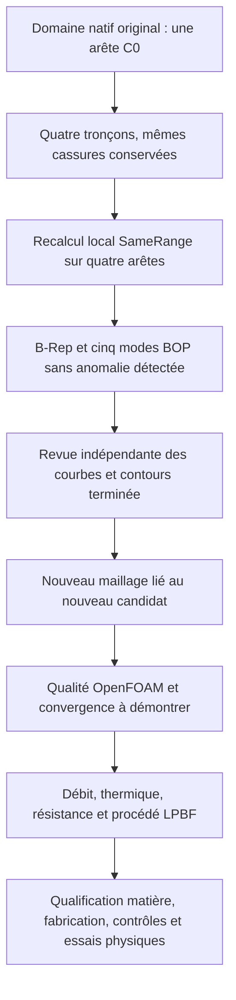

# M64 — correction de la représentation C0 et essais de reprise

## Avancée vérifiée

Le nouveau candidat natif du **domaine gazeux**, `7fc114c1…`, passe le
contrôle B-Rep exact après relecture ainsi que les cinq modes BOP employés :
auto-intersections, petites arêtes, reconstruction de faces, continuité et
cohérence des courbes sur surfaces. Le domaine précédent `3f20f4c5…`
conservait une anomalie de continuité C0.

Le [script reproductible](../twins/m64-cylinder-head/source/flowbench-intake/split_gas_c0_edge.py)
recrée **le même fichier natif, empreinte SHA-256 identique**, en 9,39 s.
Le [reçu agrégé](../twins/m64-cylinder-head/evidence/native-gas-c0-segmentation-20260908.json)
relie ce résultat aux entrées, aux étapes intermédiaires et aux contrôles.

Il s'agit d'une correction de représentation CAO, pas d'une nouvelle forme
de culasse. La cible reste M64 biturbo quatre soupapes, 700 PS au vilebrequin
comme objectif non atteint. L'échelle du scan et les interfaces M64 restent
non certifiées. Aucun calcul de débit, thermique, résistance ou LPBF n'est
validé par ce résultat.

## Ce qui a changé

L'arête native 97 portait trois cassures de tangente au sein d'une même
B-spline. Le candidat représente ces quatre tronçons par quatre arêtes.
Les cassures restent des jonctions : leur disparition du diagnostic de
continuité *interne à chaque arête* ne signifie pas qu'elles ont été lissées.

Le [mécanisme OCCT](https://dev.opencascade.org/doc/refman/html/class_shape_upgrade___shape_divide_continuity.html)
peut soit simplifier des nœuds, soit découper une courbe. La première
expérience avec la tolérance native de 5×10⁻⁶ avait simplifié un nœud : elle
n'est pas retenue. Le candidat suivant demande une tolérance de suppression
nulle et conserve les trois coupures. Ce réglage seul n'est toutefois pas
une preuve d'équivalence géométrique ; les représentations doivent être
comparées indépendamment.

Après le découpage, quatre drapeaux `SameRange` restaient faux, alors que
les plages enregistrées des courbes 3D et des courbes sur les deux faces
adjacentes étaient déjà égales. Le recalcul local par `BRepLib.SameRange`
rétablit leur cohérence. Aucun drapeau n'est forcé directement, aucune
tolérance d'arête n'est augmentée et aucun appel `SameParameter` n'est
effectué dans cette correction.

| État | Faces | Arêtes | Sommets | B-Rep exact |
| --- | ---: | ---: | ---: | --- |
| Domaine d'origine | 88 | 192 | 117 | Valide, anomalie C0 au BOP |
| Découpage avant cohérence des paramètres | 88 | 195 | 120 | Rejeté |
| Candidat après cohérence locale | 88 | 195 | 120 | Valide après relecture |

La tolérance de 5×10⁻⁶ est une tolérance **numérique en unités de scan**,
pas une tolérance de fabrication certifiée. Les fichiers natifs d'origine
restent inchangés. Les candidats intermédiaires rejetés sont conservés.

## Contre-vérification indépendante

Un second programme compare les représentations natives, sans réutiliser
le générateur. Les degrés, pôles, poids, nœuds et multiplicités des quatre
B-splines sont identiques à ceux de quatre copies de la courbe originale
segmentées aux mêmes bornes. Les 117 sommets existants gardent leurs
coordonnées et tolérances ; trois sommets partagés matérialisent les coupures.

L'audit examine les surfaces des 88 faces, 388 courbes paramétriques et les
191 autres arêtes. Aucune incompatibilité n'est détectée. Quelques
descripteurs d'axes présentent des écarts d'arrondi, ce qui interdit de
qualifier tous les descripteurs de strictement identiques. Les orientations,
occurrences d'arêtes et graphes de sommets des contours sont conservés.
Cette comparaison dépasse un simple échantillonnage de points sur les
surfaces, sans devenir une preuve métrologique ou physique.

Le journal indépendant, lié dans le reçu, termine en 0,42 s. Les essais
préparatoires incomplets sont conservés ; un parcours `WireExplorer` ne
couvrant pas toutes les occurrences n'a pas été présenté comme exhaustif.

## Limites et prochaine utilisation

La [passe de remaillage suivante](M64_REMAILLAGE_NATIF_20260908.md)
est maintenant exécutée sur ce candidat : nouveau volume de 469 985
tétraèdres, contre-audits de frontière et contrôle OpenFOAM. L'intégrité
du volume passe, mais six familles de qualité restent rejetées ; aucune
autorisation CFD n'en découle.

Le candidat peut maintenant servir de base à une **nouvelle tentative de
maillage diagnostique**, avec ses propres contrôles de frontières et de
qualité. Cela ne dispense pas des gardes du programme de maillage.

Le précédent maillage de 481 189 tétraèdres appartient au domaine
`3f20f4c5…`, **pas** au candidat `7fc114c1…`. Ses six rejets OpenFOAM restent
dans le [lot précédent](M64_VOLUME_REEL_CONTROLES_20260908.md). Ils ne sont
ni effacés, ni automatiquement résolus par les nouveaux contrôles CAO.

Le [contre-contrôle Netgen/OpenFOAM](M64_NETGEN_CONTRECONTROLE_20260908.md)
mesure séparément une optimisation de ce maillage historique : génération
récupérée avec intégrité conservée, mais six familles de qualité toujours
rejetées. Aucun résultat de cet ancien domaine n'est attribué au candidat C0.

## Vérification logicielle et ressources

Le `make check` termine avec le code 0 : 2 293 cas dans la suite principale,
dont 108 ignorés, aucun échec ; les cibles complémentaires terminent aussi.
Le journal complet porte l'empreinte
`498cbac74a1eec13839aaee3c65c5e198ffdf423fcd3a7500f9b78d899d86239`.
Les deux nouveaux tests vérifient notamment les partitions de paramètres
incomplètes et le refus du candidat intermédiaire invalide. Le témoin
d'arrondi utilise une valeur synthétique, sans paramètre extrait du scan.

Ces calculs CAO ont tourné sur le Mac avec des limites CPU explicites. Aucune
dépense Vast dans ce lot ; le contrôle des instances retourne une liste vide.

## Corps métallique : deux reprises STEP rejetées

Le corps métallique est distinct de ce domaine gazeux. Les
[deux expériences STEP](../twins/m64-cylinder-head/evidence/ported-body-step-repair-attempts-20260908.json)
n'ont pas réparé son échange :

- `FixSameParameter` sur les huit arêtes concernées retourne un succès,
  mais le B-Rep avant/après est strictement identique. Il reste 23 faces
  et huit arêtes fautives ; après un nouvel échange STEP, les comptes
  deviennent 25 et neuf. Cette version est rejetée.
- La suppression puis reprojection explicite d'une seule courbe paramétrique
  garde un écart numérique d'environ 1,3946×10⁻⁵ unité, supérieur au budget
  natif de 5×10⁻⁶. Aucune tolérance n'est relevée, aucune extension aux
  autres arêtes ni nouveau STEP n'est lancée depuis ce candidat rejeté.

Les fichiers d'origine sont inchangés. Ces échecs excluent de présenter
un retour logiciel `true` comme une réparation effective ; il reste à
expliquer la dégradation de représentation pendant l'échange STEP.

**La culasse n'est pas encore autorisée à imprimer pour un usage moteur.**
