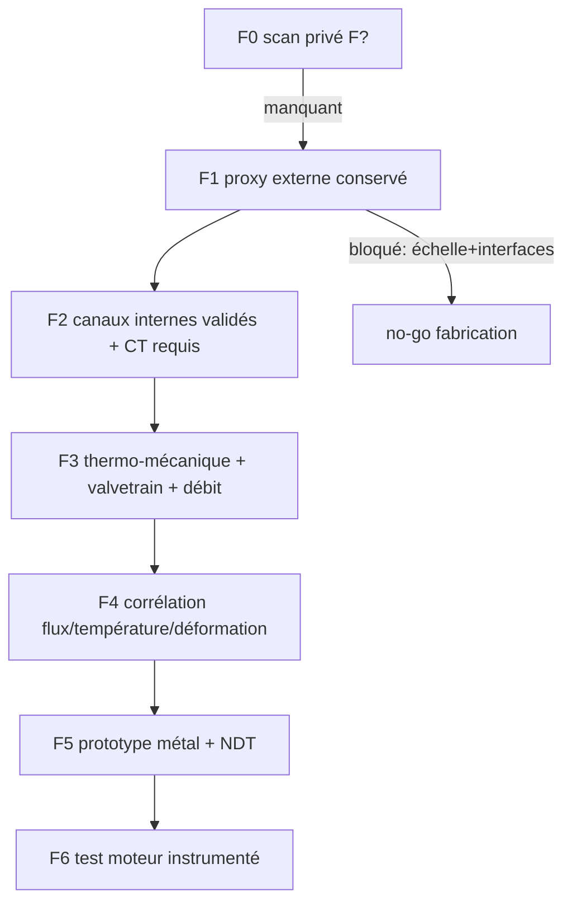
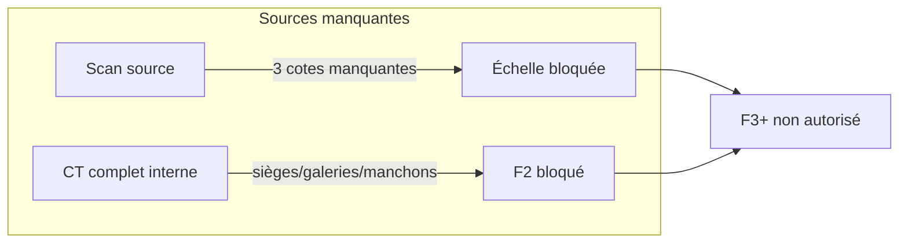

# Plan de continuation — Culasse Porsche 993/964 (700 hp, turbo), sprint court

Date: 2026-09-14

## Statut réel (aujourd'hui)

- La version `reference-993-cylinder-head` est bien créée, mais **aucun scan 993 fiable** n’est présent dans le repo pour cette version.  
- Le lot actif exploitable est `work/993-cylinder-head-fast` (proxy, basé sur 935, geometry-level only).
- `physics-readiness` pour ce lot : `highest_verified_level = unverified` ; `manufacturing_release_authorized = false`.
- Les tests actuels valident seulement l’intégrité géométrique de niveau `F1` et des stubs de CFD (`watertight`), **pas** de thermique/comportement moteur réel.
- Les checks OpenFOAM actuels échouent par **small determinant** :
  - low_B : 91 cellules problématiques,
  - high_B : 89 cellules problématiques.
- Aucune pièce ne doit être présentée comme imprimable ou moteur-ready aujourd’hui.



## Portée validée pour ce sprint

1. Conserver la forme externe (règle « pas d’ovale ») tant qu’un gain chiffré n’est pas prouvé.
2. Travailler la version 2V/4V sur les zones autorisées : chambres, rayons, épaisseurs > 1.5 mm, usinabilité, dégagements de poudre, supports/rehausse d’usinage.
3. Préparer une version de refroidissement 2V/4V cohérente avec la thermodynamique air/huile sans changer la silhouette d’emprise.
4. Produire des sorties 100 % traçables pour CAO, OpenFOAM et maquette thermique/conduction, puis arrêter la publication tant que le F2/F3/F4 n’est pas fermé.



## Exécution immédiate (maintenant)

### 1) Vérifier l’existant (sans attendre le scan)

```bash
cd /Users/maxime/projects/3dprinting993
python3 twins/reference-993-cylinder-head/source/verify_outputs.py \
  work/993-cylinder-head-fast
python3 twins/reference-993-cylinder-head/source/build_physics_readiness.py \
  --pipeline work/993-cylinder-head-fast \
  --contract twins/reference-993-cylinder-head/reengineering-contract.json \
  --inputs twins/reference-993-cylinder-head/engineering-inputs.template.json \
  --output work/993-cylinder-head-fast/reports/physics-readiness.json
```

### 2) Si le scan 993 réel arrive (remplace le path ci-dessous)

```bash
cd /Users/maxime/projects/3dprinting993
SCAN_OBJ=raw-scans/993-cylinder-head/original/scan.obj
OUTPUT=work/993-cylinder-head/pipeline
PYTHON=/usr/bin/python3 \
twins/reference-993-cylinder-head/run_pipeline.sh "$SCAN_OBJ" "$OUTPUT"
```

### 3) Checks OpenFOAM rapides sur les stubs

```bash
twins/reference-993-cylinder-head/source/check_openfoam_mesh.sh \
  work/993-cylinder-head-fast/cfd/low_B/fluid-domain.msh \
  work/993-cylinder-head-fast/openfoam/low_B
twins/reference-993-cylinder-head/source/check_openfoam_mesh.sh \
  work/993-cylinder-head-fast/cfd/high_B/fluid-domain.msh \
  work/993-cylinder-head-fast/openfoam/high_B
```

## Objectif technique des variantes (2V / 4V)

- 2V baseline : référence conservatrice, silhouette inchangée.
- 4V concept : amélioration ciblée des zones utiles (admission/échappement), puis comparaison sur Pareto:
  débit utile, pertes de distribution, température locale, contrainte sièges, mass-mobile/susceptibilité vibration.

- Matériaux pré-analysés côté ordre d’étude : `AlSi10Mg LPBF` (référence) et `AlF357` (comparatif mécanique), avec `INCONEL 751` réservée échappement en complément si thermiques validées.
- Les ressorts/soupapes/sièges restent des composants rapportés et ne sont pas imprimés monobloc dans cette version.

## Points de blocage immédiats

- Pas d’échelle de scan fiable (3 cotes physiques manquantes).
- Pas de géométrie interne complète (CT absent / segments internes manquants).
- Pas de profils de came + courbes de pression + température pour charge 700 hp.
- Pas de qualification matière par coupons (température, fatigue, porosité, traitement).

## Prochaine version 8h (plan d'action court)

1. **Figer l’état proxy** (A0) et geler tous les exports (STEP + rendus) comme base de communication.
2. **Densifier la preuve numérique** (A1) : qualité maillage + correction qualité cellules + relance checkMesh.
3. **Préparer package d’entrée Vast** (A2) : conteneur + dataset + scripts 2V/4V + logs de comparaison pour run sur GPU/CPU hybride.
