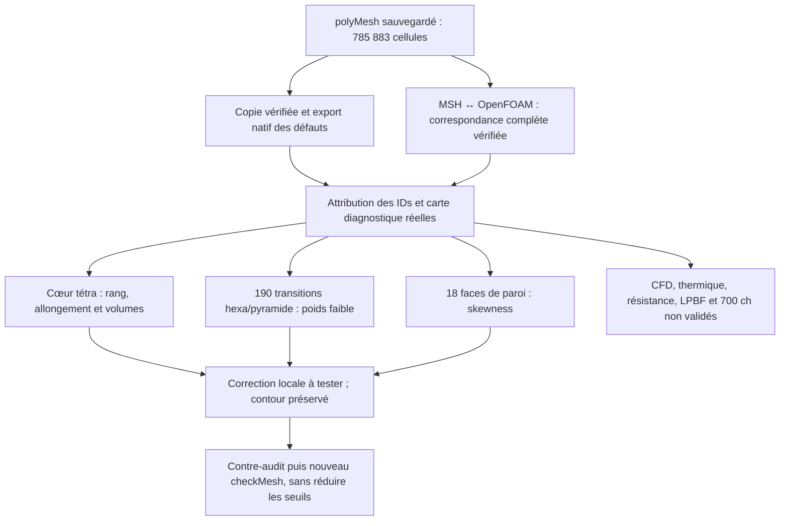

# M64 — défauts OpenFOAM localisés, sans modification du contour

**L'export natif des défauts et leur attribution aux cellules sources sont
terminés. Les cinq familles de qualité restent refusées. Ce lot corrige le
lecteur de correspondance, pas la culasse ni son maillage.**

Le domaine gazeux de [785 883 cellules](M64_HYBRID_OPENFOAM_20260909.md)
est repris exactement tel que sauvegardé. Aucun `gmshToFoam`, changement
d'échelle, solveur CFD, calcul thermique ou calcul d'impression n'est relancé.
Le maître CAO et la silhouette Porsche ne changent pas.

## Résultat utile pour choisir la correction

| Ensemble natif | Attribution effectivement vérifiée |
|---|---|
| 2 305 cellules à faible déterminant | Toutes tétraédriques ; 2 ont une face interne, 465 en ont deux, 867 trois et 971 quatre. |
| 10 cellules très allongées | Toutes tétraédriques ; toutes appartiennent aussi aux 2 305 précédentes. |
| 18 faces à skewness excessive | Toutes sur `walls`, adjacentes à des tétraèdres. |
| 1 491 faces à faible poids d'interpolation | 1 301 entre tétraèdres ; **190 entre hexaèdre et pyramide**. |
| 137 faces à faible rapport de volumes | Toutes entre tétraèdres ; toutes également à faible poids. |
| 3 545 faces au-delà de 70° de non-orthogonalité | 3 126 entre tétraèdres ; **419 parmi les 1 536 raccords tétraèdre/pyramide**. |
| Ensemble `shortEdges` | **5 identifiants de points**, incidents à 15 tétraèdres. Ce fichier n'est pas une liste de cinq identifiants d'arêtes. |

Les ensembles peuvent se chevaucher et ne s'additionnent pas en un nombre
total de cellules défectueuses. Aucune des faces à faible poids n'est sur
un raccord tétraèdre/pyramide ; il ne faut pas confondre ce raccord avec
la base hexaèdre/pyramide. Parmi les cellules à faible déterminant,
416 touchent 446 faces de raccord tétraèdre/pyramide.

Le [déterminant OpenFOAM](https://github.com/OpenFOAM/OpenFOAM-14/blob/7b05503f98a85be88af930df48623b4d152bfc35/src/meshCheck/primitiveMeshCheck/primitiveMeshCheck.C)
est construit à partir des normales des faces internes ou couplées, pas du
Jacobien volumique du tétraèdre. Ici, les patches sont non couplés : les
**467 cellules n'ayant qu'une ou deux faces internes** ne peuvent fournir
trois directions indépendantes. Cela explique une incapacité de rang pour
ce sous-ensemble, mais **pas les 1 838 autres cellules**, ni les quatre autres
familles refusées. Le tenseur natif n'est pas recalculé par cette attribution.
Les volumes positifs constatés précédemment ne suffisent pas à accepter la CFD.

## Export natif exécuté sur une copie, en 12,148 secondes

La seule commande native est :

```sh
checkMesh -allTopology -allGeometry -writeSurfaces -writeSets -surfaceFormat vtk
```

La version est **OpenFOAM Foundation 14-7b05503f98a8**, image x86 locale
épinglée. Le conteneur sur Kali est limité à quatre CPU et 4 Gio, sans réseau,
avec le cas source en lecture seule. L'outil reste sériel (`nProcs: 1`).
Les sept ensembles attendus sont retrouvés avec leurs classes et comptes.
Les identifiants proviennent des `cellSet`, `faceSet` et `pointSet` ASCII,
**pas des enveloppes VTK**, qui ne prouvent pas à elles seules les IDs source.

`checkMesh` prend 10,896 s ; le processus complet, nettoyage compris, 12,148 s.
Il termine sans timeout ni OOM. L'export est réussi, mais le journal conserve
`Failed 5 mesh checks`. Le code 0 du superviseur signifie ici
**export terminé et conteneur nettoyé**, pas maillage accepté. Les 29 fichiers
d'origine, dont les six fichiers `polyMesh`, sont inchangés. Les 19 fichiers
ajoutés sont des exports et un nouveau journal. Le conteneur exact est supprimé
et son absence revérifiée. **Aucune nouvelle dépense Vast.**

## Correspondance MSH → OpenFOAM : première hypothèse corrigée

Le premier lecteur refuse au point OpenFOAM 1029 / MSH 1030, axe 2, en
2,693 s. Il supposait une écriture à 12 chiffres avant et après mise à l'échelle.
Son script et son reçu de refus sont conservés ; le maillage n'est pas modifié.

Le code officiel force une précision supérieure lors de l'écriture des points
par [polyMesh](https://github.com/OpenFOAM/OpenFOAM-14/blob/7b05503f98a85be88af930df48623b4d152bfc35/src/OpenFOAM/meshes/polyMesh/polyMeshIO.C#L553-L561).
Les fonctions [fullPrecision/highPrecision](https://github.com/OpenFOAM/OpenFOAM-14/blob/7b05503f98a85be88af930df48623b4d152bfc35/src/OpenFOAM/db/IOstreams/IOstreams/IOstream.C#L82-L95)
et l'écriture directe de [transformPoints](https://github.com/OpenFOAM/OpenFOAM-14/blob/7b05503f98a85be88af930df48623b4d152bfc35/applications/utilities/mesh/manipulation/transformPoints/transformPoints.C)
justifient, pour ce cas double précision, la séquence **15 → multiplication
binary64 par 0,001 → 12 → réécriture 15**.

La correction se limite à ce modèle numérique. **Aucune tolérance de
rapprochement ni recherche géométrique approximative n'est ajoutée.** Le second
lecteur retrouve les 223 155 points dans l'ordre source, les faces complètes
des 785 883 cellules par bijection et les orientations owner/neighbour.
Les 99 470 faces externes et leurs rôles concordent ; les 1 536 interfaces
tétraèdre/pyramide sont internes. Le contrôle prend 28,895 s.

L'écart maximal avec une multiplication directe sans sérialisation est
5,003 × 10⁻¹³ dans le repère numérique mis à l'échelle. Ce nombre caractérise
la chaîne d'écriture, **pas la précision du scan**. Les `cellZones` OpenFOAM,
les paramètres UV/classes de nœuds, l'identité CAO et l'absence globale de
recouvrement ne sont pas certifiés par ce lecteur.

## Carte diagnostique et suite ciblée

L'attribution indépendante prend 8,449 s. Elle relit tous les IDs natifs,
recompte les faces internes et recoupe les 1 536 interfaces. Les sorties
privées fournissent tous les marqueurs et la frontière réelle, sans
sous-échantillonnage des défauts. La visualisation utilise deux projections
orthographiques à échelles identiques entre lignes ; elle montre **le domaine
d'air**, pas la culasse métallique. Les marqueurs de faces/cellules sont
les moyennes des sommets uniques, pas les centroïdes natifs pondérés.
Les axes restent en unités du scan, non certifiées. Ni couleurs thermiques
ni performances moteur ne sont inventées. Les maillages, coordonnées et
dérivés géométriques restent privés conformément aux règles du dépôt.

La correction doit distinguer les tétraèdres du cœur, les faces de paroi et
les transitions hexaèdre/pyramide. Une simple fusion de tétraèdres ne change
pas les deux cellules adjacentes aux 190 transitions hexaèdre/pyramide.
Le prochain calcul doit mesurer leurs distances projetées face-centres,
leurs volumes et la géométrie des couches avant de choisir une redistribution.
Pour les tétras à rang insuffisant, une agglomération locale reste une option
à éprouver, avec contrôle des voisins et du
[prédicat de concavité natif](M64_AGGLOMERATION_LOCALE_20260908.md).
Aucune sélection nouvelle ni transformation correctrice n'est exécutée ici.



La pile de la photo reste pertinente avec les
[rôles séparés documentés](M64_HYBRID_OPENFOAM_20260909.md#rôle-des-logiciels-de-la-photo).
Ditto/MQTT ne corrigent pas un maillage ; PhysicsNeMo ne constitue pas un
contre-calcul indépendant lorsqu'il apprend les mêmes résultats non qualifiés.

Les tests ciblés passent : 20 pour l'export/supervision, 18 pour le lecteur
corrigé et 13 pour l'attribution, soit **51 tests**. Les 17 tests de la première
version du lecteur étaient également passés : le vrai cas a donc été essentiel
pour découvrir son hypothèse fausse. `make check` termine avec le code 0 ;
certains tests natifs optionnels sont ignorés selon les dépendances présentes.
Ces contrôles logiciels ne sont pas des essais de résistance ou d'impression.
Les empreintes sont dans le
[registre de preuves](../twins/m64-cylinder-head/evidence/geometry-checkpoint-20260908.json),
entrée `gas_hybrid_defect_localization`. Aucun résultat de ce lot ne libère
une culasse à imprimer ou à monter sur moteur.
