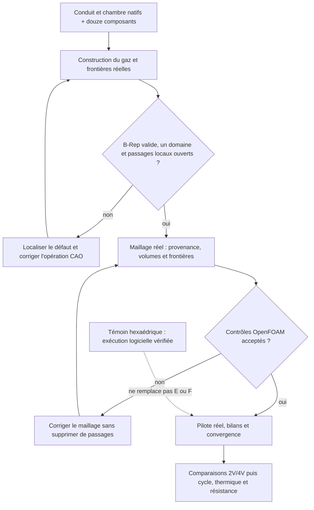

# M64 — volume d'air et exécution OpenFOAM

## Ce qui fonctionne effectivement

La chaîne **Gmsh → OpenFOAM Foundation 14 → solveur compressible `fluid`**
a exécuté 20 itérations sur un conduit rectangulaire témoin. L'import, la
conversion d'unités, les trois frontières et `checkMesh -allTopology
-allGeometry` passent sur ses 325 hexaèdres. Chaque commande s'est terminée
avec un code de sortie observé de 0.

**Ce témoin n'est pas la culasse.** Il vérifie les interfaces logicielles et
les conditions de banc préparées, pas le débit de la pièce. Le débit évolue
encore à l'arrêt ; aucune convergence n'est revendiquée. Les 20 itérations
stationnaires ne représentent pas 20 secondes de fonctionnement moteur.
Le [reçu d'exécution](../twins/m64-cylinder-head/evidence/intake-openfoam-runtime-smoke-20260908.json)
conserve les empreintes des sources, des journaux et les essais rejetés.

Les conditions sont celles du [pilote d'admission](M64_ADMISSION_CHAMBRE_20260908.md) :
pression totale d'entrée 101 325 Pa, température totale 293,15 K et pression
statique de sortie 94 350,51052 Pa. Le gaz est parfait, le calcul résout
l'énergie et utilise k–ω SST. L'intensité turbulente de 5 % et la longueur
de mélange de 3 mm sont des hypothèses à étudier, pas des mesures. Les parois
adiabatiques de ce banc froid **ne calculent pas la dissipation thermique
de la culasse**.

## Pourquoi le premier maillage tétraédrique n'a pas été accepté

Les 1 768 tétraèdres du premier témoin avaient des volumes positifs, une seule
composante et des frontières orientées complètes. Néanmoins, OpenFOAM a
signalé 92 cellules de mauvais déterminant pour ses opérateurs volumes finis.
Un Jacobien de tétraèdre et ce contrôle de stencil volumes finis ne mesurent
pas la même qualité. Le code de sortie 0 de `checkMesh` ne suffit pas : le
pilote exige explicitement `Mesh OK.` et l'absence de contrôle échoué.

La conversion duale a été essayée puis rejetée : une mauvaise décomposition
de face et 139 cellules concaves subsistent. Aucun seuil n'a été desserré pour
faire passer ce test. Le témoin hexaédrique qualifie l'exécution du logiciel,
**pas une méthode de maillage prête pour les passages réels de la culasse**.

Deux incompatibilités de la version 14 ont aussi été corrigées et testées :
le type du groupe de parois importé (`patch` vers `wall`, sans toucher les
coordonnées ni la connectivité), et les objets de suivi natifs
`volFieldValue` à la place de `fieldMinMax` absent de cette image.

## Domaine réel : opérations et preuve attendue

Le domaine gazeux doit réunir les conduits, la chambre et le récepteur,
puis exclure les **douze vrais composants** du module : soupapes, sièges et
guides. Le récepteur Ø100 × 100 est un montage de banc supposé, pas le piston.
La transformation du module est appliquée une seule fois ; l'hypothèse
`1 unité de scan = 1 mm` ne certifie toujours pas les interfaces M64.

L'inspection indépendante des composants a identifié les deux portées
d'échappement fermées et les jeux guide/tige. Chaque annulaire de guide
d'admission possède un jeu radial de 0,015 unité sur 35 unités. Une partie
seulement est incluse dans le conduit brut : tronquer ce passage à sa sortie
du conduit créerait une paroi fictive. L'extension complète est donc conservée.
Sa fermeture haute sera une **condition de banc idéalisée**, identifiée dans
les frontières, pas une nouvelle pièce ni un joint physique qualifié.

La version `gas-domain-04` est rejetée : le volume avant soustraction est
un solide valide ; après soustraction, il contient une micro-coque partageant
des faces avec sa frontière principale. Le défaut natif est
`BRepCheck_InvalidImbricationOfShells`, sans défaut individuel de face,
d'arête ou de fil. Ce résultat n'est pas une cavité physique démontrée.
Le diagnostic des constituants avant fusion ne retrouve aucune intersection
volumique avec les sièges. Le défaut est ainsi localisé dans l'assemblage
booléen, pas justifié comme une nouvelle forme mécanique.

La correction `gas-domain-05` utilise l'identité ensembliste
`(union Ai) moins B = union (Ai moins B)` : soustraire les mêmes composants
aux constituants avant leur union. Elle ne justifie ni d'omettre un siège,
ni d'effacer une coque manuellement, ni de modifier une cote. Elle a rétabli
un solide B-Rep valide, y compris après relecture native et STEP, en 45,81 s.
Le [reçu de construction](../twins/m64-cylinder-head/evidence/gas-domain-construction-20260908.json)
conserve les versions rejetées et les résultats séparés. Les quatre faces
coplanaires ont été attribuées aux sièges réels, dont elles recouvrent
intégralement les surfaces ; le négatif de chambre n'est pas un matériau.

Le contrôle BOP natif signale encore une arête B-spline C0 : trois positions
sont continues, avec des angles tangents de 0,622°, 6,964° et 16,764°. Il ne
s'agit pas seulement d'un angle entre deux faces. Deux petits tronçons ont
des longueurs numériques de 0,000239 et 0,000049 unité, très inférieures à
la taille minimale de maille de ce pilote. Ils ne sont ni supprimés ni lissés.
Leur représentation par le maillage doit être mesurée sans imposer une
précision nanométrique injustifiée à un scan non étalonné.

Le STEP ajoute 31 anomalies `InvalidCurveOnSurface` au contrôle BOP, bien que
sa topologie B-Rep passe. **Ce STEP n'est pas qualifié pour calcul.** Une
éventuelle tentative de maillage utilisera le B-Rep natif exact, avec une
revue C0 explicite, et ne transformera pas les anciens contrôles faux en
contrôles réussis. La revue indépendante `advisory-audit-02`, terminée en
8,07 s, autorise uniquement cette tentative diagnostique : positions continues,
sièges entièrement couvrants et normales opposées. Son reçu privé porte
l'empreinte `936846c6a1d5f3b0765eb30b75e6cf1003fa6052cb5717487292dde7c3fec8cd`.

## Prévol d'import : comparaison des mêmes intégrateurs

Le premier prévol réel `pilot-01` s'est arrêté **avant de générer un seul
élément**. Les 88 faces, leurs aires et leurs centres étaient conservés,
mais le contrôle comparait deux intégrateurs de volume différents :

| Appel sur le même B-Rep natif | Volume numérique, unités³ |
| --- | ---: |
| OCCT non adaptatif | 995 961,8505977857 |
| Gmsh `getMass` observé | 995 961,8505977859 |
| OCCT adaptatif, epsilon 1e−9 | 995 964,5870880088 |

Le [contre-calcul](../twins/m64-cylinder-head/evidence/gas-domain05-volume-integrators-20260908.json)
explique ainsi l'écart qui avait dépassé le garde d'import. Le contrôle doit
comparer le résultat Gmsh à l'appel OCCT **non adaptatif correspondant**,
en gardant le seuil relatif de 1e−6. La valeur adaptative reste distincte
et l'écart d'intégration est conservé. Cela ne modifie ni les surfaces,
ni les tolérances CAO, ni les seuils de qualité des éléments. Ce prévol
rejeté n'est donc pas présenté comme un échec d'un maillage déjà produit.
La [lecture de la source officielle Gmsh 4.15.2](../twins/m64-cylinder-head/evidence/gas-domain05-gmsh-mass-source-20260908.json)
confirme également l'appel non adaptatif utilisé pour `getMass` en dimension 3.

## Première génération effective : rejet local conservé

Avec cette correction de comparaison, l'import passe : un volume, 88 faces
et écart relatif de volume de 2,22e−16 entre intégrateurs correspondants.
Gmsh produit **44 774 triangles de surface et 22 387 nœuds**, puis rejette
la reconstruction du volume. Le journal désigne deux facettes de la même
face 38, classée `walls_port` et issue de `raw_intake_face_8`, avec un angle
de 0,0324048° comparé à son critère de 0,1°.

Ce rejet concerne la triangulation : il **ne démontre pas à lui seul une
auto-intersection de la CAO**. Le critère d'angle n'a pas été abaissé. Aucun
maillage volumique n'a été exporté ou qualifié et aucun calcul de débit n'a
été lancé. Le run a duré deux secondes sur le CPU local, sans manque de
mémoire ; louer plus gros ne corrigerait pas cette condition géométrique.

Les trois nœuds C0 examinés sont à 0,000428–0,000563 unité du nœud de
frontière le plus proche. Ces distances sont enregistrées comme diagnostics,
pas comme une preuve de conformité de toute la frontière. Le journal privé
du run conserve les deux triplets de facettes fautives. Le premier helper
ne sauvegardait le MSH qu'après la génération 3D ; cette surface historique
n'a donc pas été conservée et ne peut pas être reconstruite à l'identique
sur la seule base de son journal.

## Surface sauvegardée et diagnostic local

Le helper conserve désormais la surface avant toute tentative 3D. Une
exécution limitée à la 2D a sauvegardé **44 776 triangles, 22 388 nœuds et
88 faces**, sans tétraèdre ni nouvelle génération volumique. La relecture
MSH préserve les triangles orientés et les groupes de frontières ; l'écart
maximal de coordonnées est de 5,70e−14 unité. Les incidences d'arêtes sont
fermées et cohérentes, sans triangle dupliqué. Ces contrôles topologiques
ne prouvent ni l'absence d'intersection ni la conformité à la surface CAO.

Cette exécution a duré 1,42 s. Malgré les mêmes options explicites, elle
contient deux triangles et un nœud de plus que la surface historique : ce
n'est **pas une reproduction bit à bit** du précédent rejet. Les deux
triplets de nœuds signalés existent sur la face 38 actuelle. Leurs normales
orientées font 179,9676° entre elles et sont presque orthogonales aux normales
CAO évaluées aux barycentres projetés. Les distances barycentre–CAO sont
0,02824 et 0,04973 unité. Cela fournit une cible de diagnostic local, sans
démontrer une intersection réelle, une inversion globale ou l'identité
géométrique avec l'ancienne paire.

Le [reçu du maillage](../twins/m64-cylinder-head/evidence/native-gas-mesh-pilot-20260908.json)
relie les trois exécutions, les paramètres inchangés et leurs empreintes.
Les coordonnées, normales complètes et connectivités restent privées.
La prochaine action est de corriger et contrôler la triangulation de cette
face de conduit, puis de retenter le volume et les contrôles OpenFOAM.
Aucun changement de forme de culasse ni abaissement du seuil de rejet
n'est justifié par ce seul diagnostic.

## Relancer sans perdre la traçabilité

Les [sources du pilote](../twins/m64-cylinder-head/source/flowbench-intake/prepare_openfoam_case.py)
créent un répertoire neuf et un manifeste des fichiers. Le
[lanceur](../twins/m64-cylinder-head/source/flowbench-intake/run_openfoam_pilot.py)
vérifie ces empreintes, refuse de réimporter ou redimensionner un cas déjà
exécuté, et conserve les codes de sortie et journaux de chaque étape. Pour
`head_pilot`, il exige une revue indépendante liée au domaine natif et à
l'empreinte exacte du maillage. La préparation seule ne constitue pas une
exécution. Les gros fichiers et les géométries privées ne sont pas publiés.

La séquence fonctionne sur le runtime x86 local existant. Aucune location
Vast n'a été engagée pour ces témoins. Le plafond utilisateur reste 44 USD,
sans recharge automatique. La relecture du wrapper approuvé le 8 septembre
retourne 43,9166429608502 USD de crédit disponible et aucune instance ; c'est
un état observé, pas une garantie sur un solde futur. L'image locale OpenFOAM
n'a pas encore de digest de registre qualifié
pour ce nouveau lot : il faut vérifier ce point, le job, la paire SSH et
l'association de clé avant une location.

Références primaires pour la configuration :
[modules OpenFOAM 14](https://doc.cfd.direct/openfoam/user-guide-v14/solvers-modules),
[conditions aux limites](https://doc.cfd.direct/openfoam/user-guide-v14/derived-boundary-conditions).
Les commandes et dictionnaires ont également été vérifiés dans les sources
et les tutoriels de l'image effectivement exécutée.

Le guide de documentation a structuré cette note autour des résultats
observés, des rejets et d'une procédure reproductible. Ni ces contrôles
logiciels, ni le futur calcul de banc froid ne libèrent la culasse pour
fabrication ou démarrage ; le [plan multiphysique](M64_MULTIPHYSICS_EXECUTION.md)
reste applicable.

## Vérification logicielle du lot publié

Sur les sources finales du lot, `make check` s'est terminé avec une sortie
observée de 0. La suite principale compte 2 253 tests en 177,854 s, dont
102 ignorés ; les cibles supplémentaires se terminent aussi, avec un autre
test OCP ignoré. Le journal global privé porte l'empreinte
`abd35d512c8d131cff05e099ee7c6d4a1335f73597b8604fcc17455d0ce18905`.

Les **42 tests ciblés** des constructeurs, des diagnostics, du maillage et du
pilote OpenFOAM passent séparément dans le runtime contenant OCP, sans test
ignoré. Le maillage de surface, le maillage volumique, l'exécution du solveur
et la convergence restent quatre résultats distincts : un test logiciel
réussi ne fait pas réussir un calcul physique rejeté.
