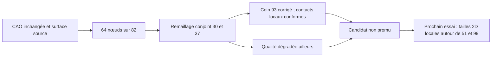

# M64 — redistribution d'arête et remaillage conjoint

**Le défaut ciblé au coin 93 est corrigé sur la copie, mais le candidat reste
refusé : la qualité du maillage se dégrade ailleurs.** Aucun changement de
contour Porsche ni promotion du maillage volumique de référence.

Ce lot suit l'[audit des diagonales](M64_SURFACE_DIAGONAL_AUDIT_20260909.md).
Il utilise la surface MeshAdapt `7af7f207…`, pas un nouveau dessin de culasse.
L'échelle physique et les interfaces M64 restent non qualifiées.

## Essai réellement exécuté

Un conteneur Linux x86 sur Kali exécute une génération 1D temporaire de
l'arête 82 : 64 nœuds au lieu de 13, progression demandée `1/1,1` vers le
sommet natif 51. Le maillage temporaire est vidé avant la réinjection exacte
de la référence. Seules l'arête 82 et les faces 30/37 sont ensuite remaillées.
La CAO est montée en lecture seule ; aucun volume 3D n'est généré.

Les rapports mesurent une progression réelle des cordes de 0,909090 à
0,909355. Le dernier segment vaut 0,96736 fois le segment voisin de l'arête 93,
sous la limite d'essai de 2. Ce rapport est un critère de gradation numérique,
pas une cote ni une tolérance de fabrication.

Les neuf contrôles natifs de conservation passent. Le contre-calcul retrouve
les classes, coordonnées et éléments ordonnés hors cible inchangés, y compris
les 72 faces portant 71 152 quadrilatères. Les frontières communes 82 et 93
restent conformes. Les paramètres natifs de la nouvelle arête 82 sont conservés
pendant la génération 2D ; le MSH final ne sérialise pas ces paramètres.

## Résultat quantifié : amélioration locale, refus global du candidat

| Indicateur | Source | Candidat refusé |
|---|---:|---:|
| Triangles face 30 | 107 | 268 |
| Triangles face 37 | 2 299 | 2 478 |
| Obstructions face 30 | 0 | 1 |
| Obstructions face 37 | 22 | 20 |
| Obstructions des deux faces | 22 | 21 |
| Borne minimale des deux faces | 0,0032268884 | 0,0010824348 |
| Angle minimal des deux faces, degrés | 0,085767353 | 0,023879723 |

Une obstruction désigne ici le repère mathématique de borne de qualité
inférieur à 0,1 pour un tétraèdre partageant la facette. Ce n'est ni le SICN
d'un volume effectivement généré, ni un seuil universel d'admission CFD.
Les comparaisons indépendantes utilisent des fractions exactes des coordonnées
binary64 ; les décimales du tableau sont des affichages arrondis.

La facette au coin 93 ne présente plus cette obstruction. En revanche,
la face 30 gagne un triangle problématique et la face 37 voit ses extrema
se dégrader. La baisse du compteur total ne suffit donc pas à retenir le
candidat. Le maillage candidat sauvegardé porte l'empreinte `2de5fd52…`.

Le contrôle exact des contacts avec la face 36 traite **503 paires avant et
550 après** : aucun contact non conforme dans les deux cas. Il ne couvre pas
toutes les paires du modèle ni la couverture continue de la CAO.

## Conséquence pour le prochain essai

Le triangle dégradé de la face 30 est attaché au dernier segment de 82, près
du sommet 51. Les deux pires triangles de 37 s'appuient sur de très petits
segments de l'arête 99, distincte de 82. La prochaine piste est donc un champ
de taille 2D local autour de ces deux zones, avec contrôle des faces voisines,
plutôt qu'un autre coefficient de progression 82 seul. Ce champ n'est pas
encore appliqué ; ce diagnostic ne prouve pas à lui seul la cause interne
du comportement du mailleur. Les courbes CAO restent fixes.

La lecture du code Gmsh 4.15.2 précise le prochain essai :
`src/mesh/BackgroundMeshTools.cpp`, lignes 244–268, consulte le callback
de taille puis applique `Mesh.MeshSizeMin`. Le plancher actuel de 0,005
peut donc relever une petite taille demandée. Ce n'est pas une borne absolue
sur tous les éléments existants : `src/mesh/meshGFaceBDS.cpp`, lignes 603–624,
initialise aussi les tailles à partir des segments 1D incidents. Le prochain
cas doit tester ensemble le plancher et le champ local, en comptant les
appels par face ; un callback ajouté seul n'est pas une correction démontrée.
Cette inspection du code n'exécute pas le prochain cas.

## Exécution, preuves et limites

- Calcul natif : 16,344 s ; 17,014 s avec le nettoyage.
- Contre-calcul indépendant : 5,933 s.
- Plafonds : quatre CPU, 4 Gio, cinq minutes avec réserve de nettoyage.
- 38 tests logiciels ciblés passent : 15 worker, 10 lanceur, 13 contre-calcul.
- `make check` termine avec le code 0 ; des tests optionnels sont ignorés
  selon les dépendances disponibles. Ce contrôle du dépôt ne valide pas la pièce.
- Processus terminé avec le code 2 de refus de qualité, sans erreur de
  génération, dépassement de temps ni manque de mémoire signalé.
- Conteneur supprimé et absence revérifiée ; fichiers d'entrée inchangés.
- Aucune nouvelle dépense Vast, aucune qualification CFD, thermique,
  mécanique, LPBF ou puissance moteur.

Le booléen historique du lanceur `process_completed_and_cleaned` reste faux
car il exige aussi un code 0 : il ne signifie pas ici un conteneur laissé actif.
Le brut, le candidat et les reçus sont conservés en privé ; leurs empreintes
figurent dans le [registre de preuves](../twins/m64-cylinder-head/evidence/geometry-checkpoint-20260908.json),
entrée `gas_curve82_joint_remesh`. Aucune autorisation de fabrication n'est ouverte.

