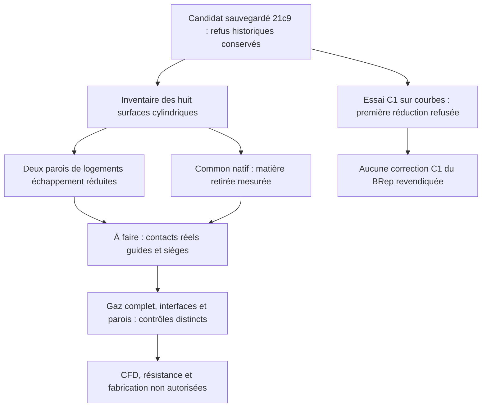

# M64 — matière retirée et parois des logements d’échappement

Le diagnostic natif a mesuré la matière retirée, sans nouvelle découpe de la
culasse. Il constate surtout **une réduction des surfaces cylindriques associées
aux deux logements de guides d’échappement**. Ce changement appelle un contrôle
des contacts avec les vrais guides ; il ne prouve, à lui seul, ni perte de
rétention ni tenue suffisante.

Le candidat sauvegardé `21c9c40b…` reste inchangé. Les refus et les deux alertes
C0 de l’[audit précédent](M64_EXHAUST_NATIVE_AUDIT_20260908.md) sont conservés.
Ces deux nouvelles étapes sont liées dans une
[capsule distincte](../twins/m64-cylinder-head/evidence/exhaust-material-controls-20260908.json) ;
elles ne réécrivent aucun reçu antérieur et n’autorisent ni CFD ni fabrication.

## Les logements : changement mesuré, contact réel encore à contrôler

Huit surfaces cylindriques sont associées aux quatre sièges et quatre guides,
avant et après la coupe sauvegardée. Les axes enregistrés sont déjà dans le
repère final ; aucune transformation supplémentaire n’est appliquée aux corps
ou aux axes. Les surfaces complètes sont mesurées, **pas leur seule partie en
contact avec l’insert**.

| Surface associée au guide | Aire avant → après, unités scan² | Aire perdue | Étendue axiale de la boîte avant → après, unités scan |
|---|---:|---:|---:|
| Échappement 1 | 2 549,528606 → 1 673,989540 | 875,539066 | 74,549353 → 51,012425 |
| Échappement 2 | 2 272,879397 → 1 397,089473 | 875,789924 | 74,549353 → 51,003675 |

L’étendue angulaire de chaque boîte reste `6,28318530718 rad` avant/après.
**Une boîte couvrant environ 2π ne prouve pas une surface de contact continue
sur 360°** : elle peut encadrer une face découpée. De même, les étendues axiales
ci-dessus ne sont pas les longueurs effectivement insérées des guides, dont
la longueur nominale V2 est 35 unités sous l’hypothèse d’échelle existante.
Aucune portée de rétention n’est calculée par ce nouvel inventaire.

Les aires des quatre surfaces de siège et des deux surfaces de guide admission
ne changent pas dans ce calcul. Les empreintes sérialisées complètes des huit
faces diffèrent pourtant avant/après : **ni identité des faces déduite des
aires, ni déformation déduite d’une empreinte différente**. La portée admission
historique 23/35 n’est ni améliorée ni requalifiée par cette observation.

## Matière retirée : un Common distinct, pas une nouvelle coupe

Le calcul effectue uniquement l’intersection `Common(corps avant, outil
échappement)`, en mode non destructif, fuzzy nul. Le corps avant `33375e12…`,
l’outil `9e1ab8b3…` et le candidat sauvegardé `21c9c40b…` sont lus sans STEP,
recalage, réparation ou modification de tolérance demandée.

La matière obtenue est un solide, une coque, 258 faces, 563 arêtes et 308
sommets. BRepCheck exact est valide avant et après sa relecture native.
Son volume est **89 589,078029635 unités scan³** ; le BRep privé est lié à
l’empreinte `08b32607…`. Le volume du corps avant est 1 244 303,585578462 et
celui du candidat sauvegardé 1 154 714,507690458 unités scan³.

Le même appel d’intégration adaptative est utilisé avec une consigne `Eps=1e−9`.
Les estimations relatives **retournées**, qui ne sont pas des bornes certifiées,
sont environ `3,15807e−8` pour le corps avant, `3,04024e−8` pour le candidat et
`1,05805e−9` pour la matière retirée. Elles ne permettent pas d’annoncer une
convergence atteinte à `1e−9`.

Le résidu `Vavant − Vcandidat − VCommon` vaut `−0,000141630750` unité scan³,
soit `1,13823e−10` du volume initial. C’est une observation de cohérence
numérique, **pas une borne d’erreur indépendante ni une preuve d’équivalence
géométrique de la différence**. Le BOP complet antérieur n’est pas relancé.

Sur la seule relecture du nouveau Common, 89 tolérances de sommets changent
exactement comme `float(format(avant, '.15g'))`, avec un écart maximal
`4,235164736271502e−21` unité scan. Les tolérances d’arêtes et de faces sont
bit à bit identiques. Cette observation séparée ne remplace pas le garde
historique refusé de `21c9`, ni une preuve complète de conservation géométrique.

## Essai de courbes C1 : méthode refusée, aucun BRep corrigé

Une tentative distincte de reparamétrage synchronisé et de réduction de
multiplicité est réellement exécutée sur des copies de courbes, avec le budget
natif `5e−6` inchangé. OCP refuse la première réduction de multiplicité de la
courbe 3D de l’arête 1603, à la tolérance d’appel `2,0000000000000004e−7`.
L’essai s’arrête immédiatement : **la courbe 3D 1606 et les quatre p-curves ne
sont pas testées**. Aucune surface ni aucun BRep n’est écrit ou modifié.

Ce résultat refuse cette méthode bornée ; ce n’est ni une impossibilité générale
de construction CAO, ni une preuve de fissure. Les deux alertes C0 restent
localisées et non corrigées. Une première tentative locale, arrêtée avant OCP
par l’installation impossible de la limite mémoire macOS, reste un échec runtime
distinct, pas un refus géométrique supplémentaire.

## Limites, exécution et suite

Les contrôles fonctionnels 6–12 ne passent pas : les 7–8 disposent seulement
d’un inventaire de surfaces de logement ; continuité du gaz complet, contacts
réels des inserts, séparation des conduits, ouvertures autorisées, bandes
protégées et épaisseurs finales restent à contrôler. Le prochain travail utile
est la mesure des contacts réels des guides d’échappement sur `21c9`, avec leurs
étendues axiales et angulaires, puis les communications gorges–chambre.

L’essai C1 termine avec code natif/wrapper 2 en 0,521 s / 0,921 s nettoyage
compris. Le diagnostic de matière termine avec code 0 en 10,585 s / 11,058 s.
Ce code 0 signifie diagnostic exécuté, pas pièce validée. Les 15 tests de
préparation C1 et les 14 tests du contrôle matière passent ; ils ne constituent
pas une qualification physique.

Les deux passages utilisent l’image existante OCP 7.9.3.1, sans réseau,
avec entrées/sources RO : C1 borné à 60 s, 2 CPU, 2 Gio mémoire+swap total ;
Common à 300 s, 2 CPU, 4 Gio mémoire+swap total. Aucun OOM ni timeout. Les
conteneurs exacts sont supprimés, leur absence vérifiée indépendamment. Les
limites sont établies par les commandes gelées ; aucune capture HostConfig
en direct de ces courts passages n’est revendiquée.

Fichiers, formes d’entrée et tolérances restent inchangés. Géométrie, coordonnées,
axes, bornes absolues et fichiers CAD restent privés. Les mesures utilisent les
unités du scan ; ni l’échelle absolue ni les interfaces M64 ne sont certifiées.

