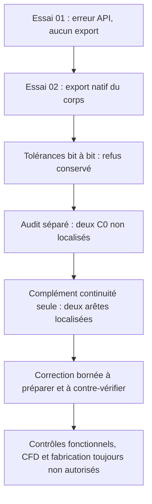

# M64 — passage d’échappement natif : candidat conservé, non validé

Le corps avec admission et échappement a été exporté, mais **reste refusé** :
le contrôle bit à bit des tolérances après sérialisation échoue et un audit
BOP indépendant signale deux `BOPAlgo_GeomAbs_C0`, désormais **localisés mais
non corrigés** par un contrôle ultérieur limité à la continuité.
Aucune dérogation, qualification fonctionnelle ou autorisation de fabrication
n’est accordée. La [capsule de preuves](../twins/m64-cylinder-head/evidence/exhaust-native-audit-20260908.json)
relie les trois étapes initiales et ce complément aux reçus privés, sans
publier la géométrie.

## Trois étapes initiales et un complément distinct

| Étape réellement exécutée | Observation | Décision conservée |
|---|---|---|
| Essai 01 | Appel d’API `HasErrors` indisponible sur l’objet `BRepAlgoAPI_Cut` ; arrêt avant export | Erreur du programme, pas preuve d’invalidité de la pièce |
| Essai 02 | Export natif `21c9c40b…`, un solide, une coque, 4 900 faces ; BRepCheck exact valide avant/après relecture | Refus `rejected_native_tolerance_integrity` |
| Audit indépendant | Relecture du même export, cinq modes BOP activés ensemble ; deux signalements C0 | Refus maintenu, incidence non qualifiée |
| Localisation ultérieure | Continuité seule ; les deux arêtes et trois nœuds internes sont identifiés | Localisées, non corrigées ; aucun refus levé |

L’essai 01 termine avec un code travailleur 1 et un code conteneur 2, en
7,514 s murales supervisées. L’essai 02 termine avec le code 2 en 12,569 s.
Son calcul natif dure 11,554 s ; son intervalle conteneur est
11:20:12,499–11:20:24,905 UTC, le 8 septembre 2026.

Le corps d’entrée `33375e12…` et l’outil d’échappement `9e1ab8b3…` sont
épinglés. Aucun changement de repère supplémentaire n’est appliqué, aucun
STEP n’est utilisé et les originaux restent intacts. Le refus préalable
relatif au maintien des guides n’est pas effacé par cette nouvelle découpe.
La référence reste issue du scan 935 ; `1 unité = 1 mm` demeure une hypothèse,
pas une échelle ni une compatibilité d’interfaces M64 certifiées.

## Ce que le diagnostic de sérialisation démontre — et ne démontre pas

Les listes enregistrées présentent 89 différences parmi 5 176 tolérances de
sommets. L’écart absolu maximal est `4,235164736271502e−21` unité de scan.
Les 10 075 tolérances d’arêtes et les 4 900 tolérances de faces sont identiques ;
les extrema et les tolérances des entrées sont inchangés. Le volume adaptatif
calculé avant et après relecture est égal, sans constituer une preuve globale
d’identité géométrique.

Sur ces listes ordonnées, `float(format(avant, '.15g')) == relecture`
reproduit exactement les 5 176 valeurs, dont les 89 différentes. Les témoins
à 16 et 17 chiffres ne reproduisent aucune des 89 différences. Ce reçu
arithmétique seul ne vérifiait pas le code de sérialisation et n’établit
**aucune correspondance géométrique indépendante de tous les sommets**.

La lecture primaire ultérieure d’OCCT 7.9.3 montre que
[`TopTools_ShapeSet::Write`](https://github.com/Open-Cascade-SAS/OCCT/blob/V7_9_3/src/TopTools/TopTools_ShapeSet.cxx#L427-L515)
fixe la précision à 15 chiffres, appelle l’écriture de la géométrie puis
restaure la précision. La
[routine des sommets](https://github.com/Open-Cascade-SAS/OCCT/blob/V7_9_3/src/BRepTools/BRepTools_ShapeSet.cxx#L497-L508)
écrit leur tolérance dans ce flux. C’est cohérent avec l’arrondi observé,
pas une déformation mécanique mesurée ni une preuve complète d’invariance.
Le refus historique demeure, sans dérogation générale ni tolérance de
fabrication déduite ; les deux C0 restent un obstacle distinct.

## Audit BOP séparé, en lecture seule

Le reçu indépendant `09dfd5e6…` est lié au candidat sauvegardé. BRepCheck
exact est valide ; BOP signale `HasFaulty=true`, `HasErrors=false` et
`HasWarnings=false`, avec **deux `BOPAlgo_GeomAbs_C0` au total**.
Les modes `SelfInterMode`, `SmallEdgeMode`, `RebuildFaceMode`,
`ContinuityMode` et `CurveOnSurfaceMode` sont activés dans ce même audit,
avec fuzzy nul, sans arrêt au premier défaut.

Ce contrôle dure 174,308 s pour BOP, 177,111 s au niveau du wrapper, et
retourne 2. Les tolérances et toutes les entrées restent inchangées ; aucun
B-Rep/STEP n’est écrit ou réparé. Les deux signalements ne sont **pas des
fissures physiques démontrées**. Dans ce snapshot, leurs entités ne sont pas
localisées et leur incidence fonctionnelle n'est pas qualifiée. Ce reçu reste
inchangé ; le complément ci-dessous ne transforme aucun refus en succès.

## Complément : localisation native, sans correction

Le reçu `18dba811…` concerne exactement le même candidat `21c9c40b…`. Seul
`ContinuityMode` est activé ; les huit autres modes sont explicitement
désactivés. Ce contrôle ne répète ni le BOP complet, ni BRepCheck, ni une
découpe. Le corps d'entrée et l'outil seuls donnent chacun zéro alerte de
continuité ; le candidat conserve exactement les deux alertes attendues.

Les sous-formes signalées sont les arêtes natives **1603 et 1606 de ce
candidat exact**. Elles sont chacune incidentes à la face 678, dont le support
B-spline global complet correspond à celui de la face 1 de l'outil
d'échappement. Leurs autres faces incidentes sont respectivement 881 et 884,
dont les supports correspondent aux faces 4408 et 4194 du corps avant coupe.
Ces associations utilisent l'adjacence native et les représentations complètes
binary64 des supports : degrés, pôles, poids, nœuds, multiplicités et
périodicité. Elles ne reposent pas sur d'anciens IDs réutilisés et ne prouvent
pas l'identité des faces tronquées.

Aux **trois nœuds internes examinés**, les évaluations natives unilatérales
donnent chacune un saut de position numérique nul. Les angles entre tangentes
sont respectivement **0,03993974°, 0,01033415° et 0,25917866°**. Ces observations
ponctuelles ne prouvent ni l'absence globale de jeu ou de défaut géométrique,
ni la continuité des dérivées, ni l'intégrité mécanique. Les supports complets
des deux courbes n'ont pas de représentation identique retrouvée dans les
entrées ; une absence de correspondance ne démontre pas une géométrie nouvelle.

La localisation termine avec le code 0 en **1,043 s** pour le lecteur et
**1,477 s** pour le wrapper, nettoyage compris. Entrées locales et distantes,
sources et empreintes des tolérances natives restent inchangées. Quinze tests
sans OCP passent, dont le refus d'un compte d'alertes différent, d'un résultat
vide, d'une forme absente ou d'un avertissement natif. Leur réussite ne vaut
pas qualification de la CAO. Aucune géométrie n'est écrite ou réparée ; les
coordonnées, paramètres de coupe et pôles restent privés.

## Ce qui reste absent

Le `Common` du matériau réellement retiré et le BOP final du producteur
n’ont pas été exécutés : ils sont situés après le garde de sérialisation.
L’audit séparé ne remplace pas ce `Common` ni les contrôles fonctionnels 6–12 :
continuité du gaz complet quatre soupapes, maintien des sièges/guides,
parois après les deux conduits et bandes d’interfaces protégées.
Thermique, résistance, LPBF et validation d’impression ne sont pas exécutés
sur ce candidat. Voir le [dossier matériau/refroidissement/LPBF](M64_700CH_MATERIAL_COOLING_LPBF.md)
pour leurs exigences distinctes.

Une image **privée** est réellement rendue à partir du seul corps exporté :
4 900 faces, 92 118 triangles, déflexions linéaire 0,18 et angulaire 0,25 rad.
Elle montre une vue externe opaque et une demi-coupe d’affichage non bouchée,
sans transformation supplémentaire, lissage, décimation ni génération IA.
Aucun ancien assemblage de douze composants ni aucune ancienne affectation
fonctionnelle de couleurs n’est réutilisé. Le gris n’est pas un choix de
matériau. Image, maillage dérivé et coordonnées restent privés.

## Ressources et portée

Pour les étapes initiales sur Kali x86 : deux CPU, 4 Gio de mémoire et swap
combinés, limite 300 s par exécution native, réseau coupé et entrées montées
en lecture seule. L’essai
02 est lié à la commande du wrapper figé ; l’inspection HostConfig en direct
a manqué ce conteneur déjà terminé. Pour l’audit indépendant, les limites
ont aussi été constatées sur le conteneur vivant. Les conteneurs sont
supprimés, absence vérifiée ; aucun OOM ni timeout n’est signalé.

La localisation ultérieure utilise la même image et OCP 7.9.3.1, mais une
borne distincte de **30 s CPU et murales, deux CPU et 2 Gio mémoire+swap au
total**. Ses limites sont liées à la commande du wrapper figé ; aucune capture
HostConfig en direct de ce court passage n'est revendiquée. Le conteneur exact
est supprimé et son absence est revérifiée indépendamment. Aucune OOM ni
expiration n'est observée.

Le rendu local dure 3,834 s d’extraction puis 5,220 s de rendu, sans timeout.
Aucune nouvelle location ni dépense Vast pour ce lot. Le plafond autorisé de
44 USD est un budget, pas une mesure du solde du compte. Cette documentation
ne vaut ni validation de la culasse complète ni autorisation de fabrication.
