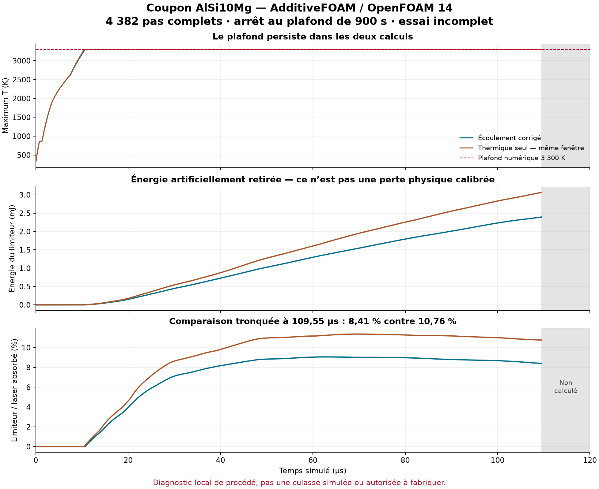
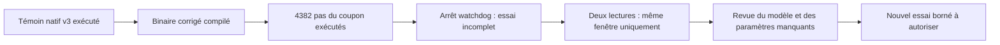

# F58 — coupon avec contrat Marangoni corrigé : essai incomplet

**Le calcul s'est arrêté à sa limite de 900 s : 4 382 pas complets sur 4 800,
soit 109,55 µs sur les 120 µs prévues. Sortie native 137, sans OOM.** Le plafond
numérique de 3 300 K persiste. Ce résultat ne valide ni le procédé d'impression,
ni le matériau de la culasse, ni la culasse elle-même.

L'erreur fatale `adjustPhi` de l'ancien essai ne s'est pas reproduite pendant
la fenêtre calculée. C'est un progrès de fonctionnement du couplage, pas la
preuve que le modèle physique est désormais suffisant.

## Changement et exécution réels

Le [patch public](../twins/m64-cylinder-head/source/additivefoam/marangoni-assignable-openfoam14.patch)
fait retourner `false` à `assignable()` dans la condition limite Marangoni.
Le nouveau binaire épinglé conserve les 92 autres fichiers de source contrôlés.
L'appel natif à `adjustPhi` est conservé ; aucun flux n'est remis artificiellement
à zéro pour contourner ce contrôle. Le contrat avait été testé dans le
[témoin natif v3](M64_F58_PREDICTOR_CONTRACT_20260908.md).

Ce nouveau coupon reprend le cas couplé : 57 600 cellules, pas de temps 25 ns,
laser 380 W, `nOuterCorrectors=1`, `momentumPredictor=no`. Le maillage, la poudre
initiale, les lois matériau, la source Kelly/SuperGaussian et le limiteur sont
conservés. Par rapport à la référence **thermique seule**, l'écoulement est activé ;
la comparaison n'isole donc pas l'effet du patch à lui seul.

Exécution série sur Kali existant : plafond 4 CPU, 4 Gio mémoire+swap total,
racine du conteneur en lecture seule, réseau désactivé. Le watchdog a arrêté
le calcul après **900,759 s**. Le conteneur a été retiré et son absence vérifiée.
Les 30 fichiers d'entrée préexistants sont inchangés ; seuls les deux champs
de capteurs initiaux déclarés, `f58_Co` et `f58_divPhi`, ont été ajoutés.

## Bilan sur la même fenêtre, 0–109,55 µs

Deux lecteurs distincts en arithmétique Decimal à 60 chiffres concordent sur
les six intégrales ci-dessous. Ils relisent les données numériques ; ce ne sont
pas deux modèles physiques indépendants. Le lecteur secondaire n'importe ni
le garde d'exécution ni le comparateur principal ; ses neuf tests ciblés passent.

| Terme intégré, en joules | Thermique seule | Couplage corrigé |
|---|---:|---:|
| S — sensible discret | 0,025914258 | 0,026365839 |
| L — latent | 0,003278407 | 0,003471679 |
| D — diffusion nette entrante | 0,003749998 | 0,003743797 |
| Q — laser absorbé | 0,028509148 | 0,028492565 |
| A — advection discrète | 0 | 0,00000365236 |
| Limiteur artificiel | 0,003066512 | 0,002395219 |

La fermeture comptable est `S + L − D − Q + A + limiteur`.
Le terme A est la somme discrète de `rho*Cp*div(phi,T)*V` : lorsque Cp varie,
ce n'est **pas** le flux physique net d'enthalpie à la frontière. Le terme S
est également le terme discret instrumenté, pas une calorimétrie indépendante.

Le limiteur représente **8,406 % de Q**, contre **10,756 %** en thermique seule.
Son intégrale baisse de 21,891 % sur cette fenêtre, mais reste artificielle.
Le rapport du résidu absolu intégré à Q vaut environ **1,407 × 10⁻⁶**.
Une petite erreur de bilan ne démontre pas la justesse des phénomènes modélisés.
Le coupon corrigé atteint le plafond sur **3 956 pas** ; Tmax consigné vaut
3 300,000000022154 K, avec le très faible dépassement numérique indiqué.

Les sorties d'isothermes contiennent **4 383 instants**, de zéro au dernier pas
complet. Dimensions à 109,55 µs, en micromètres, ordre longueur/largeur/profondeur :

| Isotherme | Thermique seule | Couplage corrigé |
|---|---|---|
| 850 K | 223,97757 / 177,53197 / 157,56600 | 242,72657 / 207,06455 / 157,39672 |
| 870 K | 220,10427 / 174,05128 / 156,21747 | 239,50046 / 204,59963 / 156,15512 |

Ce sont des dimensions d'isothermes calculées, **pas des mesures de bain fondu**.
À 870 K, les écarts relatifs au thermique sont +8,812 % en longueur,
+17,551 % en largeur et −0,0399 % en profondeur ; aucun gain industriel n'est déduit.

## Arrêt, historique et suite

Le journal contient 4 352 résolutions de pression, dont une au pas 4 383
interrompu : ce nombre n'est pas le nombre de pas thermiques complets.
Les maxima des capteurs consignés sont U = 3,565635 m/s, Co = 0,003619697,
|div(phi)| = 0,008247393 s⁻¹. L'erreur du garde est nulle, mais la complétude
est refusée. Le pas interrompu et les 418 pas manquants ne sont ni intégrés
ni extrapolés vers 120 µs.

Les échecs v1/v2 et le témoin v3 restent dans leur
[historique](M64_F58_PREDICTOR_CONTRACT_20260908.md). L'ancien coupon couplé,
arrêté par `adjustPhi` au pas 474, reste documenté
[séparément](M64_F58_COUPLED_FLOW_20260908.md) ; ce nouvel essai ne le transforme
pas rétrospectivement en réussite.

Les propriétés nominales AlSi10Mg ne sont pas calibrées pour le lot de poudre.
Poudre et solide partagent encore les mêmes lois k/Cp ; aucune surface libre,
évaporation ou perte de masse n'a été ajoutée. Le limiteur n'est pas une chaleur
latente de vaporisation. La suite exige la revue de ces lacunes et des entrées
matériau avant une nouvelle campagne, pas seulement un délai de calcul accru.
Aucun second essai corrigé n'est lancé dans ce reçu.

Les [empreintes et valeurs exactes](../twins/m64-cylinder-head/evidence/f58-corrected-coupon-20260908.json)
permettent de rattacher le résultat aux journaux. Aucune nouvelle dépense Vast
pour ce coupon. Aucune convergence, corrélation expérimentale, qualification
LPBF ou autorisation de fabrication n'est établie.
