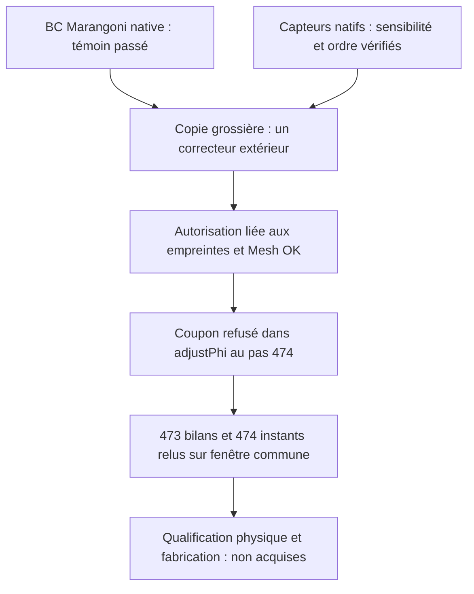

# M64 — activation contrôlée de l'écoulement du coupon F58

**Le premier coupon couplé est refusé après 473 pas complets, à 11,825 µs.**
Le pas suivant échoue dans `adjustPhi` sur un défaut de continuité : les
120 µs visées ne sont pas atteintes. Les deux témoins natifs préalables
passent, mais ne prévoyaient pas ce refus du couplage. Aucun de ces essais
n'est un essai de culasse ou une qualification d'impression.

Suite séparée : [diagnostic du prédicteur et correctif testé sur un cas
natif de 32 cellules](M64_F58_PREDICTOR_CONTRACT_20260908.md). Ce témoin
ne remplace pas le coupon interrompu décrit ici.

Le [raffinement spatial précédent](M64_F58_SPATIAL_REFINEMENT_20260908.md)
laisse subsister le plafond de 3 300 K. La suite porte sur une physique
absente de ce témoin thermique, pas sur un nouveau raffinement ni sur un
relèvement du plafond. [Capsule et empreintes](../twins/m64-cylinder-head/evidence/f58-coupled-flow-20260908.json).

## Une seule modification physique testée

Dans la copie du coupon grossier à 25 ns, `nOuterCorrectors` passe de `0` à
`1`. `momentumPredictor no`, les corrections de pression, la matière, la
source Kelly/SuperGaussian, les conditions limites et le limiteur restent
inchangés. Aucun coefficient n'est ajusté pour obtenir un verdict favorable.

Le [contrôle du solveur ORNL](https://ornl.github.io/AdditiveFOAM/docs/solver-controls/)
identifie `nOuterCorrectors=0` comme mode thermique seul. Le
[témoin Marangoni amont, lignes 47–49](https://github.com/ORNL/AdditiveFOAM/blob/9c05c5eb54db03faa342b14b0806efe740de8c44/test/marangoni/system/fvSolution#L47)
utilise un correcteur extérieur et le prédicteur désactivé. Le
[code de correction pression, lignes 49–54](https://github.com/ORNL/AdditiveFOAM/blob/9c05c5eb54db03faa342b14b0806efe740de8c44/applications/solvers/additiveFoam/pU/pEqn.H#L49)
met alors à jour `phi`, `U` et ses frontières. L'absence d'un solveur linéaire
`U/UFinal` n'est pas compensée par un changement implicite du prédicteur.

## Témoin natif de Marangoni : exécuté

Les fichiers `.C/.H` de la condition limite ORNL sont copiés bit-à-bit et
compilés dans un exécutable témoin sur l'image OpenFOAM 14 épinglée. Cette
condition est normalement compilée dans le solveur ; elle n'est pas supposée
présente dans une bibliothèque qui ne la contiendrait pas.

Sur 32 hexaèdres manufacturés et 16 faces supérieures, trois gradients de
température contrôlent la traction tangentielle, son inversion et le cas
normal sans cisaillement. L'oracle vérifie `mu P dU/dn = (dSigma/dT) P grad(T)`
et `U·n = 0`, avec `P = I − n⊗n`. Il utilise les valeurs nominales existantes
`mu=0,0013 Pa·s` et `dSigma/dT=−0,0003 N/(m·K)`. La
[condition amont](https://github.com/ORNL/AdditiveFOAM/blob/9c05c5eb54db03faa342b14b0806efe740de8c44/applications/solvers/additiveFoam/derivedFvPatchFields/marangoni/marangoniFvPatchVectorField.C)
est exécutée réellement, pas remplacée par l'oracle Python.

| Contrôle natif | Résultat observé | Seuil du témoin |
|---|---:|---:|
| Erreur maximale de traction | 5,1062×10⁻¹² Pa | 10⁻⁹ Pa |
| Vitesse normale maximale | 9,8608×10⁻³² m/s | 10⁻¹⁴ m/s |
| Durée murale / sortie | 8,923 s / 0 | 180 s |

Ces seuils vérifient l'implémentation en virgule flottante, pas la justesse
de la carte matière. Aucun transport PDE ni laser n'est exécuté. Une première
tentative avait échoué à compiler le **driver** (`boundaryMesh()` et
`Info.precision` incompatibles avec cette API). Son refus, sa sortie 2 et
son journal sont conservés ; seuls ces appels et la présentation du fichier
`Make/options` sont corrigés dans une nouvelle tentative. Le backend reste
inchangé.

## Témoin natif des capteurs : exécuté

La configuration `flowDiagnostics` testée est bit-à-bit celle de la préparation.
Elle emploie `CourantNo`, `div(phi)`, `volFieldValue/maxMag` et
`surfaceFieldValue/sumMag` sur les trois patches `top/bottom/sides`.

Un second exécutable C++ impose `U=s·(1000x,2000y,3000z)` et le flux de cette
vitesse aux centres des faces. Il utilise la boucle native `Time::run`, avec
trois états successifs `s=1,2,−1`, sans résoudre de PDE. L'état nul initial
et **chacun des trois pas terminés**, dernier compris, sont comparés à un
oracle algébrique séparé.

| Grandeur | s=1 | s=2 | s=−1 |
|---|---:|---:|---:|
| Maximum de la norme de U, m/s | 0,298171511 | 0,596343022 | 0,298171511 |
| Courant maximal | 0,000375 | 0,000750 | 0,000375 |
| Maximum de `abs(div(phi))`, s⁻¹ | 6 000 | 12 000 | 6 000 |
| Somme des flux frontières absolus, m³/s | 6×10⁻⁹ | 1,2×10⁻⁸ | 6×10⁻⁹ |

Les sorties concordent à la tolérance relative `2×10⁻¹²` et absolue `10⁻¹⁸`
du témoin. Sortie 0 en 4,922 s, sans OOM ni timeout. Ce flux artificiel non nul
est volontaire : il teste la sensibilité du capteur, pas une frontière
imperméable. L'ordre producteur/réducteur et l'absence de retard d'un pas sont
vérifiés par les fichiers réellement écrits. Les mécanismes natifs sont
documentés dans [Time.C, lignes 856–897](https://github.com/OpenFOAM/OpenFOAM-14/blob/7b05503f98a85be88af930df48623b4d152bfc35/src/OpenFOAM/db/Time/Time.C#L856)
et [functionObjectList.C, lignes 376–390](https://github.com/OpenFOAM/OpenFOAM-14/blob/7b05503f98a85be88af930df48623b4d152bfc35/src/OpenFOAM/db/functionObjects/functionObjectList/functionObjectList.C#L376).

## Coupon préparé et critères avant lecture du résultat

Les 29 fichiers d'entrée grossiers épinglés sont d'abord copiés exactement.
Après préparation, seuls `fvSolution` et l'inclusion des capteurs dans
`controlDict` changent ; `system/flowDiagnostics` est ajouté. Le maillage
57 600 cellules et la distribution initiale de poudre ne sont pas régénérés.

Le calcul conserve 380 W, 25 ns et 3 300 K, avec 120 µs visées : 4 800 bilans
énergétiques et 4 801 instants de capteurs étaient attendus. Le lanceur limite
l'exécution à 900 s, 4 CPU, 4 Gio **mémoire et swap combinés**, sans réseau,
avec backend et fichiers `system` en lecture seule. Un `Mesh OK` explicite
est nécessaire avant le laser ; un simple code retour de `checkMesh` ne suffit pas.

Il arrête le diagnostic sur NaN/Inf/FATAL, Courant >0,5, résidu final de
pression >10⁻⁶ ou échec de la borne conservative
`0,0508764045 + Co_max + 0,5 dt max(abs(div(phi))) < 1`.
Cette dernière borne concerne le transport explicite sur la grille et les
propriétés épinglées, pas une preuve globale de convergence multiphysique.
Un arrêt ou un timeout reste un résultat incomplet ; aucune relance automatique.

Les six termes à contre-lire séparément sont sensible, latent, apport net
par les frontières, laser absorbé, advection et limiteur artificiel. Les
dimensions des isothermes 850/870 K demandent aussi une lecture indépendante.
Deux parseurs ne sont pas deux physiques indépendantes. Une intégrale
d'advection faible ou nulle ne prouve pas l'absence de circulation interne.
Précisément, le terme `A = Σ rho Cp div(phi,T) V` est l'opérateur discret
instrumenté, **pas un flux net physique d'enthalpie à la frontière quand Cp
varie**. Le bilan comptable est `S + L − D − Q + A + limiteur` ; sa fermeture
ne transforme pas cet opérateur en un modèle d'enthalpie validé.

Le contrat d'intégrité est fixé **avant** le calcul : tous les fichiers
préexistants doivent rester identiques. Seuls `0/f58_Co` et `0/f58_divPhi`
sont admis comme nouveaux champs initiaux produits par les capteurs, comportement
démontré par le témoin natif. Les refus historiques F58 ne sont pas réécrits.

## Résultat réel : refus du couplage, lecture partielle seulement

Le 8 septembre 2026, le conteneur démarre à 11:09:10 UTC et termine à
11:09:42 UTC : **33,001 s murales, sortie native et client 1**, sans OOM
ni timeout. `checkMesh` donne `Mesh OK`. Le conteneur est supprimé et son
absence vérifiée. Le solveur résout effectivement 442 corrections de pression
et produit un écoulement non nul avant le refus.

Au pas 474, à 11,85 µs, `adjustPhi` indique qu'il ne peut pas éliminer le
défaut de continuité en ajustant la sortie. Ce pas n'a **aucun bilan terminé**.
Les statistiques suivantes portent donc sur les **473 pas précédents** :
vitesse maximale 0,684980 m/s, Courant maximal 0,000477983, borne de transport
maximale 0,0513544 et résidu final de pression maximal 9,92578×10⁻⁷.
Ces valeurs ne lèvent pas le refus de continuité du pas suivant.

Un parseur indépendant, utilisant `Decimal` à 60 chiffres et aucun import
du lanceur ou de l'ancien évaluateur, reconstitue les six intégrales.
La référence thermique complète est **tronquée à la même fenêtre** ; aucune
intégrale partielle n'est comparée aux 120 µs de la campagne précédente.

| Sur 473 pas, soit 11,825 µs | Thermique seul | Couplage interrompu |
|---|---:|---:|
| Stockage sensible S, mJ | 3,035286 | 3,035648 |
| Stockage latent L, mJ | 0,235353 | 0,235891 |
| Apport net frontières D, mJ | 1,388299 | 1,388299 |
| Laser absorbé Q, mJ | 1,895941 | 1,895621 |
| Opérateur discret A, mJ | 0 | 0,0000372153 |
| Limiteur artificiel, mJ | 0,0136008 | 0,0123445 |
| Limiteur / laser absorbé | 0,71736 % | 0,65121 % |
| Intégrale du résidu absolu / Q | 2,09024×10⁻⁷ | 1,84189×10⁻⁷ |
| Pas atteignant le plafond à 10⁻⁶ K près | 54 | 51 |

Le plafond subsiste dans les deux cas. L'énergie incidente sur cette seule
fenêtre vaut 4,4935 mJ ; aucun pas complet ne dépasse 380 W absorbés. La
variation du limiteur ne prouve ni une correction physique suffisante ni une
amélioration de culasse. Le bilan reste celui du modèle artificiellement plafonné.

Les fichiers d'isothermes 850/870 K et les capteurs contiennent **474 instants**,
de l'état initial au pas 473. À 870 K, les dimensions finales calculées sont :

| Dimension à 11,825 µs, µm | Thermique seul | Couplage interrompu |
|---|---:|---:|
| Longueur | 96,902884 | 96,959544 |
| Largeur | 108,483210 | 109,049600 |
| Profondeur | 52,066613 | 51,994773 |

Ce sont des sorties du même modèle, pas des mesures du bain. Les fichiers
capteurs arrondis à la précision d'écriture héritée sont recoupés avec le
journal à 16 chiffres, en tenant compte de cet arrondi. Le maximum du flux
absolu aux frontières sur les pas achevés est 1,33321×10⁻²⁶ m³/s ; cela ne
décrit pas le flux provisoire qui provoque le refus au pas suivant.

Les **30 entrées préparées** (29 fichiers initiaux, dont deux modifiés par
préparation, plus le dictionnaire des capteurs) sont rehashées intactes.
Seuls les deux champs initiaux préannoncés sont ajoutés. Le contrat prévu
d'intégrité passe ; le refus numérique du solveur reste intégralement conservé.
La localisation du message fatal est établie ; ce parseur ne démontre pas
la cause algorithmique du flux provisoire. Aucun second coupon couplé n'est
relancé dans ce sous-lot.

## Limites et état de livraison

La carte AlSi10Mg fournit des coefficients nominaux de viscosité, dilatation,
tension superficielle et propriétés thermiques. Elle ne fournit pas ici une
calibration du lot de poudre, sa conductivité effective mesurée, ni une
absorption laser indépendante. La poudre et le solide ont actuellement les
mêmes lois `k/Cp`. Les lois thermiques sont évaluées dans leurs plages
bornées ; leur présence n'établit pas leur validité à 3 300 K.

L'activation testée ajoute l'écoulement du bain dans le modèle existant.
Elle ne crée ni surface libre/keyhole, ni évaporation, ni perte de masse :
le terme de limitation n'est pas une chaleur latente de vaporisation.
Une recette physique défendable exige encore les propriétés manquantes et
des mesures de référence. Voir la [campagne matériau/procédé](M64_700CH_MATERIAL_COOLING_LPBF.md).

Les deux témoins sont exécutés sur Kali existant, avec 2 CPU, 2 Gio de mémoire,
120 s CPU cumulés surveillés et 180 s murales maximum ; leurs conteneurs sont
supprimés et leur absence vérifiée. Les entrées restent inchangées. Les tests
privés sont **8 PASS pour le préparateur et 24 PASS pour le lanceur** après
renforcement du contrôle des grilles temporelles ; l'oracle des capteurs a
**6 tests PASS**, dont les refus de décalage, dernier pas absent et données non finies.
Le contre-parseur partiel ajoute **7 tests PASS**, notamment l'exclusion du
pas fatal sans bilan et le rejet des grilles temporelles décalées/dupliquées.
Ces résultats ne remplacent pas `make check` du checkpoint de publication.
Le Mermaid est fourni en source ; aucun rendu exécuté n'est revendiqué ici.
Aucune location Vast dans ce sous-lot, aucune géométrie CAO privée publiée,
aucune autorisation d'impression ou de démarrage moteur.
