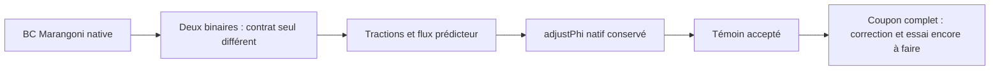

# M64 — contrat du prédicteur Marangoni : témoin natif réussi

**Le correctif passe sur un témoin natif de 32 cellules, pas sur le coupon F58.**
L'ancien exécutable reproduit le refus `adjustPhi` ; le nouveau franchit ce
même garde, tout en conservant les 48 tractions tangentielles comparées.
Le [coupon couplé interrompu](M64_F58_COUPLED_FLOW_20260908.md) reste refusé :
son binaire n'a été ni modifié ni relancé. [Capsule et empreintes](../twins/m64-cylinder-head/evidence/f58-predictor-contract-20260908.json).

## Défaut de contrat isolé

La condition Marangoni projette la vitesse sur le plan tangent, mais hérite
`assignable()=true`. Le champ `UEqn.H()` possède des frontières extrapolées ;
`constrainHbyA` ne réapplique la valeur de U que pour une condition non
assignable. La composante normale de ce prédicteur peut donc échapper à la
contrainte, alors que le U final est correctement projeté.

Le changement testé est une seule méthode du header Marangoni :
`assignable() const { return false; }`, comme pour la condition `slip` native.
Les fonctions de traction `snGrad` et de projection `evaluate`, les conditions
`noSlip` et `fixedFluxPressure`, ainsi que `adjustPhi`, restent inchangées.
Le prédicteur du pas fatal F58 n'a pas été sauvegardé : ce témoin isole le
défaut de contrat, mais ne reconstitue pas quantitativement ce pas du coupon.

## Historique conservé

| Tentative | Résultat réel | Interprétation |
|---|---|---|
| v1 | Compilation refusée, sortie 2, 7,130 s | `fvCFD.H` absent ; aucun témoin exécuté. |
| v2 | Compilation et `Mesh OK`, sortie 134, 58,850 s | Ancien garde refusé comme attendu ; nouveau arrêté avant `adjustPhi` par l'oracle « zéro exact ». Le lecteur attendait aussi à tort des booléens numériques. |
| v3 | Paire native réussie, sortie 0, 23,927 s | Ancien `adjustPhi` : sortie 1 attendue ; nouveau : sortie 0, domaine reconnu fermé. |

La v3 corrige l'oracle et le lecteur, sans accepter rétrospectivement la v2.
Elle reprend le budget de vitesse normale **déjà fixé à 10⁻¹⁴ m/s** par le
témoin BC antérieur. Chaque patch doit respecter
`sum(abs(phiHbyA)) ≤ 10⁻¹⁴ × sum(magSf)`, avec aire calculée nativement.
Les valeurs doivent être finies, les normes non négatives ; `ddtCorr` reste
exigé exactement nul aux frontières non couplées. Aucun flux n'est écrasé
manuellement et le garde natif n'est ni retiré ni intercepté.

| Mesure du prédicteur avant `adjustPhi` | Ancien | Nouveau |
|---|---:|---:|
| Maximum de vitesse normale, m/s | 0,10004623 | 6,16298×10⁻³² |
| Somme des modules des flux frontières, m³/s | 9,99901×10⁻¹⁰ | 9,75752×10⁻⁴¹ |

Le résultat nouveau est **dans le budget**, pas mathématiquement égal à zéro.
Les trois gradients de température testés couvrent traction tangentielle,
gradient normal et inversion du gradient. Les 48 vecteurs de traction natifs
sont identiques entre les deux exécutables ; ce n'est pas une comparaison
entre deux modèles physiques indépendants.

## Périmètre et preuves

Le maillage est immobile ; l'état fabriqué représente une phase entièrement
liquide : matrice Euler,
convection upwind et diffusion natives, puis `HbyA`, `ddtCorr` et `adjustPhi`.
Aucune équation PDE n'est résolue, aucun laser n'est exécuté. Cette preuve
isole un défaut d'implémentation, sans valider l'écoulement complet du coupon.

OpenFOAM 14, commit `7b05503f98a85be88af930df48623b4d152bfc35` :
[contrat de transform](https://github.com/OpenFOAM/OpenFOAM-14/blob/7b05503f98a85be88af930df48623b4d152bfc35/src/finiteVolume/fields/fvPatchFields/basic/transform/transformFvPatchField.H#L100),
[contrat de slip](https://github.com/OpenFOAM/OpenFOAM-14/blob/7b05503f98a85be88af930df48623b4d152bfc35/src/finiteVolume/fields/fvPatchFields/derived/slip/slipFvPatchField.H#L112),
[constrainHbyA](https://github.com/OpenFOAM/OpenFOAM-14/blob/7b05503f98a85be88af930df48623b4d152bfc35/src/finiteVolume/cfdTools/general/constrainHbyA/constrainHbyA.C#L39),
[ddtCorr aux frontières](https://github.com/OpenFOAM/OpenFOAM-14/blob/7b05503f98a85be88af930df48623b4d152bfc35/src/finiteVolume/finiteVolume/ddtSchemes/ddtScheme/ddtScheme.C#L166),
[garde adjustPhi](https://github.com/OpenFOAM/OpenFOAM-14/blob/7b05503f98a85be88af930df48623b4d152bfc35/src/finiteVolume/cfdTools/general/adjustPhi/adjustPhi.C#L82).

Les 25 tests du lecteur passent, dont les lignes réelles v2, NaN/Inf, signes,
booléens, bornes falsifiées et dépassements de débit ou de vitesse. La capsule
lie leurs sources et les journaux natifs. Les 19 entrées et six sorties du
retour v3 ont été re-hachées ; les preuves d'intégrité du backend sont conservées.
Une contre-lecture indépendante, sans importer le lanceur, confirme les
empreintes, les bornes et les comparaisons par lecture directe avec Decimal.
L'erreur maximale de traction observée est 5,10640×10⁻¹² Pa, sous l'oracle
de 10⁻⁹ Pa ; cela ne constitue pas une validation physique indépendante.
Le conteneur Kali a été supprimé, sans OOM ni timeout : limites 2 CPU,
2 Gio mémoire et mémoire+swap combinées, 180 s, réseau désactivé. Aucune
nouvelle location Vast n'a été utilisée.

**Suite non exécutée :** appliquer uniquement ce correctif à une nouvelle
copie des sources F58, compiler un nouveau binaire épinglé, puis revoir un
essai couplé borné avec tous les gardes conservés. Le plafond de 3 300 K et
les questions de validation LPBF restent ouverts ; aucune culasse n'est
validée ni autorisée à fabriquer par ce témoin.
