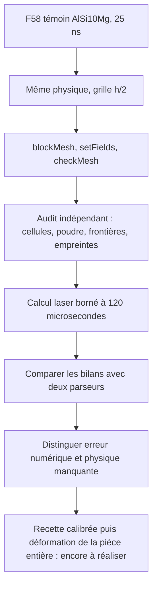

# M64 — raffinement spatial du témoin AdditiveFOAM F58

Ce travail porte exclusivement sur le **coupon logiciel AlSi10Mg F58**,
pas sur une culasse, CP1, une recette fournisseur qualifiée ou une simulation
de déformation de construction entière. La
[campagne matériau/procédé](M64_700CH_MATERIAL_COOLING_LPBF.md) reste ouverte.

**Résultat : le calcul h/2 atteint 120 µs, mais le plafond subsiste.** Le
limiteur retire encore 9,3093 % de l'énergie laser absorbée. Le raffinement
spatial seul ne résout donc pas le défaut physique du modèle. Le code natif
termine sans erreur ; le refus strict d'intégrité du lanceur est conservé et
expliqué séparément ci-dessous.

## Question testée

Après les trois pas temporels 100/50/25 ns, le plafond de 3 300 K et son puits
artificiel subsistent. Cet essai isole une nouvelle variable : **diviser
chaque dimension des cellules par deux**, à pas de temps 25 ns inchangé.
Deux niveaux spatiaux ne permettent pas d'affirmer un ordre de convergence,
et des maxima tous écrêtés ne démontrent pas une convergence physique.

| Paramètre | Référence 25 ns | Essai spatial h/2 |
|---|---:|---:|
| Grille | 120 × 20 × 24 | 240 × 40 × 48 |
| Cellules | 57 600 | 460 800 |
| Dimensions des cellules, µm | 25 × 25 × 12,5 | 12,5 × 12,5 × 6,25 |
| Durée physique | 120 µs | 120 µs |
| Pas de temps | 25 ns | 25 ns |
| Laser incident | 380 W | 380 W |
| Énergie incidente nominale | 45,60 mJ | 45,60 mJ |
| Plafond numérique | 3 300 K | 3 300 K |

Le binaire instrumenté, les bibliothèques, la carte AlSi10Mg, la source
SuperGaussian/Kelly, la trajectoire et les conditions initiales/limites sont
identiques. Ce modèle reste thermique : `nOuterCorrectors=0` ne résout pas
la convection complète du bain. Aucun changement d'absorption ou de plafond
n'est utilisé pour améliorer artificiellement le verdict.

## Préparation et contre-audit réellement exécutés

Le maillage est régénéré ; l'ancienne liste de poudre à 57 600 valeurs n'est
pas réutilisée sur 460 800 cellules. Une initialisation uniforme provisoire
est suivie du `setFields` natif inchangé, puis contrôlée indépendamment.

- OpenFOAM : **Mesh OK**, 460 800 hexaèdres, une région, non-orthogonalité nulle,
  rapport d'aspect 2 ; préparation en 11,288 s, sortie 0, sans OOM.
- Audit indépendant : bijections complètes des points/cellules sur la grille,
  six faces quadrangulaires orientées par cellule, frontières vérifiées.
- Volume recalculé : `4,4999999999999974e−10 m³`, contre `4,5e−10 m³` nominal.
- Poudre vérifiée **cellule par cellule** : 76 800 cellules dans les huit
  couches supérieures, 384 000 dans le substrat. L'interface à −50 µm ne
  traverse aucune cellule, à l'arrondi des coordonnées près.
- Un témoin échangeant poudre/substrat tout en gardant le même comptage
  global est refusé par l'auditeur.

Le pas de temps est aussi présélectionné par une borne de diffusion
conservative sur cette grille orthogonale : `alpha ≤ 169,8/(2670×900)` et
`Di ≤ 3 alpha dt Σ(1/h_i²) = 0,203506 < 1`. Elle inclut le coefficient
de frontière Dirichlet doublé ; elle dépend des limites de propriétés du
modèle actuel et n'est pas une preuve de stabilité de toute physique ajoutée.

## Exécution bornée et critères de lecture

Kali x86, série, plafond 4 CPU/4 Gio et 1 500 s. Racine du conteneur en lecture
seule, réseau désactivé, espace temporaire borné et journaux Docker limités.
L'autorisation de lancer le laser est séparée du reçu d'acceptation du
maillage. Aucun GPU ni location Vast n'est employé dans ce sous-lot.

Le bilan demandé comprend stockage sensible, latent, frontières, advection,
laser absorbé et limiteur artificiel. Il faut contrôler tous les 4 800 pas,
les puissances du journal et les intégrales avec un second parseur indépendant.
La fermeture d'un bilan **incluant une suppression artificielle d'énergie**
ne valide pas l'impression.

## Résultat effectivement exécuté

Le calcul natif a tourné le 8 septembre 2026 de 09:37:25 à 09:58:47 UTC :
**1 282,135 s**, sortie 0, sans timeout ni OOM. L'état final Docker est
conservé ; le conteneur est supprimé et son absence vérifiée. Les deux
journaux contiennent les 4 800 pas de 25 ns, jusqu'à 120 µs.

| Grandeur sur 120 µs | Référence h | Maillage h/2 |
|---|---:|---:|
| Stockage sensible, mJ | 28,346910 | 28,948196 |
| Stockage latent, mJ | 3,692608 | 3,752034 |
| Frontières, apport net, mJ | 3,806254 | 3,824625 |
| Laser absorbé, mJ | 31,562272 | 31,839641 |
| Advection sortante, mJ | 0 | 0 |
| Limiteur artificiel, mJ | 3,329043 | 2,964055 |
| Limiteur / laser absorbé | 10,54754 % | 9,30932 % |
| Intégrale du résidu absolu / laser absorbé | 1,52258×10⁻⁶ | 5,84385×10⁻⁷ |
| Plafond atteint | 3 300 K | 3 300 K |

Les intégrales changent de 2,12 % pour le sensible et de 10,96 % pour le
limiteur, en valeur absolue **normalisée par la référence h**. Cette dernière
baisse ne constitue ni un gain de rendement de culasse ni une convergence
spatiale établie. Le laser absorbé reste inférieur aux 45,60 mJ incidents ;
aucun des 4 800 pas ne dépasse 380 W absorbés, selon les journaux instrumentés.

Les sorties natives d'isothermes ont aussi été relues indépendamment :
4 801 instants par fichier, état initial inclus. À 870 K et 120 µs :

| Dimension calculée, µm | h | h/2 | Variation par rapport à h |
|---|---:|---:|---:|
| Longueur | 234,85825 | 234,14363 | −0,3043 % |
| Largeur | 174,82490 | 181,47350 | +3,8030 % |
| Profondeur | 167,34914 | 177,21333 | +5,8944 % |

La profondeur à 850 K change aussi de +5,8097 %. Il s'agit des dimensions
renvoyées par les objets de post-traitement du modèle plafonné, **pas de
mesures de bain ni d'une validation indépendante de la géométrie fondue**.

### Refus strict du lanceur : préservé, pas contourné

Le solveur crée quatre fichiers de métadonnées dans `constant/polyMesh` :
`cellLevel`, `pointLevel`, `level0Edge` et `refinementHistory`. Le lanceur
figé exigeait une liste de fichiers exactement identique avant/après :
il termine donc en **refus, sortie 1**, avec `case_inputs_unchanged=false`,
malgré la sortie 0 du solveur. Son code et ce reçu ne sont pas réécrits.

L'examen primaire et un contre-audit indépendant retrouvent les 24 fichiers
préexistants bit-à-bit inchangés et uniquement ces quatre ajouts. Les niveaux des cellules
et points sont nuls ; `level0Edge=6,25e−6 m`, aucun historique de division
n'est actif. Les 4 799 enregistrements de sélection de raffinement et de
points de division sont tous nuls. Les anciennes sources et entrées restent
également inchangées. Cette classification permet de lire le diagnostic
énergétique sans déclarer que le contrat strict du lanceur a réussi.
Reçu indépendant final :
`bfe6e903bc81fd9a8bcabda1a9f1d119fefdfb0f68c77608f44f46d59f1ddd84`.

**Deux parseurs indépendants ne constituent pas deux physiques indépendantes** :
ils contre-vérifient les mêmes journaux et les six termes du même modèle
instrumenté. Ils ne remplacent ni un autre solveur qualifié ni une mesure.

## Décision et suite

Ne pas louer une machine plus grosse pour répéter ce seul raffinement en
espérant supprimer le plafond. Les deux niveaux mesurent une sensibilité
spatiale ; ils ne permettent pas d'estimer un ordre ou une erreur extrapolée.
La priorité suivante est de vérifier le domaine de validité de la source,
des propriétés poudre/solide et du modèle de bain, puis de qualifier toute
physique ajoutée sur un témoin et une calibration indépendante. Le plafond
ne sera pas relevé et l'absorption ne sera pas ajustée pour obtenir un
verdict favorable. La distorsion de la culasse entière n'a pas été calculée.

## Traçabilité de préparation

Le [reçu public agrégé](../twins/m64-cylinder-head/evidence/f58-spatial-refinement-20260908.json)
relie les journaux, l'état natif, l'observation de sortie du lanceur, la
comparaison primaire et le contre-calcul Decimal. Les journaux et champs
bruts restent privés. Les clés nulles/non vérifiées des parseurs ne sont
pas remplacées par les statuts du processus : ces preuves sont distinctes.

| Artefact privé | SHA-256 |
|---|---|
| Lanceur effectivement exécuté | `936409570698397bb50beb0bedfa97de4ee792efdc6d164b82ea58dcb7543eb2` |
| Préparation | `7448656ae19242c05e47761117df488e9b4594c12f73b62c020912d68aea75da` |
| Checkpoint du maillage | `50b3c36c1154e2f4e0dfa7ece85f339d435aa7359f9814bac1dfd17b0cd11791` |
| Contre-audit du maillage | `833e6efab6c9439185b814d484649caa393d53375ab1c9fb939861c7f16a8b93` |
| Observation runtime recoupée | `8a00c6a7e37b57cc0cccda4685abf6e8e63aa166b8fdec005b8f1b1be1f8d7cb` |
| Binaire F58 | `b13dacc72146e8df5ded9d20c4b20e7a21051dd21244f9598d441e81c871364d` |
| Carte AlSi10Mg | `65d464489b95dd60bffa61a30caee53e1ec951c4bd53dfed0d7d1ea0d435e3ea` |

## Vérification logicielle et budget

La préparation et le comparateur privés totalisent 22 tests uniques réussis
(12 préparation/lanceur, 10 comparateur) ; quatre helpers ont en outre été
réexécutés contre le comparateur v2. Le parseur Decimal possède sept témoins
synthétiques réussis. Ces tests sont distincts de l'exécution native et de
l'audit du maillage effectivement produit.

Le `make check` complet du lot termine avec sortie observée 0 : la suite
principale contient 2 431 tests, dont 108 ignorés pour dépendances optionnelles.
Les autres cibles terminent également sans échec. Journal privé :
`eed2b2a1aad81089b05d87dde8b5e6e7843a43554bd77737aa607d96f3b2e510`.
Les sources Mermaid sont relues ; aucun rendu exécuté de ces nouveaux
diagrammes n'est revendiqué. La stratégie de test sépare régression,
contre-lecture et physique ; la documentation conserve les refus.

Le plafond utilisateur est 44 USD, sans recharge. **Aucune nouvelle location
Vast pour ce sous-lot** : le témoin est exécuté sur la machine Kali existante.
Un crédit annoncé n'est pas un solde garanti ni une preuve de calcul achevé.

Les sources privées et les cas antérieurs sont conservés. Ces diagnostics
ne donnent **aucune autorisation d'impression ou de démarrage moteur**.
