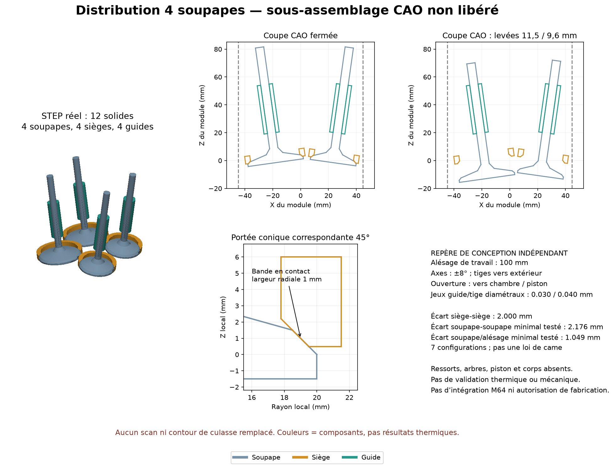

# Distribution 4V : sous-assemblage CAO indépendant construit



**Douze solides ont été construits et exportés en STEP d'assemblage nommé :**
quatre soupapes à portée conique, quatre sièges annulaires correspondants et
quatre guides. Les STEP fermé et à levées maximales sont valides après
réimport. Sept configurations passent les contrôles géométriques décrits
ci-dessous. Ce n'est pas une culasse terminée, intégrée au moteur ou autorisée
à fabriquer.

Le module possède son propre repère de conception, **en millimètres**.
Il ne lit ni le scan 935 ni F53 et ne change aucune enveloppe extérieure.
Ses coordonnées ne sont pas des interfaces Porsche mesurées. L'alésage
100 mm est une base de travail provisoire, pas un contrat de montage M64.

## V2 : meilleur pire cas, avec un compromis explicite

Le placement **V2** est retenu comme candidat d'encombrement : il translate
tous les composants de `+1,5 mm` selon X. Aucun diamètre, profil de composant,
inclinaison ou levée ne change. V1 reste intégralement disponible comme
témoin. Le seuil géométrique des enveloppes de sièges est porté à **2 mm**
pour le contrôle de V2 ; ce seuil est respecté.

| Distance minimale native | V1 | V2 |
|---|---:|---:|
| Soupape/alésage, pire cas des sept états | 0,308483 mm | **1,048589 mm** |
| Soupape/soupape, pire cas des sept états | 2,175732 mm | 2,175732 mm |
| Enveloppe de siège/enveloppe de siège | 2,000000 mm | 2,000000 mm |
| Soupape/alésage, admission seule à levée maximale | **1,323201 mm** | **1,048589 mm** |

L'amélioration du pire cas global vaut **0,740106 mm**. V2 n'améliore donc
**pas chaque état ni chaque soupape individuellement** : en rapprochant
l'échappement du cylindre, il améliore la zone d'admission initialement
limitante. Le cas admission seule ouverte perd `0,274612 mm` de marge.
Cette sélection se fonde sur le pire cas global, pas sur une dominance
sans compromis. Le [comparatif complet](../twins/m64-cylinder-head/evidence/four-valve-design-v2-20260907/placement-comparison.json)
publie les sept états et les quatre soupapes par état. Aucune V3 n'est
construite dans ce lot.

Le millimètre environ restant à froid **n'est toujours pas une validation
à chaud, sous flexion, avec le piston réel ou avec les tolérances de montage**.

## Paramètres et provenance

| Paramètre | Admission | Échappement | Statut |
|---|---:|---:|---|
| Diamètre de tête | 40 mm | 33 mm | Comparaison documentaire Swindon |
| Levée maximale testée | 11,5 mm | 9,6 mm | Comparaison documentaire Swindon |
| Position X des axes au plan de référence V1 → V2 | −19,5 → −18 mm | +22 → +23,5 mm | Choix de conception |
| Position Y des deux axes | ±22,5 mm | ±22,5 mm | Choix de conception V1 |
| Inclinaison d'axe | −8° | +8° | Choix de conception, angle inclus 16° |
| Angle de portée par rapport au plan transversal | 45° | 45° | Choix de conception, pas angle d'axe |
| Largeur radiale de bande de contact | 1 mm | 1 mm | Choix de conception, non qualifié |
| Diamètre extérieur du siège | 43 mm | 36 mm | Choix de conception |
| Diamètre de tige | 6 mm | 6 mm | Choix de conception |
| Alésage du guide | 6,030 mm | 6,040 mm | Choix diamétral à froid |
| Diamètre extérieur / longueur du guide | 11 / 35 mm | 11 / 35 mm | Choix de conception |

Les diamètres et levées sont publiés dans la
[fiche primaire Swindon](https://swindonpowertrain.com/wp-content/uploads/2025/10/M64-24V-Cylinder-Head-Kit-Product-Sheet-0923.pdf).
Cela n'établit ni la géométrie interne du kit, ni sa transposition au moteur
turbo du projet. Les autres valeurs sont les choix explicites du module.

Le [catalogue primaire MAHLE](https://www.mahle-aftermarket.com/media/homepage/facelift/media-center/product-catalogs/mahle_valve_train_components_catalog_2025_screen_v002.pdf)
documente des portées 45° pour certaines soupapes M64 **2V Carrera**, ainsi
qu'une table générale de jeux tige/guide. Cette dernière ne précise pas
littéralement si ses jeux sont radiaux ou diamétraux : les jeux diamétraux
0,030 / 0,040 mm du présent module sont **choisis**, pas automatiquement
dérivés ou validés par cette table. Voir la
[revue documentaire](M64_VALVE_MODULE_PRIMARY_REFERENCES_20260907.md).

Les pièces ne sont pas encore des références d'achat. Les alliages, états
métallurgiques, traitements, serrages des sièges et guides dans le corps,
lubrification et valeurs à chaud restent à sélectionner et qualifier.

## Géométrie réelle des contacts et du mouvement

Le siège et la soupape utilisent le même cône sur la bande de contact.
Pour une portée 45°, une variation radiale de 1 mm correspond à une
variation axiale de 1 mm et une largeur mesurée sur la pente de √2 mm.
Le modèle distingue cette bande conique de l'alésage cylindrique du guide.
Les pièces sont des solides de révolution, pas des disques simplement
superposés. Le col de soupape est encore défini par des tronçons coniques :
ses raccordements de fatigue et les détails d'extrémité/verrouillage de
tige ne sont pas finalisés.

L'axe local positif va vers l'extrémité de tige. Les tiges s'écartent vers
l'extérieur du module ; une levée positive applique la translation
**opposée à cet axe**, vers la chambre et le piston. Les positions des
sièges et guides restent fixes. La tige couvre encore toute la longueur
du guide à la levée maximale candidate.

Il n'y a **aucun ressort factice**, arbre à cames, culbuteur, piston ou corps
de culasse ajouté pour combler les éléments non définis. Les configurations
simultanées constituent une exploration d'encombrement, pas une loi de
came ni un cycle moteur calculé.

## Vérifications exécutées

| Contrôle natif OCCT | Résultat V1 |
|---|---:|
| Solides par STEP après réimport | 12 |
| BRepCheck des composants et deux assemblages réimportés | Valide |
| Séparation minimale entre enveloppes cylindriques pleines des sièges | **2,000 mm** |
| Seuil géométrique de conception choisi pour cette séparation | 1,5 mm |
| Séparation minimale entre siège et guide voisin | 21,755 mm |
| Erreur maximale des points de bande commune sur les deux solides | `2,04e-14` mm |
| Tests de placement de bande | 72 distances natives par soupape |
| Intersection volumique siège/soupape au fermé | Sous `1e-7` mm³ |
| Jeu radial natif tige/guide, minimum des quatre | 0,015 mm |
| Distance soupape/soupape minimale parmi les états testés | **2,176 mm** |
| Distance soupape/alésage minimale parmi les états testés | **0,308 mm** |
| Coupes STEP après réimport, fermé / levée max | 65 / 64 arêtes, BRepCheck valide |

Un dernier audit **en lecture seule** a activé explicitement
`BRepCheck_Analyzer.SetExactMethod(True)` sur les quatre STEP d'assemblage
V1/V2, puis sur chacun de leurs solides réimportés : tous passent. L'unité
`SI_UNIT(.MILLI.,.METRE.)` est également présente dans les STEP. Les
[reçus V1](../twins/m64-cylinder-head/evidence/four-valve-design-20260907/exact-integrity-report.json)
et [V2](../twins/m64-cylinder-head/evidence/four-valve-design-v2-20260907/exact-integrity-report.json)
portent leurs hashes exacts. Aucune géométrie n'a été reconstruite pour ce
contrôle supplémentaire.

**La marge de 0,308 mm au cylindre est faible.** Le fait qu'elle soit positive
à froid ne démontre pas l'absence de contact avec dilatation, tolérances,
flexion, guidage réel ou dépôts. Elle n'est pas présentée comme suffisante
pour un moteur. De même, 2 mm entre enveloppes de sièges représente l'espace
géométrique disponible pour un pont de matière, pas un pont dont la
résistance ou le refroidissement aurait été calculé.

Les sept états sont : fermé, levées simultanées à 25 / 50 / 75 / 100 %,
admission seule au maximum et échappement seul au maximum. Pour chacun :
six couples soupape/soupape, 32 couples soupape/composant fixe et quatre
soupapes face à l'alésage de travail ont été contrôlés. Les tangences
indésirables sont rejetées même si leur volume commun est nul ; le contact
intentionnel de la portée propre est distingué des contacts voisins.

Les surfaces de sièges ont aussi été remplacées **pour le seul contrôle
d'encombrement** par leurs cylindres extérieurs pleins. Cela évite de
confondre absence de collision des anneaux et présence d'un espace entre
enveloppes. Aucun corps de culasse n'est implicitement créé par ce contrôle.

Les collisions sont calculées par distance et opérations booléennes
volumiques sur les solides natifs ; le cylindre de contrôle contient toute
la hauteur des soupapes dans les états considérés. Ces sept configurations
seules ne prouvent pas une absence de collision continue, ni une absence de
contact avec un piston absent. L'audit complémentaire suivant traite uniquement
les six couples soupape/soupape sur toute leur levée.

## Audit continu complémentaire : couples soupape/soupape V2

Le [rapport natif complémentaire](../twins/m64-cylinder-head/evidence/four-valve-design-v2-20260907/continuous-valve-pair-report.json)
provient de **862 distances OCCT** calculées sur les quatre solides soupapes
réimportés du STEP V2. Ils sont identifiés par équivalence volumique unique
avec les profils paramétriques ; l'ordre des solides du STEP n'est pas supposé.
L'exécution sur Kali s'est terminée avec code 0, dans le runtime OCP existant
`sha256:49979f46f421459dae4bf21aaa898e2253b07301c3e5b2cabaa6eaf06f54d696`.

Chaque soupape est translatée sur son axe, indépendamment des autres, entre
zéro et sa levée maximale. Pour deux solides rigides, la distance ne peut
diminuer de plus que la somme de leurs déplacements. Sur une grille couvrant
entièrement ces deux intervalles, cela donne :

```text
distance continue >= minimum des distances échantillonnées
                     - rayon de couverture de la première grille
                     - rayon de couverture de la seconde grille
                     - réserve numérique supposée
```

Avec un pas maximal de 1 mm, les six bornes restent positives. La plus faible
vaut **1,216556 mm**, après déduction des deux rayons de couverture et d'une
réserve numérique de `1e-5 mm`. Le minimum natif échantillonné est
`2,175732 mm`. Il ne faut pas confondre la borne conservatrice et le minimum
géométrique réellement atteint.

**La réserve numérique OCCT est une hypothèse, pas une borne d'erreur
certifiée par arithmétique d'intervalles.** Cette conclusion conditionnelle
concerne les seuls couples de soupapes rigides de ce module froid. Elle ne
couvre ni piston, composants fixes, flexion, dilatation, dépôts, jeux de
guidage réels, ni loi de came. Ce n'est toujours pas une validation moteur.
Le [script indépendant](../twins/m64-cylinder-head/source/audit_continuous_valve_clearance.py)
conserve tous les échantillons et SHA256 ; il ne modifie ni STEP ni scan.

## Artefacts et reproduction

- [Source paramétrique](../twins/m64-cylinder-head/source/build_four_valve_distribution.py).
- [Paramètres V2](../twins/m64-cylinder-head/source/four-valve-distribution-v2.parameters.json).
- [STEP V2 fermé](../twins/m64-cylinder-head/evidence/four-valve-design-v2-20260907/closed.step).
- [STEP V2 aux levées maximales simultanées](../twins/m64-cylinder-head/evidence/four-valve-design-v2-20260907/simultaneous_100pct.step).
- [Coupe STEP V2 fermée](../twins/m64-cylinder-head/evidence/four-valve-design-v2-20260907/closed-section.step).
- [Coupe STEP V2 aux levées maximales](../twins/m64-cylinder-head/evidence/four-valve-design-v2-20260907/simultaneous_100pct-section.step).
- [Construction V2](../twins/m64-cylinder-head/evidence/four-valve-design-v2-20260907/build-report.json), [audit V2](../twins/m64-cylinder-head/evidence/four-valve-design-v2-20260907/audit-report.json), [coupes V2](../twins/m64-cylinder-head/evidence/four-valve-design-v2-20260907/sections-report.json), [rendu V2](../twins/m64-cylinder-head/evidence/four-valve-design-v2-20260907/render-report.json).
- Témoin V1 conservé : [STEP fermé](../twins/m64-cylinder-head/evidence/four-valve-design-20260907/closed.step), [construction](../twins/m64-cylinder-head/evidence/four-valve-design-20260907/build-report.json), [audit complet](../twins/m64-cylinder-head/evidence/four-valve-design-20260907/audit-report.json).

Ces STEP proviennent exclusivement de la nouvelle définition paramétrique,
pas d'un scan privé. Le rendu d'ensemble est réalisé sur le STEP réimporté ;
les coupes de la figure sont des intersections CAO natives. Aucune image
générative n'est utilisée. Le skill `create-viz` a guidé les couleurs par
composant, les axes en millimètres et les avertissements visibles.
Dans la figure V2, les pointillés correspondent à l'intersection du cylindre
avec le plan `Y = 22,5 mm`, soit `X = ±√(50² − 22,5²) mm`. Ils remplacent
les limites projetées `X = ±50 mm` du premier rendu V1, sans changer les
calculs natifs de distance au cylindre.

Sur le runtime Linux OCP préparé :

```sh
timeout 300 /opt/venv/bin/python build_four_valve_distribution.py --stage build --output /chemin/nouveau/module
timeout 300 /opt/venv/bin/python build_four_valve_distribution.py --stage audit --output /chemin/nouveau/module
timeout 300 /opt/venv/bin/python build_four_valve_distribution.py --stage sections --output /chemin/nouveau/module
timeout 300 /opt/venv/bin/python build_four_valve_distribution.py --stage render --output /chemin/nouveau/module
timeout 300 /opt/venv/bin/python build_four_valve_distribution.py --stage integrity --output /chemin/nouveau/module
```

Chaque étape native se limite à deux CPU et 4 Gio. `--parameters` accepte
un JSON de paramètres de conception ; les champs omis reprennent les
valeurs de la classe `Parameters`. Les sorties préexistantes sont protégées.
Pour V2, passer `--parameters four-valve-distribution-v2.parameters.json`
aux cinq étapes. `--stage compare --baseline /chemin/V1 --output /chemin/V2`
reproduit le comparatif des rapports natifs sans reconstruire la CAO.
Les contrôles Python locaux couvrent paramètres, orientation, contact
conique, jeux, états sélectionnés et absence de promotion en validation
moteur ; ils ne remplacent pas les exécutions natives enregistrées.

Le module reste à intégrer à des interfaces M64 démontrées, puis à compléter
par le corps, les conduits, les portées de fixation, la distribution et ses
ressorts sélectionnés. La thermique, la charge turbo, les pressions de
contact, les jeux à chaud, la fatigue et le procédé de fabrication ne sont
pas validés par ce sous-assemblage.

### Interfaces siège/corps et guide/corps : premier écran exécuté

Un [écran analytique reproductible](../twins/m64-cylinder-head/seat-guide-thermal-screen/README.md)
compare maintenant les **interfaces siège/corps et guide/corps**, avec
plages documentaires et hypothèses de dilatation explicitement séparées.
Il montre des pertes possibles d'interférence dans certaines hypothèses,
sans permettre de sélectionner un serrage ou un matériau de fabrication.
Les deux diamètres extérieurs de sièges et les axes sont désormais des
entrées CAO reproductibles ; un calcul local de contact peut ensuite
contraindre l'épaisseur et le transfert thermique autour d'eux. Cette
interface est prioritaire à des ressorts choisis sans loi de came, masses
mobiles qualifiées et accélérations réelles. Elle ne nécessite pas de
substituer une nouvelle enveloppe au scan. Le corps et ses logements ne sont
pas encore construits dans ce module.
