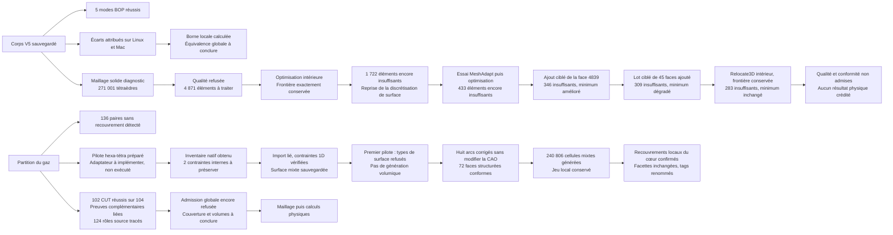

# M64 — contacts de guides et préparation géométrique

**Dernier résultat gaz : le correctif de huit arcs permet de générer
240 806 cellules mixtes, dont les 67 200 hexas attendus. Le contrôle final
refuse cependant la topologie : des recouvrements locaux de tétraèdres sont
confirmés. Ce n'est pas encore un maillage admissible pour OpenFOAM.**
Pour le solide, le déplacement intérieur réduit de 309 à 283 les tétraèdres
sous `minSICN = 0,1`, sans améliorer le minimum de 0,000792. Le fichier CAO
et la frontière du maillage restent inchangés ; la distance
échantillonnée à la CAO reste non qualifiée. Ces diagnostics ne démontrent
ni amélioration de résistance ni aptitude à la fabrication.

**Le candidat BRep sauvegardé passe les cinq modes BOP sélectionnés ;
les 136 contrôles de non-recouvrement du gaz passent également.** Le nouveau
diagnostic complet des frontières termine 104 soustractions : 102 passent,
deux restent averties sur le même groupe de trois faces. Les différences de
resérialisation sont maintenant attribuées sur Linux comme sur macOS, sans
preuve d'équivalence globale des solides ni levée du refus historique.
Le maître `21c9c40b…` reste inchangé, sans promotion du candidat `450ba081…`.
Les contacts nominaux des guides sont mesurés, sans qualification à chaud.
La partition du gaz reste refusée : validité et non-recouvrement sont contrôlés,
mais la couverture des frontières et le bilan de volumes ne sont pas encore
acceptés globalement. Un nouveau contrôle du 8 septembre attribue les huit
faces des deux groupes mixtes aux rôles source. Leur rattachement aux preuves
antérieures permet un registre des **124 faces externes**, sans revalidation
physique des étiquettes. Un premier maillage du **solide V5**, distinct du gaz,
est obtenu puis rejeté : **4 871 éléments sur 271 001 sous le seuil de qualité**.

Ce point suit les [contrôles de matière et de logements](M64_EXHAUST_MATERIAL_CONTROLS_20260908.md)
et la [localisation des défauts du maillage](M64_ANNULAR_MESH_LOCALISATION_20260908.md).
Les [empreintes des reçus](../twins/m64-cylinder-head/evidence/geometry-checkpoint-20260908.json)
séparent les opérations successives et conservent les échecs. Les unités restent
celles du scan, sans certification de l'échelle ou des interfaces M64.

## Appui des inserts : mesure sur la géométrie, pas sur une pièce fabriquée

Les quatre guides du STEP V2 sont identifiés parmi ses douze solides par leurs
surfaces cylindriques, axes, longueurs et volumes, puis recoupés avec les
identifiants enregistrés. Leur transformation de repère est appliquée une fois.
Les modèles d'inserts ne sont pas remplacés par les boîtes des logements.

Pour chaque guide, `Common(face extérieure du guide, corps)` fournit un patch
exporté en privé. Son aire est rapportée à la surface latérale extérieure du
guide de longueur nominale 35 unités. Soixante-quatre sections natives,
strictement intérieures et régulièrement espacées, mesurent ensuite les arcs
d'appui. L'union des arcs évite de compter deux fois les superpositions.

| Guide CAO | Aire du patch, unités scan² | Fraction de la surface extérieure | Sections sans / partielles / complètes |
|---|---:|---:|---:|
| Échappement 1 | 817,779374 | 67,6123 % | 17 / 5 / 42 |
| Échappement 2 | 817,528516 | 67,5915 % | 17 / 5 / 42 |
| Admission 1 | 794,822941 | 65,7143 % | 22 / 0 / 42 |
| Admission 2 | 794,822941 | 65,7143 % | 22 / 0 / 42 |

Les 256 sections sont des **échantillons**, pas une preuve de couverture
continue entre les plans. La moyenne des sections diffère légèrement du
rapport d'aires ; elle ne le remplace pas. Les deux admissions concordent avec
le diagnostic historique 23/35 ; cette concordance ne qualifie pas leur tenue.

Les quatre intersections `Common(guide solide, corps)` ont un volume
numériquement nul. Ce n'est ni une preuve de jeu strictement nul à toute
échelle, ni une prescription de serrage. Les opérations utilisent les
tolérances natives d'OCCT. Pression de contact, conductance thermique,
dilatation différentielle et rétention restent à déterminer. Une fraction
d'appui inférieure à 100 % ne suffit, à elle seule, à conclure à un défaut.

Le premier témoin échoue avant tout cas pour une collision de noms lors de
l'import Python d'OCP. Après correction limitée à cet import, quatre témoins
natifs passent : appui entier, demi-longueur, demi-circonférence et aucun
contact, avec 32 sections conformes. Le contrôle des quatre guides suit avec
code natif/wrapper 0, en 7,761 s / 8,196 s nettoyage compris. Aucun corps modifié.

## Courbes : restriction exacte et candidat segmenté, acceptation non acquise

Les six supports existants des deux arêtes signalées C0 sont divisés en quinze
supports : cinq courbes 3D et dix p-curves. Pour ces B-splines non rationnelles,
les identités polynomiales sont contrôlées en arithmétique rationnelle sur
chaque intervalle ; les coefficients sont réassemblés exactement. Les quinze
supports construits dans OCP sont au moins C1 à l'intérieur de leur domaine.
Les 495 comparaisons supplémentaires de points natifs donnent un écart nul ;
cet échantillonnage n'est pas, à lui seul, la preuve globale.

Les discontinuités de tangente initiales restent aux jonctions. Il ne s'agit
pas d'un lissage. Aucun corps BRep n'est lu ou écrit pendant cet essai de
supports de 0,613 s. À ce stade, leur réintégration dans une copie topologique
et le contrôle du corps complet restent à faire, sans changer les surfaces.
L'ancien refus de réduction de multiplicité reste distinct et conservé.

### Réintégration : trois arrêts logiciels avant remplacement des arêtes

| Essai natif | Durée native | Premier arrêt | Travail réellement atteint |
|---|---:|---|---|
| V2 | 2,135 s | `topological_occurrence_location_not_identity` | Lecture et contrôles du corps source ; copie non créée. |
| V3 | 2,542 s | `copy_placement` | Copie créée en mémoire ; correspondance des entités non terminée. |
| V4 | 2,897 s | `Standard_NoSuchObject` | Bijections des entités copiées contrôlées ; revue racine/hiérarchie non terminée. |

Les deux premiers gardes confondaient représentation interne d'une
localisation et transformation effective. V4 autorise seulement, pour les
sommets copiés, un changement de représentation si les deux matrices sont
exactement identitaires et si coordonnées brutes, coordonnées effectives et
tolérances sont identiques. Les autres localisations restent comparées sans
cette exception. Les 4 938 changements de représentation observés en V4 ne
sont donc pas 4 938 déplacements de sommets.

L'exception V4 ne démontre pas un défaut de la pièce : le reçu la situe après
la bijection, mais ne contient pas de traceback permettant d'identifier
l'appel précis. Aucun de ces trois essais ne reconstruit les arêtes,
n'exporte de BRep, ne relit un candidat ou n'exécute BOP. Les champs de modes
BOP décrivent le calcul prévu ; `stage=complete` signifie fin du programme,
pas réussite géométrique. Les entrées et le programme restent inchangés durant
chaque essai, sorties 2 sans OOM ni timeout. Aucun ancien refus n'est effacé.

Un diagnostic local séparé reproduit une recherche de sous-forme absente avec
les localisations non cumulées. En cumulant les localisations, comme le fait
[OCCT lors de la copie](https://github.com/Open-Cascade-SAS/OCCT/blob/V7_9_3/src/BRepTools/BRepTools_Modifier.cxx),
le parcours complet effectue 75 186 recherches sans erreur, sur 25 069 formes.
Ce diagnostic ne reconstruit rien et ne modifie pas le corps, en mémoire ou
sur disque. Il identifie une correction du programme à tester, pas une
correction du corps déjà acquise.

### V5 : candidat sauvegardé et relu, resérialisation différente

La correction limitée des deux parcours de hiérarchie est exécutée sur Kali.
Elle produit un candidat binaire privé : un solide, une coque, 4 900 faces,
10 078 arêtes et 5 179 sommets. Cela ajoute trois arêtes et trois sommets,
sans changer les supports des surfaces ni leurs localisations/tolérances
dans la copie en mémoire. Les occurrences orientées des contours correspondent
aux remplacements prévus. Il ne s'agit pas d'un lissage du contour Porsche.

Après sauvegarde/relecture, les nombres d'entités restent identiques,
`BRepCheck` exact passe, les tolérances des sommets/arêtes/faces sont conservées
et les coefficients des quinze supports segmentés correspondent exactement.
Le corps source reste inchangé en mémoire et sur disque.

Le garde suivant refuse pourtant le candidat : son empreinte de sérialisation
binaire en mémoire diffère après relecture (`reread_serialized_representation_equal=false`).
Les contrôles précédents n'identifient pas encore la différence ; elle ne doit
être ni assimilée sans diagnostic à une déformation, ni écartée comme anodine.
Les quadratures comparatives et les cinq modes BOP prévus ne sont pas atteints.
Aucun critère n'est dispensé et le candidat n'est pas promu comme maître.
Durées 8,307 s natives / 8,905 s nettoyage compris, sorties 2, sans OOM ni timeout.
Pour V5, les plafonds demandés sont enregistrés, mais la sonde de ressources a
échoué avant inspection : aucune mesure effective CPU/RAM n'est revendiquée.
Suppression et absence du conteneur sont vérifiées séparément.

### BOP indépendant du candidat sauvegardé : cinq modes réussis

Un contrôle distinct relit directement le binaire `450ba081…` sur Kali/OCP
7.9.3.1, sans reconstruire ni exporter le corps. `SelfInterMode`,
`SmallEdgeMode`, `RebuildFaceMode`, `ContinuityMode` et `CurveOnSurfaceMode`
sont tous activés et terminés : **zéro défaut, erreur ou avertissement**.
Les quatre autres modes restent désactivés et sont consignés dans le reçu.
Ce résultat concerne ces cinq modes, pas tous les critères possibles d'OCCT.

`BRepCheck` exact passe avant et après. Les tolérances brutes/effectives et les
empreintes binaires du même objet chargé restent identiques durant le contrôle.
Le fichier source est inchangé ; l'ancien refus de resérialisation n'est pas
effacé. Durées : 173,501 s pour BOP, 178,128 s pour le worker et 178,849 s
nettoyage compris. Sorties 0, sans OOM ni expiration. Les plafonds effectifs
2 CPU/4 Gio, le système de fichiers racine en lecture seule et l'absence de
réseau sont vérifiés. Conteneur supprimé, absence revérifiée séparément.

### Sérialisation : les 1 114 octets différents sont localisés sur macOS

Une lecture par chemin suivie de deux écritures **en mémoire** reproduit une
différence de 1 114 octets sur 5 205 080, sans changement de longueur. Les deux
écritures successives du même objet sont identiques. Un lecteur du format OCCT
V3 attribue ensuite toutes les différences ; il vérifie les limites des tables,
les références topologiques, les orientations, les drapeaux et la fin du fichier.

| Champs modifiés après lecture/écriture | Octets différents | Écart maximal par composante |
|---|---:|---:|
| Directions des courbes 2D | 90 | `1,11023e−16` |
| Directions des courbes 3D | 366 | `2,22045e−16` |
| Directions des repères de surfaces planes/cylindriques | 374 | `2,22045e−16` |
| Caches des extrémités UV de 101 arêtes | 284 | `4,26326e−14` en coordonnées UV |

Aucun octet différent ne reste non attribué. Les localisations, points,
coefficients des B-splines, rayons, intervalles, tolérances, références et
drapeaux topologiques sérialisés ne changent pas dans cette comparaison.
Les directions sont sans dimension ; un écart UV **n'est pas** une distance 3D.
Les 32 correspondances exactes à une normalisation simple parmi 45 groupes de
directions 2D modifiés ne justifient pas d'attribuer tous les écarts à cette seule
opération. Le format reconstruit des directions/repères et recalcule des caches
UV lors de la lecture ; ce sont des mécanismes à distinguer.
[Lecture des directions](https://github.com/Open-Cascade-SAS/OCCT/blob/V7_9_3/src/BinTools/BinTools_Curve2dSet.cxx),
[lecture et écriture des arêtes](https://github.com/Open-Cascade-SAS/OCCT/blob/V7_9_3/src/BinTools/BinTools_ShapeSet.cxx).

Ces diagnostics de 0,756 s, 1,343 s et 1,683 s utilisent **macOS arm64**, pas le
conteneur Linux. L'empreinte après lecture y est `7f3cc7e4…`, contre `37eda433…`
dans l'audit BOP Linux, avec le même format V3. L'attribution macOS ne prouve
donc pas celle de Linux. Les empreintes avant/après chaque audit ne sont
comparées qu'au sein de la même exécution. Aucun BRep n'est exporté, aucune
tolérance augmentée et aucun candidat promu. Une première sonde atteint son
plafond CPU sans checkpoint ; deux essais du lecteur s'arrêtent sur des erreurs
de séparateurs avant correction d'après le format source. Leurs reçus privés
sont conservés ; ils ne sont pas des échecs physiques de la pièce.

### Linux : empreinte BOP reproduite et 175 octets attribués

Un lot distinct utilise la même image OCP 7.9.3.1 linux/amd64 que l'audit BOP.
La lecture du fichier puis l'écriture V3 en mémoire reproduisent exactement
son empreinte `37eda433…`. Deux écritures du même objet chargé concordent.
Le corps comporte toujours 5 205 080 octets : 175 diffèrent du fichier source,
contre 1 114 sur macOS. Aucun nouveau BOP ni export CAO n'est exécuté.

| Champs Linux modifiés | Octets différents | Entités concernées |
|---|---:|---:|
| Directions de lignes 2D | 64 | 32 courbes |
| Directions de coniques 3D | 40 | 15 courbes |
| Repères de plans et cylindres | 58 | 23 surfaces |
| Caches d'extrémités UV | 13 | 10 arêtes de la table TShapes |

Tous les octets différents sont attribués. Points, coefficients des B-splines,
rayons, intervalles, tolérances, localisations, références et drapeaux
topologiques sérialisés restent inchangés dans cette comparaison. Les 32
directions 2D modifiées correspondent à la formule de normalisation simple
testée ; ce constat ne décrit pas tous les mécanismes de reconstruction des
repères 3D. L'écart maximal des caches reste une grandeur UV (`1,42109e−14`),
pas une distance spatiale. Le résultat Linux n'efface pas le résultat macOS.

Durées : 1,360 s natives / 1,955 s nettoyage compris, sorties 0, pas d'OOM ni
expiration. Plafonds effectifs 2 CPU/4 Gio, racine en lecture seule et réseau
absent contrôlés ; conteneur supprimé et absence revérifiée. Le fichier source,
les décodeurs et les entrées restent intacts. Le candidat n'est pas promu.

### Borne des représentations Linux : portée locale explicite

Un calcul séparé, sans appel OCP, traite les valeurs binary64 comme des
rationnels exacts et arrondit les majorants vers l'extérieur. Il encadre les
32 lignes 2D sur leurs intervalles complets, les 15 coniques 3D et les 23
repères de surfaces modifiés. Pour les plans, les contours définissent une
enveloppe UV finie ; les B-splines utilisées sont non périodiques, à extrémités
bloquées et poids positifs. Leur enveloppe de pôles fournit un encadrement.

Le maximum des bornes par composante spatiale vaut
**`1,0854592454916939e−14` unité scan**, sur une ellipse 3D. Par exemple, la
variation d'une ligne est bornée par `max|t| × |Δdirection|` ; celle d'une
conique par `rayon1 × |Δaxe1| + rayon2 × |Δaxe2|`. Les repères et changements
de paramètres sont pris en compte pour les contours projetés sur les plans.

Une revue indépendante reproduit les 72 bornes spatiales et 32 bornes UV,
vérifie les offsets et les deux décodeurs importés. Ces derniers ne sont pas
directement épinglés dans le script de bornes : leurs hashes ont été contrôlés
séparément, comme ceux du corps et du rapport Linux. Durée du calcul initial :
1,241 s ; aucun natif ni fichier CAO créé.

Cette borne porte sur les **représentations analytiques et contours décrits**,
pas sur la distance de Hausdorff entre solides, les erreurs d'évaluation
flottante d'OCCT ou les caches UV d'extrémités. Le budget de représentation
provisoire `1e−9` unité scan, fixé avant le calcul, n'est ni une tolérance
d'usinage ni une levée automatique du refus historique. Aucune précision
physique, équivalence globale ou autorisation de fabrication n'en est déduite.

## Partition du gaz : refus conservé

Sur le domaine d'admission `fab1338a…`, le calcul natif obtient en mémoire
seize blocs annulaires à six faces, douze arêtes et huit sommets, plus un cœur.
Les contrôles d'ascendance des frontières et d'interfaces partagées précèdent
le refus `native_partition_volume_sum_failed`. Le seuil relatif `1e−9` n'est
pas modifié. Aucun export BRep de cette partition ni `gmsh.generate` exécuté.

La somme des dix-sept volumes enregistrés lors de ce premier essai vaut
`995961.7204052373` unités scan³. Le volume initial de **cet appel** n'ayant
pas été consigné avant le refus, l'écart exact du garde n'est pas reconstructible.
Il faut instrumenter les deux intégrales et leurs estimations de quadrature
avant de conclure à une erreur de partition ou d'intégration. Les valeurs
d'anciens reçus ne remplacent pas la valeur manquante.

### Deuxième essai : intégration instrumentée, sans changer la partition

Un nouvel appel consigne désormais le volume initial, les dix-sept volumes et
leur somme avant la décision. Il retrouve le refus : `995961.70449802` contre
`995961.7204052373` unités scan³, soit un écart relatif `1.59717e−8`, supérieur
au seuil inchangé `1e−9`. Le premier reçu n'est ni corrigé ni remplacé.

Les mêmes formes en mémoire sont ensuite intégrées à trois précisions
adaptatives, avec la surcharge `Eps` explicite d'OCCT :

| Eps demandé | Volume du domaine, unités scan³ | Somme des 17 volumes, unités scan³ | Écart relatif |
|---:|---:|---:|---:|
| `1e−7` | 995964,5780437368 | 995964,5779154756 | `1,28781e−10` |
| `1e−9` | 995964,5870689296 | 995964,5870742635 | `5,35549e−12` |
| `1e−11` | 995964,5869731805 | 995964,5869750070 | `1,83387e−12` |

Cet accord est un indice de sensibilité à la quadrature, **pas une preuve de
conservation géométrique** : l'estimation retournée pour le domaine reste
proche de `1,054e−7`, malgré les précisions plus strictes demandées. Les
estimations OCCT ne sont pas des bornes garanties ; accord somme/domaine et
convergence absolue sont deux contrôles différents.
[API OCCT 7.9.3](https://github.com/Open-Cascade-SAS/OCCT/blob/V7_9_3/src/BRepGProp/BRepGProp.hxx)

Le deuxième essai dure 5,099 s natifs, 5,654 s nettoyage compris ; sortie 2,
sans OOM ni timeout. Un BRep **diagnostic privé** est exporté avant la décision,
avec cinq checkpoints. À l'issue de cet essai, sa relecture indépendante et le
non-recouvrement restent à contrôler. Aucun maillage ni solveur lancé ; le refus
non adaptatif reste actif. Sources et entrées inchangées, conteneur exact
supprimé et absence revérifiée hors du lanceur.

### Relecture indépendante : validité réussie, audit incomplet

Un auditeur distinct relit le domaine source et le BRep diagnostic sauvegardé.
Les 19 contrôles `BRepCheck` exacts passent : domaine, composé et 17 solides.
Aucune arête non dégénérée ne manque du drapeau `SameParameter`. Les incidences
retrouvent 16 blocs annulaires et un cœur, avec huit interfaces cœur/blocs.

L'intégration alternative Gauss–Kronrod sur le domaine et les 17 solides
donne `995964.5863888268` contre `995964.5863979517` unités scan³, soit
`9.16178e−12` d'écart relatif. Ce calcul utilise `IsUseSpan=True` et `Eps=1e−9` ;
il ne remplace pas le refus historique ni ne transforme une estimation en
borne garantie.

Les ensembles de signatures de supports et d'orientations des frontières
concordent. Le premier groupe passe les deux soustractions sans résidu de face
ou d'arête. L'auditeur s'arrête ensuite sur
`support_group_has_ambiguous_physical_roles` : son regroupement par support
rencontre plusieurs rôles physiques. Cela ne prouve pas une différence de
géométrie. La couverture des frontières est **partielle**, les 136
intersections entre solides ne sont **pas exécutées**, et la comparaison
finale des instantanés mémoire n'est **pas atteinte**.

Sorties natives/lanceur 2, en 1,082 s / 1,647 s, sans OOM ni timeout ; fichiers
d'entrée et programmes inchangés. Le candidat n'est pas admis au maillage.

### Séparation des rôles : 16 groupes contrôlés, puis arrêt booléen

La version suivante distingue couverture géométrique et attribution des rôles.
Elle enregistre deux groupes plans mêlant `walls_chamber` et `walls_seat`, sans
les traiter comme un défaut géométrique ni les déclarer correctement classés.
Les opérations booléennes et leurs critères restent inchangés.

Cette fois, 16 groupes passent, soit 32 soustractions réussies documentées,
sans résidu de face ni d'arête. Une opération du groupe suivant déclenche
`native_boolean_error_or_warning` ; son sens exact et le total des soustractions
réussies ne sont pas enregistrés. Le reçu ne
distingue pas erreur et avertissement, et ne consigne pas le type de message :
aucune cause géométrique précise ne peut en être déduite. Les 19 contrôles de
validité et les 18 intégrations GK sont répétés avec les mêmes résultats.
Les 136 intersections entre solides et le contrôle mémoire final ne sont
toujours pas exécutés. Les deux versions refusées restent disponibles.

Durées 1,375 s natives / 1,934 s nettoyage compris ; sorties 2, sans OOM ni
timeout, sources et entrées inchangées, absence du conteneur vérifiée hors
lanceur. La suite doit enregistrer le groupe, le sens et les messages natifs
de chaque opération ; le non-recouvrement peut faire l'objet d'un lot distinct,
sans prétendre que la couverture des frontières est acquise.

### Lot indépendant : les 136 intersections entre solides sont terminées

Les mêmes quatre entrées gelées sont relues, sans nouvelle partition, sans
soustraction de frontières et sans quadrature. Les 19 contrôles `BRepCheck`
exacts passent de nouveau. Les `17 × 16 / 2 = 136` paires font chacune l'objet
d'un `Common` non destructif et d'un journal avant/après l'opération.

**136 résultats valides, zéro solide d'intersection, zéro erreur, avertissement
ou résultat inconnu.** Les fichiers d'entrée et les instantanés mémoire
texte/tolérances sont inchangés ; l'empreinte texte n'est pas une preuve complète
de tous les coefficients binaires. Le non-recouvrement est contrôlé dans le
cadre des tolérances natives. Ce lot ne contrôle ni l'auto-intersection interne
de chaque solide ni la couverture totale du domaine.

Durées : 5,256 s natives / 5,796 s nettoyage compris ; pas d'OOM ni expiration,
plafonds effectifs 2 CPU/4 Gio et conteneur absent après suppression. Le code
retour 2 est prévu même si les 136 paires passent : les refus antérieurs sur
frontières, rôles physiques et volumes restent en vigueur. Aucun maillage lancé.

### Diagnostic complet des frontières : un seul groupe reste averti

Les 52 groupes de supports orientés sont tous examinés dans les deux sens,
soit 104 `CUT` terminés. **102 résultats sont valides, sans face ni arête
résiduelle et sans message natif.** Les deux autres opérations, sur le groupe
17 des faces source/candidat 28, 29 et 35 (`walls_port`), retournent chacune
quatre `BOPAlgo_AlertFaceBuilderUnusedEdges`, sans erreur. Leurs résultats ne
sont pas examinés après l'avertissement : aucun résidu nul n'est supposé.

Le diagnostic conserve les paramètres booléens et critères précédents. Il
vérifie 19 formes BRep, les incidences et les instantanés mémoire avant/après.
Un contrôle distinct recompte les 86 faces source, toutes les faces externes
candidates, 208 événements de journal et les empreintes de 312 sorties natives.
Cela prouve l'exécution exhaustive du diagnostic, pas la couverture géométrique
des deux opérations averties. À ce stade du diagnostic, les deux groupes plans
aux rôles physiques mélangés restent sans attribution résolue ; le nouveau
contrôle du 8 septembre présenté ci-dessous les traite séparément.

Durées : 1,984 s natives / 2,550 s nettoyage compris ; sortie 2 intentionnelle,
pas d'OOM ni expiration. Aucun nouveau `Common`, GK, BRep ou maillage.
Les plafonds 2 CPU/4 Gio sont vérifiés après la fin du processus, sans mesure
de mémoire de pointe. Sources/entrées inchangées, conteneur retiré, absence
revérifiée indépendamment. La capture native complète a réussi ; une limite
du programme est conservée dans le reçu : la résolution de `GetReport().Dump`
précède son bloc de capture d'exception. Aucun échec de capture n'est observé.

### Identité complémentaire des trois faces : test strict refusé

Un contrôle séparé sérialise chaque face entière, contours compris, en V3
binaire en mémoire. Les six contrôles BRep passent et les placements racines
et orientations correspondants concordent. Cependant, les faces 28 et 29 ont
des représentations différentes, malgré des longueurs respectivement égales
à 21 237 et 21 605 octets. La bijection exacte des trois faces est donc refusée.

La face 35 a le même SHA enregistré, mais la fonction de comparaison des
octets s'arrête au premier non-appariement : aucun succès global ni test
distinct complet de la face 35 n'est inventé. Cette différence binaire ne
prouve pas, à elle seule, une différence de forme. Il faut en identifier les
champs avant de décider d'une comparaison géométrique pertinente.

Durées : 0,461 s natives / 1,034 s nettoyage compris ; sorties 2, aucune
normalisation demandée, aucun lissage, `CUT`, BOP ou export. Entrées et objets
chargés inchangés, plafonds 2 CPU/4 Gio vérifiés, absence du conteneur confirmée.
Les deux soustractions averties ne sont pas renommées en réussites.

### Différences des faces 28/29 : données auxiliaires, géométrie définissante inchangée

Le décodeur complet localise ensuite **deux octets par face**, quatre au total.
Seules les directions X/Y d'un plan auxiliaire changent, avec un écart maximal
par composante de `1,23260e−32`, sans dimension. Aucun autre champ sérialisé
ne diffère. Les empreintes des quatre faces source/candidates reproduisent
celles du test précédent ; les décodeurs restent inchangés.

Le parcours de toutes les références montre que ces plans sont utilisés
**exclusivement par des représentations d'arête de type 4, « Regularity »**.
Ils ne sont référencés ni par les faces, ni par leurs p-curves ou sommets.
Chaque face possède un support B-spline principal inchangé. Ce lien est
établi par les références du fichier, pas supposé à partir des numéros de
surfaces. [Lecture du type 4 et du support de face dans OCCT](https://github.com/Open-Cascade-SAS/OCCT/blob/V7_9_3/src/BinTools/BinTools_ShapeSet.cxx#L976-L1054).

Le sous-graphe sérialisé définissant les deux faces est donc identique dans
cette relecture Linux/OCP : support principal, courbes 3D, p-curves et plages,
contours orientés, sommets, localisations et tolérances. Une revue pure des
dépendances, reproduite indépendamment, rejette aussi deux témoins altérés :
plan modifié utilisé par une p-curve et modification d'un champ de sommet.

Ce résultat explique **pourquoi le test d'identité binaire stricte refusait
ces deux faces**. Il ne démontre pas la cause des avertissements `CUT`, ne
modifie aucun octet de CAO et ne qualifie pas toute la partition. Les caches
ou champs non sérialisés, une autre architecture et la précision physique ne
font pas partie de cette preuve. Les refus historiques sont conservés.

Durées : 0,450 s natives / 0,995 s nettoyage compris, sorties 2 ; revue du
graphe sans nouvel appel natif. Entrées inchangées, conteneur exact supprimé,
absence revérifiée. Aucun nouveau `CUT`, maillage ou solveur physique lancé.

### Nouveau résultat du 8 septembre : huit faces, deux groupes de rôles résolus

Le domaine `fab1338a…`, la partition `c9eceb77…` et leur manifeste gelé sont
relus sans nouvelle opération géométrique. Les deux groupes plans mixtes sont
retrouvés dans les inventaires natifs, puis chaque face candidate est comparée
à **toutes** les faces source de son groupe : `5² + 3² = 34` comparaisons.
Huit appariements uniques réussissent et **26 appariements croisés sont
refusés** ; ces derniers ne sont pas des défauts de la partition.

Les huit réussites portent sur les **octets complets de chaque face chargée,
BinTools VERSION_3**, contours et tolérances compris, avec contrôle séparé du
placement racine exact, de l'orientation et de l'empreinte du support.
**Aucune exclusion de donnée auxiliaire n'est nécessaire ici.** Un même plan,
une aire, un centre ou un numéro identique ne suffit pas à l'appariement.
L'égalité des numéros ci-dessous est un résultat, pas une hypothèse.

| Groupe | Face candidate | Face source | Rôle source transféré |
| --- | ---: | ---: | --- |
| 2 | 2 | 2 | `walls_chamber` |
| 2 | 3 | 3 | `walls_seat` |
| 2 | 4 | 4 | `walls_chamber` |
| 2 | 9 | 9 | `walls_seat` |
| 2 | 15 | 15 | `walls_chamber` |
| 3 | 5 | 5 | `walls_chamber` |
| 3 | 6 | 6 | `walls_seat` |
| 3 | 14 | 14 | `walls_seat` |

Une contre-lecture vérifie l'unicité et l'exhaustivité des lignes et des
comparaisons, ainsi que les rôles dans le manifeste relu et rehaché séparément.
Cette vérification couvre une limite connue du superviseur : sa conversion
en dictionnaires/ensembles ne rejetterait pas à elle seule des doublons
fabriqués dans un reçu. Aucun doublon n'existe dans le reçu natif obtenu ;
le programme exécuté reste gelé, sans correction rétroactive.

Durées : **0,614 s natives / 1,214 s nettoyage compris**, sorties 2 prévues
pour conserver les autres refus. Plafonds effectifs 2 CPU/4 Gio, budget total
120 s dont 30 s réservées au nettoyage ; sans OOM ni expiration, sans mesure
de mémoire de pointe. Entrées, sources et objets chargés inchangés ; conteneur
supprimé, absence vérifiée indépendamment. Les **11 tests ciblés passent**.
Le contrôle logiciel global `make check` termine aussi avec le code 0 ;
ses tests natifs optionnels ignorés ne constituent pas une validation de pièce.
Les empreintes complètes des huit paires, du rapport `625be76c…`, du processus
`50b3d0e6…` et de la contre-lecture `d1e997de…` figurent dans la
[capsule de preuves](../twins/m64-cylinder-head/evidence/geometry-checkpoint-20260908.json).

Ce résultat transfère des étiquettes source existantes, sans nouvelle
validation physique. Les huit correspondances sont des faces entières :
aucune preuve générale de couverture de faces subdivisées n'est extrapolée.
Les `CUT` avertis et le refus volumique restent enregistrés et inchangés.
Aucun `CUT`, `Common`, GK, BRep, maillage ou solveur supplémentaire n'est produit.

Les lots booléens Kali enregistrent une valeur `FuzzyValue()` effective
de `1e−7` unité scan, pour une demande à zéro. OCCT impose un plancher dans
[`SetFuzzyValue`](https://github.com/Open-Cascade-SAS/OCCT/blob/V7_9_3/src/BOPAlgo/BOPAlgo_Options.cxx).
Ils ne sont donc pas décrits comme des opérations booléennes en arithmétique
exacte ou à tolérance effective nulle. Cela ne modifie pas les tolérances
stockées dans les entrées.

### Registre dérivé des 124 rôles extérieurs du gaz

Un traitement JSON sans nouvel appel natif relie les reçus précédents :
113 faces par couverture bidirectionnelle de groupes mono-rôle, huit par
identité complète, deux par identité du sous-graphe définissant les faces
28/29 et une par empreinte entière et placement exact de la face 35.
Le registre `ebd58991…` couvre une fois chacune des 124 faces externes des
52 groupes, avec un seul propriétaire ; les 32 faces internes en sont exclues.
La racine a réexécuté ce traitement et retrouvé exactement le même registre.
Les rôles proposés antérieurement pour la source sont transférés, pas validés
physiquement. Ni les avertissements du groupe 17 ni le refus volumique ne sont
réécrits. Aucun nouveau calcul de couverture ou de volume n'est lancé.

### Premier maillage diagnostic du solide V5

Le fichier `450ba081…` est relu dans OCP 7.9.3.1 puis transmis à Gmsh 4.15.2
par un BRep ASCII V3 privé. L'empreinte de la racine est contrôlée **avant**
extraction de son unique solide ; les deux empreintes restent distinctes.
Le pont relu est BRep valide : un solide, une coque, 4 900 faces.
La conversion attribue 118 octets différents dans le pont ASCII et 101 dans
la relecture de l'export Gmsh, notamment des repères, sommets, intervalles et
caches UV. Ces comptes ne sont pas une distance géométrique.

L'essai est explicitement autorisé comme **diagnostic d'import non qualifié** :
comparaison géométrique globale `false`, borne spatiale cumulée `null`, aucune
autorisation CAE ou fabrication. Cela ne réduit pas le budget géométrique
`1e−9` et ne le déclare pas respecté. Avant génération, la réimportation
reproduit exactement le BRep exporté et l'inventaire Gmsh examinés. Le fichier
V5 original reste intact ; aucune réparation intentionnelle, décimation ou
réutilisation d'anciens groupes anatomiques n'est appliquée.

| Contrôle du maillage `763a2ad9…` | Résultat |
| --- | --- |
| Éléments / nœuds / triangles frontières | 271 001 / 65 735 / 91 300 |
| Connexité et frontière | Une composante, frontière complète, aucune face CAO sans triangles |
| Jacobiennes et volumes signés | Tous strictement positifs |
| Qualité `minSICN ≥ 0,1` | **Refus : 4 871 éléments (1,7974 %), minimum 0,0000406853** |
| Écart de volume au BRep importé | 0,24615 %, sous le seuil grossier de 1 % |
| Relecture MSH | Tags et connectivité conservés ; qualité toujours refusée |

Le contrôle composite `mesh_export_roundtrip=false` inclut le critère de
qualité : ce n'est pas une corruption du fichier. L'écart maximal de coordonnées
après relecture est `5,7396e−14` unité scan. Les 4 871 éléments trop déformés
comprennent 2 916 éléments adjacents à une face frontière et 1 955 sans face
frontière ; leur localisation privée ne leur attribue pas un rôle anatomique.

Une projection de 46 583 centroïdes de triangles sur leurs supports Gmsh
donne un maximum de **0,38760 unité scan**. C'est un diagnostic échantillonné,
pas une borne sur toutes les facettes, une preuve d'appartenance aux contours
de découpe ou une tolérance d'usinage. Le contrôle du helper après maillage
porte sur entités, volume et descripteurs, pas sur une identité BRep complète.

Un seul essai : 9,333 s pour les trois stades d'import et 27,440 s pour le
maillage, nettoyage compris, soit 36,773 s cumulées. Plafond 4 CPU/4 Gio sans
swap supplémentaire, 1 200 s cumulées dont 60 s de réserve, stade maillage
limité à 600 s. Le producteur configure deux threads de maillage ; quatre CPU
sont une limite du conteneur, pas une mesure d'utilisation. Sorties d'import 0,
maillage 2 attendu, sans OOM ; les quatre conteneurs ont été supprimés et leur
absence revérifiée. Huit tests purs du wrapper et 21 du producteur passent.
Aucune nouvelle dépense Vast, charge moteur, simulation thermique ou mécanique.

### Optimisation intérieure du solide V5, frontière gelée

Deux tentatives partent chacune d'une copie du **même MSH initial** `763a2ad9…`.
Elles ne chargent aucune CAO et ne génèrent pas de nouveau maillage depuis la
géométrie. L'optimiseur natif par défaut de Gmsh modifie la connectivité et des
nœuds intérieurs ; les éléments et nœuds des entités de dimension 0/1/2 doivent
rester strictement identiques. La vraie frontière des tétraèdres est également
comparée aux triangles stockés, et les nœuds de frontière ne doivent pas être
classés comme nœuds volumiques mobiles.

La première tentative exécute l'optimiseur mais échoue ensuite avec
`Unknown element 396236` pendant le calcul des qualités. Aucun MSH optimisé
n'est exporté et aucune amélioration n'est créditée à ce reçu `67c8fb6b…`.
L'ancien cache d'éléments n'était pas invalidé après les échanges, avec
`Mesh.Renumber=0`. La seconde version ajoute uniquement
[`rebuildElementCache(onlyIfNecessary=False)`](https://gmsh.info/doc/texinfo/gmsh.html#index-gmsh_002fmodel_002fmesh_002frebuildElementCache)
après l'optimisation et sa trace dans le rapport. Cette opération reconstruit
l'index tags→éléments, pas la géométrie ; renumérotation, frontière, métrique et
seuils restent inchangés. Le reçu initial et les deux versions sont conservés.

| Contrôle | Avant | Après, export binaire relu |
| --- | ---: | ---: |
| Tétraèdres | 271 001 | 260 107 |
| Tétraèdres sous `minSICN = 0,1` | 4 871 | **1 722** |
| Fraction en nombre sous le seuil | 1,7974 % | 0,6620 % |
| Fraction du volume absolu dans ces éléments | 0,1676 % | 0,1149 % |
| Minimum `minSICN` | 0,0000406853 | 0,0000406853 |
| Nœuds / nœuds frontières / triangles frontières | 65 735 / 45 636 / 91 300 | Identiques |

Le MSH dérivé `a6871a23…` contient **64,6479 % de tétraèdres insuffisants en
moins**, sans amélioration du minimum. La somme des volumes signés reste
`1 157 574,359375028` unités scan³ ; aucune Jacobienne ni aucun volume nul ou
négatif, une seule composante, aucune frontière manquante, surnuméraire ou
non-manifold. Les entités de frontière, tags, orientations, connectivités et
coordonnées binary64 sont exactement conservés. L'ensemble du maillage après
optimisation est identique après export/relecture MSH 4.1 binaire.

L'optimiseur utilise en interne `gamma = 3 r_inscrit / R_circonscrit`, pas
`minSICN`. Ses annonces de tétraèdres « ill-shaped » ne remplacent pas notre
recalcul du seuil `0,1`. Un seul appel API par tentative, `force=True` pour le
volume discret, `OptimizeThreshold=0,3`, sans Netgen ni périodicité. Dans cette
méthode, `niter=1` ne borne pas la boucle interne et `dimTags` ne restreint pas
le modèle : l'isolation à un seul volume et le watchdog externe bornent l'essai.

Les durées, nettoyage compris, sont 6,601 s pour l'échec initial puis 13,800 s
pour la version corrigée ; sorties 2 puis 0. Ce dernier code indique seulement
la fin du diagnostic, **pas l'acceptation de la qualité**. Chaque essai est
plafonné à 120 s, dont 20 s réservées au nettoyage, 2 CPU/2 Gio sans swap
supplémentaire, un thread de maillage configuré, sans réseau. Les deux
conteneurs exacts sont supprimés ; leur absence est revérifiée par la racine.
Pas d'OOM, entrées et programmes gelés inchangés. Les huit tests purs corrigés
passent également lors de leur réexécution par la racine. Aucun nouveau coût
Vast, aucune nouvelle charge thermique, mécanique ou moteur.
Le contrôle logiciel `make check` termine avec le code 0 : sa découverte
unitaire compte 2 431 tests, dont 108 ignorés selon les dépendances disponibles,
puis les contrôles complémentaires passent. Cela ne signifie pas que tous les
solveurs natifs ont été exercés ni que la pièce est physiquement validée.

La lecture du diagnostic de surface initial, conservé par cette optimisation,
retrouve **856 triangles sous `minSICN = 0,1` sur 146 faces**, avec un minimum
2D de `0,0018031574`. Cette valeur 2D n'est pas assimilée à une borne de qualité
3D. Elle désigne un travail distinct : reprendre la discrétisation de surface
sur les supports CAO existants puis contrôler à nouveau conformité, frontière
et qualité volumique. Aucun changement de silhouette n'est justifié par ces
seuls défauts de maillage. Le rattachement anatomique des faces n'est pas inféré
de leurs numéros Gmsh. Les limites d'import et de conformité CAO précédentes
restent entières ; la répétabilité de plusieurs optimisations complètes n'est
pas démontrée.

### Essai MeshAdapt : 433 tétraèdres insuffisants, pas d'admission

L'essai `8a7a499f…` repart du même BRep d'import gelé. Il reproduit exactement
son empreinte et son inventaire avant de mailler ; le maître et le V5 restent
inchangés. Sur les 146 faces précédemment signalées, l'algorithme demandé
devient MeshAdapt (`1`), avec Frontal-Delaunay (`6`) demandé ailleurs. Les logs
retrouvent aussi 40 bascules automatiques de Frontal-Delaunay vers MeshAdapt,
soit 186 faces effectivement traitées par MeshAdapt. Le générateur
recrée cependant **tout le maillage** : il ne garantit pas que seules ces
146 triangulations changent. Le mécanisme de bascule en cas d'échec reste
activé et tracé. Aucun nouveau lissage, réparation ou changement de silhouette
CAO n'est demandé par ce changement de méthode de maillage ; les limites de
l'import Gmsh déjà documentées restent applicables.

| Indicateur | Optimisation précédente | Nouvel essai, après optimisation |
| --- | ---: | ---: |
| Tétraèdres | 260 107 | 273 576 |
| Sous `minSICN = 0,1` | 1 722 | **433 (0,15827 %)** |
| Fraction du volume absolu dans ces éléments | 0,11490 % | 0,00771 % |
| Minimum `minSICN` | 0,0000406853 | 0,0000406853 |
| Triangles de surface sous le seuil / faces concernées | 856 / 146 | 51 / 23 |
| Minimum `minSICN` des triangles | 0,00180316 | 0,01592716 |

La baisse en nombre est de 74,8548 % par rapport au dernier essai optimisé,
et de 91,1107 % par rapport aux 4 871 défauts initiaux. Ces pourcentages
concernent des maillages différents, pas une amélioration matérielle ou moteur.
Avant l'unique optimisation intérieure, le nouveau maillage compte 284 333
tétraèdres dont 3 226 sous le seuil ; après, 433 subsistent, dont 367 adjacents
à une face frontière et 66 sans face frontière. Les 67 931 nœuds, 45 751
nœuds frontières et 91 530 triangles restent identiques **pendant cette
optimisation**, pas par rapport au maillage précédent.

Les empreintes orientées de huit surfaces changent entre génération 2D et 3D.
Les signatures géométriques exactes non orientées et les comptes de triangles
restent identiques sur les 4 900 faces : aucune subdivision ou déformation
de peau n'est détectée entre ces deux stades. La conformité est mesurée à
nouveau sur la peau finale : 46 698 centroïdes projetés, maximum observé
**0,45258 unité scan**, contre 0,38760 au premier maillage. Les échantillons
ne sont pas identiques ; la sélection dépend notamment de l'ordre des triangles.
Cette hausse n'est donc pas une preuve de régression géométrique et cette
mesure n'est toujours ni une borne continue,
ni une preuve d'appartenance aux contours découpés. On conserve cette hausse
défavorable plutôt que de sélectionner seulement les indicateurs améliorés.
L'écart volumique au BRep importé passe de 0,24615 % à 0,25589 % ; il ne
prouve pas une équivalence géométrique. L'admission d'import reste non qualifiée.

L'export MSH 4.1 binaire `5727c17e…` est relu : types, connectivités tétra/surface,
tags tétra/nœuds et coordonnées sont conservés, écart de coordonnées nul.
Une composante, frontière complète, aucun volume ni Jacobien non positif.
La limite de qualité échoue encore après relecture. L'avertissement Gmsh
sur 49 tétraèdres utilise sa propre métrique : il ne remplace pas les **433**
défauts recalculés avec `minSICN`.

Un seul essai natif, 49,793 s / 50,619 s nettoyage compris ; plafond 300 s
dont 30 s de nettoyage, 4 CPU/4 Gio, deux threads configurés, aucun réseau.
Le wrapper termine à 0 pour le diagnostic, le helper à 2 pour le refus de
qualité. Pas d'OOM ; conteneur exact supprimé, absence revérifiée par la racine,
sources et programmes inchangés. Six tests purs de sélection et de portée
passent, avec revue indépendante des hooks avant exécution. Aucun coût Vast,
aucune nouvelle simulation de charge moteur, de thermique ou de résistance.

### Essai ciblé supplémentaire : face 4839, minimum 3D amélioré

La revue du pire tétraèdre précédent trouve deux triangles frontières sur
la même face B-spline 4839 : ses quatre sommets sont sur la frontière gelée.
Il est presque coplanaire, avec une hauteur d'environ `8,49e−5` unité scan,
malgré des arêtes de 1,203 à 5,101. Ses triangles de surface sont acceptables
en 2D (`minSICN ≥ 0,2304`) ; cette face n'était donc pas dans les 146 premières.
C'est une hypothèse de triangulation contraignante, pas un défaut CAO démontré.

Un second essai ajoute **seulement cette face** aux affectations MeshAdapt
demandées, mêmes données, tailles, options et seuils. Le test porte donc sur
147 affectations ; 41 bascules automatiques supplémentaires sont tracées.
L'optimisation intérieure passe de 285 772 tétraèdres, dont 3 202 insuffisants,
à **274 680, dont 346 insuffisants (0,12596 %)**. Le minimum final est
**0,00300248**, soit 73,8 fois le minimum du premier essai ; la limite 0,1
reste refusée. Le nombre insuffisant baisse de 20,09 % par rapport aux 433,
et de 79,91 % par rapport aux 1 722 du lot précédent.

Un parseur indépendant en Python lit les deux MSH binaires complets, pas
seulement les 100 pires éléments : l'ancien quadruplet de sommets est retrouvé
une fois dans le premier et zéro fois dans le second. La face 4839 passe de
23 à 25 triangles et n'a plus de tétraèdre insuffisant portant un triangle
frontière sur elle. Le reçu `9900dca7…` conserve cette preuve et ses limites.
Le recalcul global change les signatures de 267 surfaces entre essais :
on n'attribue pas chaque gain global à la seule face 4839. Sa projection locale
échantillonnée passe de `3,21e−5` à `7,03e−5` unité scan sur 12 puis 13 points,
sans preuve de conformité continue. Le parseur termine à 0 en 2,679 s, sans
module natif, sans nouvelle génération et sans modification de CAO.

Les 68 139 nœuds, 45 757 nœuds frontières et 91 542 triangles sont conservés
pendant l'optimisation. Les signatures non orientées des 4 900 surfaces
restent exactes entre 2D et 3D ; neuf signatures orientées changent. Une
composante, frontière complète, Jacobiennes et volumes signés positifs.
Après relecture binaire du MSH `362c3e75…`, connectivités, tags contrôlés et
coordonnées sont conservés exactement, qualité toujours refusée. Parmi les
346 éléments insuffisants, 302 sont adjacents à une face frontière et 44 non.
Il reste 50 triangles insuffisants sur 23 faces. Le maximum projeté sur les
46 704 centroïdes échantillonnés reste `0,45258` unité scan : aucune nouvelle
preuve de conformité continue ou d'équivalence géométrique globale.

Cet unique essai supplémentaire termine en 51,801 s / 52,656 s nettoyage
compris, avec le même plafond 300 s/4 CPU/4 Gio, sans OOM ni coût Vast.
Conteneur exact supprimé et absence revérifiée ; CAO, entrées et programmes
gelés inchangés. Sept tests purs passent. `make check` termine également à 0
sur les modifications documentaires et le dépôt existant ; ce contrôle
logiciel n'est pas une validation native de tous les solveurs ni de la pièce.

### Essai solide : lot ciblé de 45 faces supplémentaires

Une analyse des 100 pires éléments du résultat précédent retrouve 51
tétraèdres ayant deux triangles frontière sur une même face et leurs quatre
sommets sur la frontière. Ils concernent 45 faces encore en Frontal-Delaunay,
sans bascule automatique. Leur qualité triangulaire minimale dépasse 0,1 :
le filtre 2D ne détectait pas ce défaut volumique. Au total, 92 des 100 pires
ont quatre sommets frontières ; ces proportions ne sont pas extrapolées
aux 346 éléments insuffisants.

Un seul essai ajoute ces 45 faces aux 147 affectations précédentes, soit
192 faces sélectionnées, sans changer la CAO, les tailles ou les seuils.
Après une optimisation intérieure, il reste **309 éléments insuffisants sur
276 262**, contre 346 auparavant. Cependant, le minimum SICN se dégrade de
0,00300248 à **0,00079205** : ce résultat n'est pas une amélioration sur tous
les critères et reste refusé. La comparaison indépendante des MSH complets
retrouve chacun des 51 quadruplets ciblés une fois dans l'ancien maillage,
et aucun dans le nouveau. Cette absence exacte ne démontre ni l'absence de
défauts voisins ni celle d'autres tétraèdres aplatis.
Les 41 bascules automatiques restent tracées, soit 233 faces effectivement
maillées par MeshAdapt. Entre les deux essais, 395 empreintes de faces
changent : aucun gain causal global exclusif n'est attribué aux 45 ajouts.
Le nouveau pire élément porte un seul triangle frontière sur la face 2868
et un sommet intérieur presque coplanaire ; la triangulation de cette face
est pourtant exactement identique à celle du résultat précédent.

Les 68 422 nœuds, 45 830 nœuds frontières et 91 688 triangles sont conservés
pendant l'optimisation. Le maillage a une composante, une frontière complète,
des Jacobiennes et volumes signés positifs ; sa relecture binaire conserve
les connectivités et coordonnées contrôlées exactement.
Les signatures non orientées des 4 900 surfaces sont conservées entre 2D et
3D ; sept signatures orientées changent. Il reste 47 triangles
insuffisants sur 22 faces. Le maximum projeté sur 46 777 centroïdes est toujours
0,45258 unité scan, sans preuve continue ni tolérance physique définie.
Le programme termine en 50,829 s, 51,663 s nettoyage compris ; plafond
300 s/4 CPU/4 Gio, sans OOM. Conteneur exact supprimé et absence revérifiée.
Les fichiers et programmes gelés restent inchangés. Aucun coût Vast ni
résultat thermique ou mécanique crédité.

### Solide : déplacement intérieur Relocate3D

Le MSH du lot 192 est relu directement, sans import CAO ni régénération du
maillage. Un appel `Relocate3D`, `force=False`, `niter=1` effectue trois
passages internes dans Gmsh 4.15.2. Cette méthode optimise le gamma local des
tétraèdres incidents, pas le SICN ; aucune monotonie de tous les indicateurs
n'est présumée. Le cache de recherche d'éléments est reconstruit avant leur
réévaluation.

Les **276 262 tétraèdres et leurs connexions restent identiques**. Le nombre
sous SICN 0,1 passe de **309 à 283**, mais le minimum reste exactement
0,00079205104. Le minimum gamma reste également inchangé ; son maximum
diminue. Le pire défaut n'est donc pas résolu. Les 45 830 nœuds de frontière,
les 91 688 triangles, tous leurs tags et leurs coordonnées binary64 sont
conservés, ainsi que la classification des nœuds. Les volumes signés et
Jacobiens restent positifs ; une seule composante, aucun trou ou défaut
non-manifold détecté par ces contrôles. La relecture binaire conserve
exactement le maillage exporté et les métriques.

Le reçu `8f732823…` et le MSH privé `eac017b3…` conservent cette amélioration
partielle et le refus du seuil. Durée native 17,737 s, nettoyage compris
18,433 s ; plafond 120 s dont 20 s de nettoyage, 2 CPU/2 Gio, sans réseau,
OOM ni timeout. Les 19 tests purs du worker et du superviseur passent,
notamment la suppression du seul conteneur déjà identifié lorsque son
inspection finale échoue. Le conteneur réel a été supprimé et son absence
revérifiée par la racine. Sources et entrées inchangées, aucune dépense Vast
et aucune admission CAE ou fabrication.

### Piste gaz : préparation initiale du pilote

La partition existante comprend un cœur et 16 blocs annulaires à six faces.
Le pilote proposé conserve cette CAO : deux couches radiales, 24 éléments
par quart de circonférence et 60/115 éléments sur les deux tronçons axiaux,
soit **67 200 hexas et 384 quadrangles vers le cœur attendus**, non produits.
Le cœur demanderait des tétraèdres et des pyramides de transition. Le plan
prévoit les 124 faces externes et conserve les 32 interfaces internes sans les
transformer en parois. Le contrôle du jeu portera sur les facettes réellement
générées, pas sur la seule estimation géométrique nominale.

Cette préparation initiale privée n'était **pas un programme exécutable** : il manquait
l'inventaire ciblé des extrémités/cycles natifs et l'adaptateur de maillage mixte
avec liaison native→Gmsh sans égalité supposée des tags. Aucun nouveau découpage,
calcul de volumes ou maillage du gaz n'a été lancé. Le plan gelé `e329ac39…`
prévoit MSH 4.1 binaire/SaveAll, une limite de 300 s et 4 CPU/4 Gio sur l'image
existante ; l'admission CFD reste distincte et refusée.

### Inventaire natif du gaz : contraintes intérieures identifiées

Une lecture OCP bornée extrait 162 sommets, 291 arêtes, 156 faces et 17 volumes,
dont les 16 blocs annulaires et leurs 72 faces transfinies proposées. Elle
termine à 2 sur un contrôle de provenance trop spécifique : il confondait les
groupes source mono-rôle avec des ancêtres de fragments individuels. Une revue
des JSON sauvegardés corrige cette interprétation, sans nouvel appel natif ni
ancêtre inventé : les 32 faces cylindriques sélectionnées par blocs, supports
et extrémités portent 16 rôles guide et 16 rôles tige. Le refus initial et son
empreinte mémoire finale non achevée sont conservés ; aucune admission globale.

Deux parcours de contours apparaissaient vides sur les faces 28 et 29. Une
seconde lecture, limitée à leur stockage TopoDS, observe respectivement les
arêtes 73 et 77 avec orientation `INTERNAL`, omises par les explorateurs de
boucles. Ce ne sont pas des cycles fermés manquants à fabriquer ou à supprimer.
L'adaptateur natif→Gmsh doit représenter et conserver ces contraintes intérieures
séparément des boucles de frontière avant de lancer le maillage mixte.

Les deux lectures prennent 0,433 s / 1,044 s et 0,419 s / 1,002 s, durée native
puis nettoyage compris. Plafond de chacune : 60 s dont 15 s de nettoyage,
2 CPU/2 Gio, lecture seule, sans réseau ni export CAO. Les fichiers restent
inchangés ; la lecture ciblée confirme aussi l'empreinte mémoire avant/après.
Les deux conteneurs sont supprimés et leur absence revérifiée par la racine.
Aucun CUT/Common/GK, aucune nouvelle partition, aucun maillage gaz et aucun
coût Vast. Le programme de maillage mixte reste à intégrer et à revoir avec
ces deux contraintes ; les valeurs d'hexas annoncées restent des prévisions.

### Premier pilote gaz : import lié et surface sauvegardée

L'adaptateur privé est maintenant exécuté dans l'image Gmsh 4.15.2 existante.
La bijection des 162 sommets, 291 arêtes, 156 faces et 17 volumes est obtenue,
y compris les arêtes internes 73 et 77 observées dans les faces correspondantes.
Après génération 1D, les 162 ancres ont un écart de coordonnées nul ; les
104 chaînes annulaires et les deux chaînes intérieures passent leurs contrôles.
Cela ne résout pas les réserves d'identité géométrique continue de l'import.

La génération 2D produit **88 721 nœuds, 31 462 triangles et 74 822 quadrangles**.
Le MSH binaire `4756aa0d…` est sauvegardé avant le contrôle suivant, qui refuse
les types d'éléments ou entités de surface attendus. Aucun volume n'est généré,
le jeu sur les quadrangles n'est pas encore contrôlé et aucun calcul CFD n'est
lancé. Le refus est conservé dans le reçu `790d9ec1…`, sans modifier la CAO
ni assouplir le critère. La surface sauvegardée permet d'en localiser la cause.

Un parseur indépendant lit ensuite le MSH complet en Python standard, sans
nouvel appel Gmsh : les 156 faces sont présentes. Seules les interfaces 61–68
ont un mélange inattendu de dix triangles et 24 quadrangles chacune. Huit
courbes partagées, demandées à 24 segments et vérifiées après la 1D, en portent
32 après la 2D. Les journaux confirment que les côtés opposés n'ont alors plus
le même nombre de segments. Huit autres faces cylindriques abandonnent aussi
le maillage structuré, mais leur recombinaison masque ce défaut au seul
contrôle du type d'élément. Le reçu `893db1a2…` conserve les comptes et les
avertissements. La suite doit donc vérifier à nouveau les chaînes après 2D,
avant de créditer la conformité du maillage structuré.

Durée native : 1,951 s ; nettoyage compris : 2,611 s. Plafond 300 s dont
30 s réservées au nettoyage, 4 CPU/4 Gio RAM+swap total, réseau absent,
sources et entrées en lecture seule. Pas de timeout ni d'OOM ; les fichiers
restent inchangés. Le conteneur exact est supprimé et son absence revérifiée
par la racine. Les 70 tests purs des modules et les 10 du superviseur passent ;
ils ne remplacent pas ce résultat natif incomplet. Aucun coût Vast.
`make check` termine à 0 sur le dépôt modifié ; ce succès logiciel ne change
aucun verdict de maillage ou de qualification physique.

### Pilote gaz V2 : volume obtenu, défauts topologiques encore refusés

Une seule modification de discrétisation est appliquée : 25 nœuds sur chacun
des huit arcs extérieurs 128–135. Les 104 demandes antérieures, les 72 faces
transfinies, les 17 volumes et le BRep sont conservés. Les 162 ancres et les
114 chaînes suivies — 104 anciennes, huit ajoutées et deux contraintes
intérieures — restent exactement identiques après 2D puis après 3D, y compris
leurs tags, connexions orientées et coordonnées binary64.

Avant 2D, les deux paires de polylignes réelles comportent chacune 96 segments
par contour. La séparation radiale calculée sur les segments entiers vaut au
minimum 0,00588171564 unité scan. Les 72 faces structurées ont ensuite leurs
comptes exacts de quadrangles : le défaut de subdivision constaté dans le
premier pilote n'est plus présent dans cet essai. La surface sauvegardée
compte 31 888 triangles et 71 152 quadrangles. Le contrôle local du jeu entre
les facettes guide/tige passe avant et après 3D, avec une borne restante
minimale de 0,01177949 unité scan. Ces calculs flottants sur les facettes ne
certifient ni la géométrie continue ni un jeu mécanique à chaud.

Le MSH `61c4ee9d…` contient **173 222 tétraèdres, 67 200 hexaèdres et 384
pyramides**, soit 240 806 cellules. Tous les Jacobiens et volumes évalués
sont positifs ; la relecture binaire conserve exactement le maillage et les
métriques. Ce succès partiel ne suffit pas : le contrôle topologique signale
trois cellules dupliquées, six faces non-manifold et 126 incompatibilités
d'orientation interne. Les nœuds de surface sont conservés, mais pas la
photographie exacte de leurs éléments. Ces défauts doivent être localisés
dans les fichiers sauvegardés avant tout nouvel essai ou conversion CFD.

Le minimum SICN des tétraèdres est 0,00001418, avec 2 918 sous 0,1. Les hexas
minces ont un SICN proche de 0,08 ; le seuil 0,1 est ici **diagnostique**, pas
un critère universel d'admission CFD. L'angle entre directions de référence
Gmsh ne remplace pas la non-orthogonalité volumes-finis d'OpenFOAM.

Durée native : 33,420 s ; nettoyage compris : 34,192 s. Les 62 tests purs
passent avant exécution. Le plafond reste 300 s/4 CPU/4 Gio, sans réseau,
sans OOM ni timeout. Les entrées, sources et la CAO sont inchangées. Le
conteneur exact est supprimé et son absence revérifiée par la racine.
Aucun coût Vast, calcul moteur, thermique, mécanique ou entraînement IA
n'est crédité. Le reçu `ed79eef5…` conserve le refus, les contrôles réussis
et les deux fichiers de maillage privés.

Une contre-lecture Python standard des deux MSH distingue ensuite les causes
du refus. Les **103 040 facettes des 156 surfaces, interfaces comprises**, ont
les mêmes coordonnées, classifications et connexions orientées ; seuls
**31 343 identifiants d'éléments sont renommés**. Le refus de la photographie
exacte est donc expliqué sans constater de déformation de ces facettes et
sans effacer le critère historique. Ce constat discret n'est pas une preuve
d'identité continue à la CAO.

En revanche, les trois doublons et six faces non-manifold sont confirmés.
Les 126 faces à orientations incompatibles correspondent à **123 paires
distinctes de tétraèdres qui se recouvrent localement**. Pour ces paires, les
deux sommets opposés sont strictement du même côté du triangle commun,
vérification par déterminants rationnels exacts sur les coordonnées binary64
enregistrées. Les 166 tétraèdres impliqués ont pourtant chacun un déterminant
positif : une cellule individuellement positive ne garantit pas un maillage
sans recouvrement. Tous appartiennent au cœur, sans hexa ou pyramide
directement impliqué. Les adjacences localisent les défauts notamment près
des faces natives 51/52 et 69/70. Ce n'est pas une recherche exhaustive de
toutes les intersections possibles.

Le reçu agrégé `c48c4e5e…` lie les fichiers, douze tests purs réussis et les
signes exacts. Le diagnostic prend 5,942 s sans appel natif ni modification.
Les 31 composantes de défauts ne montrent pas le motif complet de deux
tessellations 2↔3 superposées ; aucune causalité de permutation n'est établie.
La variante suivante proposée est de désactiver **uniquement la passe finale
`Mesh.Optimize`**, en conservant `OptimizeNetgen=0` et tous les autres
paramètres. Elle n'est pas exécutée dans ce lot et son succès n'est pas présumé.
La [source Gmsh 4.15.2](https://gitlab.onelab.info/gmsh/gmsh/-/blob/gmsh_4_15_2/src/mesh/Generator.cpp#L1522)
sépare cette passe de la récupération de frontière et de la création des
pyramides, qui ne seraient pas supprimées par ce changement.

## Suite et périmètre d'exécution

Priorités : établir la décision d'admission à partir des preuves distinctes
de représentation, de frontières et du registre des 124 rôles ; conclure la
couverture et le bilan de volumes avant admission du domaine gazeux.
Pour le solide, les résultats 147 puis 192 et Relocate3D montrent une baisse
du nombre insuffisant à 283, mais le minimum dégradé n'est pas corrigé.
Traiter le mécanisme volumique
et les 22 faces de surface signalées, tout en traitant la conformité CAO dont
le maximum échantillonné a augmenté. Ne pas retoucher la silhouette pour masquer ces
défauts numériques. L'attribution des
quatre octets auxiliaires est terminée : elle n'appelle ni nouvelle correction
de ces faces ni répétition de leur test binaire strict.
Le BOP du candidat et le lot des 136 paires n'ont pas à être relancés sur les
mêmes entrées inchangées. Les contacts de
sièges, l'assemblage complet, les parois, la thermique, la résistance et le
procédé LPBF restent des contrôles distincts. Aucune puissance de 700 ch ni
aucune aptitude à la fabrication ne sont démontrées par ces diagnostics.

Les essais utilisent Kali et l'image OCP existants, sans réseau dans les
conteneurs et avec sources/entrées en lecture seule. Les budgets sont
respectivement 90 s/2 Gio pour les supports, 60 s/2 Gio pour chaque témoin,
300 s/4 Gio pour les guides et 90 s/4 Gio pour la partition, avec deux CPU et
le même plafond pour RAM et RAM+swap. Les réintégrations sont bornées à
300 s/4 Gio, les audits du gaz à 150 s/4 Gio et le BOP indépendant à
240 s au total/4 Gio, toujours deux CPU.
Aucun OOM ni timeout pour ces essais Kali ; conteneurs exacts
supprimés et absence vérifiée. Aucune nouvelle dépense Vast pour ce lot.
