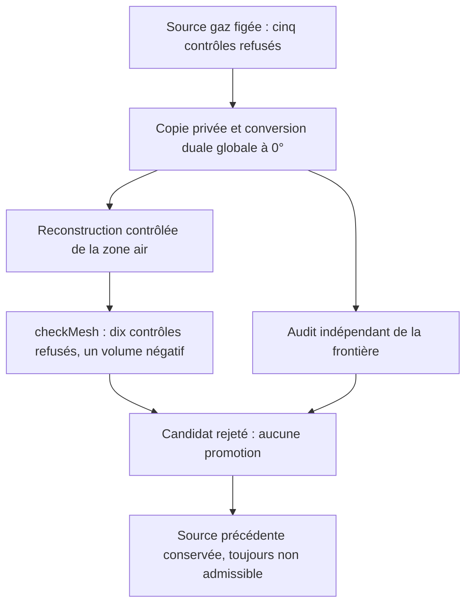

# M64 — conversion duale globale exécutée, puis rejetée

**La conversion duale du dernier maillage gaz aggrave sa qualité : dix
contrôles OpenFOAM échouent contre cinq avant conversion. Une cellule a un
volume négatif. Le candidat est rejeté, sans solveur physique exécuté.**
La [source précédente](M64_SHORT_EDGE_CORRECTION_20260909.md) est conservée
inchangée ; elle reste elle-même non admissible à la CFD. Aucun changement
de forme de culasse, gain thermique, puissance ou aptitude LPBF n'est acquis.

## Essai et environnement réels

Un seul essai global utilise `polyDualMesh` de **Foundation 14,
commit `7b05503f98a85be88af930df48623b4d152bfc35`**, avec angle de détection
des plis de frontière de 0°. Ce n'est pas l'ancien témoin rectangulaire de
1 768 tétraèdres testé à 60°, ni une répétition de la contraction locale.
Toute la discrétisation hybride est transformée, pas seulement ses tétraèdres.

Le [code primaire de polyDualMesh](https://github.com/OpenFOAM/OpenFOAM-14/blob/7b05503f98a85be88af930df48623b4d152bfc35/applications/utilities/mesh/manipulation/polyDualMesh/polyDualMesh.C)
utilise cet angle pour détecter les arêtes de frontière. **0° ne garantit
ni déplacement nul ni préservation exacte du domaine discret.** Les options
`splitAllFaces` et `concaveMultiCells` ne sont pas activées. La première
changerait notamment la multiplicité des faces entre cellules ; elle n'est
pas une correction automatique aux critères de qualité.

Commandes effectivement exécutées, exclusivement sur une copie privée :

```sh
polyDualMesh -case /output/case-01 -noFunctionObjects 0
checkMesh -case /output/case-01 -constant -noFunctionObjects -allTopology -allGeometry -writeSets
```

Le maillage sauvegardé dans `constant/polyMesh` est relu à précision 17.
Les fonctions de post-traitement sont désactivées ; aucun faux champ de
pression ou de température n'est créé pour faire passer le diagnostic.

La zone homogène `air` est vérifiée puis archivée sur la copie avant la
conversion. Après conversion, sa liste complète est reconstruite depuis
`owner` **et** `neighbour` : labels non négatifs, ordre des voisins, couverture
exacte de `0…N−1`, compte de faces cohérent. Aucun identifiant de cellule
primaire n'est réutilisé comme identifiant dual. Cette reconstruction de
métadonnées ne modifie pas les cinq fichiers de géométrie/connectivité.

Kali existante ; image linux/amd64 `a233511b…` ; plafonds **4 CPU, 4 GiB,
270 s actives / 300 s totales**. Réseau désactivé, source et scripts montés
en lecture seule. Exécution et nettoyage : **15,653 s**, sans OOM ni timeout.
Conteneur supprimé, absence contrôlée séparément. Empreintes des neuf fichiers
source et du paquet inchangées. **Aucune nouvelle location ni dépense Vast
pour cet essai** ; ce constat n'est pas un relevé du solde du compte.

## Résultat natif : rejet, même si les processus terminent avec le code 0

| Contrôle | Source conservée | Candidat dual rejeté |
|---|---:|---:|
| Cellules | 785 472 | 223 154 |
| Points | 223 154 | 1 148 120 |
| Faces | 1 688 422 | 1 486 723 |
| Familles de contrôles en échec | 5 | 10 |
| Cellules à volume nul ou négatif | 0 | 1 |
| Cellules concaves | 0 | 120 190 |
| Faces distinctes mal orientées, ensemble natif | 0 | 136 326 |
| Faces à décomposition tétraédrique refusée, ensemble natif | 0 | 171 982 |
| Faible déterminant | 1 961 | 214 |
| Faible poids d'interpolation | 1 229 | 172 |
| Faces trop obliques | 18 | 435 |
| Non-orthogonalité maximale | 89,953° | 131,986° |

Le volume négatif minimal vaut `−2.5433742853495796e−12` unité maillée³.
L'échelle reste non certifiée. Les champs génériques de volume du lecteur
historique restent `unknown` pour cette branche de journal ; ils ne sont
pas remplacés par zéro. La valeur négative est lue explicitement dans le
journal natif épinglé.

Le journal compte 136 329 occurrences d'erreur de pyramide de face, mais
écrit **136 326 faces distinctes** dans l'ensemble. De même, 343 108
occurrences de décomposition refusée donnent **171 982 faces distinctes**.
Les tableaux utilisent les tailles des ensembles, sans confondre occurrences,
faces et tétraèdres. Les 15 entrées `shortEdges` sont des **points**, pas
un nombre d'arêtes.

Les compteurs avant/après ne reposent pas sur une correspondance individuelle
des cellules entre les deux discrétisations. Les gains isolés de déterminant
ou de poids ne compensent pas les volumes négatifs et les défauts nouveaux.
Une région connectée et des noms de patches conservés ne prouvent pas
l'équivalence géométrique du domaine.

## Contre-vérification et décision

L'auditeur indépendant relit effectivement les deux frontières : **143,209 s
murales, 142,067 s CPU, pic mémoire 879,9 Mo**, entrées inchangées. Il retrouve
la fermeture orientée des arêtes et les liens des sommets, ainsi que les
noms, types et métadonnées des trois patches. Cependant, le candidat comporte
**375 polygones non convexes dans la projection contrôlée et 271 éventails
de triangulation invalides**.

La comparaison exacte des coordonnées retrouve 82 400 des 83 526 anciens
points uniques de frontière : 1 126 sont absents et 280 248 sont nouveaux.
Ces nombres décrivent une nouvelle discrétisation ; ils ne constituent pas
à eux seuls une preuve de différence, ni d'identité, du domaine continu.

Le résidu maximal de planéité vaut `0.0024871448012475667` unité maillée sur
le candidat, contre `1.3099984372445823e−13` sur la source. Le test exact
signale aussi 50 239 polygones non strictement plans dans la source : ce
diagnostic des nombres sérialisés n'est **pas un seuil d'acceptation CFD**
ni une raison de modifier la CAO. La projection et l'éventail depuis le
premier sommet sont des conventions déclarées de mesure.

Le delta de volume calculé par cet éventail est très petit
(`−2.168404344971009e−19` unité maillée³), mais ne prouve ni équivalence
géométrique ni positivité des volumes natifs. Aucune distance échantillonnée,
borne Hausdorff ou correspondance volumique des cellules n'est revendiquée.
Les dix échecs natifs restent bloquants indépendamment de cet audit.

Le premier audit s'était arrêté sur une variante ASCII multiligne des grandes
faces produites par OpenFOAM. Ce refus et son reçu sont conservés. Une
correction limitée au lecteur, avec cinq tests de régression supplémentaires,
permet le second audit sans modifier les prédicats géométriques. Les **31
tests purs ciblés** passent : neuf contrôles du worker, cinq de nettoyage
et dix-sept de l'auditeur. Ce sont des vérifications logicielles, pas des
essais physiques. Le reçu natif figé garde son champ « audit en attente »
historique ; le reçu indépendant postérieur est lié séparément.

`make check` complet termine avec le code 0. Les vérifications natives
optionnelles sautées faute de runtime ne sont pas comptées comme réussies.
Ce résultat vérifie le dépôt ; il ne change pas le rejet du maillage réel.



Le [registre des preuves](../twins/m64-cylinder-head/evidence/geometry-checkpoint-20260908.json),
clé `gas_global_dual_rejection`, lie le manifeste, les scripts, les journaux,
les empreintes des deux maillages et le nettoyage. Les géométries et les
ensembles d'identifiants privés ne sont pas publiés.

La prochaine piste retenue est une **agglomération conservatrice du maillage
primal, pilotée par la qualité**, sans nouveau dual ni abaissement des seuils.
Elle doit examiner des groupes voisins disjoints, y compris les transitions
pyramides/tétraèdres que l'utilitaire tétraédrique actuel ne traite pas.
Préconditions avant un nouveau lot natif : unions admissibles, coordonnées
et facettes externes conservées, bilan de volumes contrôlé, puis qualité de
toutes les faces voisines et correspondance des ensembles de défauts.
**Cette extension n'est pas encore exécutée** ; les précédentes fusions
tétra/tétra ne prouvent pas qu'elle résoudra tous les défauts.

La stack de la photo conserve les rôles du
[plan multiphysique](M64_MULTIPHYSICS_EXECUTION.md#précision-du-9-septembre--calcul-ia-et-banc-séparés) :
OpenFOAM pour les fluides/CHT selon modèle, Elmer comme candidat thermique et
mécanique indépendant, PhysicsNeMo après calculs admissibles et évaluation,
Ditto/Mosquitto pour l'état et la télémétrie d'un futur banc. Ce pilote
n'exécute aucun couplage nouveau entre ces logiciels.
