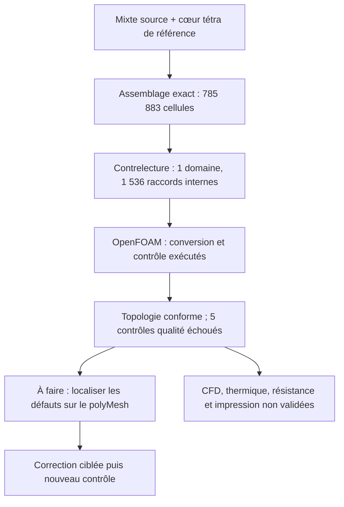

# M64 — domaine hybride assemblé ; contrôle OpenFOAM exécuté et refusé

**L'assemblage du domaine gaz est terminé et contre-vérifié. OpenFOAM retrouve
les 785 883 cellules, un domaine connecté et trois frontières, mais refuse
la qualité du maillage sur cinq contrôles. Aucun solveur physique n'est lancé.**

Ce lot exécute les trois étapes annoncées dans l'[essai précédent](M64_NATIVE_SIZE_TRIAL_20260909.md).
Il ne modifie ni le contour Porsche, ni le maître CAO, ni les cotes. Il utilise
Kali existant, sans nouvelle location ni dépense Vast. Ce n'est pas une preuve
de performance à 700 ch, de résistance, de dissipation ou d'imprimabilité.

## Assemblage effectivement réalisé

Le cœur `e873b8ae…` remplace les 175 753 anciens tétraèdres du domaine mixte
`4f41153f…`, avec conservation des 67 200 hexaèdres et 384 pyramides.
Les 718 299 nouveaux tétraèdres donnent **785 883 cellules et 223 155 points**.
Les pilotes de surface `7af7f207…` et `2de5fd52…`, dont la frontière diffère,
ne sont pas incorporés.

Les coordonnées sauvegardées, l'ordre des sommets, les identifiants et les
groupes des cellules conservées et des 99 470 faces externes restent exacts.
Les nœuds du cœur sont raccordés par une bijection de coordonnées binary64 ;
ses nœuds intérieurs et éléments reçoivent des identifiants sans collision.
Les **1 536 triangles de raccord tétraèdre/pyramide deviennent internes**,
jamais des parois. Les 384 raccords quadrangulaires pyramide/hexaèdre sont
également retrouvés.

Les 3 568 faces source internes sont omises de la liste des frontières après
contrôle de leurs deux propriétaires. Les 6 599 éléments auxiliaires 0D/1D,
sans groupe physique, sont explicitement omis de cet export volumes finis.
Tous les points exportés sont utilisés par des cellules. Les sources restent
intactes ; aucune omission ne constitue une suppression de détail CAO.

L'export MSH 2.2 ASCII passe deux relectures exactes, y compris les binary64.
Il conserve les labels d'entités et groupes d'éléments, **pas les classes de
nœuds ni les paramètres UV du format 4.1**. L'entité 3D 1 / groupe `air` 100
est réutilisée pour le cœur suivant la convention observée dans la source ;
ce n'est pas la création ni la certification d'une entité CAO.

Une contrelecture séparée reconstruit les correspondances et toutes les
incidences : aucune cellule dupliquée, aucune face non-manifold, aucune
opposition d'orientation manquante aux raccords, une composante connectée.
Ces contrôles de connectivité ne prouvent pas l'absence globale de recouvrements
géométriques. L'assemblage prend 40,879 s et la contrelecture 17,556 s.

## Résultat OpenFOAM Foundation 14

Une copie du cas est exécutée sous l'image x86 locale épinglée. Quatre utilitaires
seulement : `gmshToFoam`, `transformPoints`, `createPatch`, puis
`checkMesh -allTopology -allGeometry`. L'échelle 0,001 m/unité est appliquée
une seule fois et reste une hypothèse, pas un étalonnage du scan.

Le journal identifie **OpenFOAM 14-7b05503f98a8**. Les trois patches sont
`walls` (98 021 faces), `receiver_outlet` (1 191) et `inlet` (258).
Le contrôle topologique, l'utilisation des points, les volumes de cellules et
les raccordements passent. Le journal termine cependant par **Failed 5 mesh checks** :

| Contrôle en échec | Nombre signalé | Extrême mesuré |
|---|---:|---:|
| Cellules à grand allongement | 10 | Rapport maximal 54 610,283 |
| Faces fortement décentrées, skewness | 18 | Maximum 36,679 |
| Faible déterminant, seuil 0,001 | 2 305 | Minimum 0 |
| Faible poids d'interpolation, seuil 0,05 | 1 491 faces | Minimum 9,5681 × 10⁻⁶ |
| Faible rapport de volumes, seuil 0,01 | 137 faces | Minimum 9,5682 × 10⁻⁶ |

En outre, 3 545 faces dépassent 70° de non-orthogonalité (maximum 89,953°)
et cinq arêtes sont signalées trop courtes. Ce sont des avertissements distincts
des cinq contrôles en échec. Les familles peuvent se recouvrir : leurs nombres
ne s'additionnent pas en un total de cellules défectueuses. Le déterminant nul
est l'indicateur de conditionnement OpenFOAM, pas la preuve d'un volume nul ;
le contrôle des volumes passe dans ce même journal.

Les quatre utilitaires sortent avec le code 0. Le worker sort volontairement
avec le **code 2** parce que le journal refuse le maillage. Ce comportement
est nécessaire : le [code officiel de checkMesh](https://github.com/OpenFOAM/OpenFOAM-14/blob/master/applications/utilities/mesh/manipulation/checkMesh/checkMesh.C)
peut retourner 0 malgré des contrôles échoués. Aucun seuil n'est assoupli.

Le conteneur dispose de quatre CPU et 4 Gio, sans réseau, avec les entrées en
lecture seule. Le journal OpenFOAM indique `nProcs: 1` : quatre CPU autorisés
ne signifient pas une exécution MPI à quatre processus. Le temps total,
nettoyage compris, est **17,719 s** ; aucun timeout ni OOM. Le conteneur exact
est supprimé, son absence revérifiée, et les entrées restent inchangées.
Les indicateurs `diagnostic_completed` et `process_completed_and_cleaned` du
superviseur restent faux car ils exigent un maillage accepté : ici les quatre
étapes ont bien terminé, mais avec un refus de qualité.

## Suite ciblée, sans modifier la silhouette

1. Sur une copie du **polyMesh sauvegardé et épinglé**, exporter les ensembles
   de cellules/faces défectueuses par les options supportées de cette version.
   Ne pas reconvertir le domaine pour cette localisation.
2. Croiser leurs identifiants avec `owner/neighbour`, les types de cellules,
   les frontières et les 1 536 interfaces. Déterminer si les défauts proviennent
   des tétras, des couches ou de leurs transitions avant de choisir une correction.
   Les seuls journaux ne permettent pas d'accuser une face CAO particulière.
3. Vérifier aussi la conservation MSH → polyMesh sous renumérotation et échelle,
   avec une erreur de sérialisation explicitée. Le garde existant sur `walls`
   couvre uniquement le changement de type du patch, pas toute la conversion.
4. Corriger les défauts localisés, puis refaire le contrôle complet sans
   réduire les exigences. La CFD exige ensuite une revue du cas exact et
   l'application des critères de bilans/convergence déjà définis.

Les refus historiques sur le domaine natif restent présents. Même un futur
`Mesh OK.` ne certifierait ni l'échelle, ni les interfaces M64, ni les charges
biturbo. Le cas de banc froid préparé n'est pas un calcul de refroidissement
de la culasse et ses champs physiques ne sont pas résolus dans ce lot.

## Rôle des logiciels de la photo

La [pile complète](M64_MULTIPHYSICS_EXECUTION.md) reste le cadre d'intégration.
[OpenFOAM](https://openfoam.org/) sert aux écoulements et transferts ;
[Elmer](https://github.com/ElmerCSC/elmerfem) peut traiter thermique du solide
et structure. Leur présence ne valide pas le modèle de cette culasse.
[Ditto](https://eclipse.dev/ditto/) gère l'état du jumeau et
[Mosquitto](https://mosquitto.org/) transporte les messages MQTT : ce ne sont
pas des solveurs physiques. [PhysicsNeMo](https://docs.nvidia.com/physicsnemo/latest/user-guide/model_evaluation.html)
intervient comme modèle de substitution évalué sur des références adaptées,
pas comme remplacement de calculs encore refusés. Aucun de ces ajouts n'a
été installé ou exécuté par ce lot en dehors du parcours OpenFOAM décrit.

Les **41 tests ciblés** passent : 14 assembleur, 10 contrelecteur, 17 superviseur.
`make check` termine avec le code 0 ; des tests natifs optionnels sont ignorés
selon les dépendances disponibles. Ce contrôle du dépôt n'est pas un essai moteur.
Les empreintes et résultats sont dans le
[registre de preuves](../twins/m64-cylinder-head/evidence/geometry-checkpoint-20260908.json),
entrée `gas_hybrid_openfoam_diagnostic`. Les maillages privés et leurs coordonnées
ne sont pas publiés. Aucun gain thermique, mécanique ou moteur n'est crédité.

