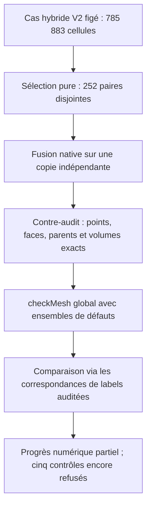
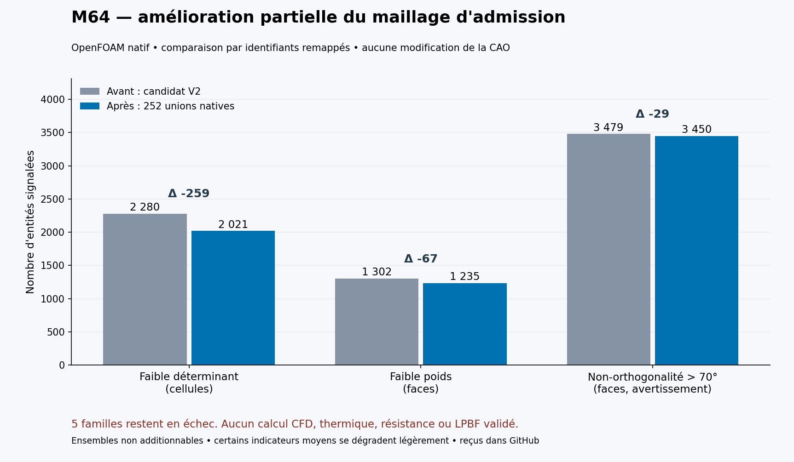

# M64 — correction par paires du maillage hybride

**252 unions de tétraèdres ont été réellement exécutées dans OpenFOAM :
259 cellules à faible déterminant, 67 faces à faible poids et 29 faces trop
non orthogonales en moins. Aucun nouveau défaut dans les neuf ensembles
comparés après correspondance des labels. Les cinq familles de qualité
restent néanmoins refusées : aucune admission CFD, physique ou LPBF.**
Le point de départ est la [correction conservatrice de 189 sommets](M64_APEX_TRANSITIONS_20260909.md).

## Procédure effectivement exécutée



La sélection examine 9 143 faces internes ; 316 paires sont individuellement
éligibles, puis 252 restent après exclusion des cellules déjà utilisées.
Elle réutilise les prédicats de convexité rationnelle, de déterminant,
d'allongement et de qualité des faces. La [marge native de concavité/planéité](https://github.com/OpenFOAM/OpenFOAM-14/blob/7b05503f98a85be88af930df48623b4d152bfc35/src/meshCheck/primitiveMeshCheck/primitiveMeshCheck.C#L1069-L1174)
est conservée : une convexité faible ne suffirait pas à éviter le refus historique.
Les 1 502 faces voisines affectées sont revérifiées conjointement, sans
abaisser les seuils. Ces prévisions ne remplacent pas les résultats natifs.

## Conservation vérifiée sur la copie réellement écrite

Le [producteur natif](../twins/m64-cylinder-head/source/flowbench-intake/agglomerate_tet_pairs/agglomerateTetPairs.C)
retire seulement les 252 faces internes communes. Il produit **785 631 cellules** :
717 795 tétras, 67 200 hexas, 384 pyramides et 252 polyèdres à six faces.
Le domaine reste une seule composante ; aucune CAO ni interface moteur n'est modifiée.

Les **223 155 points** restent exactement identiques en binary64, après
écriture à 17 chiffres et relecture. Les faces retenues, leurs orientations
avec changement cohérent owner/neighbour, les **99 470 faces externes**, leurs
patchs et la zone `air` sont conservés via des correspondances contre-vérifiées.
Chaque polyèdre possède exactement la frontière de ses deux parents ; son
volume rationnel est leur somme exacte sur les coordonnées représentées.
Les hexas, pyramides et leurs interfaces ne participent pas aux fusions.
Cette preuve de transformation n'est pas une preuve de conformité continue à la CAO.

## Résultats natifs et attribution des gains



| Ensemble natif | V2 avant | Après unions | Attribution contrôlée |
|---|---:|---:|---|
| Faible déterminant cellulaire | 2 280 | **2 021** | 259 parents remplacés par des unions non signalées |
| Faible poids d'interpolation | 1 302 | **1 235** | 34 faces supprimées + 33 conservées désormais non signalées |
| Non-orthogonalité > 70° | 3 479 | **3 450** | 16 faces supprimées + 13 conservées désormais non signalées |
| Cellules à deux faces internes | 465 | **262** | 203 parents remplacés par des unions non signalées |
| Cellules à zéro/une face interne | 2 | 2 | Mêmes cellules source |
| Allongement excessif / skewness excessive | 10 / 18 | 10 / 18 | Mêmes entités source |
| Faible rapport de volumes / points sur arêtes courtes | 137 / 5 | 137 / 5 | Mêmes entités source |

La comparaison ne soustrait pas naïvement des labels renumérotés : elle
utilise les maps de faces/points et les groupes de parents des cellules.
**Aucune union n'est signalée dans les ensembles cellulaires comparés ; aucun
singleton, point ou face conservé n'y introduit de nouveau défaut.** Une face
supprimée n'est pas présentée comme une face conservée dont la qualité serait réparée.
Les groupes se chevauchent et ne s'additionnent pas en un total de défauts uniques.

Les moyennes ne progressent pas toutes : non-orthogonalité **21,555015° →
21,556013°**, poids **0,434744385 → 0,434743558**, rapport de volumes
**0,787637439 → 0,787518094**. Elles se dégradent légèrement ; le nombre de
cellules/faces a également changé. Le minimum de déterminant reste nul.
`checkMesh` termine normalement avec le code processus 0, mais écrit
**« Failed 5 mesh checks. »** : ce code n'est pas une acceptation du maillage.

## Durée, preuves et limites

OpenFOAM Foundation **14-7b05503f98a8**, image Linux/amd64 épinglée, a tourné
sur Kali sous plafonds **4 CPU / 4 Gio**, sans réseau ni nouvelle dépense Vast.
Compilation : 1,418 s ; fusion : 2,319 s ; contre-audit : 15,552 s ;
`checkMesh` : 11,095 s. Le processus complet et son nettoyage prennent
**31,482 s**, sans timeout ni OOM ; le conteneur exact est supprimé et absent.
La comparaison indépendante des ensembles prend 1,361 s ; ses dix tests passent.
La sélection pure prend 10,024 s et ses neuf tests passent.

La dernière étoile de pyramide non corrigée fait l'objet de deux études pures
distinctes : déplacement suivant la normale, puis recherche 3D bornée.
Elles ne fournissent **aucun candidat admissible ni nouveau maillage** ;
la recherche 3D ne prouve pas une impossibilité générale. Leurs refus sont conservés.
Aucune absence globale d'intersections ni corrélation moteur n'est déduite
de la seule conservation de ce lot.

## Couverture géométrique composée : portée distincte

Une revue indépendante accepte la formulation étroite : **couverture numérique
composée vérifiée sous critère natif déclaré**, pour le domaine gaz source
et sa partition BRep en 17 solides, pas pour leur équivalence au maillage.
Le nouveau calcul relit les reçus épinglés : 188 occurrences orientées,
32 interfaces internes annulées exactement, couverture exhaustive de
86 faces source par 124 faces externes dans 52 groupes, 102 soustractions
natives valides sans résidu face/arête et 136 intersections sans solide
d'intersection. Il recontrôle également les 312 fichiers d'alertes.

Les deux soustractions averties restent averties. Pour leur groupe,
la capture native complète établit séparément l'identité des éléments qui
définissent les trois faces ; les différences de sérialisation attribuées
aux régularités d'arête ne modifient pas les surfaces ni les contours définissants.
Les anciens flux binaires bruts n'étant pas conservés, cette conclusion
repose explicitement sur la capture épinglée et ses décodeurs, pas sur une
nouvelle relecture des flux natifs.

Pour un domaine orienté régulier, `V = (1/3) ∫frontière x·n dA` :
les contributions des interfaces partagées s'annulent avant intégration.
L'égalité extérieure reste sous le critère booléen natif, avec fuzzy effectif
`1e−7` unités scan : **ni borne Hausdorff ni borne d'erreur volumique garantie**.
Les écarts relatifs recalculés des quadratures adaptatives vont de
`1,288e−10` à `1,834e−12` ; le contre-calcul GK donne `9,162e−12`.
L'écart non adaptatif historique `1,597e−8` et son refus restent conservés.

Cette composition prend 0,034 s, avec 12 tests ciblés passant également en
revue indépendante. Elle ne constitue aucune admission CFD/CHT,
certification d'échelle ou d'interfaces M64, ni qualification d'impression.
Le reçu `5cb8a63ce7ba…` est référencé séparément des fusions.

## Reproduire la figure publique

Le script lit les comptes du registre, sans importer de géométrie :

```sh
python3 twins/m64-cylinder-head/source/render_hybrid_pair_quality.py
```

Il requiert Matplotlib ; le rendu publié a utilisé la version 3.10.7.
Les producteurs natifs, entrées privées et journaux restent liés par SHA-256.
Les tests de sélection, transformation, supervision, recherches locales et
comparaison mappée passent : 78 tests ciblés, plus les 12 de composition.
`make check` termine également avec le code 0 ; les tests natifs optionnels
sans leur environnement sont explicitement ignorés. Ce succès logiciel
ne contredit pas les cinq contrôles de qualité de maillage en échec.

Empreintes recontrôlées des reçus privés : natif `feaf402cf025…`, transformation
`c9ce6b2f6220…`, comparaison mappée `db85a5861bfd…`, processus `74a097f1411e…` ;
études de la dernière étoile `50215fc2bee4…` et `14c915c27166…`.
Les preuves complètes sont référencées dans le [registre géométrique](../twins/m64-cylinder-head/evidence/geometry-checkpoint-20260908.json)
et le [checkpoint](M64_GEOMETRY_CHECKPOINT_20260908.md). Aucun maillage brut,
coordonnée, identifiant d'entité privé ou donnée de compte n'est publié ici.
