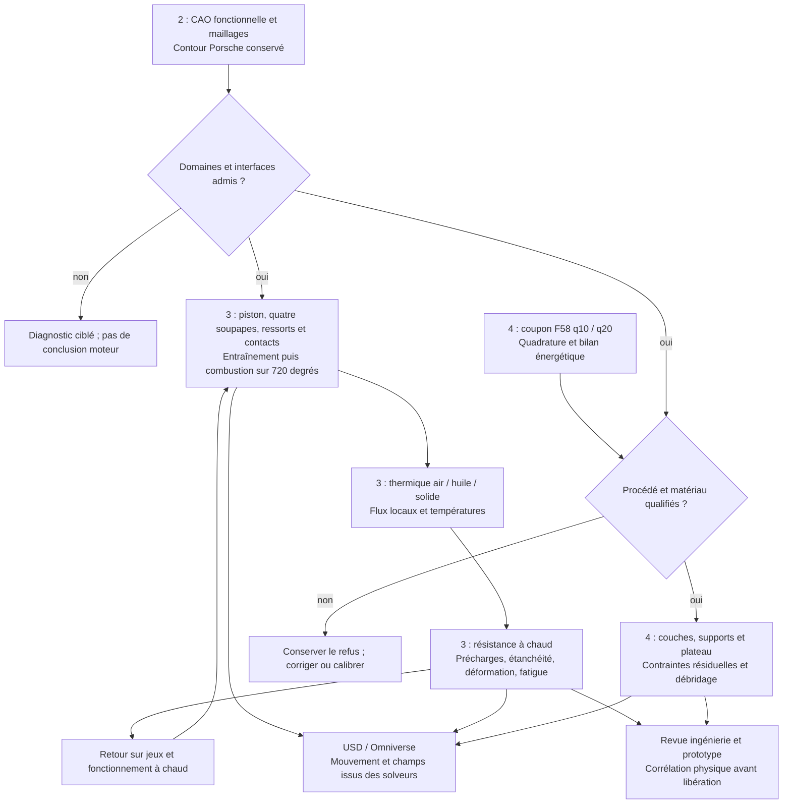

# M64 — jobs 2, 3 et 4 préparés, sans nouveau calcul natif

**Livré :** manifeste des sous-jobs, préparateur à empreintes, deux decks LPBF
privés, contre-calcul énergétique 40 µs et tests logiciels. La
[recherche GPU et publications](M64_GPU_RESEARCH_20260912.md) motive les choix.
Le fonctionnement piston/soupapes est inclus explicitement. Aucune location,
aucun solveur industriel ni modification de contour dans cette préparation.
Les jobs complets ne sont **pas encore admis à l'exécution**.

## Ordre des travaux



Le retour thermique→jeux→cycle nécessitera des critères de convergence, pas
une boucle infinie. Le manifeste décrit le premier passage et les prérequis ;
il n'exécute pas ce graphe et n'autorise pas la fabrication.

## 2 — CAO et maillage sans changement de silhouette

Conserver le maître ; terminer la définition des sièges/guides, conduits,
porte-arbres/culbuteurs, huile, filetages, interfaces et surépaisseurs d'usinage.
Photos et dimensions d'enveloppe ne deviennent pas des tolérances de montage.
Toute modification fonctionnelle nécessite justification et contrôle d'écart.

Le primal gaz courant contient **784 675 cellules** ; cinq familles restent
refusées : 1 886 lowD, 9 allongements, 1 223 faibles poids, 134 rapports de
volumes, 18 skewFaces. Ce gaz d'admission froide n'est ni le solide ni l'air
de refroidissement autour des ailettes. Le maître du pilote PhysicsNeMo quatre
sièges n'est pas la dernière culasse complète à conduits.

Prochain essai différent : TMOP/MFEM sur 1 000–5 000 tétras avec nœuds
intérieurs libres. Fixer frontière physique, limite de région et nœuds
incidents aux cellules non tétra. **Avant location** : pont polyMesh↔MFEM
bijectif, aller-retour contrôlé à 17 chiffres, image CUDA et témoin tétra
CPU/GPU. Le writer amont à 14 chiffres ne convient pas tel quel. Ces éléments
ne sont pas encore livrés : aucun argv de réparation réelle n'est inventé.

Réinjecter seulement sur copie, contrôler volumes/intersections, contour,
patches/zones, neuf ensembles et extrema natifs. La commande de contrôle reste
`checkMesh -case /output/case-01 -allTopology -allGeometry -writeSets`, dans
l'image Foundation14 épinglée et sous superviseur borné. Ne pas confondre son
code de sortie avec `Mesh OK`. Un gain partiel reste diagnostique ; même un
maillage accepté ne certifie ni interfaces ni indépendance au maillage.

## 3 — Fonctionnement réel, puis thermique et résistance

Premier cas : **monocylindre entraîné sans combustion**. Définir piston,
chambre, quatre axes et levées/phases sur 720°, puis vérifier mouvement,
fermetures et conservation au remapping. Ajouter ensuite allumage, combustion,
turbo et contre-pression. Trois preuves distinctes sont nécessaires :

1. **Cinématique/jeux** : positions, vitesses, accélérations ; distances
   piston-soupape, soupape-soupape, tige-guide et ressort comprimé, avec
   tolérances, dilatation et flexion. Les enveloppes froides ne suffisent pas.
2. **Distribution dynamique** : masses/inerties, came/poussoir/culbuteur,
   raideur/précharge/amortissement, frottement et contacts ; affolement,
   rebond au siège, spires jointives, efforts sur sièges/guides. Une levée
   imposée ne calcule pas ces phénomènes.
3. **Cycle ouvert** : admission, résiduels, compression, combustion, détente,
   échappement. Cantera/Wiebe pour le modèle réduit ; OpenFOAM mobile pour
   les champs locaux. Plusieurs cycles jusqu'à périodicité et raffinement
   angle/temps/maillage. Un seul 720° terminé ne prouve pas la périodicité.
   Comparaison 2V/4V aux mêmes conditions de fonctionnement.

Réemploi à borner : le [modèle M64 IVC→EVO](M64_700PS_VARIABLE_THERMO_20260908.md)
est un cycle fermé ; F46 lance 36 cas avec hypothèses historiques ; F45 est
un criblage de ressort à un degré de liberté. Le helper F2 de la 917 code un
phasage de 60° entre cylindres : **pas réutilisable tel quel sur le M64 six-cylindres**.
Le tutoriel OpenFOAM mobile déjà essayé n'avait atteint que 110°, pas un moteur
M64 complet. Les commandes natives d'un tutoriel ne remplacent pas ce travail.

Les sorties `p(angle)` et flux locaux alimentent la **CHT** gaz/solide/air.
L'huile exige conductance de contacts, alimentation/retour, viscosité, débit
disponible et pertes de charge. Une puissance cible au vilebrequin ne fixe
ni pression crête ni flux locaux. Une face non affectée n'est pas adiabatique
par défaut. Les huit familles d'interfaces restent incomplètes au
[contrat M64](../twins/m64-cylinder-head/interface-contract.json).

Transférer températures du solide et efforts vers la **résistance** : goujons,
inserts, étanchéité, déformation à chaud, plasticité/fluage/fatigue selon données.
Contrôler repères, couverture et champ constant du mapping, résultantes/moments,
réactions et conservation d'énergie. Conserver trois niveaux de maillage et
une étude temporelle. Le p95 seul peut masquer un point critique ; sans loi
de fatigue à chaud, la durée de vie reste non établie.

Les seuils du témoin F50 (énergie 2 %, Tmax 2 %, p95 10 %, déplacement 5 %)
restent attachés à **ce témoin**, pas au M64 par défaut. Pré-déclarer les
budgets numériques et limites matériau sourcées avant chaque comparaison.
Un cas hypothétique peut avancer la recherche, pas certifier le montage.

## 4 — Du coupon à la fabrication virtuelle

**Deux decks réellement préparés**, sans lancement : 29 fichiers chacun,
57 600 cellules, 25 ns, 0–40 µs, soit 1 600 pas par cas. Modification commune
unique : `endTime` 120→40 µs. Différence intercas unique : `nPoints` passe de
`(10 10 10)` à `(20 20 20)`. Garder 380 W, AlSi10Mg témoin, absorption,
conditions thermiques et plafond 3 300 K. Ces paramètres de quadrature ne
garantissent pas huit fois plus de points dans chaque cellule.

Le [code ORNL](https://github.com/ORNL/AdditiveFOAM/blob/9c05c5eb54db03faa342b14b0806efe740de8c44/applications/solvers/additiveFoam/movingHeatSource/movingHeatSources/movingHeatSource.C)
normalise sous une condition à 5 % : cela justifie le test, sans présumer que
la quadrature explique le plafond. Le puits du limiteur reste un terme
numérique séparé, pas une chaleur physique ou de la vaporisation.

`controlDict` et `fvSolution` historiques ont été récupérés en lecture seule
sur Kali, avec SHA concordants. Les 27 autres fichiers concordent aussi ; le
cas couplé existant reste intact. Reçu source épinglé :
`7448656ae19242c05e47761117df488e9b4594c12f73b62c020912d68aea75da`.
Reçu de paire préparée privée :
`491887d1aa2c84057b54c7982621e9f34b1116d36ad5c6e506a2a72b77760aad`.
Relecture indépendante : 29 sources et 58 fichiers de sortie vérifiés, seuls
les changements prévus sont présents.

L'adaptateur énergétique est fourni et testé sur témoins synthétiques :
1 600 pas réguliers et appariés, six termes relus avec Decimal à 80 chiffres,
conservation du critère historique 120 µs, températures censurées signalées.
Il ne prouve pas le code de sortie/OOM/nettoyage du solveur : ces preuves
doivent venir du superviseur natif. Aucun résultat 40 µs nouveau n'est inventé.

Restent avant natif : runtime, binaire, trois bibliothèques et matériau
revérifiés sur l'hôte ; superviseur de la paire à **600 s total**, réseau coupé,
entrées en lecture seule, sortie ≤1 Gio, 2 CPU/4 Gio, collecte et destruction
vérifiées. Aucun GPU justifié pour ce petit coupon AdditiveFOAM inchangé.

Après qualification procédé, Adamantine est le candidat prioritaire pour
couches/supports/plateau et distorsion globale. Définir matériau à chaud,
machine/recette, orientation, trajectoires, activation, traitement thermique,
débridage et usinage. GO-MELT/HERMES ne donnent pas seuls les contraintes.
Contrôler épaisseurs après usinage, accès poudre et supports retirables.
**1,5 mm est un filtre de projet, pas une règle universelle de fabricabilité.**
Le coupon AlSi10Mg ne sélectionne pas l'alliage de la culasse.

## Utilisation du paquet

- [Manifeste des six sous-jobs](../twins/m64-cylinder-head/jobs/steps-234-20260912.json) :
  dépendances, prérequis manquants, enveloppes de ressources et plafonds.
- [Préparateur](../twins/m64-cylinder-head/source/prepare_jobs_234.py) : quatre
  reçus publics épinglés copiés avec le plan et `preparation.json`. Il ne
  lance aucune commande/API. **Code zéro = dossier préparé, pas job admis.**
- [Générateur LPBF](../twins/m64-cylinder-head/source/prepare_f58_quadrature.py) :
  liste blanche/SHA, sortie neuve, contrôles avant/après ; géométrie privée non publiée.
- [Contre-calcul 40 µs](../twins/m64-cylinder-head/source/compare_f58_quadrature_40us.py) :
  deux journaux épinglés, parseur F58 inchangé, aucune promotion en validation physique.

```sh
# Depuis la racine réelle du worktree, préparation sans location.
job_prep_dir="$(mktemp -d /private/tmp/m64-job-prep.XXXXXX)"
python3 twins/m64-cylinder-head/source/prepare_jobs_234.py \
  --root "$PWD" \
  --plan "$PWD/twins/m64-cylinder-head/jobs/steps-234-20260912.json" \
  --output "$job_prep_dir/packet"
```

Le générateur accepte `--reference --source-case --historical-system --output`
avec chemins privés vérifiés. Le lecteur prend
`--q10-log --q10-sha256 --q20-log --q20-sha256 --parser --output`.
Ni l'un ni l'autre ne lance le solveur. Les commandes futures sont préparées
pour les superviseurs natifs existants, pas pour un shell libre ou un LLM
chargé de chaque pas. Le batch local n'est pas un contrôleur de calcul distant.

## Machines et budget : instantané, pas réservation

Vérification effectuée : **37 tests ciblés passent** (13 préparation, 10 decks,
14 énergie), puis `make check` complet termine avec code zéro. Les tests
natifs optionnels sans runtime OCP/Trimesh restent explicitement ignorés.
Le [reçu public](../twins/m64-cylinder-head/evidence/jobs-234-preparation-20260912.json)
conserve les empreintes et refus ; ces tests vérifient le logiciel de
préparation, pas la résistance ou le fonctionnement de la pièce.

Offres relues via le **wrapper OpenBao**, le 12 septembre, avec 100 Go de disque
alloué dans la requête. `dph_total` inclut cette estimation de stockage,
transferts séparés ; disponibilité et performances réelles à revérifier :

| Usage candidat | Offre observée | USD/h |
|---|---|---:|
| Références CPU ; GPU secondaire | 32 CPU effectifs, 128 609 Mo RAM, RTX 3080 Ti 12 Go | 0,1626 |
| Géométrie GPU compatible | 32 CPU effectifs, 64 205 Mo RAM, RTX 3090 24 Go | 0,1744 |
| CPU/RAM lourds si nécessaires | 128 CPU effectifs, 257 524 Mo RAM, RTX 4060 Ti 16 Go | 0,5344 |

Les CPU effectifs ne sont pas des cœurs physiques dédiés garantis. Pas d'A100
dans cette sélection momentanée sous 0,80 USD/h ; relire avant essai FP64
lourd. Les TFLOPS Tensor FP16 d'une RTX ne prédisent pas ce besoin. Les limites
RAM/VRAM du manifeste sont des enveloppes initiales, pas des mesures du M64.

À 0,5344 USD/h, 3 h font environ **1,60 USD** hors transferts, sans garantie
de convergence. Première vague proposée : **cinq pilotes payants à 4 USD
maximum chacun = 20 USD**, plus le coupon Kali sans nouvelle location.
Chaque lot ≤3 h, setup/collecte/nettoyage inclus ; une seule instance payante
à la fois. Ce n'est ni une réservation ni un déblocage automatique des jobs.

Plafond utilisateur : **38 USD total**, allocation travail 32 USD et réserve
6 USD. Déduire dépenses antérieures et autres tâches au prévol ; le manifeste
n'est pas un portefeuille ni un garde de facturation. Ne pas relouer au
timeout. Image amd64/digest, paire et association SSH, watchdog externe et
nettoyage doivent être vérifiés avant chaque lancement par le wrapper approuvé.
L'inventaire des instances était vide ; aucune recharge/location demandée.

Prochaine action : finaliser la supervision de la paire coupon et le pont de
maillage local, puis **un diagnostic qualifié**. Les futurs visuels distingueront
mouvement prescrit, résultat solveur et modèle réduit. Les coupons à chaud,
la revue ingénierie et la corrélation au banc restent séparés de la préparation.
