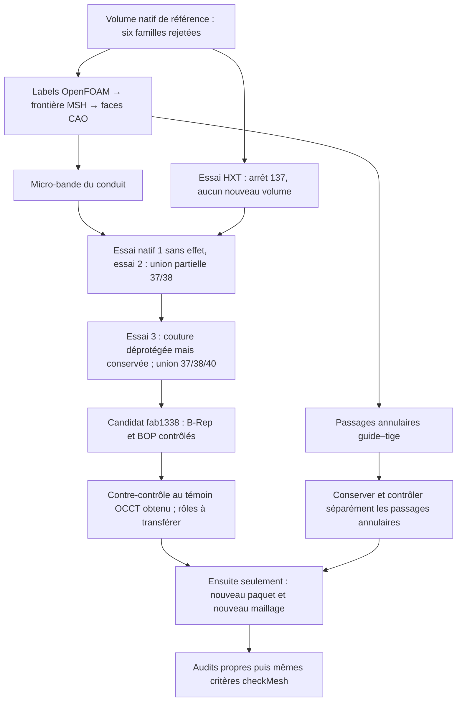

# M64 — défauts localisés, essai HXT et correction native

## Résultat

Les défauts du [remaillage natif précédent](M64_REMAILLAGE_NATIF_20260908.md)
sont maintenant reliés aux faces CAO : la micro-bande de conduit (face 38)
et les passages annulaires guide–tige constituent deux zones distinctes
à traiter. **L'essai HXT n'a pas produit de volume exploitable.** Une
correction native a ensuite créé un candidat, encore sans revue indépendante
achevée ni maillage. Le volume de référence conserve ses six familles rejetées.
Aucun calcul CFD, thermique, mécanique ou LPBF n'est validé par cette étape ;
elle n'autorise ni impression ni fonctionnement moteur.

Le [reçu de diagnostic](../twins/m64-cylinder-head/evidence/hxt-native-diagnostic-20260908.json)
regroupe les empreintes et les limites. Les géométries, coordonnées,
ensembles d'entités et rapports détaillés restent privés.

## Localisation sur le volume de référence

Le contrôle concerne exclusivement le domaine natif `7fc114c1…` et le MSH
`7774e94e…` de **469 985 tétraèdres**. Les 125 027 points OpenFOAM sont
appariés de façon unique aux nœuds MSH, puis la topologie retrouve les
191 956 triangles de frontière, leurs 88 faces natives et leurs rôles,
sans désaccord d'orientation. Aucun VTK n'est utilisé comme géométrie.

Les coordonnées OpenFOAM sont écrites avec **12 chiffres significatifs** :
l'appariement tient compte de l'arrondi de sérialisation, pas d'une identité
binaire ni d'un simple plus proche voisin. L'écart maximal observé vaut
4,996×10⁻¹³ m dans le cas mis à l'échelle. Le facteur 0,001 reste lié à
l'hypothèse non certifiée « une unité de scan = un millimètre ».

| Famille rejetée | Entités sélectionnées | Cellules touchant la face 38 | Cellules touchant les anneaux guide–tige | Cellules sans face de frontière |
| --- | ---: | ---: | ---: | ---: |
| Rapport d'aspect | 130 cellules | 70 | 0 | 56 |
| Skewness | 73 faces | 55 | 0 | 0 |
| Déterminant faible | 4 579 cellules | 492 | 2 589 | 399 |
| Concavité | 23 cellules | 19 | 0 | 4 |
| Poids d'interpolation faible | 1 146 faces | 253 | 48 | 748 |
| Rapport de volumes faible | 540 faces | 146 | 0 | 331 |

Pour les ensembles de faces, les cellules affectées sont l'union de leurs
propriétaires et voisines : leur nombre n'est pas celui des faces.
Les colonnes ne constituent pas une partition exhaustive. Les histogrammes
par face peuvent se recouvrir ; aucune distance aux cellules intérieures
n'est calculée. **Une adjacence observée n'établit pas une causalité.**

L'audit intrinsèque de la face 38 sonde une bande dont la largeur locale
minimale échantillonnée est d'environ 1,52×10⁻⁶ unité de scan. Ce n'est
ni une cote physique certifiée ni le minimum global démontré. La formule
approchée de flèche `δ ≈ κ h² / 8` fournit une hypothèse de raffinement,
pas une garantie de conformité ou de qualité volumique. La CAO est inchangée.

## Essai comparatif réellement exécuté

Le mailleur accepte désormais `--volume-algorithm 10` : seule l'option
`Mesh.Algorithm3D` bascule après sauvegarde de la surface et avant la 3D.
Les tailles de surface, la géométrie, les passages annulaires et les seuils
de contrôle ne sont pas assouplis. HXT est une réimplémentation parallèle
de Delaunay, identifiée par la valeur 10 dans le
[manuel officiel Gmsh 4.15.2](https://gmsh.info/doc/texinfo/gmsh.html).
Ce n'est donc pas un second modèle physique indépendant.

L'exécution native x86 sur Kali était bornée à quatre CPU, 4 Gio et 180 s,
sans réseau. Elle s'est arrêtée avec **le code 137 après 93 s** ; Docker
indique `OOMKilled: false`. Ces traces ne suffisent pas à attribuer
l'arrêt à un manque de mémoire ou à une cause certaine.

Le dernier point de reprise date de **25,076 s**, au début de la 3D :
191 958 triangles de surface sauvegardés, zéro tétraèdre dans ce fichier,
statut `incomplete`. Cette surface `9825add5…` diffère de celle du volume
de référence : ses anciens reçus de conformité ne lui sont pas transférés.
Le conteneur de l'essai est retiré. Aucun solveur CFD n'a été lancé.

## Correction native réellement tentée

Trois essais `ShapeUpgrade_UnifySameDomain` ont été exécutés avec OCP
7.9.3.1, chacun à partir du même domaine natif `7fc114c1…` :

| Essai | Résultat effectivement observé | Faces / arêtes / sommets |
| --- | --- | ---: |
| 1 — `cf81801a…` | Sans effet sur les partitions ; faces et arêtes conservées par identité en mémoire | 88 / 195 / 120 |
| 2 — `e08029b6…` | Anciennes faces 37 et 38 → nouvelle face 37 ; ancienne face 40 distincte | 87 / 194 / 120 |
| 3 — `fab1338a…` | Anciennes faces 37, 38 et 40 → nouvelle face 37, en 7,133 s | 86 / 191 / 118 |

Le troisième essai libère uniquement une protection supplémentaire : celle
de la couture 105, reconnue nativement fermée sur la face 40 et incidente
à cette seule face, sans interface entre rôles physiques. La protection
`KeepShape` peut empêcher une fusion de faces ; son comportement est décrit
dans la [référence OCCT](https://dev.opencascade.org/doc/refman/html/class_shape_upgrade___unify_same_domain.html).
La comparaison des essais identifie ici la protection de cette couture
comme le verrou de l'unification complète du groupe.

Le candidat final est un solide. **Seules les quatre arêtes de partition
101–104 disparaissent ; les 191 autres arêtes originales restent identiques
en mémoire, y compris la couture 105.** Déprotéger une couture n'a donc
pas signifié la supprimer. Cette observation n'établit aucun gain CFD.

L'opération n'active ni fusion d'arêtes ni concaténation de B-splines et
n'appelle aucun changement de tolérance. Au troisième essai, les 190 arêtes
hors des quatre partitions et de la couture sont protégées, notamment les
interfaces de siège et les tronçons C0, toujours identiques en mémoire.
Après réexport et relecture, BRepCheck et les cinq modes BOP employés
ne détectent aucun défaut. Les entrées et leur sérialisation en mémoire
restent inchangées. Une réexécution avec une garde imposant l'immutabilité
en mémoire et la conservation des arêtes protégées reproduit **exactement
le même fichier `fab1338a…`**, en 7,306 s.

### Contre-contrôle indépendant terminé

L'audit compare le candidat à un **témoin de sérialisation OCCT** : source
lue, écrite puis relue une fois, sans opération de reconstruction. Ce témoin
mémoire correspond exactement au témoin disque sans effet `cf81801a…`.
La comparaison brute à la source n'est pas identique : normalisations de
supports, courbes et de deux p-curves préexistantes sont consignées, et non
effacées par une tolérance de comparaison élargie.

Contre ce témoin, les 85 autres faces, les 191 arêtes restantes, le support
de la face fusionnée, les 16 bords extérieurs et les deux occurrences de
la couture correspondent exactement, p-curves et orientations comprises.
Seuls les sommets 68/69, devenus sans arête conservée, disparaissent ;
les autres incidences et tolérances sont conservées. Les contrôles natifs
et cette comparaison passent en 11,372 s. Les variations d'intégrales
restent une corroboration numérique, pas une borne d'erreur continue.
**Les rôles et le profil de maillage ne sont pas encore transférés.**

Le prochain verrou est le transfert vérifié des rôles dans un nouveau
paquet, puis le remaillage et ses contre-audits propres.
**Aucun maillage ni calcul physique du candidat `fab1338a…` n'a
encore été exécuté.** Les reçus du domaine précédent ne lui sont pas transférés.

## Traçabilité et coût

Les SHA-256 complets sont conservés dans le reçu lié ci-dessus : localisation
`c8a5de6b…`, audit intrinsèque `f147ca56…`, processus HXT `d7a13e82…`,
point de reprise HXT `bf30d87b…`, essais natifs `27550019…`, `90319cb9…`
et `291f4258…`, réexécution protégée `efd98c21…`, contre-audit `7bd9c92d…`.
Les tests ciblés passent : mailleur **20/20**, localisation **5/5**,
protection de la fusion **5/5**. `make check` termine avec succès :
**2 326 tests dans la suite principale, dont 108 ignorés**, puis les cibles
complémentaires ; journal `c2832b91…`. Ce sont des témoins logiciels,
pas des essais physiques. La revue de fabrication demeure non acquise.

À la vérification de ce tour : solde Vast **43,9166429608502 USD**,
aucune instance et aucune nouvelle dépense ; plafond utilisateur **44 USD**.
