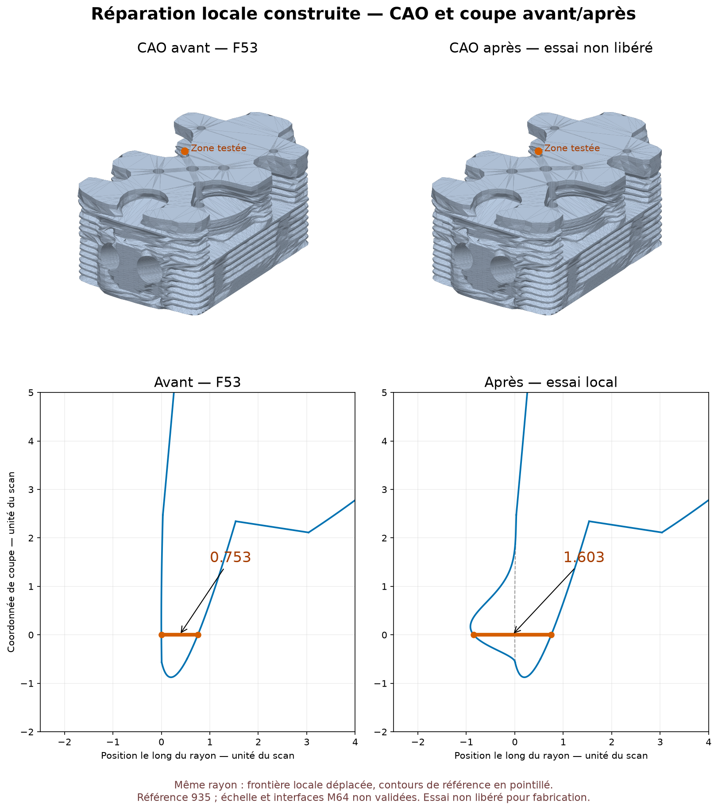

# Réparation locale Bernstein sur la référence 935 — 7 septembre 2026



Vue produite depuis les deux STEP contrôlés et leurs sections OCCT, sans
image générative. Source attribuée à Wolfe Classics selon
`catalog/sources/src-wolfe-classics-935-billet-cylinder-head-scan.json`.
Le skill `create-viz` a guidé la conservation des vues et échelles et
l'affichage de la référence en pointillé. Le rendu neutre n'est pas un
champ de températures ou de contraintes.

## Une nouvelle face et un solide ont été construits

Le candidat de bidegré **10 × 11** conserve les cinq courbes de bord de la
face source dans les contrôles effectués. La face puis le solide fermé
passent BRepCheck exact, y compris après export et import STEP. Les
tolérances de la face et de ses cinq arêtes restent à `1e-7` : aucune
réévaluation favorable par augmentation des tolérances n'est utilisée.
Le contrôle BOP d'auto-intersections a ensuite terminé sans défaut signalé.

Le même trajet local mesuré par intersection CAO passe de **0,752667 à
1,602667 unité du scan**. Parmi les autres rayons appariés, 39 restent
inchangés à `1e-5` près ; deux rayons demeurent non résolus. Ce résultat
est local et échantillonné, pas une validation d'épaisseur de toute la pièce.

La source reste la reconstruction F53 issue d'une référence de recherche
935. Ce n'est pas une géométrie M64 validée, ni une échelle certifiée, ni
une pièce autorisée à fabriquer ou à monter sur un moteur. La silhouette
globale n'est pas remplacée ; **une surface locale vers le passage d'air
est réellement modifiée**. Une boîte englobante inchangée ne signifie pas
que toute la peau extérieure est inchangée.

## Pourquoi réduire le degré a été utile

La [recherche de champ à contraintes implicites](M64_IMPLICIT_BOUNDARY_BUBBLE_20260907.md)
avait trouvé un premier champ 12 × 23. Sa surface directe respecte les
courbes, mais le contrôle contextuel OCCT de deux arêtes échoue près des
extrémités : l'évaluation par adaptateur donne environ `1,668e-7` d'écart,
alors que l'évaluation directe de la surface aux mêmes paramètres donne
`1,06e-13` et `7,29e-12`.

Le témoin utilisant la surface source inchangée et le même assemblage de
fil passe. Ce n'est donc pas une simple inversion de fil. Le STEP 12 × 23
réimporté devient valide seulement après hausse automatique de deux
tolérances d'arêtes à environ `1,668e-7` : **ce candidat reste rejeté**.
Le diagnostic constate une divergence entre voies d'évaluation ; il ne
prétend pas identifier à lui seul la ligne fautive interne d'OCCT.

La nouvelle sélection minimise d'abord le degré maximal, puis le degré
total, et seulement ensuite l'amplitude sur la grille initiale. Les scores
numériques des 14 641 champs ont été recalculés à partir des coefficients
privés déjà enregistrés : le premier rapport ne conservait que le meilleur
champ, pas tous les scores. Aucun nouvel ajustement de géométrie n'est
effectué pour cette sélection. 360 champs satisfont la limite d'amplitude
sur la grille 81 × 81.

| Exposants `(p,q,r,s)` | Bidegré | Maximum sur 24 732 points | Rapport d'orientation minimal |
|---|---|---:|---:|
| **(4,2,2,5)** | **10 × 11** | **0,934757** | **0,968771** |
| (5,2,2,5) | 11 × 11 | 0,886633 | 0,966479 |
| (3,2,2,6) | 9 × 12 | 0,998871 | 0,979431 |

Seul le premier est construit. La dernière combinaison a très peu de
marge sous la limite 1. Ces maxima restent échantillonnés, pas des bornes
globales certifiées.

## Construction et contrôles du 10 × 11

`trial_transition_bernstein.py` multiplie les coefficients en **base de
Bernstein**, sans développement monomial de haut degré ni BRepFill.
Le facteur de bord possède un unique coefficient non nul avant produit
avec `F²`, où `F` est l'équation du cylindre analytique portant la cinquième
découpe. Le déplacement vaut 0,85 au point cible. Les pôles de la surface
bilinéaire source sont élevés en degré puis additionnés aux coefficients
de déplacement dans la direction retenue.

Les nœuds reprennent exactement le domaine UV original ; les mêmes courbes
paramétriques et intervalles sont attachés aux arêtes. Les opérations
s'effectuent sur une copie du maître. Les conditions de construction
B-Spline et les fonctions de rattachement des courbes sont décrites dans
les références officielles [Geom_BSplineSurface](https://occt3d.com/dev/doc/refman/html/class_geom___b_spline_surface.html)
et [BRep_Builder](https://occt3d.com/dev/doc/refman/html/class_b_rep___builder.html).

| Contrôle natif | Résultat |
|---|---:|
| Erreur du point déplacé de 0,85 | `3,89e-14` unité |
| Erreur maximale courbes/surface à mêmes paramètres, 121 points/arête | `6,25e-9` unité |
| Même contrôle sur surface source | `6,25e-9` unité |
| Écart maximal des premières dérivées aux bords échantillonnés | `9,61e-12` |
| Écart formule factorisée / surface OCCT, 6 250 points | `7,14e-14` unité |
| Déplacement natif maximal sur ces points | `0,934182` unité |
| Rapport d'orientation natif minimal | `0,968804` |
| Face avant et après export/import | BRepCheck exact valide |
| Tolérance face et cinq arêtes, avant et après import | `1e-7`, inchangée |
| Couture | Une coque ; zéro arête libre ou multiple |
| Solide avant et après export/import | BRepCheck exact valide, 20 431 sous-formes contrôlées |
| Topologie | Un solide, une coque, 4 929 faces ; zéro arête non-manifold |
| BOP auto-intersections du solide complet | Terminé, aucun défaut signalé |
| Variation des six bornes englobantes, avant export | 0 |
| Variation de volume | `+10,6963` unités³, soit `+0,0008584 %` |
| Variation de surface | `+7,49387` unités² |
| Variation de volume due au seul aller/retour STEP | `4,66e-10` unité³ |

Le coefficient de normalisation vaut `89,8421`, contre environ 497 655
pour le 12 × 23. La meilleure stabilité n'est pas déduite de ce rapport
seul : elle est observée dans les évaluations et contrôles natifs. Le
maximum absolu des coefficients Bernstein de déplacement vaut `3,18756` ;
ce n'est pas le maximum de la surface.

Un contrôle indépendant supplémentaire a comparé **toutes** les tolérances
des deux STEP complets : 4 929 faces, 10 222 arêtes et 5 278 sommets. Les
distributions sont strictement identiques, avec minimum et maximum `1e-7`
dans chaque catégorie. La seule face 10 × 11 et ses cinq arêtes conservent
aussi cette valeur après la couture et l'import du solide complet.

La [borne globale Bernstein indépendante](M64_BERNSTEIN_GLOBAL_BOUND_20260907.md)
établit pour le polynôme scalaire stocké `|D| ≤ 0,9512202009568349` sur
**tout le carré UV**, et pas seulement aux points de la grille. Elle emploie
une subdivision rationnelle exacte des coefficients flottants enregistrés.
Sa portée n'inclut pas une borne globale des arrondis d'évaluation OCCT,
ni une validation mécanique ou de fabrication.

## Artefacts privés et limites

Sur Kali, sous :

```text
/tmp/917-f50/out/m64-local-transition-bernstein-20260907-low-degree/
```

- `private-bernstein-coefficients.npz` : coefficients, paramètres et pôles privés réutilisables.
- `private-replacement-face.step` : face 10 × 11, SHA `168327ff82585039ccd4c62e4004a73b0176fca42f6ea09d49e8582f37ed33c5`.
- `diagnostic-candidate.step` : solide complet, SHA `42057011e25ecc48b215a58e979a0d9bcf4769f2f96f9690b751a81a7bde2cd8`.
- `surface-report.json`, `solid-report.json`, `audit-report.json` : étapes natives séparées.

SHA des rapports surface/solide/audit :

```text
33f99d631f77a6a6bc14a4a9a3dea531f2e40c2a44a31a97606e76a94209636f
6482f829ed18a836ed54351b630bb2703ab5c3d2b99063b428a1da83ef5784e9
d2bb2b1195b1ef320ca8dc9fac7a57a910aa9477a28c3022f771f4e70eb508af
```

Image publiée : SHA `18057ee6e124420960d5f1d8e742d8f000898f688e78ba68141107c973eaa08a`.
Le [résumé public expurgé](../twins/m64-cylinder-head/bernstein-local-repair-summary-20260907.json)
ne contient ni coordonnées, ni indices de faces/probes privés, ni STEP/NPZ.

Rapports annexes, sous `/tmp/917-f50/out/` :

- `m64-bernstein-adaptor-boundary-audit-20260907.json`, SHA `af85432b9e495205b5672e6eca49f2426e8c2a9a2e31c0e39e00fd9b2e685cec` : rejet du 12 × 23 et hausse automatique des tolérances à l'import.
- `m64-low-degree-localized-fields-20260907.json`, SHA `645bfb542e396528e6372f449b71a27554976d45929ba98ff9c32807dc7526c8` : classement des trois candidats de moindre degré.
- `m64-bernstein-complete-tolerance-audit-20260907.json`, SHA `c68b62f1386ff8879e3d6c90e52937cd2949252a73c1b7179a93e08e79cb85fe` : inventaire privé complet de chaque tolérance, avec histogrammes exacts et contrôle spécifique de la face modifiée.

Le contrôle d'auto-intersections BOP a terminé dans son plafond
de 300 secondes, avec `exit 0`. Il n'est pas remplacé par la seule réussite de BRepCheck.
Les scripts d'audit et de construction sont limités à deux CPU et 4 Gio ;
la sélection numérique est limitée à 60 secondes. Un premier lancement
de l'audit s'est arrêté avant calcul sur un helper distant ancien ; après
mise en cohérence du helper testé, l'audit reprend sans reconstruire la CAO.
Le rapport initial est conservé sous `audit-report-import-error.json`.

Deux tests unitaires vérifient les produits Bernstein et la construction
du facteur localisé ; quatre autres couvrent l'audit et la recherche de
champ. Quatre tests lient le résumé expurgé à ses preuves, vérifient les
comptes de rayons et empêchent sa promotion en pièce M64 libérée.
Les preuves CAO ci-dessus proviennent des exécutions natives,
pas de ces tests seuls.

## Piste suivante et résultat de l'essai séparé

**Mise à jour :** le [renfort local C2 sur le trajet isolé le plus mince](M64_ISOLATED_C2_REJECTION_20260907.md)
a depuis été construit comme surface séparée, puis rejeté au filtre de
pente avant toute face ou couture. Il n'est pas combiné avec le
solide 10 × 11. La proposition et l'audit préalables restent ci-dessous.

`audit_remaining_transition_faces.py` a inspecté les quatre rayons non
adjacents faibles restants dans la géométrie source réelle. Les quatre
surfaces d'entrée sont bilinéaires non rationnelles, à quatre limites
isoparamétriques et un seul fil. Elles ne nécessitent donc pas le facteur
cylindrique utilisé dans la réparation précédente.

- Deux rayons, `1,144959` et `1,304774` unités, traversent le même couple
  de faces en sens opposés. Une correction doit contrôler ces deux trajets
  ensemble, pas les considérer comme deux défauts indépendants.
- Un autre trajet vaut `1,427734` unité.
- Le plus faible restant vaut `1,052418` unité ; son point d'entrée est
  très proche d'une limite paramétrique. Normaliser une bulle globale à ce
  point pourrait surdéplacer d'autres zones de la face.

La piste proposée est une bulle sur un **support UV local**, avec facteurs
cubiques donnant déplacement, dérivées premières et secondes nuls au bord
du support. Une représentation B-Spline par nœuds locaux, de degré 6 × 6,
pourrait conserver les courbes initiales et un raccord C2 sans grand degré
global. Ce sont des propriétés de la construction proposée, **pas une
surface déjà construite**. Son amplitude, sa direction vers le passage
d'air, les collisions, les rayons couplés et la borne continue devront être
contrôlés avant puis après toute construction.

Rapport de lecture seul, privé :
`/tmp/917-f50/out/m64-remaining-transition-feasibility-20260907.json`,
SHA `463eaa85b14c10c2e1284049fd57642fce8e93ad1b73e5b4a37da4e7c9768a75`.
Aucune nouvelle CAO n'avait été lancée lors de cet audit préalable.

Thermique, fatigue, charge turbo, interfaces M64, fabrication LPBF et
contrôles physiques ne sont pas validés par cette réparation. Les autres
zones minces doivent encore être traitées. Le maître F53 conserve son SHA
`700baea66bc72cdb6aee529e21b167270ebde11db94b06f8e1e55ee08bdd9bf2`.
