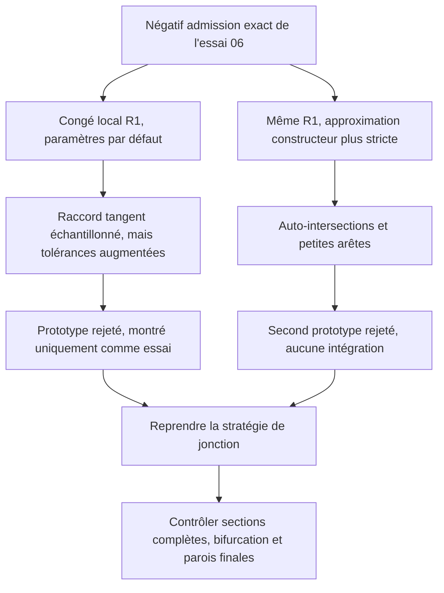

# M64 — prototypes de raccord d'admission et contre-essai HXT

Suite des [corrections locales précédentes](M64_LOCAL_MESH_AND_JUNCTION_FOLLOWUP_20260907.md).
Le but est de traiter un vrai épaulement interne et d'améliorer la
discrétisation sans changer arbitrairement la silhouette extérieure.
**Ces essais restent des développements CAO et maillage, pas une culasse
thermiquement ou mécaniquement validée.**

La suite est tracée dans le [témoin de raccord local PicoGK du 8 septembre](M64_PICOGK_LOCAL_JUNCTION_WITNESS_20260908.md).

## Raccord local : avant/après réel, deux constructions rejetées

Le [reçu des deux prototypes](../twins/m64-cylinder-head/evidence/local-intake-fillet-countertrials-20260907.json)
concerne uniquement le négatif d'admission du corps 06. Trois arêtes entre
branches et calotte sont sélectionnées par géométrie, en excluant le cercle
extérieur de référence. Le rayon de 1 unité du scan est une hypothèse de
conception, pas une cote Porsche ni un optimum de débit.

Le premier essai construit trois surfaces de raccord. Le négatif reste un
solide BRepCheck valide, sans défaut BOP en mémoire. Les angles entre plans
tangents échantillonnés aux six nouveaux bords restent sous 0,00032°.
Ce n'est pas une démonstration globale de continuité G1, et la bifurcation
entre les deux branches n'est pas entièrement reprise.

Les tolérances natives augmentent toutefois à 1,53 × 10⁻⁵ unité sur certaines
faces/arêtes et 1,60 × 10⁻⁴ sur certains sommets. **Le prototype est rejeté** :
aucun changement de seuil ni promotion au corps complet. Les réglages du
constructeur n'avaient pas été modifiés.

Les contrôles locaux du premier prototype établissent seulement :

- inclusion maintenue des sept disques de référence, avec aire manquante
  nulle ; **pas une preuve d'égalité des sections complètes** ;
- volume gaz ajouté de 29,164 unités³, volume retiré nul dans les booléens ;
- aucun ajout hors du corps original avant création des conduits ;
- distance numérique de 10,451 unités entre cet ajout et la coque originale.
  **Ce n'est pas une épaisseur finale**, notamment après l'autre conduit ;
- boîte englobante et six supports B-splines d'origine conservés.

La différence des volumes globaux adaptatifs et le volume du delta booléen
présentent un résidu d'environ 0,03648 unité³, non expliqué. Les estimateurs
d'intégration ne suffisent pas à revendiquer une conservation exacte.

### Second essai : approximation plus stricte, résultat dégradé

La [source primaire OCCT 7.9.3](https://github.com/Open-Cascade-SAS/OCCT/blob/V7_9_3/src/ChFi3d/ChFi3d_Builder_1.cxx)
montre des paramètres d'approximation par défaut moins stricts que certains
seuils topologiques du modèle. Le second essai garde le rayon, les arêtes
sélectionnées et tous les critères d'acceptation ; il ne resserre que les
paramètres de construction, avant l'ajout des arêtes.

| Paramètre de construction | Défaut | Second essai |
|---|---:|---:|
| Tang | 0,01 | 0,01 |
| Tesp | 10⁻⁴ | 10⁻⁷ |
| T2d | 10⁻⁵ | 10⁻⁷ |
| TApp3d | 10⁻⁴ | 10⁻⁸ |
| TolApp2d | 10⁻⁵ | 10⁻⁸ |
| Fleche | 10⁻³ | 10⁻⁴ |

Ce resserrement ne réussit pas : **5 auto-intersections et 4 arêtes trop
petites**, avant et après relecture native. Le maximum de tolérance atteint
0,1784 unité et un écart angulaire échantillonné 15,57°. Le résultat est
rejeté, sans troisième essai de paramètres, nouveau STEP ou découpe du corps.
La cause interne détaillée de cette dégradation n'est pas démontrée.

Le [builder](../twins/m64-cylinder-head/source/build_local_port_junction_fillet.py)
conserve séparément les modes `default` et `strict-approximation-v1`.
L'[audit local](../twins/m64-cylinder-head/source/audit_local_port_junction_fillet.py)
ne doit pas être utilisé pour transformer une inclusion de disques en une
preuve d'égalité de sections ou de paroi finale.

### Image et coupe

La vue privée avant/après utilise les 32 584 et 40 178 triangles natifs du
premier essai, sans lissage ni déformation. Elle montre **le volume du passage
de gaz, pas une nouvelle forme de culasse**. L'orange identifie les trois
surfaces ajoutées ; ce n'est ni une température ni un champ de contraintes.
La coupe est une intersection des triangles avec un plan, pas un nouveau solide.

Après revue indépendante, le [rendu](../twins/m64-cylinder-head/source/render_local_port_junction.py)
vérifie aussi que les IDs colorés correspondent à la différence des signatures
de supports et au nombre de faces de l'historique du builder. Quatre
[tests](../tests/test_local_port_junction_render.py) refusent notamment une
ancienne face présentée à tort comme nouvelle. Le rendu réel réexécuté avec
ce contrôle produit la même image : les IDs de cette image étaient corrects.
Les fichiers géométriques et images issus du scan restent privés ; leurs
empreintes sont dans le reçu public.

La prochaine reprise de la jonction doit changer la construction sur une
justification géométrique, pas poursuivre une boucle de paramètres ni
diffuser un négatif rejeté dans le modèle complet.

## Maillage du corps 05 : HXT10 n'est pas retenu

Le [contre-essai HXT10](../twins/m64-cylinder-head/evidence/native-mesh-trial05-HXT10-20260907.json)
conserve la CAO, les trois affectations MeshAdapt, les tailles et les réglages
sans optimisation. La seule option explicite changée est le générateur
volumique Gmsh, de Delaunay1 à HXT10. Il s'agit d'une comparaison de maillage,
**pas de deux méthodes de validation physique indépendantes**.

Un témoin synthétique a d'abord observé HXT, la conservation des surfaces,
la relecture MSH et des Jacobiens positifs. Son seuil de qualité échoue pour
les deux générateurs : un tétra sous 0,1. Le témoin reste rejeté. Un seul essai
diagnostique de la pièce a ensuite été explicitement autorisé sur la base
des vérifications API observées ; aucun critère de qualité n'a été diminué
et aucune qualification CAE n'a été accordée par ce témoin.

Le calcul du corps sur Kali dure 24,49 s, sortie 2, sans dépassement mémoire.
Les deux MSH réellement relus donnent :

| Mesure | Delaunay1 avec MeshAdapt local | HXT10 avec les mêmes réglages de surface |
|---|---:|---:|
| Tétraèdres | 259 699 | 340 571 |
| Tétraèdres minSICN < 0,1 | 4 744 | 7 530 |
| Tétraèdres minSICN < 10⁻⁶ | 0 | 181 |
| Jacobiens non positifs | 0 | 21 |
| Triangles frontière minSICN < 0,1 | 799 | 799 |

Pendant la génération HXT, la géométrie non orientée des 4 892 triangulations
reste identique, mais l'orientation de triangles d'une face change. Entre les
deux MSH, une face diffère aussi en triangulation non orientée et neuf en
orientation. Ces différences ne se réduisent pas au signe de zéro flottant.
**Une frontière strictement identique entre les deux exécutions n'est donc
pas démontrée** ; toute attribution causale stricte au seul générateur est
exclue. Des nombres de triangles, aires ou volumes identiques ne suffisent pas.

Le contrôle ajouté conserve les coordonnées exactes en représentation
hexadécimale, ainsi qu'une signature orientée modulo rotation cyclique des
trois sommets. L'arrondi à douze décimales reste un contrôle séparé, pas une
preuve exacte. Les Jacobiens et la qualité sont contrôlés après export :
le faible écart de coordonnées à la relecture ne masque pas les éléments
non positifs. **HXT est rejeté**, tant pour la qualité que pour la conservation
stricte demandée. Tous les conteneurs du lot ont été supprimés après collecte.

## Vérification et limite du lot

Le [reçu logiciel](../twins/m64-cylinder-head/evidence/local-fillet-hxt-software-checks-20260907.json)
consigne un `make check` avec sortie 0 : 2 144 tests dans la découverte
principale, dont 79 ignorés explicitement, puis les cibles complémentaires.
Les suites ciblées du runtime natif passent : 9 tests raccord/rendu et
21 tests maillage, aucun ignoré. Ces tests ne requalifient aucun candidat rejeté.

Aucune location Vast, aucune nouvelle découpe de culasse, aucun résultat
thermique, mécanique, fatigue ou LPBF n'est produit par ces contre-essais.
La reprise suivante doit traiter la forme de la jonction et la qualité des
frontières, avec de nouvelles preuves attachées à la géométrie correspondante.
