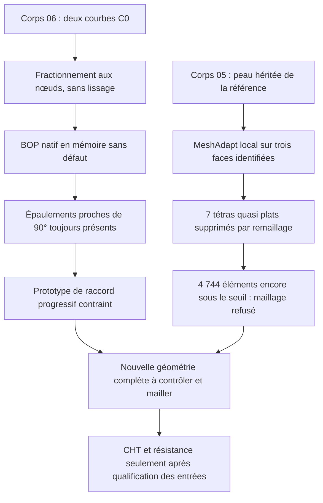

# M64 — correction locale du maillage et raccords encore à reprendre

Suite du [lot CAO, contacts et maillage](M64_NATIVE_CAD_CONTACTS_AND_MESH_20260907.md).
Deux essais distincts progressent : la discrétisation de la peau sur le corps
05 et la représentation topologique du corps 06. **Aucun des deux ne constitue
une culasse validée ni une autorisation d'impression.** Les géométries ne sont
pas interchangeables ; leurs empreintes lient chaque résultat à son objet.

## Maillage 05 : amélioration réelle sans modification de la CAO

Le [contre-essai MeshAdapt](../twins/m64-cylinder-head/evidence/native-mesh-trial05-local-MeshAdapt-20260907.json)
ne change que l'algorithme de maillage de trois faces dont la provenance dans
la peau d'origine a été contrôlée. Toutes les tailles, l'algorithme volumique
et les autres options restent identiques. Le choix est testé sur Kali x86,
dans le même conteneur limité à deux CPU et 4 Gio, sans nouvelle location Vast.
La génération réelle dure 23,71 s ; les entrées restent inchangées.

| Mesure sur les fichiers MSH relus | Avant | Après correction locale |
|---|---:|---:|
| Tétraèdres | 261 564 | 259 699 |
| Tétraèdres de qualité minSICN < 0,1 | 4 902 | 4 744 |
| Tétraèdres quasi plats, minSICN < 10⁻⁶ | 7 | 0 |
| Jacobiens non positifs | 1 | 0 |
| Triangles de frontière minSICN < 0,1 | 869 | 799 |
| Écart de volume discrétisé par rapport au natif | +0,281956 % | +0,282046 % |

Sur les trois faces ciblées, les minima de qualité passent respectivement
de 0,00515 / 0,02452 / 0,00180 à 0,30998 / 0,37297 / 0,17985. Les 4 889 autres
faces présentent la même signature de triangulation, calculée à partir des
coordonnées arrondies à douze décimales. Ce contrôle n'est pas une identité
bit à bit ni une preuve exhaustive d'équivalence géométrique.

Le fichier conserve une région connectée, toutes les faces CAO maillées et
une frontière complète. Les sept éléments presque plats disparaissent par
remaillage, pas par suppression manuelle. Mais **4 744 éléments restent sous
le seuil projet 0,1 : le maillage global est toujours refusé**. La face ayant
la plus grande erreur d'aire parmi les trois ciblées conserve environ 1,71 %
d'écart ; la convergence géométrique n'est donc pas démontrée non plus.

### Le contrôle après export est désormais obligatoire

La comparaison ultérieure des MSH a trouvé un Jacobien non positif dans le
fichier initial, alors que les Jacobiens étaient tous positifs en mémoire.
Les coordonnées ne variaient que très peu : un contrôle de déplacement maximal
à 10⁻¹⁰ unité ne suffisait pas pour ces éléments presque dégénérés.

Le [helper](../twins/m64-cylinder-head/source/mesh_native_ported_head.py)
recalcule maintenant **minSICN et minDetJac après relecture**, impose le même
nombre de tétraèdres, des Jacobiens strictement positifs et le seuil minSICN
inchangé. Les [tests dédiés](../tests/test_m64_native_ported_mesh.py) incluent
une inversion malgré un déplacement inférieur à 10⁻¹⁰. Le reçu conserve le
vrai code exécuté pour le contre-essai (`540d168f…`), distinct du helper renforcé
ultérieurement (`3b412b00…`). Aucun ancien rapport n'a été réécrit en succès.

## Corps 06 : représentation corrigée, épaulements inchangés

Le [fractionnement topologique](../twins/m64-cylinder-head/evidence/trial06-topological-edge-split-20260907.json)
remplace deux courbes C0 par cinq segments à leurs nœuds existants. Il ne
lisse ni n'ajuste les courbes et n'augmente pas leurs tolérances. Le candidat
natif conserve un solide, une coque et 4 889 faces ; le contrôle BOP complet
en mémoire ne signale plus de défaut. Le B-Rep sauvegardé et relu passe
BRepCheck et le contrôle de continuité. **Le BOP complet n'a pas été répété
après relecture, et aucun nouveau STEP n'a été exporté ou qualifié.**

La table des courbes paramétriques sur surface est identique octet pour octet.
Les supports B-splines restent inchangés ; quelques coefficients analytiques
varient d'au plus 2,22 × 10⁻¹⁶ à la sérialisation. Les intervalles des courbes
sont couverts une fois, avec les orientations de leurs occurrences conservées.
Ce sont des contrôles de représentation, pas une preuve de lissage fonctionnel.

L'écart de volume calculé sans intégration adaptative n'était pas fiable pour
comparer ces deux représentations. Le contre-calcul adaptatif donne environ
−1,53 × 10⁻⁷ unité³ d'écart ; son estimateur d'erreur relatif reste autour de
3,03 × 10⁻⁸. Ne pas confondre la précision demandée avec une borne atteinte.

Le défaut de forme interne est toujours présent : les branches débouchent
sur des portions résiduelles de calotte plane, avec des angles entre plans
tangents proches de 90°. Le fractionnement n'élimine pas ces épaulements et
ne démontre aucun gain de débit. Le prochain prototype doit créer un raccord
progressif, en préservant les sections de référence et les portées d'inserts.

Les résultats de maillage du corps 05 ne sont pas transférés au corps 06.
La suite reste géométrique : raccord progressif, peau correctement discrétisée,
puis conditions physiques explicites et convergence. Aucun champ de chaleur,
contrainte, fatigue ou résultat LPBF de culasse n'est ajouté par ce lot.

## Vérification logicielle et traçabilité

Le [reçu logiciel séparé](../twins/m64-cylinder-head/evidence/local-mesh-followup-software-checks-20260907.json)
consigne un nouveau `make check` terminé avec sortie 0 : 2 131 tests dans
la découverte principale, dont 76 ignorés explicitement, puis les cibles
complémentaires. Les 17 tests ciblés du maillage passent également sans
test ignoré. Une revue indépendante en lecture seule n'a pas trouvé de
faux succès dans les critères ajoutés et a vérifié les chiffres contre les
preuves privées. Elle n'a exécuté aucun nouveau maillage.

Les compétences de tests et de documentation ont conduit à conserver le
contre-exemple d'inversion après export, les résultats rejetés et les
empreintes du code réellement exécuté, sans les confondre avec le code futur.

La [suite des prototypes de raccord et du maillage](M64_LOCAL_FILLET_AND_HXT_COUNTERTRIALS_20260907.md)
conserve les nouveaux essais et leurs rejets séparément.
