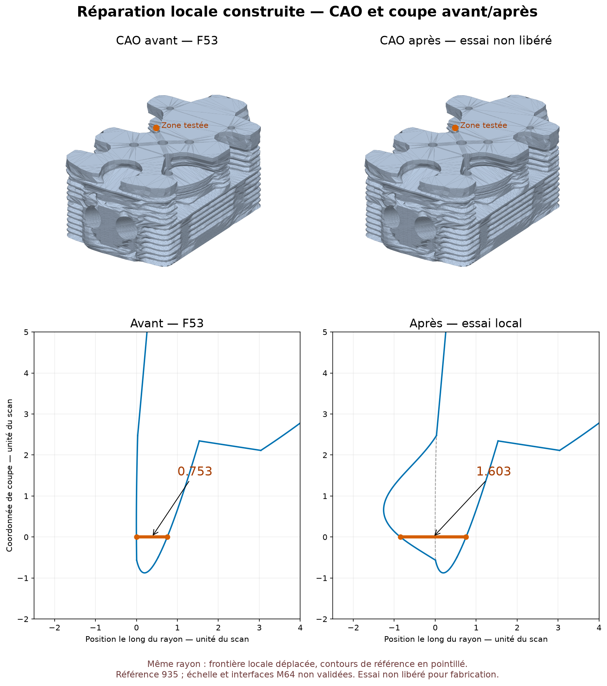

# Essai réel de reconstruction locale — 7 septembre 2026

## Une modification a effectivement été construite

`trial_transition_filling.py` reprend le STEP privé F53 exact, choisit une
seule face de la transition la plus faible, fournit ses cinq courbes de bord
dans leur ordre à `BRepFill_Filling` et ajoute un point contraint déplacé de
**0,85 unité du scan vers le passage d'air**. Le point cible est classé
`OUT` par OCCT sur le solide original. Aucun contour global de substitution,
ellipse ou déplacement d'interface n'est introduit. Le maître reste intact.

Cette opération modifie une surface locale. Elle ne doit pas être décrite
comme une conservation exacte de toute la peau extérieure.

## Résultat du candidat recousu, encore rejeté

| Contrôle effectivement exécuté | Résultat |
|---|---|
| Construction du patch | Terminée, face BRepCheck valide |
| Couture | Une coque, zéro arête libre ou multiple |
| Solide complet, avant/après export STEP | BRepCheck exact valide |
| Auto-intersection BOP | Aucun défaut signalé |
| Variation des six bornes englobantes | 0 au calcul effectué |
| Variation de volume | +36,5937 unités³, soit +0,002937 % |
| Trajet faible ciblé | 0,752667 → 1,602667 unité du scan |
| 42 rayons, même algorithme sur les deux géométries | 39 inchangés à `1e-5`, un augmenté, deux non résolus |
| Trajets diminués parmi les 40 appariés | Aucun à `1e-5` près |

Il s'agit d'un gain **local échantillonné**, pas d'une carte exhaustive
d'épaisseur. La boîte englobante inchangée n'est pas une carte de déviation
des surfaces ni une preuve de conservation de toutes les silhouettes.

La comparaison appariée des 42 rayons a été effectuée une seconde fois avec
le même sélecteur d'intervalle intérieur sur le maître et le candidat. Les
40 résolutions ne sont donc pas présentées comme une amélioration physique
par rapport aux 37 du premier audit F54, dont le sélecteur était différent.

## Pourquoi le candidat reste refusé

La première résolution du patch (30 points/courbe, trois itérations)
produit un écart maximal échantillonné aux bords de `9,06e-4`. Le raffinement
à 75 points/courbe, cinq itérations, degré maximal 12 et 48 segments réduit
ce maximum à `1,68e-5` sur 31 points de contrôle par arête. Le seuil conservé
est `1e-5` : les critères de bord ne sont pas satisfaits.

Un contrôle indépendant plus dense, **121 points sur chacune des cinq
mêmes courbes**, compare la référence et le patch :

| Courbe, ordre de parcours privé | Distance max à la surface originale | Distance max à la surface du patch |
|---|---:|---:|
| 1 | `1,52e-9` | `1,05e-5` |
| 2 | `6,73e-13` | `2,84e-5` |
| 3 | `1,00e-14` | `1,10e-5` |
| 4 | `8,77e-12` | `2,45e-6` |
| 5 | `1,00e-14` | `2,45e-6` |

Les tolérances OCCT portées par les cinq arêtes originales et la face
originale valent toutes `1e-7` ; celle de la face de remplacement exportée
vaut également `1e-7`. Il existe donc une **dégradation mesurée du raccord**,
pas seulement un seuil plus sévère que la référence. Le contrôle dense
révèle en outre un pic plus élevé que l'échantillonnage initial.

Le déplacement du point contraint est satisfait à `2,20e-7` près sur le
patch raffiné. Cela ne compense pas le défaut des bords. La couture et
BRepCheck peuvent réussir alors que ce contrôle géométrique indépendant
échoue ; aucune tolérance n'est relâchée pour déclarer le candidat accepté.

La dernière tentative autorisée augmente uniquement la résolution
(120 points/courbe, six itérations, degré 14, 96 segments). Elle est arrêtée
par le plafond **300 secondes**, `exit 124`, pendant `building_filling`.
Aucun nouveau candidat n'est produit. Les processus sont vérifiés terminés.
Chaque essai est limité à deux CPU et 4 Gio d'espace d'adressage ; le dernier
utilisait environ 2,1 Gio RSS avant l'arrêt.

## Artefacts et reproductibilité

Cette image est produite par `render_transition_filling_section.py` depuis
les deux STEP contrôlés et leurs sections OCCT ; elle n'est ni une image
générative, ni un rendu Omniverse, ni un résultat thermique. La source de
référence est attribuée à Wolfe Classics, conformément au registre
`catalog/sources/src-wolfe-classics-935-billet-cylinder-head-scan.json`.
Les géométries et coordonnées restent privées ; seule cette illustration
diagnostique est publiée.

Sous `/tmp/917-f50/out/`, sur Kali :

- `m64-local-transition-filling-20260907-v3/` : patch de résolution initiale et rejet des bords.
- `m64-local-transition-filling-20260907-refined/` : patch raffiné, encore rejeté.
- `m64-local-transition-filling-20260907-sewing-diagnostic/` : solide complet et contrôles, statut final `rejected_boundary_constraints_despite_diagnostic_checks`.
- `m64-local-transition-filling-20260907-extra-refined/` : dernière tentative arrêtée à 300 s ; rapport au stade de construction, sans succès prétendu.
- `m64-filling-independent-audit-20260907.json` : second contrôle enregistré, avec rayons appariés, 121 points par arête et audit paramétrique de la surface source. Produit par `audit_transition_filling_reference.py`, indépendamment du rapport initial de construction.

Empreintes :

- Maître inchangé, vérifié après le dernier essai : `700baea66bc72cdb6aee529e21b167270ebde11db94b06f8e1e55ee08bdd9bf2`.
- STEP complet diagnostique : `1c2e8bb78d3de01ccf724fac953b62281603a910cd1b7869e373dfcb9e263eec`.
- Face raffinée : `7a2eabdb33f54b10d4456a5b6ca78e398e6cb609415dd57ceb1b355ec38c7510`.
- Rapport indépendant apparié/dense/paramétrique : `ead88223c4a52c65c96dd5f83cc180b25cd3b6178ffe186bd5bc3234b961cf2b`.

L'image privée `m64-transition-filling-before-after-20260907-v2.png`
montre les CAO complètes avant/après et les deux sections OCCT au même point.
Le segment orange est calculé sur les rayons, pas déduit du rendu.
Hash image : `9314c60d8b8ab2571885f3667d210f1e7a91d81116de6c2312f9355590825e87`.
Le skill `create-viz` a conduit à conserver les mêmes vues/échelles et à
afficher la référence initiale en pointillé ; aucune image générative n'est
utilisée. La surface locale déplacée reste explicitement un essai non libéré.

Les deux premiers lancements avaient interrompu l'instrumentation par
`Standard_OutOfRange` lors de la lecture des erreurs G0 indexées. Ils ne
démontraient pas un échec du constructeur. Les contrôles retenus utilisent
ensuite une projection géométrique indépendante des courbes originales
et du point sur la surface obtenue.

Six tests unitaires vérifient la comparaison appariée, la distinction
entre résolution et gain, et le rejet des identités de rayons différentes.
Ils refusent aussi les longueurs non finies ou non positives, les statuts
inconnus et les tolérances invalides : un NaN ne peut pas être compté comme
un trajet inchangé.
Ils s'ajoutent aux cinq tests du diagnostic d'origine. Les résultats CAO
ci-dessus proviennent d'exécutions natives réelles, pas de ces tests seuls.

La documentation de référence OCCT décrit les bords C0 et les contraintes
ponctuelles, ainsi que la possibilité de contraintes incompatibles ; c'est
pourquoi le seul `IsDone()` ne vaut pas acceptation du patch.
[Référence officielle BRepFill_Filling](https://occt3d.com/dev/doc/refman/html/class_b_rep_fill___filling.html).

## Suite justifiée et limites

La méthode a démontré un épaississement local réel sans changement de boîte
englobante. Le prochain problème n'est plus « aucune forme construite »,
mais **comment imposer les courbes limites avec une erreur inférieure au
seuil sans multiplier excessivement le coût du patch** : correction des
courbes paramétriques/bords sur la surface reconstruite ou découpage local
du patch, puis contrôle de raccord et nouvelle comparaison géométrique.
Aucun de ces opérateurs supplémentaires n'a été exécuté dans ce lot.

### Piste des pôles intérieurs : audit seulement, puis arrêt

La surface source est une B-Spline bilinéaire : degrés 1 × 1, grille 2 × 2,
aucun pôle intérieur disponible. Quatre courbes d'ancrage sont isoparamétriques
dans l'audit à 121 points ; la cinquième est une p-curve B-Spline variant
simultanément sur environ 47,5 % du domaine U et 19,2 % du domaine V.
Ce n'est donc pas simplement une arête isoparamétrique scindée. Même une
élévation de degré suivie du maintien des seules rangées de pôles extérieures
ne préserverait pas cette courbe de rognage non isoparamétrique. Cette piste
simple est arrêtée sans aucune élévation de degré ni déformation supplémentaire.

Une piste distincte a ensuite identifié le cylindre analytique de la
cinquième limite et testé un polynôme nul sur les cinq bords. Le champ
dépasse la limite locale de déplacement et est rejeté avant construction :
[audit de la bulle à contraintes implicites](M64_IMPLICIT_BOUNDARY_BUBBLE_20260907.md).
La suite distincte en produits Bernstein aboutit ensuite à un candidat
local 10 × 11 dont les contrôles CAO passent, sans libération moteur :
[dossier consolidé de réparation Bernstein](M64_LOCAL_BERNSTEIN_REPAIR_20260907.md).

Les quatre autres trajets non adjacents faibles et les autres zones de la
pièce restent à traiter. Thermique/CHT, résistance, fatigue, circulation
d'huile, interfaces M64 et LPBF complets ne sont pas validés. La géométrie
reste une référence de recherche scan-dérivée 935 ; les unités du scan ne
constituent pas une échelle certifiée. Aucune fabrication ni mise en route
n'est autorisée, et aucun STEP/STL privé n'est ajouté au dépôt.
