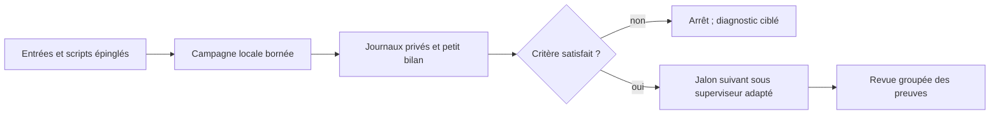

# M64 — campagnes scriptées, budget Vast 38 USD

## Décision et exécution

Option retenue : scripts déterministes, journaux privés sur disque, petits
bilans JSON et revues humaines/IA aux jalons. **Aucun LLM ne pilote chaque pas
du solveur.** Trois tâches d'agents bornées ont traité en parallèle le
contre-calcul, l'exécution batch et la recherche maillage/procédé. Les agents
consomment aussi des tokens : leurs comptes rendus sont limités aux résultats
et références utiles, sans reprise systématique de tout l'historique.

Le [lot 533](M64_MIXED_CELL_CORRECTION_20260909.md#extension--533-groupes-contre-vérifiés-le-12-septembre)
est contre-vérifié, mais reste refusé en qualité. Son natif a duré 31,842 s
sur Kali sous quatre CPU/4 Gio : aucune justification mesurée d'une location
pour répéter le même travail. Le contour maître reste inchangé.

## Batch local disponible

[`run_local_batch.py`](../twins/m64-cylinder-head/source/run_local_batch.py)
enchaîne une à huit commandes locales de confiance, sans shell ni retry.
Le manifeste épingle les scripts et entrées par SHA-256 ; les imports et
dépendances doivent être déclarés aussi. Chaque commande possède un délai,
la campagne un plafond de 3 600 s maximum et une seconde réservée au nettoyage.
Chaque sortie doit être neuve. Sur échec, entrée modifiée, timeout ou gate
qui n'est pas strictement `true`, aucune étape suivante n'est lancée.
Les journaux restent sur disque ; le bilan stdout est limité à 4 Kio.

Ce runner **n'est pas une sandbox**, ne provisionne pas de machine, ne lance
pas directement SSH/Docker et n'appelle aucune API LLM. Les phases natives
restent dans les superviseurs de conteneurs existants avec leurs plafonds
CPU/mémoire, entrées en lecture seule et suppression contrôlée. Le batch
local ne doit pas être utilisé pour abandonner un calcul distant au timeout.

```sh
python3 twins/m64-cylinder-head/source/run_local_batch.py \
  --manifest /chemin/prive/plan.json --output /chemin/prive/sortie-neuve
```

Format minimal du plan (les valeurs illustratives doivent être remplacées) :

```json
{
  "schema": "m64-local-batch/v1",
  "campaign_timeout_seconds": 60,
  "inputs": {"/chemin/prive/controle.py": "SHA256_COMPLET"},
  "commands": [{
    "argv": ["/chemin/python-reel", "/chemin/prive/controle.py", "--output", "{output}/gate.json"],
    "script": "/chemin/prive/controle.py",
    "timeout_seconds": 30,
    "gate": {"report": "gate.json", "key": "accepted"}
  }]
}
```

[`summarize_native_mesh_gate.py`](../twins/m64-cylinder-head/source/summarize_native_mesh_gate.py)
relie deux reçus épinglés (natif et comparaison indépendante), vérifie les
statuts et les neuf ensembles, puis produit seulement les comptes et le refus
qualité. Il **ne réexécute pas l'audit** et n'exporte pas de coordonnées.
Même un maillage accepté ne suffit pas à autoriser CFD ou fabrication.

Pilote réellement exécuté le 12 septembre : huit tests du lecteur passent,
puis les deux reçus privés sont résumés. Les deux commandes terminent avec
code zéro ; la campagne s'arrête en **0,162 s**, code deux, motif
`gate_not_true`, car cinq contrôles qualité restent refusés. Ce code deux
est l'arrêt attendu de la chaîne, pas une panne de solveur. Le
[bilan compact public](../twins/m64-cylinder-head/evidence/low-token-mesh-gate-20260912.json)
ne contient aucun identifiant de cellule ni coordonnée.
Empreinte : `e7a340371015a32af418c2c78f401e20b85aa2b979d4d8403db58deb5603e2c0`.
Supervision privée : `d55fd855d64b7c44a5b84942b339d7e457ac48618e944c9478649af46ec1e7a3`.

Le premier pilote avait refusé une incohérence de type dans le lecteur
(`unidentified_failed_families_after` est un nombre, pas une liste). Son
échec reste conservé ; après correction et test de régression, un nouveau
manifeste épinglé et une nouvelle sortie ont été utilisés. Aucun retry
automatique ni nouveau calcul natif. Le runner passe 25 tests distincts :
succès, refus de gates, mutation des entrées, délais et nettoyage.
La relecture indépendante des deux scripts ne relève aucun bloqueur dans
cette portée locale de confiance. `make check` complet termine avec code
zéro ; les contrôles natifs optionnels absents restent signalés comme ignorés.
Ces tests concernent le logiciel et le dossier, pas la qualification moteur.



## Tokens et argent : plafonds, pas promesse de produit fini

- Objectif de planification : **quatre revues de 15 000 tokens maximum chacune**,
  soit 60 000 tokens envisagés, agents inclus : géométrie, physique,
  fabrication, dossier final. Ce n'est **pas un limiteur Codex/API installé** ;
  le runner n'appelle pas OpenAI. Les calculs/scripts ne consomment pas de
  tokens LLM par itération. Une réduction totale en pourcentage n'est pas mesurée.
- Plafond utilisateur : **38 USD au total**, avec allocation de travail
  proposée de 32 USD et réserve de 6 USD pour transferts/stockage/nettoyage.
  Pas 38 USD par agent. Cette allocation n'est pas un nouveau portefeuille
  fournisseur ni une protection contre des dépenses d'autres utilisateurs.
- Avant chaque location : bilan courant via le wrapper OpenBao, absence de
  doublon, image `linux/amd64` par digest, paire SSH vérifiée, association de
  clé attendue, charge prête et watchdog externe armé. Ne pas contourner les
  limites plus strictes du wrapper existant (pilote PicoGK ≤4 USD).
- Les offres observées le 12 septembre proposaient notamment 32 CPU effectifs,
  environ 128 Go et une RTX 5070 à 0,678 USD/h, ou 40 CPU effectifs,
  environ 127 Go et une A100 à 0,709 USD/h. Ce sont des instantanés
  `dph_total`, **pas des réservations ni des devis complets** ; vérifier
  stockage alloué et tarifs de transfert sur l'offre exacte avant création.
- Exemple de cadrage, pas de réservation : 12 h à 0,709 USD/h ≈8,51 USD
  hors transferts/ajustements. Aucun matériel n'est loué dans ce lot.
  [Vast facture le stockage même à l'arrêt](https://docs.vast.ai/guides/reference/billing) :
  collecter les résultats puis supprimer l'instance, pas simplement l'arrêter.

## Recherche ciblée : décision technique

Sources primaires consultées le 12 septembre ; la nouveauté seule n'est pas
un critère de remplacement d'une méthode vérifiée.

| Piste | Ce qu'elle apporte et décision pour le M64 |
|---|---|
| [PhysicsNeMo-Mesh, publication NVIDIA du 7 avril 2026](https://nvidia.github.io/physicsnemo/blog/2026/04/07/physicsnemo-mesh/) | Opérations de géométrie, voisinage et calcul discret sur GPU, maillages simpliciaux. Candidat au traitement de surfaces/tétras en lots ; ne pas y convertir aveuglément le polyMesh hybride ni appeler ses sorties une preuve OpenFOAM. Benchmark CPU/GPU seulement après adaptateur testé ; non installé dans ce lot. |
| [Gmsh/HXT](https://gmsh.info/doc/texinfo/gmsh.html#Choosing-the-right-unstructured-algorithm) | Parallélisation CPU/OpenMP. HXT a déjà été essayé sur le cœur ; répéter le même maillage avec plus de RAM ne corrige pas ses petites facettes de frontière. Aucun nouveau HXT lancé. |
| [fTetWild](https://github.com/wildmeshing/fTetWild) | Tétraédralisation robuste dans une enveloppe d'approximation, licence MPL-2.0, article de 2020. Pas un correcteur hybride conservant exactement nos interfaces. Écart géométrique admissible à définir avant tout essai ; le défaut ε=diagonale/1000 n'est pas une tolérance moteur. Non retenu pour remplacer le maître. |
| [TMOP/MFEM, Camier et al., 2022](https://arxiv.org/pdf/2205.12721) | Optimisation par déplacement de nœuds et assemblage partiel GPU ; fonctions de qualité et limitation des déplacements. Papier méthodologique ancien, pas avancée nouvelle de septembre 2026. Un changement de représentation/adaptateur serait nécessaire pour nos polyèdres ; les gains publiés ne sont pas des performances mesurées sur cette culasse. |

PhysicsNeMo comme modèle réduit et Qwen/vLLM comme assistant restent facultatifs.
Un modèle réduit devra être évalué sur des cas de référence séparés ; aucun
entraînement sur le limiteur de température ne transforme celui-ci en physique.
Un LLM ne sera loué qu'après définition d'une tâche test et comparaison avec
le script seul, temps de chargement et coût inclus. Aucun nouveau serveur LLM
n'est installé par ce lot.

## Prochains lots bornés

1. **Géométrie** : traiter les petites facettes/arêtes de frontière à l'origine
   des défauts persistants, sur les mêmes surfaces CAO et avec contrôle des
   raccords. Ne pas réexécuter les variantes HXT/Relocate déjà refusées sur
   entrées identiques. Les résultats 533 restent une base diagnostic, pas un
   maillage approuvé.
2. **Procédé indépendant** : isoler la quadrature de source sur le coupon F58
   existant, thermique seul, fenêtre commune 0–40 µs à 25 ns. Comparer
   `nPoints=(10,10,10)` et `(20,20,20)` sans changer laser, matériau ou limiteur.
   Le code épinglé de `movingHeatSource.C` normalise l'énergie uniquement si
   `abs(1-sumWeights/V0)<0.05` : cette sensibilité numérique mérite un test,
   sans présumer qu'elle explique les 3 300 K. Pilote proposé : deux CPU,
   4 Gio, 600 s nettoyage inclus, arrêt unique, pas de GPU justifié.
   Vérifier la recette dérivée et les références avant lancement ; ce pilote
   n'est **pas exécuté** dans le présent dossier.
3. **Après admission des domaines** : lancer thermique puis résistance et
   contrôles de fabrication avec transferts traçables. Les interfaces moteur,
   propriétés à chaud, fatigue, fabrication réelle et corrélation au banc
   restent distinctes. Aucun budget de 38 USD ne garantit leur clôture.
