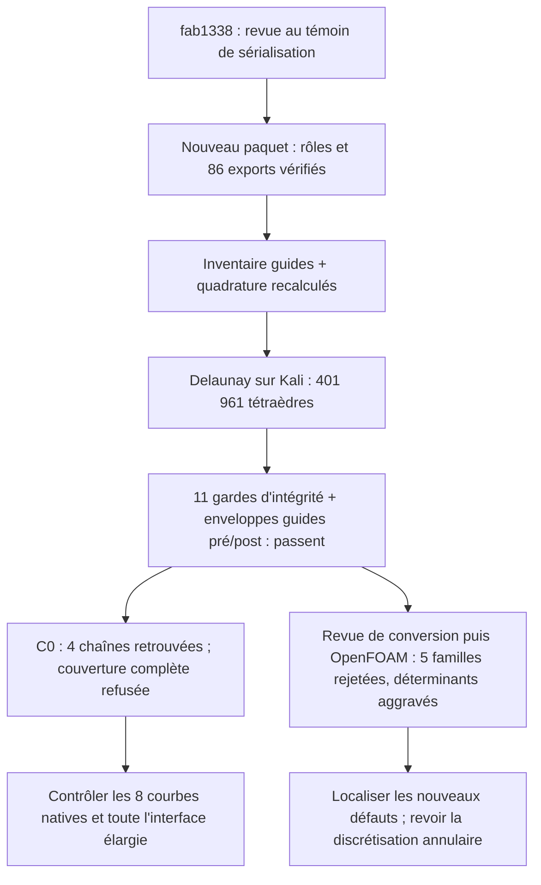

# M64 — maillage du domaine à partition unifiée

## Résultat — volume obtenu, qualité OpenFOAM et couverture C0 refusées

Le domaine gazeux `fab1338a…` dispose d'un **nouveau paquet natif avec
86 faces, 191 arêtes, 118 sommets, une coque et un solide**. Le transfert
des rôles, les exports de faces, l'inventaire des guides et la quadrature
ont été exécutés. **Le nouveau maillage Delaunay contient 401 961
tétraèdres et 186 370 triangles de frontière**, obtenus en 36,113 s.
Ses onze gardes d'intégrité et les enveloppes radiales des guides avant
et après la 3D passent. **OpenFOAM rejette encore cinq familles de qualité**,
contre six auparavant ; le nombre de cellules à faible déterminant
**augmente de 4 579 à 5 442**. Le contre-audit C0 retrouve les quatre
chaînes, mais refuse la couverture de l'interface complète désormais élargie.

Cette étape ne valide ni CFD, ni thermique, ni résistance, ni procédé LPBF.
L'impression, le montage M64 et le fonctionnement à 700 PS biturbo ne sont
pas autorisés ou démontrés. Les données géométriques détaillées restent privées.

## Du candidat contrôlé au paquet de calcul

La [correction native et sa revue indépendante](M64_LOCALISATION_ET_HXT_20260908.md)
expliquent l'unification des anciennes faces 37, 38 et 40 en une seule
face de conduit. Les interfaces de siège, les tronçons C0 et les passages
annulaires n'ont pas été supprimés pour faciliter le calcul.

La revue `7bd9c92d…` compare le candidat au **témoin de sérialisation OCCT**
`cf81801a…`, pas à une identité brute de tous les descripteurs du scan.
Cette distinction reste conservée dans le nouveau manifeste `58b8be5a…`.
La correspondance comprend 85 faces un-à-un et le groupe trois-vers-un ;
ce n'est donc pas une bijection globale entre les anciens et nouveaux indices.

Le [constructeur du paquet](../twins/m64-cylinder-head/source/flowbench-intake/package_unified_gas_domain.py)
lie explicitement domaine, manifeste d'origine, revue et sources par leurs
empreintes. Il exporte et relit les **86 faces natives** : chacune est
reconnue comme une face et passe BRepCheck. Les rôles sont affectés sans
face non appariée ou ambiguë ; les entrées et le domaine maître restent inchangés.

**Réserve sur `native_roundtrip` :** pour le corps de ce paquet, il s'agit
d'une copie bit-identique de `fab1338a…`, puis de sa relecture et de ses
contrôles B-Rep/BOP. Le champ ne constitue pas un nouveau cycle complet
d'écriture puis relecture OCCT du corps. Les exports puis relectures des
faces, en revanche, ont bien été effectués. Aucun export STEP n'est qualifié.

Les contrôles des cols d'admission et de communication des prolongements
de guides sont **hérités via la revue de correspondance des frontières**.
Aucune nouvelle intersection booléenne des cols ou guides n'a été calculée
sur ce paquet. Les joints de tige du banc restent idéalisés ; leur étanchéité
physique n'est pas qualifiée. Les valeurs historiques ne deviennent pas
des mesures nouvelles sur ce candidat.

## Inventaire et référence d'intégration nouveaux

L'inventaire `815716df…` relit les 86 faces, identifie 33 surfaces
cylindriques et les huit portions annulaires guide–tige : nouveaux indices
53–56 et 59–62. Il ne contient **aucun résultat de maillage** : la garde
d'enveloppe de facettes reste à `null` et `mesh_accepted` à `false`.
Cette garde devra être évaluée sur les triangles réellement générés.

La quadrature `1bdb66f6…` a été recalculée sur le domaine exact `fab1338a…` :

| Méthode native | Volume en unités de scan³ |
| --- | ---: |
| Non adaptative | 995 961,70449802 |
| Adaptative, précision demandée 10⁻⁹ | 995 964,5870689296 |

L'estimation de quadrature n'est pas une borne d'erreur démontrée. Ces
volumes ne sont pas des mm³ certifiés : l'échelle du scan reste une hypothèse.
La référence non adaptative servira à comparer l'import Gmsh sur la même
base d'intégration, sans transférer celle d'un ancien candidat.

## Passe exécutée et comparaison descriptive

La passe a utilisé Gmsh 4.15.2, **Delaunay 3D (`Mesh.Algorithm3D = 1`)**,
avec une limite de quatre CPU, 4 Gio et 300 s sur Kali. Le champ local
des guides reste à 0,20 unité de scan. Le champ visant l'ancienne micro-bande
« face 38 » est retiré : cet indice ne représente plus cette partition.
Ce retrait n'est ni un agrandissement du jeu guide–tige ni une relaxation
des critères de qualité. Les choix d'algorithmes sont décrits dans le
[manuel officiel Gmsh](https://gmsh.info/doc/texinfo/gmsh.html).

Le volume `c0cbb257…` est relu depuis MSH 2.2. Les onze gardes ne détectent
ni tétraèdre de volume non positif, ni frontière manquante ou surajoutée,
ni rupture de connectivité ; les groupes et la CAO native sont conservés.
La surface pré-3D `0ab139b2…` contient 93 185 nœuds. Les gardes radiales
des huit portions guide–tige passent sur leurs facettes réelles avant et
après la 3D : ce résultat ne provient pas de l'inventaire sans maillage.

| Diagnostic Gmsh après relecture | Ancien `7fc114c1…` | Nouveau `fab1338a…` |
| --- | ---: | ---: |
| Tétraèdres | 469 985 | 401 961 |
| SICN minimal | 2,5073×10⁻⁷ | 1,29054×10⁻⁵ |
| SICN inférieur à 0,1 | 1 343 | 491 |
| SICN inférieur à 10⁻⁶ | 5 | 0 |

Cette comparaison est **descriptive**, pas une causalité isolée :
l'unification des partitions et la suppression du champ devenu obsolète
« face 38 » constituent deux changements. Le SICN est un diagnostic Gmsh,
pas un substitut aux critères OpenFOAM ou une preuve de précision CFD.

## Contrôle OpenFOAM réellement exécuté

La revue `48c9803b…` autorisait uniquement conversion et diagnostic,
sans solveur. Elle retrouve avant/après 3D les 93 185 nœuds de frontière
et 186 370 triangles orientés avec leurs rôles et 86 faces natives.
Les coordonnées ASCII sont identiques ; 185 881 identifiants de triangles
sont réaffectés sans changement de géométrie ni de connectivité.

Les quatre commandes `gmshToFoam`, `transformPoints`, `createPatch` et
`checkMesh -allTopology -allGeometry` terminent avec le code zéro.
Cependant le journal conclut **`Failed 5 mesh checks`**, sans `Mesh OK` :
le superviseur renvoie donc le code 2. Un succès de processus ne vaut pas
acceptation de qualité. Aucun solveur CFD n'a été lancé.

| Contrôle OpenFOAM | Ancien `7fc114c1…` | Nouveau `fab1338a…` |
| --- | ---: | ---: |
| Rapport d'aspect excessif : cellules ; maximum | 130 ; 23 937,13 | 3 ; 2 011,04 |
| Skewness excessive : faces ; maximum | 73 ; 346,48 | 10 ; 13,1054 |
| Déterminant inférieur à 0,001 : cellules | 4 579 | **5 442 — aggravation** |
| Concavité : cellules | 23 | 0 |
| Poids d'interpolation inférieur à 0,05 : faces | 1 146 | 519 |
| Rapport de volumes inférieur à 0,01 : faces | 540 | 149 |

La concavité passe désormais ; les cinq autres familles restent rejetées.
En outre, 262 008 faces dépassent 70° de non-orthogonalité et cinq arêtes
sont signalées trop courtes : ce sont des avertissements distincts, pas
deux familles supplémentaires dans le compte des cinq échecs.

L'échelle 0,001 est appliquée une seule fois, toujours comme hypothèse.
Les trois frontières comptent 184 917 faces `walls`, 1 191 de sortie et
262 d'entrée. Les fichiers d'origine restent inchangés ; le changement
de type des parois ne change pas la géométrie. L'absence du conteneur
de diagnostic après nettoyage est vérifiée.

## Contre-audit C0 terminé : garde de couverture refusée

Le contrôle indépendant `ec44d805…` termine en **8,312 s, code 2**.
Les cinq ancres sont distinctes et appariées de manière unique avec une
distance mesurée nulle. Les quatre courbes C0 natives 97–100 sont chacune
représentées par une chaîne monotone de respectivement **12, 2, 2 et 2
segments**. Ces contrôles locaux passent séparément.

La conservation pré/post 3D des 93 185 nœuds et 186 370 triangles passe
également ; le contre-audit retrouve ces triangles comme la vraie frontière
orientée vers l'extérieur des tétraèdres, et pas seulement comme des
enregistrements de surface conservés dans le fichier MSH.

**Le résultat global reste refusé.** L'interface des faces 36/37 contient
34 arêtes de maillage, dont seulement 18 couvertes par les quatre chaînes
et 16 autres. Après fusion, l'interface native comporte les courbes 93–100,
au lieu des seules 97–100 de l'ancienne paire de faces. Le prédicat
historique exigeant que les quatre chaînes couvrent toute l'interface
ne correspond donc plus à ce périmètre élargi. Aucun critère n'a été changé
pour convertir ce refus en acceptation.

La prochaine vérification devra décrire et contrôler **les huit courbes
natives et la couverture complète de cette interface**. Les quatre chaînes
retrouvées ne prouvent ni cette couverture, ni la classification native 1D
du maillage, ni la fidélité continue des cordes à la CAO.

Les résultats des anciens maillages ne sont pas attribués à cette passe.
La suite consiste à compléter la preuve de couverture de l'interface,
à localiser les défauts de ce nouveau volume et à tester une
stratégie adaptée aux passages annulaires, **sans déformer la CAO ni élargir
les jeux pour faire passer le contrôle**. La localisation des anciens
défauts ne prouve pas celle des nouveaux ; aucun achat de GPU ne remplace
ce diagnostic. Un volume produit ne suffit pas à autoriser un solveur CFD.

## Traçabilité et ressources

`make check` se termine avec le code **0** : **2 359 tests** dans la suite
principale, dont **108 ignorés**, puis cibles complémentaires terminées.
Journal privé : `f2156040904294f5bac72626be8be00527ed5dd2633d51ea68337de4087e5572`.
Ces tests vérifient les logiciels et contrats ; ils ne renversent aucun refus
du contrôle de maillage ni ne valident physiquement la culasse.

Le [reçu public synthétique](../twins/m64-cylinder-head/evidence/unified-native-mesh-20260908.json)
regroupe les empreintes, mesures, refus et limites de cette passe. Les géométries
et coordonnées détaillées restent dans les traces privées.

Empreintes du paquet préparé : domaine `fab1338a…`, manifeste `58b8be5a…`,
source du constructeur `9bb1486f…`, revue `7bd9c92d…`, inventaire `815716df…`
et quadrature `1bdb66f6…`. Le rapport de passe est `de7094fd…` ; ses
maillages volume et pré-3D sont respectivement `c0cbb257…` et `0ab139b2…`.
La revue de conversion est `48c9803b…`, le reçu OpenFOAM `a466529e…`
et son journal `f3ec17cd…`. Le contre-audit C0 est `ec44d805…`, lié à
la source `d29d5dae…` ; ses 20 tests ciblés passent sans test ignoré.
Ces tests logiciels ne remplacent pas le refus observé sur le maillage réel.

La source réellement exécutée est **`04811670b4e46fbbc4e1268e277db9744ec39cb20846869243d5623bf7164408`**,
gelée dans les traces privées. Après cette passe, une garde de prévol a été
ajoutée contre l'omission de la taille et de la référence des guides ; huit
tests ciblés du profil unifié passent. La passe exécutée fournissait déjà
ces options et a vérifié les facettes. **La source durcie ultérieure ne lui
est pas attribuée rétroactivement.** Le point de départ source reste `e9ac07c`.

Aucune nouvelle dépense Vast pour cette exécution locale x86. Le solde
disponible vérifié est **43,9166429608502 USD**, sous le plafond utilisateur
de **44 USD** ; aucune instance Vast n'est présente au relevé vérifié.
Aucune promesse de maillage accepté ou de culasse imprimable n'est attachée
à ce résultat d'intégrité.
