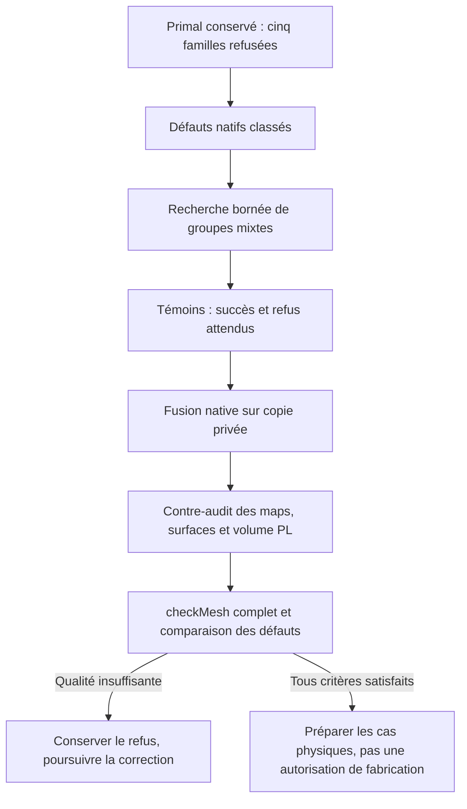

# M64 — correction conservatrice des groupes mixtes

**533 groupes mixtes ont été fusionnés nativement sur copie, dont les
34 antérieurs préservés. Le bilan initial 34 est conservé ci-dessous et
l'extension est documentée en fin de page. Le maillage
reste refusé sur cinq familles de qualité. La conservation géométrique
déclarée passe ; ni la thermique, ni la résistance, ni la fabrication de la
culasse ne sont validées.**

Source unique : le primal issu de la
[contraction locale contrôlée](M64_SHORT_EDGE_CORRECTION_20260909.md),
rapport `3aaf796baaa41664b9926322d7098976cd88ca5876230708dda2c7cf9cc3e8e7`.
Le [dual rejeté](M64_GLOBAL_DUAL_REJECTION_20260909.md) n'est pas repris.
Aucune nouvelle échelle n'est appliquée, aucun contour CAO n'est modifié.

## Localisation effectivement exécutée

Lecture indépendante des six fichiers de maillage et des neuf ensembles
OpenFOAM, avec contrôle de leurs empreintes avant/après. Les ensembles sont
ceux du calcul natif précédent : cette lecture n'est pas un nouveau calcul
de qualité ni une transformation de géométrie.

| Défaut natif | Attribution sur le primal conservé |
|---|---|
| 1 961 cellules à faible déterminant | Toutes tétraédriques ; 396 voisines directes d'hexas ou pyramides |
| 9 cellules à fort allongement | Toutes tétraédriques |
| 1 229 faces à faible poids | 1 228 interfaces tétra/tétra, une hexa/pyramide |
| 135 faces à faible rapport de volumes | Toutes tétra/tétra |
| 3 447 faces non orthogonales | 3 034 tétra/tétra, 390 pyramide/tétra, 23 poly/tétra |
| 18 faces très déformées | Toutes sur `walls`, avec un tétra comme cellule propriétaire |

Les 2 cellules à une seule face interne et les 208 à deux faces internes sont
des tétras sans voisin direct hexa/pyramide. L'ensemble `shortEdges` contient
**quatre identifiants de points**, pas quatre arêtes.

Le domaine contient 785 472 cellules : 717 579 tétras, 67 200 hexas,
384 pyramides et 309 autres polyèdres. La liste privée comprend 5 914 cellules
affectées ou parentes des défauts, dont 1 428 voisinages mixtes. Cette liste
n'autorise aucune fusion par elle-même.

Exécution de classification : 8,690 s de durée, 8,658 s CPU et pic mémoire
1 161 347 072 octets ; six tests ciblés passent. Aucun solveur lancé.
Rapport : `577e46e47d3e7485f41ed452c5a64f1d50d812628c745bb15c96e15aefc20a91`.
Les coordonnées et identifiants détaillés restent privés.

## Extension et contrôles

L'utilitaire précédent traitait uniquement des parents tétraédriques.
L'extension examine des groupes connexes de **deux à huit cellules**, avec
faces parentes triangulaires ou quadrangulaires. Elle ne déplace ni ne supprime
de point, conserve chaque face retenue et les patches, et ne supprime que les
faces internes à une union et les cellules fusionnées.

Deux représentations sont explicitement séparées :

- La prédiction de qualité utilise les centres et volumes de type OpenFOAM :
  centres de faces pondérés par les aires projetées et centres de cellules
  calculés par pyramides.
- La contre-vérification géométrique utilise un éventail de triangles fixé
  sur le premier sommet de chaque face source, avec coordonnées binaires
  converties en rationnels exacts. Elle vérifie la conservation du volume
  de cette représentation et la convexité de chaque union. Une rotation de
  sérialisation ne doit pas changer silencieusement la diagonale d'un quad.

La conservation du volume de cet éventail n'est pas déclarée identique au
volume natif à éventail centré sur la face. Aucune preuve globale d'absence
d'intersection du scan ou de conformité continue à la CAO n'en est déduite.

Les critères de qualité ne sont pas abaissés : déterminant ≥ 0,001,
allongement ≤ 1 000, poids ≥ 0,05, rapport de volumes ≥ 0,01, skewness ≤ 4.
La non-orthogonalité au-delà de 70° ne doit pas empirer. Le test natif de
concavité reste applicable, y compris aux faces conservées coplanaires.
Les faces voisines sont recalculées après choix conjoint des groupes.

## Place de la stack photographiée

Les sources officielles revérifiées confirment les rôles, pas un couplage
automatique : [Elmer](https://github.com/ElmerCSC/elmerfem) peut calculer la
thermique et la mécanique ; [PhysicsNeMo](https://developer.nvidia.com/physicsnemo)
permet de construire et d'évaluer des modèles IA physiques.
[Ditto](https://eclipse.dev/ditto/intro-overview.html) représente l'état d'un
équipement et [Mosquitto](https://mosquitto.org/) transporte les messages MQTT.
Ces deux derniers services ne remplacent pas les solveurs et ne produisent
pas de mesures de banc absentes. Le
[plan multiphysique et son diagramme](M64_MULTIPHYSICS_EXECUTION.md#précision-du-9-septembre--calcul-ia-et-banc-séparés)
reste la référence : aucun service de télémétrie ni modèle IA supplémentaire
n'est présenté comme exécuté par ce pilote.

La stratégie de tests sépare témoins purs, témoins natifs, vérification du
maillage réel et qualification physique. Aucune nouvelle dépense Vast pour
ce lot, exécuté sur la machine Kali existante.

## Essai natif effectivement exécuté

La recherche s'arrête au plafond de 40 000 évaluations, après 759 des 13 782
faces de départ, en 8,960 s : elle n'est pas exhaustive. Sur 38 groupes
admissibles individuellement, 34 groupes disjoints sont retenus :
22 unions pyramide/tétra et 12 unions pyramide/trois tétras. Les 238 faces
externes des groupes sont recontrôlées conjointement.

Le programme C++ est compilé dans l'image OpenFOAM 14 `linux/amd64` figée.
Le témoin pyramide/tétra passe l'audit, avec volume PL exact `5/3`, six points
et sept faces conservés. Les quatre refus attendus sont observés : sélection
de frontière, face interne cyclique omise, point orphelin et neuf parents.
Chaque refus laisse le petit maillage intact et n'écrit aucune map.

Sur le domaine réel, les 92 parents deviennent 34 cellules ; 82 faces
strictement internes sont supprimées. Résultat : **785 414 cellules,
1 688 340 faces, 223 154 points**. La contre-vérification confirme les quatre
maps, tous les points bit à bit, toutes les faces orientées retenues et leurs
patches, et la conservation du volume PL par partition. Les 34 quads externes
des groupes ne sont pas exactement plans, mais leur éventail déclaré passe
la convexité ; cela n'est pas une certification physique du scan.

| Contrôle natif | Avant | Après |
|---|---:|---:|
| Cellules à faible déterminant | 1 961 | 1 955 |
| Faces non orthogonales > 70° | 3 447 | 3 411 |
| Faces à faible poids | 1 229 | 1 229 |
| Faces à faible rapport de volumes | 135 | 135 |
| Faces très déformées | 18 | 18 |
| Cellules à fort allongement | 9 | 9 |
| Familles de contrôles refusées | 5 | 5 |

Ces valeurs proviennent du journal `checkMesh`, pas du prédicteur. Celui-ci
annonçait seulement 24 faces non orthogonales supprimées. La comparaison
indépendante des ensembles explique les 36 de moins : **24 faces internes
supprimées et 12 faces conservées désormais sous le seuil**. Les six défauts
de déterminant disparaissent dans six unions ; ce ne sont pas six cellules
inchangées réparées. Aucun nouvel identifiant défectueux après correspondance
n'est observé dans les neuf ensembles, ni nouvelle famille de contrôle refusée.
Cette non-régression locale n'est pas une acceptation globale du maillage.

### Incident de collecte, distinct du calcul

Compilation, lot des cinq témoins, fusion, audit et `checkMesh` terminent
avec code zéro ; les quatre cas négatifs sortent comme prévu avec code un.
Le travailleur échoue ensuite en classant l'annonce
`cells with two non-boundary faces` comme un ensemble de faces. Ce défaut
de lecteur interrompt la collecte, **pas le contrôle natif déjà terminé**.
Le reçu initial reste inchangé et conserve son statut incomplet ; il ne doit
pas être réécrit en succès. La reprise se limite à relire les fichiers
existants, sans nouveau calcul ni modification du maillage.

Cette récupération est effectivement exécutée en 4,032 s, avec contrôle des
empreintes avant/après : source, manifeste, six fichiers géométriques, quatre
maps, cinq journaux, audit et témoins. Le premier nom d'entité dans l'annonce
détermine la classe attendue ; l'en-tête, le nombre, l'unicité et la plage des
identifiants de chaque fichier sont ensuite vérifiés. Les neuf ensembles
sont présents et cohérents. Le rapport de récupération séparé conserve
`process_completed=false` pour le travailleur initial et déclare explicitement
`native_executed=false` pour cette relecture.

Le contre-calcul séparé s'exécute ensuite en 2,199 s. Il reconstitue les
correspondances entre cellules parentes et unions, faces et points, vérifie
les fichiers réellement écrits et les annonces natives. Résultat : zéro
nouveau défaut dans les neuf ensembles, aucun ensemble non résolu et les
mêmes cinq familles refusées. Les deux relectures ont une supervision murale
de 60 s ; aucune relance OpenFOAM n'est effectuée.

Les **95 tests purs ciblés** passent : classification 6, sélection 10,
producteur/travailleur 29, audit 15, nettoyage 5, récupération 15 et
comparaison 15. Ils s'ajoutent au lot de cinq témoins natifs et au contrôle
du domaine réel ; aucun ne constitue un essai moteur. `make check` passe,
avec les vérifications natives optionnelles absentes signalées comme ignorées.

Le conteneur privé est supprimé et son absence est revérifiée indépendamment.
Durée totale avec nettoyage : 32,298 s ; aucune limite mémoire/temps atteinte.
Limites imposées : quatre CPU, 4 Gio, 220 s pour le travailleur et 300 s au
total. Une alerte de compilation de comparaison signé/non signé est conservée
dans le journal ; aucune erreur de compilation.

Reçus initiaux conservés :

- Paquet : `d5100738ff52c136a4a755861536ba98b11fda6342d192c9105956beffb4ee70`.
- Travailleur : `c9080392eb2a03361317db3084e398bfe7ffe8acd8ffe3cc7d2c6b41bf43a8ad`.
- Supervision : `0a280fd48eec692fad7f65080b0f81ff486f88d2c9c1ab46dfd3efd4d191f46d`.
- Audit des unions : `6ad743a2a6b35f486a027e37621944547082a18d9c9dd1e7d703f90c2a65bd34`.
- Journal `checkMesh` : `2052fa445aab3713a0a040d1394f77607908ae662fd2d76c2332df145ca16ac5`.

Reçus complémentaires, sans réécriture des précédents :

- Récupération : `d317023924d85bef240bd2169a5d02760d060626c7a59cce99bd515834b199a7`.
- Code de récupération : `c42d70200961174f769658d895354c9b554ce82c25a1eee2d585283f43ef8e56`.
- Comparaison indépendante : `f4151214d8e530009f94821560a5f8b5cb1a4c38414b22c3d2291cfaf3cbb2c9`.
- Code de comparaison : `b94f4f3f3dac8d6b1ab2a1f078d210c039282a882002cc78274f1774dc39fd03`.

Les empreintes ne constituent pas une preuve de qualité par elles-mêmes :
elles identifient les fichiers lus, les tests exécutés et les refus conservés.

## Extension : 533 groupes, contre-vérifiés le 12 septembre

Le lot natif du 9 septembre est repris par ses fichiers sauvegardés ; aucun
nouveau calcul OpenFOAM n'est nécessaire pour cette publication. La recherche
pure examine les 13 462 paires restantes et engage 12 523 recherches à largeur
limitée : 572 013 évaluations en 50,743 s, pic mémoire environ 1,27 Go.
Les 957 groupes individuellement admissibles donnent 533 groupes disjoints
retenus : **34 inchangés et 499 nouveaux**, 1 330 cellules parentes et 990
faces internes à retirer. Les 3 292 faces externes sont contrôlées conjointement.
Toutes les graines sont visitées, mais la recherche reste **non exhaustive**
(largeur trois, quatre extensions, huit parents maximum, sélection gloutonne).

Compilation, témoins, fusion native, audit indépendant et `checkMesh`
terminent avec code zéro en 31,842 s sur Kali, sous plafonds quatre CPU/4 Gio.
Le défaut de classification du premier nom d'entité est corrigé dans une copie
du travailleur ; les reçus de l'ancien échec ne sont pas réécrits. Les entrées
sont conservées, le conteneur supprimé et son absence revérifiée le 12 septembre.
Résultat : **784 675 cellules, 1 687 432 faces, 223 154 points**.

| Ensemble natif | Lot 34 | Lot 533 |
|---|---:|---:|
| Faible déterminant | 1 955 | 1 886 |
| Non-orthogonalité > 70° | 3 411 | 2 910 |
| Faible poids | 1 229 | 1 223 |
| Faible rapport de volumes | 135 | 134 |
| Fort allongement | 9 | 9 |
| Skewness | 18 | 18 |
| `shortEdges` : points signalés | 4 | 4 |
| Une face interne | 2 | 2 |
| Deux faces internes | 208 | 207 |

La contre-lecture du 12 septembre dure 4,075 s (4,360 s avec supervision),
sous plafond 60 s. Elle compare les fichiers exportés au **lot 34**, avec
correspondances composées via le primal commun et tous les parents, pas
seulement les représentants. Les 34 composantes restent identiques ; les
499 ajouts sont disjoints. Aucun nouvel identifiant défectueux, ensemble
inconnu ou nouvelle famille refusée n'est observé.

Les 501 défauts de non-orthogonalité en moins comprennent 175 faces supprimées
et 326 faces conservées désormais sous le seuil. La baisse de 69 faibles
déterminants comprend deux coalescences d'images et 67 images désormais non
signalées : **pas 69 cellules inchangées réparées**. Les pires extrema restent
insuffisants, et la moyenne du rapport de volumes baisse légèrement. Cette
non-régression des ensembles n'affirme donc pas une amélioration de tout scalaire.
Les cinq familles restent en échec : ni CFD, ni thermique/résistance, ni
fabrication ne sont autorisées par ce lot. Aucune dépense Vast pour ces essais.

Identités des preuves privées, sans coordonnées ni identifiants géométriques :

- Sélection pure : `b7d263f3f2c1c243b939caca04ca21ffcc84453ea01eb58d0cb6f8fc8b1f90cc`.
- Manifeste natif : `c8215d4dc88aad6513f2685908e90425dd7bbc92ce0b2996d173d0412c0af421`.
- Rapport natif : `8b5b48f416a96fe054304fe11e0d94b7b978a54d4d66bb682158571dd0d17998`.
- Audit des unions : `ed53bc2348df6ff4887acd92a2e9322326eb55d32b400dfc49b7f0230913b157`.
- `checkMesh` : `5782126619c81596d508b5c2d0b12e2faacb0a67ad88ae0bd7dcedfabf5040cb`.
- Comparaison indépendante : `9fd4feb771388affbe8759f6f4f770163014153b8a606edc3456a58e64add614`.

Le [mode batch](M64_LOW_TOKEN_CAMPAIGN_20260912.md) réutilise ces reçus épinglés
et s'arrête automatiquement sur le refus qualité, sans relancer ce lot.
