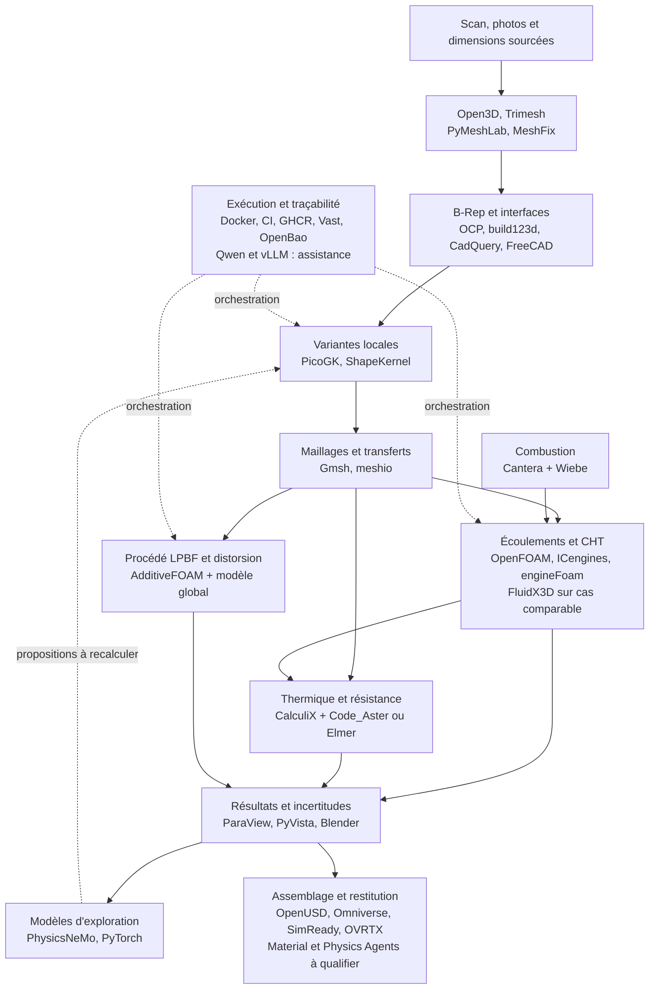
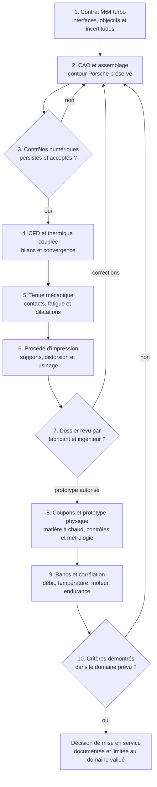

# M64 — périmètre de simulation multiphysique

État détaillé du dernier lot : [PicoGK et Vast](M64_PICOGK_EXECUTION.md).
Reprise du 8 septembre : [chambre candidate, assemblage et préparation du
banc d'admission](M64_ADMISSION_CHAMBRE_20260908.md), avec
[comparaison PicoGK locale](M64_PICOGK_LOCAL_JUNCTION_WITNESS_20260908.md).
Dimensionnement cible : [M64 biturbo 700 PS](M64_700CH_ENGINE_RESEARCH.md).
Campagne parallèle : [matériaux, refroidissement et LPBF](M64_700CH_MATERIAL_COOLING_LPBF.md).
Les cartes Mermaid et l'inventaire ci-dessous couvrent la pile demandée ;
ils ne déclarent pas toute la chaîne exécutée sur le corps actuel.

## Décision utilisateur

Base M64 964/993, objectif turbo, quatre soupapes par cylindre et comparaison
deux soupapes. La cible de calcul est 700 ch métriques au vilebrequin ; elle
n'est pas une puissance obtenue. La variante précise reste ouverte. Conserver la silhouette
Porsche issue des références pertinentes : aucune enveloppe ovale de substitution.
Les anciens modèles 917/935 ne sont pas des interfaces M64 validées.

## Ordre d'exécution et preuves attendues

1. **Interfaces** : établir un tableau sourcé des goujons, registres de cylindre,
   plans de joint, distribution, admission/échappement et lubrification. Séparer
   cotes publiées, déductions et inconnues ; conserver variantes et tolérances.
2. **CAO d'assemblage** : reconstruire les surfaces fonctionnelles, sièges,
   guides, distribution, fixations et surépaisseurs d'usinage. Corriger les
   défauts de parois et de maillage. Vérifier les jeux à froid avant simulation.
3. **Charges turbo** : définir régime, charge, carburant, suralimentation,
   pression cylindre et états thermiques comme scénarios traçables. Employer
   Cantera pour les études thermochimiques appropriées ; aucun mécanisme ni
   résultat zéro dimension ne constitue une validation CFD tridimensionnelle.
4. **Thermique complète** : CFD/CHT OpenFOAM sur gaz, solide et air de
   refroidissement ; comparer air seul et assistance huile. Inclure pertes de
   charge et puissance auxiliaire. Contrôler conservation d'énergie, convergence
   temporelle et spatiale sur trois niveaux, puis contre-calcul indépendant.
5. **Résistance complète** : éléments finis avec propriétés à chaud, pression
   cylindre, précharges, contacts siège/guide et champs thermiques transférés.
   Évaluer déplacements, étanchéité, plastification et fatigue thermomécanique
   selon les données disponibles. Contrôler convergence et équilibre des efforts.
6. **Distribution** : jeux piston/soupapes et soupapes/soupapes sur le cycle,
   dilatation, ressorts, contacts et dynamique selon loi de came documentée.
   Une animation prescrite n'établit ni absence d'affolement ni durée de vie.
7. **Fabrication LPBF** : matériau-machine-recette identifiés, orientation,
   supports accessibles, dépoudrage, surépaisseurs, distorsions, traitement
   thermique et usinage. AdditiveFOAM local ne remplace pas un calcul complet
   de déformation de construction ; corriger les échecs numériques existants.
8. **Omniverse** : inspecter l'assemblage, les mouvements et les interférences ;
   afficher les champs calculés avec unités, légendes, cas et provenance.
   Distinguer résultats importés, animation et dynamique réellement résolue.

## Contrôle initial du 6 septembre 2026, avant les tentatives Vast

- Kali 192.168.2.3 répond en SSH ; architecture x86_64 et Docker accessibles.
- Le prévol local du skill `omniverse-cad-to-simready` a échoué : OpenUSD et
  Asset Validator absents du runtime interrogé, checkouts requis absents et
  services OVRTX/Material/Physics non prêts. Aucun calcul Omniverse exécuté.
- Rapport local : `/private/tmp/m64-omniverse-preflight-20260906/report.json`.
- Aucune location Vast effectuée lors de ce contrôle initial. Deux tentatives
  ultérieures et leur suppression sont consignées dans
  `M64_VAST_EXECUTION_20260906.md` ; aucune instance ne reste active après celles-ci.
- Le workflow du skill est arrêté au prévol ; ce blocage logiciel ne suspend
  pas la recherche documentaire des interfaces M64.

## Critère de livraison

Publier les preuves et les échecs pour chaque cas, sans transférer les anciens
résultats 917 à M64. La comparaison deux/quatre soupapes utilise les mêmes
conditions imposées et tient compte des incertitudes. Aucun résultat virtuel
ne remplace la qualification matière/procédé, l'inspection de la pièce et la
corrélation au banc ; aucune autorisation de fabrication moteur n'est acquise.

## Intégration de la pile demandée dans les photos

Les logiciels ne sont pas interchangeables ni tous des solveurs. La sélection
suivante définit leur rôle, pas une déclaration d'installation ou de réussite.

| Fonction | Briques demandées et rôle |
| --- | --- |
| Interfaces exactes et CAO | OCCT/OCP avec build123d, CadQuery ou FreeCAD ; conserver un maître fonctionnel éditable |
| Géométrie de refroidissement | PicoGK/ShapeKernel ; HelixHeatX comme exemple de construction, pas modèle thermique de culasse |
| Scan et maillage | Open3D/Trimesh/PyMeshLab/MeshFix selon défaut, Gmsh/meshio ; chaque réparation comparée à la source |
| Gaz moteur et chaleur | OpenFOAM/ICengines et Cantera ; loi Wiebe explicitement distincte d'une combustion CFD résolue |
| Contre-calcul | FluidX3D seulement sur un problème physique effectivement couvert et comparable ; licence d'usage à vérifier avant usage commercial |
| Thermomécanique | CalculiX ; Code_Aster ou Elmer comme candidat indépendant selon contacts et lois matière nécessaires |
| Fabrication | AdditiveFOAM pour le procédé local, complété par un modèle de distorsion de construction entière |
| Inspection et rendu | OpenUSD, Omniverse/SimReady/OVRTX, ParaView/PyVista/Blender ; aucun rendu n'est une preuve de résistance |
| Modèles réduits | PhysicsNeMo/PyTorch après obtention d'un jeu de calculs éligibles ; Qwen/vLLM n'est pas un solveur ni une autorité de validation |
| Exécution | Docker/CI/GHCR, Kali et Vast via le wrapper OpenBao autorisé |

Avancement de cette reprise : voir `M64_INTERFACE_SOURCE_REGISTER.md`,
`M64_LEAP71_STACK.md`, `M64_CHT_RUNTIME_SMOKE.md` et
`M64_VAST_EXECUTION_20260906.md`. Les preuves de l'ancien projet 917 restent
historiques ; elles ne sont pas renommées en preuves M64.

Vérifications de cette reprise : `make check` complet réussi, puis sept tests
ciblés du contrat M64 réussis après ajout des pistes du manuel. Le test natif
PicoGK linux/amd64 a été répété indépendamment sur Kali. Ces contrôles de
logiciel et de dossier ne constituent pas une validation de la pièce.

## Carte de la chaîne cible

Ce schéma décrit le travail à couvrir, **pas une chaîne entièrement exécutée
sur la culasse actuelle**. Les flèches transportent des géométries, conditions
limites ou résultats identifiés par leur empreinte. Les bibliothèques CAO qui
partagent Open CASCADE ne constituent pas des contre-calculs indépendants.

[Source Mermaid](../diagrams/m64-stack.mmd) ·
[SVG](../diagrams/m64-stack.svg) · [PNG](../diagrams/m64-stack.png) ·
[Scène éditable](../diagrams/m64-stack.excalidraw).

### Inventaire des preuves au 7 septembre 2026

Lecture du code, des contrats et des reçus conservés, sans nouvelle installation.
« Intégré » ne veut pas dire « exécuté », et une exécution ne vaut pas validation.
La géométrie actuelle est celle liée au STL `e006e148…` dans le
[reçu PicoGK](../twins/m64-cylinder-head/evidence/picogk-roundtrips-20260907.json).

| Briques | État constaté et preuve | Prochaine utilisation vérifiable |
|---|---|---|
| build123d, Open CASCADE/OCP, CadQuery, FreeCAD | OCP exécuté sur le maître actuel ; autres constructeurs ou dépendances présents, sans preuve récente d'utilisation de chacun sur ce corps. [Audit CAO](M64_FOUR_SEAT_BODY_CAD_AUDIT.md). | Achever les fonctions et l'assemblage ; contrôler le STEP éditable et les reprises d'usinage. |
| Open3D, Trimesh, PyMeshLab, MeshFix | Trimesh utilisé sur les sorties actuelles ; autres réparateurs disponibles ou utilisés historiquement. [Audit des domaines](../twins/m64-cylinder-head/evidence/picogk-cooling-domain-mesh-audit-20260907.json). | Employer chaque réparation seulement sur un défaut identifié ; conserver le brut et les écarts. |
| PicoGK, ShapeKernel, HelixHeatX | Trois résolutions auditées, défauts conservés et connectivité grossière exécutée ; HelixHeatX reste un exemple, pas un échangeur greffé. [Exécution réelle](M64_PICOGK_EXECUTION.md). | Traiter les micro-coques avec preuve de leur origine, affiner les fonctions des vides et générer uniquement les variantes locales admissibles. |
| Gmsh, meshio | Générateurs/conversions intégrés ; deux maillages solides audités mais non qualifiés pour la CAE actuelle. [Audit solide](M64_SOLID_MESH_AUDIT_20260907.md). | Mailler le bon SHA avec régions et groupes physiques, puis vérifier qualité et convergence. |
| OpenFOAM, AATE/ICengines, engineFoam | Exécutions OpenFOAM historiques, utilitaires AATE testés ; aucun cycle complet attesté sur ce corps. [F49](917_F49_CFD_CHT.md), [F37](917_F37_ICE_ENGINE_FOAM.md). | Fixer version, exécutable réellement disponible et cas moteur mobile ; ne pas créer un alias prétendant être un solveur absent. |
| Cantera et modèle Wiebe | Cas zéro dimension historiques, pas combustion 3D de la géométrie actuelle. [Autorité des modèles](../twins/reference-917-engine/engine-solver-authority-f46.json). | Scénarios turbo/carburant/lois de levée documentés ; comparer les modèles et transmettre les charges avec leur incertitude. |
| FluidX3D | LBM déjà exécutée sur F36, pas sur ce corps ; désaccords anciens non résolus. [Contre-calcul historique](../twins/reference-917-engine/evidence/f36-final-cfd-thermal/cross-solver-report.json). | Cas d'écoulement comparable, avec domaine de validité et licence compatibles. |
| CalculiX ; Code_Aster ou Elmer | CalculiX exécuté sur d'anciens modèles ; aucune exécution Code_Aster/Elmer retrouvée. | Choisir et qualifier le second solveur sur témoins, puis comparer contacts, transferts thermiques et contraintes du même cas. |
| AdditiveFOAM et distorsion globale | Coupon F58, témoin laser nul et trois pas temporels exécutés ; le cas actif reste plafonné. Ce n'est pas une impression de culasse. [Derniers contrôles](M64_700CH_MATERIAL_COOLING_LPBF.md). | Corriger le plafonnement artificiel, qualifier la recette, puis calculer supports, distorsion, retrait du plateau et usinage. |
| OpenUSD, Omniverse/SimReady, OVRTX, Material/Physics Agents | Conversion du module V2 de 12 composants réussie, **sans corps** ; Material a échoué, suite physique non exécutée. [État NVIDIA](M64_AVANCEMENT_20260907.md). | Assembler corps et distribution ; résoudre les échecs de services, vérifier unités/instances et superposer les vrais champs CAE. |
| PhysicsNeMo, PyTorch, Qwen, vLLM | Runtimes préparés/testés, pas de modèle de culasse entraîné et évalué. [Contrat IA](../twins/reference-917-engine/physicsnemo-readiness-f52.json). | Constituer des cas admissibles ; séparer apprentissage/test, mesurer l'erreur et recalculer les variantes retenues. Qwen/vLLM assistent, sans autorité de validation. |
| ParaView, PyVista, Blender | Rendus et coupes PyVista/VTK actuels ; code Blender et exports ParaView présents, sans reçu récent pour chaque application. | Montrer mêmes unités, géométrie, cas et échelles de couleur ; conserver des vues de coupe et animations explicitement étiquetées. |
| Docker, CI, GHCR, Vast, OpenBao | Image Python/PicoGK publiée, calculs réels collectés ; location de reprise arrêtée et absence vérifiée. [Dernier reçu](../twins/m64-cylinder-head/evidence/picogk-roundtrip-checkpoint-audit-20260907.json). | Un job borné par reçu, digest, budget et garde d'arrêt ; jamais de secret ni de scan propriétaire dans l'image publique. |

Tous les noms de la photo sont suivis. Faire fonctionner plusieurs interfaces
du même noyau ou plusieurs réparateurs sans besoin identifié ne crée pas une
preuve supplémentaire de qualité de pièce. Les logiciels alternatifs sont
qualifiés par un cas témoin avant de choisir le rôle de production ou de
contre-calcul. Une exclusion doit être motivée dans le dossier, pas cachée.

### Trois limites techniques à respecter

- **FluidX3D** : la documentation amont limite le modèle à `Mach < 0,3` et
  n'offre pas de réactions chimiques. Le contre-calcul visé porte donc sur un
  écoulement couvert, pas une seconde combustion turbo complète. L'usage
  commercial est interdit par la licence publique actuelle ; il ne sera pas
  engagé dans ce cadre sans droits adaptés.
  [Documentation et licence amont](https://github.com/ProjectPhysX/FluidX3D).
- **PhysicsNeMo** : framework de modèles physiques à construire/adapter et
  évaluer, pas modèle spécialisé qui déduit une culasse fonctionnelle de
  photos. Le choix de modèles reste conditionné aux données et aux équations
  du cas. [Documentation NVIDIA](https://docs.nvidia.com/physicsnemo/latest/overview.html).
- **Omniverse et AdditiveFOAM** : l'assemblage et les champs restitués ne
  remplacent pas la résistance/fatigue ; un calcul local de procédé ne ferme
  pas à lui seul la distorsion de construction, la matière ni l'inspection.
  [AdditiveFOAM, source ORNL](https://github.com/ORNL/AdditiveFOAM).

## Parcours de validation et boucles de correction

Les seuils d'acceptation doivent être fixés **avant** la comparaison. Même
géométrie d'interface, mêmes scénarios et unités, mêmes conditions limites,
bilan énergétique/efforts et incertitudes suivies pour les deux solveurs et
les versions deux/quatre soupapes. Un accord de deux codes ne constitue pas
une corrélation physique si les mêmes données erronées les alimentent.

[Source Mermaid](../diagrams/m64-validation.mmd) ·
[SVG](../diagrams/m64-validation.svg) · [PNG](../diagrams/m64-validation.png) ·
[Scène éditable](../diagrams/m64-validation.excalidraw).

Le scan demeure la référence disponible : les cotes absentes ne deviennent
pas mesurées par multiplication des photos ou des simulations. On peut
poursuivre une conception sous hypothèses et étudier leur sensibilité ; une
interface critique non démontrée reste explicitement non certifiée. Les
coupons, le prototype et les bancs de la carte sont des étapes physiques à
réaliser, pas des événements prétendument simulés avec succès.

Avant de modifier le refroidissement : protéger les interfaces, séparer air
extérieur et passages internes, puis comparer air seul et éventuelle assistance
huile avec un budget de débit, pression, chaleur et puissance auxiliaire.
Le bénéfice doit dépasser les incertitudes et rester compatible avec fatigue,
nettoyage, dépoudrage et usinage. La forme extérieure Porsche n'est pas une
variable libre.

## Registre à conserver pour chaque exécution

Chaque cas publie le rôle du logiciel, version/commit, digest d'image, empreinte
de géométrie, unités et repère, paramètres et leur provenance, matériau et
conditions limites, maillage, solveur, critères fixés, résultats, convergence,
échec éventuel, durée/coût et décision. Les gros fichiers ou sources non
redistribuables restent privés et sont liés par leur empreinte.

Les statuts doivent rester distincts :
`planned`, `integrated`, `executed`, `numerically_verified`,
`physically_correlated`, `manufacturing_authorized`.
Un statut tardif ne découle jamais automatiquement du précédent.
Les diagrammes décrivent l'architecture et les décisions ; les reçus datés
restent l'autorité sur ce qui a réellement été exécuté.
