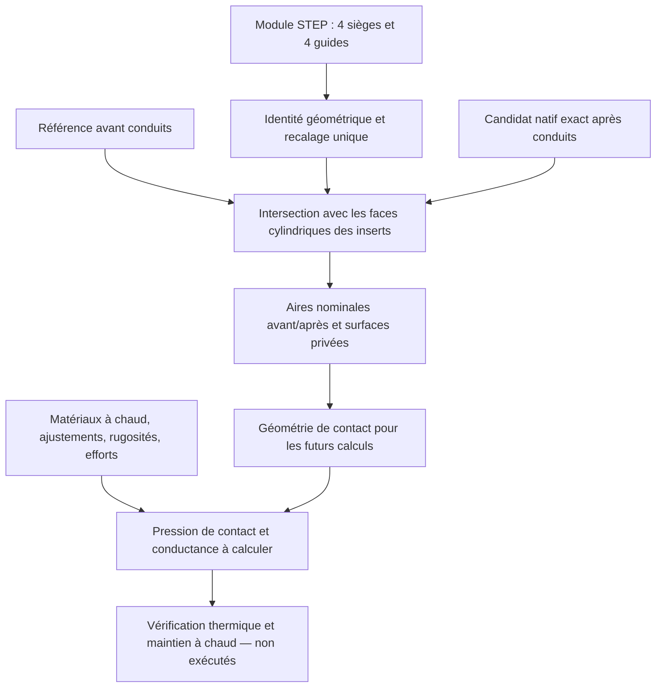

# M64 — surfaces lisses, contacts d'inserts et maillage natif

Ce lot poursuit l'[essai de conduits 05](M64_PORTS_AND_CONTINUOUS_MOTION_20260907.md).
Les résultats sont attachés à une géométrie exacte par empreinte, jamais
transférés automatiquement à une nouvelle version de la pièce. Le maître
reste privé et inchangé ; l'échelle et les interfaces M64 ne sont pas certifiées.

## Contacts nominaux réellement calculés sur l'essai 05

Le [reçu des contacts](../twins/m64-cylinder-head/evidence/insert-OD-contacts-trial05-20260907.json)
concerne le B-Rep natif `3e3cc163…`, pas son STEP non qualifié. Les huit inserts
du module STEP sont identifiés par correspondance géométrique unique, puis
recalés une seule fois. Leur intersection volumique avec le corps, **avant et
après découpe**, est nulle dans les booléens exécutés. Le second contrôle a été
ajouté après revue indépendante puis le calcul réel a été relancé : 21,54 s,
entrées inchangées et mêmes fractions d'aire.

L'intersection entre la face cylindrique extérieure de chaque insert et le
corps donne les surfaces nominales suivantes, après création des conduits :

| Insert | Fraction de la surface cylindrique nominale en contact |
|---|---:|
| Quatre sièges | 100 % chacun |
| Deux guides d'admission | 65,714 % chacun |
| Guide d'échappement 1 | 67,612 % |
| Guide d'échappement 2 | 67,592 % |

La référence non percée de conduits couvre 100 % de ces huit faces. La
diminution sur les guides provient donc de l'ouverture des passages de gaz.
Le pourcentage décrit une aire ; il ne garantit pas une longueur de portée
uniforme sur tout le pourtour. Une surface de contact n'établit **ni serrage,
ni pression de contact, ni conductance thermique, ni tenue à chaud**.
Le jeu/interférence d'assemblage, la dilatation, les propriétés des matériaux,
les rugosités et les efforts restent à définir et à calculer.

Les épaulements, faces intérieures et bandes d'étanchéité soupape/siège sont
explicitement exclus de ce calcul. Les surfaces natives de contact et leurs
empreintes sont conservées dans le dossier privé. Les deux quadratures
adaptatives demandent ε = 10⁻⁹ et 10⁻¹¹ ; leurs estimateurs ne sont pas des
bornes mathématiques rigoureuses.

La coïncidence reste celle du noyau OCCT, à ses tolérances natives : jusqu'à
10⁻⁷ unité sur la référence et les inserts ; sur le candidat, jusqu'à
5 × 10⁻⁶ sur les arêtes, 5,100001 × 10⁻⁶ sur les sommets et 10⁻⁷ sur les faces.
Le paramètre booléen de tolérance additionnelle reste nul. Un témoin montre
qu'un jeu radial réel de 5 × 10⁻⁸ unité peut encore être classé en coïncidence,
alors qu'un jeu de 10⁻⁶ ne l'est plus. Ce n'est donc **pas une preuve de jeu nul**.
Le contrôle de pénétration volumique est un écran numérique au seuil absolu
10⁻⁷ unité³, pas une borne certifiée sur une interférence physique.

Les [témoins logiciels](../tests/test_m64_insert_contacts.py) couvrent un contact
complet, un guide exposé sur la moitié de sa longueur, un jeu radial positif,
le rejet d'une mauvaise face cylindrique, d'un insert enfoui dans un bloc
sans alésage et d'un gain de contact présenté à tort comme un enlèvement de
matière. Un cinquième test documente le cas du jeu inférieur à la tolérance. Le
[script](../twins/m64-cylinder-head/source/audit_insert_contact_surfaces.py)
ne modifie aucune géométrie d'entrée.

## Limite du lot

Ces surfaces préparent les [entrées CHT](M64_CHT_HEAD_INPUT_AUDIT.md). Elles ne
constituent pas encore une partition complète gaz/solide/air/huile, ni des
conditions aux limites physiques. Une face non identifiée ne devient pas
adiabatique par défaut. Aucun résultat de température, résistance, fatigue,
puissance moteur ou simulation LPBF de la culasse n'est déduit de ces contacts.

## Troncs C1 bornés, construits et réimportés

L'essai 05 utilisait un tronc réglé, seulement C0 entre sections. Le nouveau
[générateur C1](../twins/m64-cylinder-head/source/build_bounded_c1_trunk.py)
conserve toutes les sections circulaires, sans loft global ni ajustement d'un
nuage rééchantillonné. Les pentes d'une interpolation Hermite cubique locale
sont limitées conjointement sur les centres, rayons et limites `centre ± rayon`.
Les contrôles de Bernstein restent dans les bornes des stations voisines.
Le calcul rationnel exact vérifie cette propriété, puis contrôle séparément
les pôles flottants réellement transmis au noyau CAO.

Cette construction donne quatre faces rationnelles par tronc, avec une base
B-spline axiale C1. Les sections sont conservées à la précision numérique ;
elle ne prétend pas reconstruire les surfaces intérieures Porsche mesurées.
Les tangentes communes ne garantissent pas C2 et la fusion ultérieure avec les
branches des soupapes ne devient pas automatiquement C1.

Les [deux troncs exécutés](../twins/m64-cylinder-head/evidence/bounded-C1-trunks-20260907.json)
ont chacun un solide valide, zéro défaut BOP signalé avant/après réimport
B-Rep et après réimport STEP, sans modifier les réglages du traducteur ou
les tolérances natives. Le dépassement global calculé sur les pôles stockés
est nul pour ces deux objets. Le contrôle de volume utilise l'intégrale
polynomiale du rayon au carré, multipliée par π, comparée à une intégration
native adaptative : écart relatif 3,16 × 10⁻¹⁰ à l'admission et 2,39 × 10⁻¹²
à l'échappement. Ces contrôles concernent les troncs seuls, pas toute la culasse.

Les formules de pentes de départ suivent la méthode décrite dans la
[documentation primaire PCHIP de SciPy](https://docs.scipy.org/doc/scipy/reference/generated/scipy.interpolate.PchipInterpolator.html).
La limitation conjointe et la conversion exacte sont vérifiées par le code
du projet ; la documentation SciPy ne certifie pas ces développements locaux.

Onze [tests dédiés](../tests/test_bounded_c1_trunk.py) couvrent les stations,
bords et dérivées, la conversion exacte, les entrées refusées et les vrais
solides natifs dans les deux sens axiaux. La
[revue indépendante](../twins/m64-cylinder-head/evidence/bounded-C1-independent-checks-20260907.json)
ajoute 286 contrôles rationnels sur huit modèles synthétiques, 16 mutations
invalides rejetées et deux relectures des pôles natifs après couture. Elle
ne requalifie ni les raccords aux branches ni l'essai intégré rejeté. Le sélecteur
`--trunk-interpolation bounded-c1` est ajouté au générateur de conduits,
avec empreinte du nouveau code dans les entrées. Les modes historiques restent
disponibles pour reproduire les essais rejetés ; ils ne sont pas remplacés.

### Essai complet 06 : candidat non retenu

Le [nouvel essai intégré](../twins/m64-cylinder-head/evidence/scan-seeded-ports-trial-06-bounded-C1-20260907.json)
a réellement reconstruit les deux banques et découpé le corps en 380,55 s.
Les noyaux gaz natifs sont chacun monoblocs et passent les contrôles BOP
exécutés. Après découpe, le corps reste un solide BRepCheck valide, mais
**deux défauts `GeomAbs_C0` sont signalés** ; ils persistent à la relecture
B-Rep. L'essai est donc rejeté, sans promotion en maître ni en géométrie de calcul.

Son STEP ajoute 67 défauts de courbes sur surface et présente une différence
de volume intégré de 12,834 unités³ par rapport au natif. Les troncs isolés
passaient le contrôle d'échange, mais cela ne suffit pas pour leurs raccords
booléens ni pour le corps découpé. La continuité et les représentations
d'intersection doivent être reprises localement. Les inputs et le maître
original restent inchangés.

## Diagnostic STEP de l'essai 05 : réparation non acquise

Le diagnostic a localisé 26 couples arête/face, concernant 21 arêtes. Il
retrouve à la fois une baisse des tolérances locales à l'import et une
dégradation de certaines courbes paramétriques sur surface. Une correction
`SameParameter` ciblée laisse 24 défauts ; une suppression/reprojection
ciblée suivie de `SameParameter` en laisse 23. **Les deux essais sont rejetés**,
sans nouveau maître ni STEP qualifié. Les entrées originales restent inchangées.

Le [reçu dédié](../twins/m64-cylinder-head/evidence/trial05-STEP-repair-counterchecks-20260907.json)
conserve leurs empreintes. Ces échecs ne sont pas masqués en augmentant
globalement les tolérances. Ils ne remettent pas automatiquement en cause
le B-Rep natif, mais maintiennent fermé le jalon d'échange STEP.

## Maillage réel de l'essai 05 et échecs conservés

Le [générateur de maillage natif](../twins/m64-cylinder-head/source/mesh_native_ported_head.py)
importe directement le B-Rep `3e3cc163…` dans Gmsh 4.15.2 sur Kali x86.
Il ne passe pas par le STEP rejeté et n'applique ni réparation, couture,
fermeture, simplification, ni changement d'échelle. La comparaison d'aire et
de centroïde donne une bijection des 4 892 faces, sans perte observée ; ce
contrôle par descripteurs n'est pas une preuve exhaustive d'équivalence.

Un vrai maillage est généré, exporté puis relu : **261 564 tétraèdres,
63 530 nœuds et 88 312 triangles de frontière**, une région connectée et
frontière complète. Le volume discrétisé dépasse le volume natif de 0,282 %.
Mais 4 902 tétras ont un indice de qualité minSICN inférieur au seuil projet
0,1, dont sept quasi dégénérés sous 10⁻⁶. Le minimum vaut environ 7,52 × 10⁻¹⁷.
Les Jacobiens étaient positifs en mémoire. Un contrôle ultérieur du MSH relu
trouve un Jacobien non positif, ce qui renforce son rejet ; voir la
[correction locale et le contrôle après export](M64_LOCAL_MESH_AND_JUNCTION_FOLLOWUP_20260907.md).
**Ce maillage est rejeté avant calcul thermique ou mécanique.**

Le premier contre-essai conserve géométrie, tailles 1 à 6 unités et génération,
puis ajoute une optimisation tétraédrique Netgen. Le maillage initial est
reproduit, mais l'optimiseur termine avec code 139, sans dépassement mémoire.
Aucun maillage optimisé n'est accepté. Le crash logiciel ne prouve pas que
le B-Rep est invalide. Les deux essais sont limités à deux CPU, 4 Gio et
295 s, réseau désactivé ; les conteneurs ont été supprimés après collecte.
Aucune location Vast n'a été nécessaire.

Un diagnostic distinct relit le même MSH : 869 triangles de surface sont
également sous 0,1. Les sept tétras quasi plats ont tous leurs quatre nœuds
sur une même face CAD. Le problème n'est donc pas uniquement intérieur :
la discrétisation de frontière doit aussi être examinée avant de relancer
une optimisation volumique. Les coordonnées et identifiants restent privés.
Les [reçus des deux essais et du diagnostic](../twins/m64-cylinder-head/evidence/native-mesh-trial05-counterchecks-20260907.json)
les distinguent du nouveau corps C1 de l'essai 06, auquel ils ne sont pas transférés.

Un contre-contrôle géométrique indépendant retrouve les trois faces concernées
dans le maître avant découpe : aire commune complète avec leurs faces sources,
différences surfaciques nulles dans les deux sens, et aucune aire commune avec
les deux négatifs gaz. Elles sont donc héritées de la peau conservée, selon
ces opérations à tolérances natives. **Inférence pour la prochaine étape :**
modifier les seuls troncs de conduits ne devrait pas résoudre ces mauvais
éléments ; il faut tester une correction locale de discrétisation de cette peau.
Ce [contre-essai local a ensuite été exécuté](M64_LOCAL_MESH_AND_JUNCTION_FOLLOWUP_20260907.md) :
il supprime les sept tétras quasi plats sans modifier la CAO, mais ne satisfait
pas encore le seuil global de qualité.

## Vues de l'essai 06

Les vues privées représentent les 71 302 triangles de tessellation du corps
actuel, sans lissage ni décimation. La demi-vue et la coupe utilisent la même
géométrie et affichent **rejet natif : 2 défauts ; STEP rejeté : 69 défauts**.
Le bleu/orange identifie admission/échappement, sans champ thermique ou
résultat CFD. Les coupes servent à l'inspection ; elles ne modifient pas la CAO.

Le reçu de l'essai 06 contient les empreintes des images et du rendu, sans
publier la géométrie ou les coordonnées issues du scan privé.

## Tests du lot

`make check` termine avec sortie 0 : sa découverte principale exécute
**2 119 tests, dont 76 ignorés explicitement** dans le runtime par défaut,
puis les cibles complémentaires terminent. Les suites ciblées sont également
exécutées dans le runtime OCP qualifié : **43 tests réussis, aucun ignoré**
(11 C1, 13 routage, 5 contacts, 5 maillage, 7 mouvement continu, 2 peau).
Le [reçu logiciel](../twins/m64-cylinder-head/evidence/C1-contact-mesh-software-checks-20260907.json)
conserve les empreintes des journaux et des sources. Une suite logicielle
réussie ne renverse ni le rejet CAO de l'essai 06, ni le rejet de qualité du
maillage 05, ni les jalons physiques encore ouverts.

Les compétences de tests et de documentation ont servi à ajouter les
contre-exemples de tolérance/contact et de bornes C1, ainsi qu'à conserver
séparément les preuves et leurs limites.
