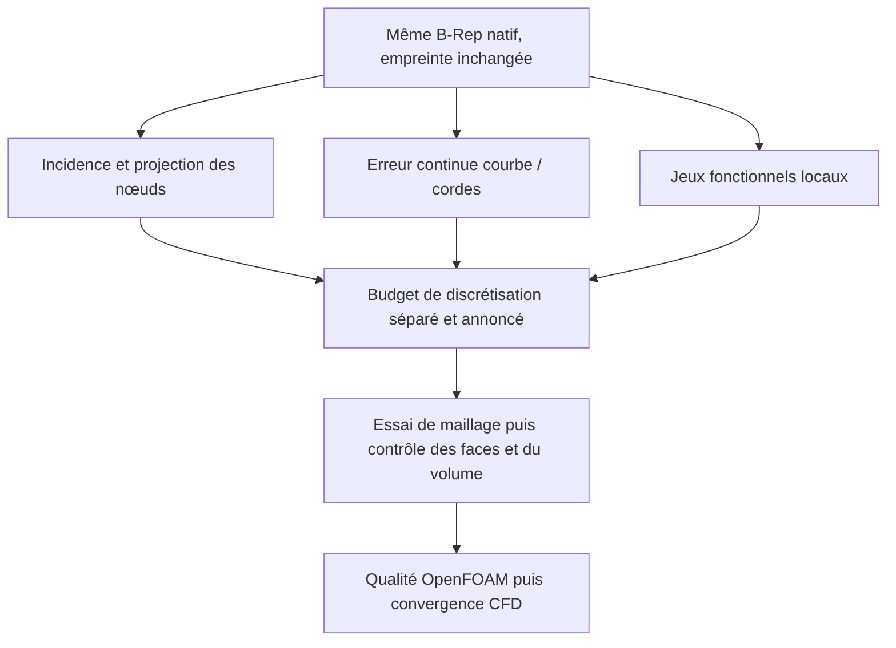

# M64 — approximation des petites arêtes : résultat et portée des tolérances

Suite exécutée séparément : [remaillage à une corde et refus OpenFOAM](M64_SHORT_EDGE_REMESH_20260908.md).
Les bornes et le périmètre historique ci-dessous restent inchangés.

**Aucun nouveau maillage ni changement de CAO dans ce sous-lot.** Les bornes
calculées ci-dessous éclairent une possible réduction du nombre de segments
sur les arêtes natives 98/99 du domaine gazeux unifié `fab1338a…`.
Elles ne constituent ni un résultat CFD ni une précision physique du scan.

## Ne pas confondre trois critères

1. **Tolérance native de représentation / projection :** `5e−6` unité de scan
   est la tolérance des arêtes OCCT concernées. Elle sert au découpage natif
   et à l'appariement des nœuds sur leurs supports.
2. **Erreur continue de discrétisation :** distance entre toute une courbe et
   ses cordes. Aucun contrat global imposant `5e−6` à cette erreur n'a été
   retrouvé dans les contrôles actifs. Le test d'incidence avait explicitement
   laissé cette preuve à `false`.
3. **Jeu radial guide–tige :** le budget `0,0075` appartient au contrôle
   géométrique de ces surfaces cylindriques. Il ne devient pas un budget
   générique pour les arêtes siège/conduit 98/99.

L'API [OCCT BRep_Tool](https://occt3d.com/dev/doc/refman/html/class_b_rep___tool.html)
décrit la tolérance de l'entité, tandis que [Gmsh](https://gmsh.info/doc/texinfo/gmsh.html#Specifying-mesh-element-sizes)
possède des contraintes distinctes de discrétisation des courbes et des tailles
de maille. **Notre conclusion d'ingénierie :** une tolérance B-Rep ne suffit
pas, à elle seule, à définir l'erreur admissible d'un maillage CFD.

## Bornes effectivement calculées

Les deux arêtes sont des Bézier polynomiaux de degré 6. Le calcul utilise
les coordonnées binaires natives converties en fractions exactes, puis
128 sous-arcs de Casteljau. L'enveloppe convexe des pôles borne la distance
à la corde entière ; des points exacts donnent une borne inférieure.
Les perturbations des extrémités vers les nœuds réels sont incluses, avec
arrondi extérieur. Le contrôle de l'existant prend le minimum de distance
sur **l'union des deux segments**, pas seulement sur le segment associé.

| Arête / représentation | Borne inférieure courbe → segments | Borne supérieure de Hausdorff |
|---|---:|---:|
| 98 / une corde envisagée | 1,52498192e−5 | 1,52498640e−5 |
| 99 / une corde envisagée | 8,82529733e−6 | 8,82564969e−6 |
| 98 / deux cordes actuelles | 7,77457517e−6 | 7,77471599e−6 |
| 99 / deux cordes actuelles | 2,31031464e−6 | 2,31046194e−6 |

Toutes les distances sont en **unités de scan non étalonnées**. Le
contre-calcul OCCT sur 17 points concorde à moins de `2,31e−14` unité ; six
assertions synthétiques passent. Les entrées restent inchangées.
Les bornes de ce tableau sont arrondies vers l'extérieur.

Si l'on imposait une erreur continue de `5e−6`, une seule corde échouerait
pour les deux arêtes ; les deux cordes actuelles de 98 échoueraient aussi.
C'est une conclusion **conditionnelle à ce budget**, pas une preuve que
le maillage doit respecter ce budget ni que toute réduction est impossible.
Le PASS d'incidence `c0ce7de8…` n'est pas révoqué : il ne prétendait justement
pas vérifier la fidélité continue des cordes.
Les usages sont vérifiables dans le [split natif](../twins/m64-cylinder-head/source/flowbench-intake/split_gas_c0_edge.py)
et l'[auditeur d'incidence](../twins/m64-cylinder-head/source/flowbench-intake/audit_segmented_c0_mesh.py).

## Décision suivante

La réduction à deux nœuds n'est **ni lancée ni qualifiée ici**. Avant un
essai comparatif : définir un budget de discrétisation propre aux fonctions
locales, apparier les tags Gmsh aux arêtes natives sans supposer leurs numéros
identiques, conserver les sommets/C0 et les frontières partagées, contrôler
les faces réellement produites et leurs intersections, puis exécuter les
contrôles OpenFOAM sur ce nouveau maillage. Une approximation déclarée ne
doit pas être présentée comme une CAO modifiée ou comme une géométrie exacte.
La convergence du calcul reste nécessaire après acceptation du maillage.

L'[essai MeshAdapt précédent](M64_SURFACE_MESHADAPT_20260908.md) demeure
rejeté sur sa qualité OpenFOAM ; aucun seuil ni historique n'est réécrit.

## Traçabilité privée

Les coordonnées et les géométries restent privées ; leurs preuves ne sont
pas remplacées par le tableau arrondi ci-dessus.

| Artefact | SHA-256 |
|---|---|
| Domaine natif | `fab1338a3e3cf36469977716a9cb54b3118382f592c7c41d7c789bdb5fb3aeba` |
| Bornes resserrées, rapport 02 | `9150138a046b944dc0ebdcb5f24934cbd66ef11b130c86ab7e292b163e6fa357` |
| Union des deux cordes, rapport 03 | `db8588e7f12acaba568590a91806878fee6531ace1fa9eeaef69397350e59f76` |
| Source extraction / bornes initiales | `cb392cbbeb2fa4b6bcd7d7699a25c98a62b57635a93fd8e5f776ab0d5355fd17` |
| Source resserrement | `48e2d7e34b2d73e5c7e3303a2424668e11596303ec0e09b45ca76f7f91e0daf7` |
| Source contre-calcul union | `af813d14152827f84d3cf8b1fbf267a20eb049c48f2c19b616f9894784625f87` |
