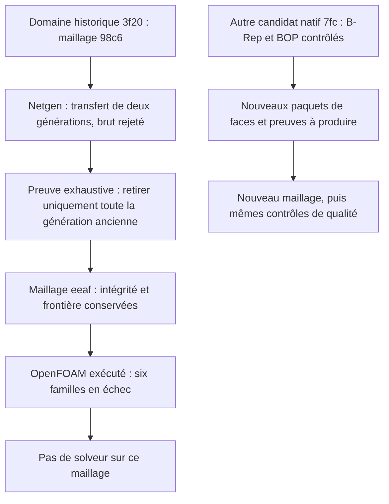

# M64 — récupération Netgen et contre-contrôle OpenFOAM

Ce lot porte sur le domaine natif historique `3f20f4c5…`, **pas** sur le
[candidat à représentation C0 corrigée](M64_CORRECTIONS_NATIVES_20260908.md)
`7fc114c1…`, qui n'a pas encore été remaillé. Aucun résultat n'est transféré
automatiquement entre ces deux fichiers.

## Optimisation volumique : génération récupérée, maillage encore rejeté par OpenFOAM

Le maillage d'admission issu du traitement Netgen contient désormais **458 307 tétraèdres** après récupération de sa génération complète. Les **191 968 triangles des 88 faces frontières** conservent exactement leurs coordonnées, leurs orientations et leurs rôles après remappage des numéros de nœuds. **Le nouveau contrôle OpenFOAM rejette encore six familles de critères.** Cette étape traite le transfert et l'intégrité d'un maillage numérique ; elle ne valide ni le débit, ni la température, ni la résistance de la culasse.

La [capsule de preuves](../twins/m64-cylinder-head/evidence/native-gas-netgen-recovery-20260908.json) rassemble les empreintes des scripts, journaux de processus et rapports. Les géométries et preuves détaillées restent privées ; leurs empreintes ne constituent pas, seules, une reproduction publique des calculs.

### Essais réellement exécutés

Un prévol et **trois appels natifs Netgen** ont été réalisés dans l'image Gmsh **4.15.2**, `linux/amd64`, empreinte `27bb1cab…b2764d4`. Chaque tentative était bornée à **4 CPU, 4 Gio et 300 secondes**, sans réseau. Aucun solveur CFD n'a été lancé dans ce lot.

| Étape | Résultat observé | Sortie | Durée murale du reçu de processus |
|---|---|---:|---:|
| Prévol | NumPy absent ; aucun appel Netgen | 2 | 4 s |
| Appel 1 | Transfert sans surface effectivement rattachée au volume ; arrêt natif | 139 | 10 s |
| Appel 2 | Adjacences rétablies ; Netgen termine, puis contrôle bloqué par le cache d'éléments | 2 | 65 s |
| Appel 3 | Sauvegarde immédiate et cache reconstruit ; deux générations superposées détectées et rejetées | 2 | 129 s |

Les durées du tableau sont les mesures entières des reçus de processus, pas des temps CPU. Les appels 2 et 3 passent respectivement **44,958 s** et **45,102 s** dans l'optimiseur. Le paramètre `niter=1` ne limite pas cette branche native à une seule itération interne : il s'agit d'un seul appel API par tentative. Les conteneurs ont tous été supprimés et leur absence vérifiée ; aucune nouvelle location Vast n'a été effectuée.

### Défaut de transfert identifié et correction contrôlée

La reconstruction des liens discrets par `createTopology(False, False)` rétablit **88 adjacences volume–face**. Elle conserve tous les anciens nœuds et éléments, leurs connectivités et leurs groupes. Les **101 points et 3 687 lignes auxiliaires** ajoutés sont exclusivement portés par des nœuds ou arêtes déjà présents sur la frontière ; aucune nouvelle surface de fermeture n'est créée.

La relecture du code Gmsh explique le mécanisme suivant : sur ce volume entièrement discret, la branche de nettoyage peut conserver les anciens tétras avant que le transfert Netgen ajoute les nouveaux. L'appel avec cache reconstruit permet de mesurer le défaut : **939 496 tétras**, volume signé total **doublé**, **111 186 doublons** et incidences volumétriques incohérentes. Ce résultat brut est conservé et demeure rejeté. Le cache reconstruit répare uniquement l'indexation, pas cette superposition. [Source Gmsh 4.15.2](https://gmsh.info/src/gmsh-4.15.2-source.tgz), [API du cache](https://gmsh.info/doc/texinfo/gmsh.html#index-gmsh_002fmodel_002fmesh_002frebuildElementCache).

La récupération n'a **pas dédupliqué les 111 186 tétras** ni supprimé les éléments de mauvaise qualité. Elle a identifié exhaustivement les **481 189 éléments de l'ancienne génération**, puis retiré cette génération entière de la copie. Les **458 307 nouveaux tétras** ont tous été conservés. Seuls **30 776 nœuds devenus orphelins**, après vérification de toutes les incidences, ont été retirés ; aucune coordonnée n'a été changée.

La preuve compare tous les anciens tétras, leurs rôles et l'ordre de leurs quatre sommets, avec une **bijection globale des 126 760 nœuds** et une comparaison **exacte des coordonnées ASCII avec Decimal**. Elle contrôle également toute la frontière. Les seuls numéros ne suffisent pas : l'écriture MSH2 réattribue les identifiants par défaut, même lorsque `Mesh.Renumber=0`. [Option MSH2 distincte](https://gmsh.info/doc/texinfo/gmsh.html#index-Mesh_002ePreserveNumberingMsh2).

Le maillage récupéré vérifie les contrôles directs suivants : **zéro doublon**, **zéro face incidente à plus de deux tétras**, **zéro face interne de même orientation**, **volumes signés strictement positifs**, frontière extérieure complète orientée et volume signé total égal à celui du maillage initial. L'extraction n'a relancé ni Netgen ni une génération de maillage.

### Qualité mesurée : améliorations et régressions

Une relecture indépendante dans Gmsh, **sans génération ni optimisation**, dure **2,287 s** et termine avec une sortie 0. Elle confirme **124 940 nœuds**, **458 307 tétras** et tous les groupes physiques d'origine.

| Mesure | Initial | Génération récupérée | Lecture |
|---|---:|---:|---|
| SICN minimal | 1,39830 × 10⁻⁷ | 7,62991 × 10⁻⁷ | Extrême amélioré, toujours très faible |
| Tétras avec SICN < 10⁻⁶ | 8 | 1 | Moins d'éléments presque dégénérés |
| Tétras avec SICN < 0,1 | 1 409 | 1 595 | Régression de cet indicateur |
| SICN non positif | 0 | 0 | Aucun observé |
| Jacobien minimal | 6,21332 × 10⁻¹² | 9,83784 × 10⁻¹² | Positif dans les coordonnées non mises à l'échelle |
| Jacobiens non positifs | 0 | 0 | Aucun observé |

Le seuil SICN de **0,1 est ici un indicateur diagnostique**, pas une autorisation CFD ni un critère abaissé pour accepter le résultat. Les valeurs de Jacobien utilisent les coordonnées du scan ; elles ne certifient aucune échelle physique en millimètres. **Aucune amélioration uniforme du maillage n'est revendiquée.**

### Contrôle OpenFOAM réellement exécuté

Après revue indépendante, le fichier récupéré **`eeaf1c79…56d66d`** a été converti puis contrôlé dans **OpenFOAM Foundation 14** avec les mêmes scripts, la même image **`a233511b…de1c17`** et les mêmes critères que le maillage initial. Les étapes `gmshToFoam`, `transformPoints`, `createPatch` et `checkMesh -allTopology -allGeometry` ont réellement été exécutées ; aucun solveur n'a été lancé. La conversion d'échelle **0,001 m par unité de scan**, appliquée une seule fois, reste une hypothèse non étalonnée physiquement.

| Critère OpenFOAM en échec | Initial | Génération récupérée |
|---|---:|---:|
| Cellules de rapport d'aspect excessif | 139 | 151 |
| Rapport d'aspect maximal | 36 243,06 | 53 139,06 |
| Faces fortement distordues (`skewness`) | 53 | 30 |
| Skewness maximale | 183,10 | 104,31 |
| Cellules de déterminant < 0,001 | 4 243 | 1 790 |
| Cellules concaves | 25 | 15 |
| Faces de poids d'interpolation < 0,05 | 1 200 | 897 |
| Faces de rapport de volumes < 0,01 | 532 | 443 |

Cinq décomptes diminuent, mais le nombre de cellules très allongées et leur rapport maximal augmentent. **Les six familles restent rejetées.** Le déterminant de cellule évalué par OpenFOAM pour ses calculs en volumes finis n'est pas le Jacobien géométrique mesuré par Gmsh ; leurs résultats ne se substituent pas l'un à l'autre.

Les quatre commandes retournent **0**, mais le journal conclut à **six contrôles échoués**. Le superviseur retourne donc **2** et conserve le refus de CFD. La durée murale du reçu est de **11 s**, dont **6,438 s** pour `checkMesh`. Le conteneur a été retiré et son absence vérifiée. La capsule contient les empreintes complètes du rapport **`624e45df…d4a225`**, du journal **`a0ce4926…81e308`**, de la revue **`a5586f06…7861a1`** et du reçu de processus **`de5eb2c2…35c56a`**.

### État de validation et prochaine décision

Le contrôle du maillage récupéré est désormais **exécuté et rejeté**, pas `non_executed`. Les solveurs CFD, thermiques, structurels et de procédé additif restent `non_executed` **dans ce lot**. La prochaine étape est une correction locale motivée par les défauts encore observés, suivie des mêmes contrôles ; aucune baisse de seuil ni exécution de solveur sur le maillage rejeté n'est autorisée.

Les assertions logicielles, la sortie du programme et des Jacobiens positifs ne constituent ni une convergence de calcul, ni une validation physique, ni une autorisation d'impression ou de fonctionnement moteur.

## Enchaînement des preuves

## Prochain lot borné

Créer un nouveau paquet de faces natif pour `7fc114c1…`, conserver le profil
historique, puis recalculer les empreintes et transférer les rôles par la
correspondance géométrique auditée. L'ancien avis signalant C0 et un ancien
contrôle STEP ne sont pas réutilisables pour ce candidat. Reprendre d'abord
la surface et ses contrôles, avant le volume et toute CFD. Les trois
nouveaux sommets doivent rester représentés ; aucune suppression de détail
ni hausse de tolérance n'est implicitement autorisée.

Les tests logiciels du [lot CAO](M64_CORRECTIONS_NATIVES_20260908.md#vérification-logicielle-et-ressources)
passent séparément ; ils ne changent pas ces refus de qualification.
