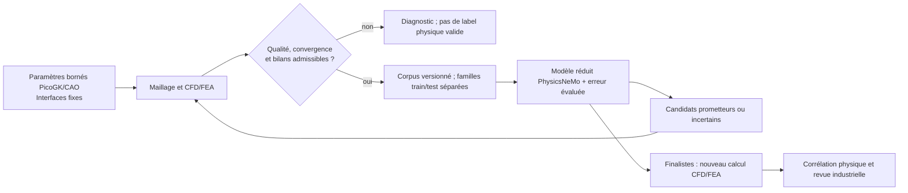

# Neural Concept : application au M64 turbo

Recherche vérifiée le 12 septembre 2026. Quatre publications consultées ;
aucun entraînement M64 ni gain de performance moteur démontré.

## Publications et décision

| Source primaire | Apport et limite pour notre projet |
|---|---|
| [Baqué et al., Geodesic Convolutional Shape Optimization, ICML 2018](https://proceedings.mlr.press/v80/baque18a.html), §3 et §4.1–4.3 | Prédicteur appris sur simulations, optimisation, nouvelle simulation lorsque la forme sort du domaine appris. Expérience 3D sur 2 000 formes synthétiques : pas un minimum prescrit pour M64. Aucun dépôt officiel réutilisable identifié dans cette recherche. |
| [Remelli et al., MeshSDF, NeurIPS 2020](https://arxiv.org/html/2006.03997v2), §3.2, §4.3 et supplément §8.7 | Gradients vers une représentation implicite. L'expérience automobile utilise 1 400 voitures et OpenFOAM, pas des photos seules. Aucune licence de code identifiée dans le [dépôt officiel](https://github.com/cvlab-epfl/MeshSDF) lors du contrôle : clarification nécessaire avant intégration. |
| [Durasov et al., Enabling Uncertainty Estimation in Iterative Neural Networks, ICML 2024](https://proceedings.mlr.press/v235/durasov24a.html), §3.2, §4.2 et §5.1 | Dispersion entre itérations comme indicateur d'incertitude pour sélectionner de nouvelles simulations. Pas une borne universelle d'erreur physique. [Code MIT](https://github.com/cvlab-epfl/iter_unc/blob/main/LICENSE) ; reproduction complète du corpus CFD non documentée dans le README consulté. |
| [Talabot et al., PartSDF, TMLR 2025, version du 20 octobre](https://arxiv.org/html/2502.12985v3), §4.4, §5 et annexe D | Représentation par composants, avec exemple de carrosserie optimisée autour de roues fixes. Labels de parties requis ; difficultés sur structures minces et fragments parasites. [Code MIT](https://github.com/cvlab-epfl/PartSDF/blob/main/LICENSE), [données/checkpoints CC BY 4.0](https://zenodo.org/records/17466765). Ces données ne qualifient pas une culasse. |

Le [benchmark commercial Neural Concept du 10 septembre 2025](https://www.neuralconcept.com/post/from-dataset-to-design-impact-how-neural-concept-set-a-new-benchmark-on-mits-drivaernet)
annonce quatre A100 et 24 heures d'entraînement sur DrivAerNet++. C'est une
publication d'entreprise, pas une reproduction indépendante, un devis M64
ou une mise à disposition libre de son produit.

## Transposition proposée, pas résultat acquis

Retenir d'abord **l'apprentissage actif**, sans remplacer la CAO par une forme
librement générée. Le contour maître reste conservé : aucune enveloppe ovale.
Figer les interfaces et zones non autorisées à évoluer ; un composant latent
« fixe » ne remplace pas un contrôle dimensionnel de la géométrie exportée.

Premier sous-problème proposé : conduit d'admission à levées imposées,
débit et perte de charge. Thermique, résistance et dynamique de distribution
exigent leurs propres données ; un banc de flux stationnaire ne simule pas
le cycle moteur. Commencer par un prédicteur simple de KPI sur paramètres,
puis envisager [DoMINO/PhysicsNeMo](https://docs.nvidia.com/physicsnemo/latest/physicsnemo/api/models/operators.html)
pour les champs de surface/volume si les données justifient cette complexité.
PartSDF vient ensuite si la paramétrisation devient insuffisante. PicoGK
n'est pas supposé différentiable : optimisation bornée sans dérivées, ou
chemin différentiable séparé explicitement vérifié.

Chaque échantillon doit lier géométrie/parent, paramètres, unités, matériau,
conditions aux limites, versions/réglages solveur, qualité de maillage,
convergence, bilans, champs et KPI. Séparer entraînement, calibration et test
par famille géométrique et régime, pas par instantanés quasi identiques.
Mesurer les erreurs locales aux sièges et ponts thermiques, pas seulement
une moyenne globale. Les scores d'incertitude et cas hors domaine demandent
de nouveaux calculs : ils ne garantissent pas la sûreté.

Les résultats limités artificiellement à 3 300 K ne deviennent pas des vérités
physiques par entraînement. Ne pas mélanger coupon LPBF et fonctionnement
moteur. Les interfaces M64 manquantes ne viennent ni des photos ni de poids
préentraînés automobiles.

## Tokens et coût total

Scripts pour génération, exécution, extraction et sélection ; le LLM reçoit
des reçus compacts et propose des analyses ou du code à tester. Aucun LLM à
chaque pas du solveur, aucune décision autonome de fabrication. Comptabiliser
les tokens réellement traités par le LLM hébergé séparément d'une économie
OpenAI, qui reste un contrefactuel non mesuré.

Comparer « données CAE + entraînement + nouvelles simulations + recalcul final »
à une optimisation CAE directe. L'inférence rapide ne suffit pas à prouver
l'amortissement. Aucun gain de tokens ou de rendement moteur n'est mesuré ici.
