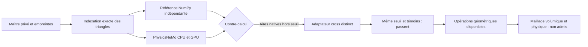

# M64 — PhysicsNeMo-Mesh réellement exécuté sur Vast

## Résultat et décision

Le 12 septembre 2026, une A100 40 Go a exécuté deux contre-calculs sur les
**293 308 triangles / 146 648 sommets** du corps de référence issu du scan
935. **Aucun sommet déplacé, aucun triangle supprimé, aucun changement de
contour.** Ce corps à quatre sièges n'est pas la dernière culasse M64
complète avec ses conduits ; le pilote qualifie des opérations géométriques,
pas une pièce moteur. L'échelle absolue et les interfaces restent non certifiées.

| Charge réellement chronométrée | CPU, 4 threads | A100 CUDA | Rapport CPU/GPU |
|---|---:|---:|---:|
| PhysicsNeMo natif : construction Mesh, aires, normales, sept qualités | 117,872 ms | 1,768 ms | 66,67 |
| Adaptateur distinct : construction Mesh, aires et normales par produit vectoriel | 8,555 ms | 0,253 ms | 33,75 |

Médianes de cinq répétitions après échauffement distinct ; objet Mesh neuf à
chaque appel, CUDA synchronisé avant/après. **Rapports hors transferts,
échauffement, imports et installation ; charges différentes entre les lignes.**
Les transferts aller/retour valent respectivement 2,067/18,694 ms pour le
premier lot, 2,063/1,439 ms pour le second. La copie NumPy vers CPU (~3,9 ms)
est encore séparée. Aucun gain de bout en bout ni accélération CFD n'est démontré.
Un aller-retour unique n'est donc pas une raison de relouer une grosse carte.

## Défaut numérique trouvé et adaptation vérifiée

Le contre-calcul NumPy indépendant utilise :

$$
A=\tfrac12\|(v_1-v_0)\times(v_2-v_0)\|,\qquad
n=\frac{(v_1-v_0)\times(v_2-v_0)}
        {\|(v_1-v_0)\times(v_2-v_0)\|}.
$$

La version native 2.2.2 calcule les aires triangulaires par une différence de
produits scalaires. Elle dépasse notre seuil numérique strict sur **4 438
triangles (1,513 %)**, côté CPU comme GPU : erreur relative maximale
**3,232 × 10⁻⁶**, aucune aire positive annulée sur ce corps. Les normales
passent. L'accord CPU/GPU seul aurait donc caché cet écart au contre-calcul.
Les sept qualités concordent CPU/GPU, mais n'ont pas de référence NumPy
indépendante et ne sont pas les critères du polyMesh hybride OpenFOAM.

Deux témoins synthétiques, distincts du scan, exposent aussi une aire
positive arrondie à zéro et une normale non unitaire à très petite échelle.
Ce ne sont pas des triangles géométriquement dégénérés à supprimer.

L'[adaptateur explicite](../twins/m64-cylinder-head/source/physicsnemo-mesh/benchmark_cross_adapter.py)
emploie la structure Mesh et les opérations PyTorch de produit vectoriel et
norme. Il **ne modifie ni PhysicsNeMo ni les tolérances**. Sur le corps :
**zéro triangle hors seuil**, erreur relative maximale CUDA des aires
**2,93 × 10⁻¹⁶ au plus** ; les deux témoins passent aussi. Un vrai triangle
colinéaire conserve une normale non finie et est refusé, pas artificiellement validé.
Ce contrôle ne prouve pas la robustesse sur toute échelle ou tout maillage.

Seuils inchangés : aires `rtol=1e-10, atol=0` ; normales
`rtol=1e-10, atol=1e-12`. Ce sont des seuils de comparaison numérique,
**pas des tolérances d'usinage ou une incertitude métrologique**.

Décision : conserver l'adaptateur testé pour ces champs géométriques sur cette
entrée, et garder la version native comme diagnostic comparatif refusé en
précision globale. Pas de lissage, réparation automatique ou admission CFD.



## Exécution, coûts et sauvegarde

- A100 SXM4 40 Go, 40 CPU effectifs, 127 445 Mo RAM, 100 Go disque ;
  seulement quatre threads CPU employés pour une comparaison contrôlée.
- Image PicoGK/Python `linux/amd64` par digest, paire SSH et association de
  clé contrôlées avant calcul ; aucun secret publié. PhysicsNeMo a été installé
  dans un venv distinct : **pas une nouvelle image Docker PhysicsNeMo qualifiée**.
- Python 3.11.2, PhysicsNeMo 2.2.2, Torch 2.10.0+cu128, CUDA 12.8,
  NumPy 2.4.6. Roue PhysicsNeMo et cinq fichiers source vérifiés par SHA-256.
  Les rapports pip et le gel des dépendances sont conservés en privé ;
  toutes les dépendances transitives ne sont pas verrouillées à l'avance.
- Premier bootstrap refusé : ancien pip et normalisation du nom
  `typing_extensions`. Second venv neuf, pip 26.2.1 : installation et
  contrôle GPU terminés en 155,04 s. Aucun second achat de machine.
- Prix observé : 0,708889 USD/h ; pilote plafonné à 3 USD, délai externe
  2 h avec réserve de nettoyage. Les 12 Go de téléchargement budgétés couvrent
  image **et dépendances**, pas seulement l'image compressée.
- **Instance supprimée**, absence confirmée par le fournisseur, inventaire
  vide et watchdog indépendant terminé. Rapports, images et archive
  d'environnement récupérés avec comparaison des empreintes distante/locale.
- Crédit avant/après : 38,480688 → 38,283279 USD, soit **0,197409 USD de
  diminution observée**. Ce relevé n'est pas une facture détaillée définitive.
  Aucun achat complémentaire ni recharge automatique ; plafond utilisateur
  de 38 USD total conservé.

## Preuves et reproduction

- [Reçu d'exécution et de nettoyage](../twins/m64-cylinder-head/evidence/physicsnemo-mesh-pilot-20260912.json).
- [Mesures natives intégrales agrégées](../twins/m64-cylinder-head/evidence/physicsnemo-mesh-stock-20260912.json).
- [Mesures de l'adaptateur agrégées](../twins/m64-cylinder-head/evidence/physicsnemo-mesh-cross-20260912.json).
- [Scripts](../twins/m64-cylinder-head/source/physicsnemo-mesh/) : bootstrap
  borné, indexation exacte, référence, benchmark natif, adaptateur, rendu.

Les paquets NPZ, reçus d'entrée et empreintes sont gelés pour cet essai.
Leur régénération doit faire l'objet d'un nouvel audit et de nouvelles
empreintes explicites ; ne pas désactiver les contrôles pour accepter un autre
corps. Aucun maillage brut, coordonnée ou image dérivée du scan n'est ajouté
à ce commit public. Deux vues privées 1800 × 1250 ont été produites et
inspectées : corps gris et qualité triangulaire
`q=4sqrt(3)A/somme(longueurs²)`, échelle fixe [0,1], sans température,
contrainte, décimation ou lissage.

Dans l'environnement Linux GPU testé, avec les entrées privées gelées :

```sh
python -B benchmark_mesh.py --mesh head-surface.npz \
  --reference cpu-reference.npz --reference-report report.json --output lot-neuf
timeout --signal=TERM --kill-after=10 310 python -B benchmark_cross_adapter.py \
  --library benchmark_mesh.py --mesh head-surface.npz \
  --reference cpu-reference.npz --reference-report report.json --output cross-neuf
```

Le benchmark natif limite son enfant à 290 s puis tue et attend le groupe de
processus. L'adaptateur exige la supervision externe ci-dessus : l'alarme
Python 300 s ne remplace pas le délai dur du processus natif ni le watchdog
de facturation. Les sorties doivent être neuves. Aucun lancement cloud dans
les tests, aucun LLM dans la boucle de calcul.

Les 37 tests ciblés passent avec l'audit de roue activé. Ils vérifient
indexation exacte, orientation/volume de tétraèdre,
références, conservation des entrées, témoins numériques et supervision.
Les 18 tests du benchmark et les 9 tests de l'adaptateur passent également
sur la machine louée. L'audit de roue local est optionnel et sans réseau
(`M64_PHYSICSNEMO_WHEEL` désigne le fichier téléchargé préalablement).

`make check` complet termine avec code zéro ; les contrôles natifs optionnels
sans dépendances restent explicitement ignorés, dont l'audit de roue non fourni
par défaut. La relecture indépendante ne relève aucun point bloquant dans
la portée de ce pilote. Cela ne constitue pas une validation physique.

## Suite utile

Réutiliser ces calculs dans les lots géométriques en gardant les données sur
GPU lorsque c'est pertinent. La correction des petites facettes de frontière
et le contrôle des interfaces CAO restent le prochain travail géométrique.
La conformité du maillage volumique, CFD/CHT, résistance, fatigue et procédé
d'impression ne sont **pas** devenues acquises grâce à ce benchmark.

Sources primaires consultées :
[module Mesh et domaines pris en charge, NVIDIA](https://nvidia.github.io/physicsnemo/blog/2026/04/07/physicsnemo-mesh/),
[distribution 2.2.2](https://pypi.org/project/nvidia-physicsnemo/2.2.2/).
Les chiffres du tableau viennent de nos reçus, pas des accélérations
annoncées par NVIDIA.
