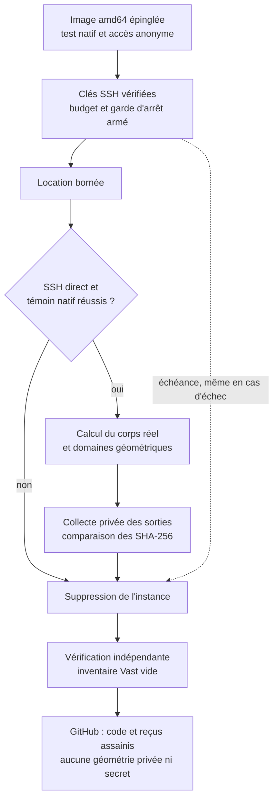

# PicoGK — exploitation du corps réel M64/4V

## Résultat du lot du 7 septembre 2026

L'image Docker publique a été construite et utilisée sur une instance Vast.
Le corps réel et trois domaines volumiques ont été calculés à 0,6 unité,
récupérés et vérifiés par SHA-256. Le STL du corps et les trois STL de domaines
sont identiques octet pour octet aux sorties correspondantes sur Kali.
La location est détruite et l'inventaire Vast indépendant est vide.

Sur Kali, les voxelisations à 0,6 / 0,3 / 0,15 unité ont terminé. La campagne
d'audit indépendante a traité les deux premières résolutions, puis a été
interrompue avec le code 137 pendant la résolution 0,15, avant l'écriture du
rapport global. Seuls deux résumés de progression ont été récupérés, pas les
rapports détaillés de distances et de cordes. La cause exacte n'est pas établie :
un pic mémoire est une hypothèse, pas un diagnostic prouvé. Les trois calculs
restent disponibles, mais l'audit intégral n'est pas livré ni déclaré réussi.

**Ce lot livre une chaîne géométrique reproductible et ses preuves, pas une
nouvelle culasse validée thermiquement, mécaniquement ou pour l'impression.**

## Périmètre

Le corps étudié est la reconstruction privée issue du scan de référence 935,
avec quatre logements de sièges et guides. La cible projet est le M64 turbo
964/993 ; cette origine documentaire ne prouve pas l'interchangeabilité M64.
Le STEP maître reste intact. L'hypothèse d'échelle `1 unité = 1 mm` n'est pas
une certification métrologique. Aucun nouvel ovale ni contour extérieur libre
n'est introduit.

## Image de calcul publiée et qualifiée

Image logicielle publique, sans scan, STEP ni géométrie privée :

```text
ghcr.io/cluster2600/3dprinting993-picogk-m64@sha256:131d29d42635b1c691649edb04fa716d8fddd7751f3ebc6011efb9be8a1b0414
```

[Construction GitHub Actions réussie](https://github.com/cluster2600/porscheparts/actions/runs/34147345040).
Plateforme `linux/amd64`, téléchargement anonyme du digest exact et témoin
natif hors réseau répétés sur Kali. Les sources amont sont épinglées ; .NET 9
et le runtime PicoGK 26.2 sont inclus. Les dépendances de paquets ne constituent
pas encore une reconstruction garantie bit-à-bit.

Le témoin synthétique contrôle le logiciel, pas la culasse. Les objets natifs
maillages/voxels sont libérés avant la bibliothèque qui les possède.

## Capacités réellement utilisées

| Opération | Utilité pour la conception | Limite de preuve |
|---|---|---|
| STL → voxels → STL à plusieurs résolutions | Quantifier les écarts au maître | Ne remplace pas les portées exactes du B-Rep |
| Érosion/dilatation et différence | Localiser les détails sensibles | Ce n'est pas une mesure certifiée d'épaisseur |
| Boîte analytique à distance signée − corps | Préparer les volumes non solides | Air extérieur, logements et cavités non encore classés |
| Érosion de 1,5 unité et intersection | Construire une réserve géométrique exploratoire | Ni zone autorisée à retirer, ni épaisseur mécanique admissible |
| Corps − réserve | Conserver une enveloppe géométrique de protection | Les surfaces fonctionnelles exigent des masques spécifiques |
| Champs OpenVDB nommés et relecture | Réutiliser les domaines volumiques sans tout reconstruire | Champs à bande étroite, pas distance exacte partout |

Les modules sont dans [`source/picogk`](../twins/m64-cylinder-head/source/picogk/README.md)
et [`source/picogk-cooling`](../twins/m64-cylinder-head/source/picogk-cooling/README.md).
Le second se compile avec le SDK de l'image déjà qualifiée ; son binaire et sa
bibliothèque native sont identifiés dans chaque reçu.

## Contrôles indépendants

- Contrôle du STEP, triangulation déclarée et SHA de l'entrée avant/après.
- Fermeture, orientation, connectivité de surface et volumes de maillage.
- Outil de distances échantillonnées dans les deux sens vers les triangles du
  maître, pas seulement vers leurs sommets. La campagne à trois résolutions
  n'a pas persisté son rapport détaillé : aucune distribution de distances
  n'est déclarée validée par ce lot. Ce ne sont pas des bornes de Hausdorff.
- Partitions corps/complément et réserve/enveloppe vérifiées séparément.
- Témoin de cube creux pour distinguer volume matériel et enveloppe externe.
- Relecture des champs VDB par nom et contrôle de leurs volumes reconstruits.
- Aperçu VTK opaque de tous les triangles et coupe réelle passant par les
  axes de deux logements, sans lissage des coordonnées ni image générée par IA.

Un défaut important a été observé dans la mesure native `CalculateProperties`
sur les domaines creux : son passage intermédiaire maillage → voxels peut
donner le volume de l'enveloppe pleine. Les valeurs natives sont conservées
avec l'avertissement ; une intégration orientée indépendante du maillage sert
au contre-contrôle. Le seuil de contrôle n'a pas été augmenté pour masquer
l'écart. La validité du volume intégré reste subordonnée à la fermeture et à
l'orientation du maillage.

Un second défaut a été reproduit dans l'appel C# d'appartenance `bIsInside`
sous Linux x86 : le retour booléen natif pouvait être mal interprété. Le
module utilise un adaptateur local à retour sur un octet, testé sur des points
dans la matière, dans une cavité et à l'extérieur. La bibliothèque native et
l'image restent inchangées ; le correctif est isolé et documenté avec le
module, sans prétendre que toutes les API amont sont qualifiées.

Sur les exports de domaines à 0,6 unité, l'audit indépendant a aussi détecté
quatre triangles exactement dégénérés et trois arêtes non-manifold dans le
complément et la peau. La concordance des volumes ne supprime pas ce défaut :
les sorties originales restent conservées et ne sont pas déclarées maillages
CFD prêts à l'emploi. Des copies distinctes filtrant uniquement ces triangles
d'aire exactement nulle passent le contrôle de fermeture/orientation, sans
déplacer de sommet ni modifier les octets des triangles conservés. Le noyau
érodé ne nécessite aucun retrait.

À 0,3 unité, les trois exports bruts passent ces mêmes contrôles sans aucun
retrait. La peau contient cependant une petite coque négative de 12 triangles,
conservée et signalée pour investigation : ni suppression arbitraire ni
interprétation comme porosité du matériau. Ces contrôles ne classent toujours
pas la connectivité des volumes fluides.

Deux coques de surface ne prouvent pas deux cavités volumiques. Une analyse
de connectivité par occupation et propagation depuis l'extérieur reste à
effectuer avant d'appeler le complément « domaine CFD de refroidissement ».

## Exécution Vast, incidents et arrêt



[Source Mermaid](../diagrams/m64-vast-run.mmd) ·
[SVG](../diagrams/m64-vast-run.svg) · [PNG](../diagrams/m64-vast-run.png) ·
[Scène éditable](../diagrams/m64-vast-run.excalidraw).

Le [reçu Vast](../twins/m64-cylinder-head/evidence/picogk-vast-execution-20260907.json)
trace l'instance `50187676`, le digest, les empreintes, les contrôles SSH et
la suppression vérifiée. Ressources annoncées : 80 threads CPU, 257 776 Mo de
RAM, RTX 3060 de 12 Go et 100 Go de disque, à environ 0,280 USD/h. Ces
opérations PicoGK n'ont pas utilisé d'accélération GPU. Ce n'est pas un test
de performance GPU, ni une justification pour louer des B200.

| Calcul à 0,6 unité | Durée interne du rapport | Mémoire maximale du processus |
|---|---:|---:|
| Corps et différence morphologique | 3,063 s | 861 216 768 octets |
| Complément, noyau, peau et VDB | 12,324 s | 1 293 873 152 octets |

Ces durées excluent le démarrage, le téléchargement de l'image, la compilation
du second module et les transferts. Elles ne constituent pas un benchmark
normalisé face à Kali. Le module de domaines a été compilé avec le SDK de
l'image qualifiée ; son assembly a une empreinte différente de celui compilé
sur Kali. La bibliothèque native est identique et les trois STL concordent.
Les fichiers VDB ont des SHA différents ; leur identité binaire n'est pas
affirmée. La relecture des quatre champs nommés passe sur chaque hôte.

Trois tentatives payantes antérieures sont conservées comme échecs, avec
annulation et absence vérifiée :

- `50185391` : rejet du contrat d'état ; le diagnostic initial ne conserve pas
  la cause exacte.
- `50186579` : `actual_status` absent malgré `cur_state=running`. Le contrôleur
  accepte maintenant cet état observé de repli, jamais l'état simplement désiré.
- `50186920` : échec de validation SSH dont la catégorie exacte n'était pas
  conservée. Le contrôleur attend désormais le port direct, fixe cet endpoint
  pour la connexion et classe les erreurs. Un changement proxy/direct est une
  hypothèse de l'ancien échec, pas une cause démontrée.

La quatrième tentative a passé SSH, le témoin natif puis les calculs réels.
L'accès utilise uniquement le wrapper OpenBao approuvé ; aucune valeur de
secret n'est enregistrée dans les reçus publics. Le garde d'échéance avait
été armé avant la location ; il a supprimé l'instance à l'entrée de sa réserve
de nettoyage, puis une lecture indépendante a confirmé un inventaire vide.
Les résultats récupérés sont conservés en privé, avec leurs empreintes.

La diminution de crédit observée sur les quatre tentatives est d'environ
0,053 USD au relevé après arrêt. **Ce n'est pas une facture définitive** :
la comptabilisation du calcul, du stockage ou des transferts peut être retardée.
Aucune recharge automatique n'a été demandée.

## Vérification logicielle du lot

`make check` a terminé avec le code 0 : suite principale de 2 032 tests,
46 ignorés, puis contrôles complémentaires. Les tests de contrat ne prouvent
pas la physique de la pièce. Les exécutions natives et audits de géométrie
sont documentés séparément ; l'audit fin interrompu n'est pas masqué par la
réussite des tests logiciels.

## Passage vers une amélioration de pièce

La [chaîne complète et ses validations](M64_MULTIPHYSICS_EXECUTION.md)
définit les rôles de tous les logiciels demandés et les preuves encore absentes.

1. Identifier les interfaces, portées, filetages et zones à ne pas modifier.
2. Classer les espaces vides et fixer les entrées/sorties des circuits envisagés.
3. Générer uniquement dans les volumes autorisés des variantes locales de
   canaux et raccordements. Une ligne centrale de canal de rayon `r` requiert
   une réserve de `1,5 + r`, plus marge numérique, et non simplement 1,5.
4. Comparer débit, pertes de charge, températures, contraintes et accès de
   dépoudrage ; conserver une modification seulement sur bénéfice démontré.

Les valeurs 1,5 et 20 unités utilisées ici sont des paramètres exploratoires,
pas des critères moteur ou LPBF qualifiés. PicoGK prépare la géométrie ; il ne
remplace ni OpenFOAM/CHT, ni la résistance/fatigue, ni les cartes matériau à
chaud, ni l'étude du procédé d'impression.

## Photos, IA et PhysicsNeMo

Les photos documentaires peuvent aider à identifier les fonctions, comparer
des architectures et contrôler visuellement la reconstruction. Elles doivent
être regroupées par référence exacte (930, 935, M64 ou kit aftermarket), avec
source et droits. Leur abondance n'en fait pas des vues calibrées de la même
pièce : aucune cote cachée n'est déclarée mesurée sur cette base.

Une IA de vision peut proposer des correspondances ; PicoGK exécute les règles
géométriques codées. [PhysicsNeMo](https://docs.nvidia.com/physicsnemo/latest/overview.html)
est un framework pour entraîner et utiliser des modèles physiques, pas un
ingénieur culasse préentraîné qui déduit toute la physique de photographies.
Deux voies sont possibles : modèle réduit appris sur des calculs de référence,
ou modèle informé par les équations (PINN), qui exige lui aussi géométrie,
paramètres matière, chargements et conditions limites définis.

Pour ce projet, les résultats de CFD/CHT et de structure seront les données de
référence d'un éventuel accélérateur d'exploration. Séparer les géométries et
points de fonctionnement d'entraînement de ceux de test ; mesurer les erreurs
sur températures, débits, pertes de charge et contraintes ; refaire un calcul
indépendant de chaque variante retenue. Un modèle qui reproduit ses données
d'entraînement ne démontre pas une amélioration moteur ni la tenue en service.

Aucun corpus de « 1 000 photos », modèle PhysicsNeMo spécialisé ou campagne
d'apprentissage de culasse n'est déclaré constitué ou exécuté dans ce lot.

## Reçus publiables et fichiers privés

- [Qualification de l'image](../twins/m64-cylinder-head/evidence/picogk-image-qualification-20260907.json).
- [Trois exécutions de voxelisation sur Kali](../twins/m64-cylinder-head/evidence/picogk-roundtrips-20260907.json).
- [Audits indépendants des trois résolutions, avec état partiel](../twins/m64-cylinder-head/evidence/picogk-three-resolution-audit-20260907.json).
- [Domaines volumiques à deux résolutions](../twins/m64-cylinder-head/evidence/picogk-domains-20260907.json).
- [Contre-audit topologique et filtre exact](../twins/m64-cylinder-head/evidence/picogk-cooling-domain-mesh-audit-20260907.json).
- [Calculs réels sur Vast, collecte et arrêt vérifié](../twins/m64-cylinder-head/evidence/picogk-vast-execution-20260907.json).

Les reçus incluent les empreintes des entrées, sorties, rapports privés,
programmes et bibliothèques. Les STL, STEP, VDB et rendus privés ne sont pas
embarqués dans le dépôt public. Le script de rendu est versionné et les images
ont été montrées dans le fil de travail ; les couleurs n'y représentent
aucune température ou contrainte calculée.

**Statut : préparation géométrique contrôlée, pas culasse validée ni autorisée
à fabriquer ou à faire fonctionner.**
