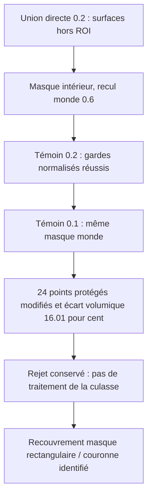
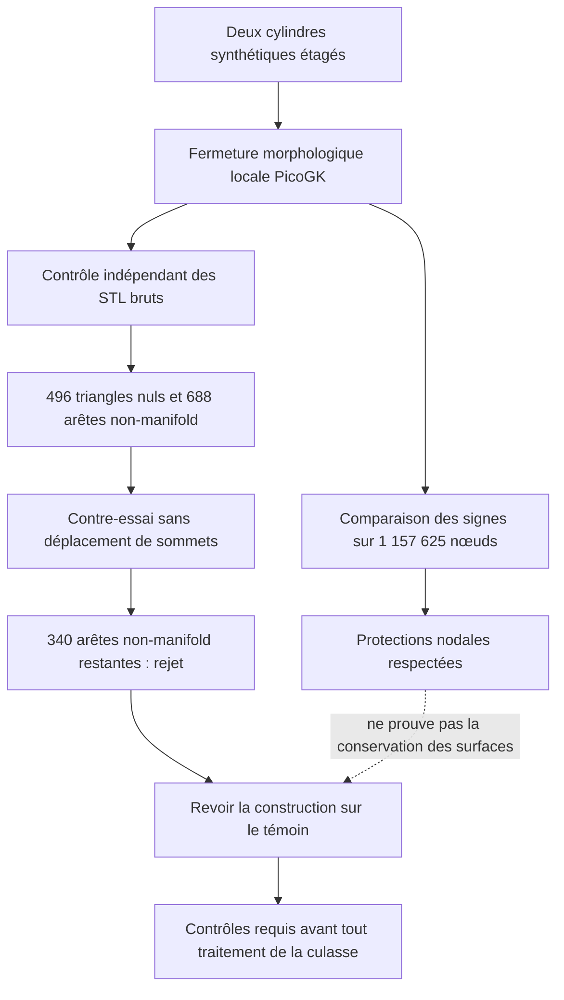
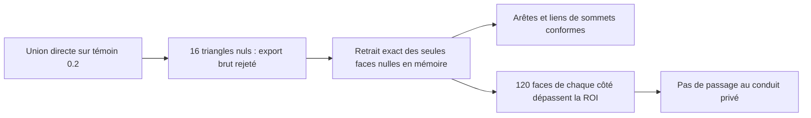

# M64 — témoin de raccord local PicoGK, 8 septembre 2026

## Dernier état : masque intérieur testé à 0,2 puis 0,1, suite rejetée

Les travaux ne se limitent plus au premier témoin ci-dessous. Une union
directe à masque intérieur a passé les gardes normalisés au pas **0,2**, puis
échoué au pas **0,1** sur **24 points protégés**. Le volume réellement ajouté
varie de **16,01 %**, au-delà du seuil préenregistré de 5 %. **Aucun de ces
essais synthétiques n'a été appliqué à la culasse privée.** Le maître reste
inchangé ; aucune validation physique ou d'impression n'est revendiquée.

La priorité sur la géométrie réelle est documentée séparément dans
[Admission, chambre et prochain calcul utile](M64_ADMISSION_CHAMBRE_20260908.md).
Les témoins PicoGK instruisent une méthode de raccord ; ils ne remplacent
pas les conduits, la chambre et les composants nécessaires au domaine gazeux.

### Deux pas comparés, sans assouplissement des gardes

Le [module à masque intérieur](../twins/m64-cylinder-head/source/picogk-local-junction-buffered/README.md)
conserve la zone autorisée et recule le masque de construction de 0,6 unité.
La [version fine séparée](../twins/m64-cylinder-head/source/picogk-local-junction-buffered-v2/README.md)
garde ce recul **fixe en coordonnées monde**, soit 3h à 0,2 et 6h à 0,1.
Un recul de 3h à 0,1 aurait changé la géométrie ; cette variante n'a pas été
exécutée. Deux niveaux ne démontrent pas une convergence asymptotique.

L'audit v2 exige aussi explicitement zéro variation SDF hors ROI et aux
protections, zéro paire indisponible et la relecture bit à bit de six champs
VDB dans leurs boîtes natives. L'ancien audit affichait les variations SDF
sans les intégrer à sa décision : le témoin 0,2 a donc été réaudité dans un
**nouveau reçu**, sans écraser ses résultats, et passe ces gardes renforcés.

| Mesure | Pas 0,2 | Pas 0,1 |
|---|---:|---:|
| Nœuds comparés | 1 157 625 | 8 615 125 |
| Points protégés modifiés, convention `<0` | 0 | 24 |
| Valeurs SDF modifiées hors ROI | 0 | 0 |
| Faces nulles brutes du candidat | 16 | 0 |
| Faces nulles brutes de l'ajout diagnostique | 8 | 40 |
| Volume effectivement ajouté, unité³ | 9,485154 | 8,176398 |
| Résidu `Vaprès−Vavant−Vajout diagnostique`, unité³ | 3,618601 | 1,120716 |

Au pas fin, les surfaces brutes avant/après passent l'écran combinatoire ;
l'ajout diagnostique brut reste rejeté. Après suppression **en mémoire des
seules faces exactement nulles**, les trois surfaces passent la topologie
combinatoire aux deux pas. Aucun sommet déplacé, triangle non nul retiré,
remplissage ou retriangulation. Tous les triangles modifiés sont contenus
dans la ROI autorisée, mais cette propriété **ne protège pas les interfaces
qui se trouvent à l'intérieur de cette ROI**.

Les 24 points en échec se trouvent tous dans le masque intérieur **et** dans
la bande protégée autour de l'anneau R10/Y0. Le coin XZ du masque atteint un
rayon de **10,46518** : le recouvrement géométrique est démontré. Les valeurs
SDF y passent de zéro à strictement négatives, maximum **0,00177247 unité**.
Le garde `<0` échoue même si le garde `<=0` reste nul ; aucun epsilon n'est
introduit pour faire passer. La cause algorithmique exacte de la variation
SDF n'est pas établie par cette seule localisation.

La différence volumique relative est **16,0065 % > 5 %**. Les distances
bidirectionnelles échantillonnées maximales valent 0,09240 avant, 0,10106
après et **0,36516 pour l'ajout diagnostique > 0,2 unité**. Ce ne sont pas
des bornes continues de Hausdorff. Les résidus volumiques restent inexpliqués.

Natif : 5,278 s au pas 0,2 et 31,274 s au pas 0,1 ; audit fin 60,52 s,
comparaison 7,53 s. Plafonds : 2 CPU, 4 Gio, 300 s par étape. L'audit fin a
reçu un plafond de **ressources seulement** de 500 000 faces ; les helpers
historiques, leurs prédicats et leurs seuils n'ont pas changé sur disque.
Les 12 tests ciblés passent dans le runtime QA, dont sept pour la décision
renforcée et les métriques. Aucun serveur Vast ni nouveau masque radial.

Le [reçu public compact](../twins/m64-cylinder-head/evidence/picogk-buffered-junction-comparison-20260908.json)
lie les sources, politiques, rapports natifs, audits, comparaison et
diagnostic par leurs empreintes exactes. Il conserve séparément les échecs
bruts et combinés. La suite historique ci-dessous reste une trace des essais
précédents, pas l'état final du lot.

## Historique : premier résultat à ne pas confondre avec une culasse

Le premier témoin synthétique est **rejeté**. Les signes du champ sont bien
préservés sur les nœuds protégés, mais la surface exportée contient des
triangles dégénérés et des arêtes non-manifold. Supprimer uniquement les
triangles dont le produit vectoriel est nul ne suffit pas. La géométrie privée
de la culasse n'a pas été traitée par cette passe ; le maître est inchangé.

Cette expérience suit les [congés B-Rep et contre-maillage HXT rejetés](
M64_LOCAL_FILLET_AND_HXT_COUNTERTRIALS_20260907.md). Elle ne remplace ni une
CAO fonctionnelle complète, ni une simulation thermique, mécanique ou LPBF.

## Protocole initial préenregistré

Le [contrat](../twins/m64-cylinder-head/source/picogk-local-junction/criteria.json)
est figé avant l'exécution : rayon exploratoire 1 unité, résolution 0,2,
aucune modification d'occupation hors région autorisée ou aux interfaces
protégées, aucune perte du gaz initial, aucun ajout touchant le bord du masque.
Chaque garde est évalué avec `< 0` et `<= 0`. Après cet échec initial, aucune
passe 0,1 ni application au conduit réel n'a été lancée automatiquement.
Le témoin fin décrit en tête appartient à une autorisation et une politique
séparées, postérieures à la correction du masque.

Le témoin n'emploie aucune cote Porsche : il assemble deux cylindres coaxiaux
étagés. Les unités sont celles de ce problème synthétique, pas une calibration
du scan M64. `voxFillet(1)` réalise ici une fermeture par offsets +1 puis −1,
pas un congé analytique exact ni une preuve de continuité G1. Les booléens du
[runtime épinglé](https://github.com/leap71/PicoGKRuntime/blob/0f26321c18ed878a7820ef769c38fd5d49d39242/Source/PicoGKVdbVoxels.h)
appellent `RebuildGrid`, mais cette fonction commence par un `return`
inconditionnel dans cette révision : **elle ne reconstruit pas le champ**.
Notre première explication sur ce point était incorrecte ; les défauts ne
peuvent donc pas être attribués à cette reconstruction désactivée.

Exécution native Linux amd64 sur Kali : image
`sha256:7c7048431256c455d1396c2e71e38be15b6d0d5d035f41fdde03de47a9025ccd`,
2 CPU, mémoire limitée à 4 Gio, réseau désactivé, timeout 300 s.
Durée du programme 6,233 s ; pic mémoire processus 123,45 Mio, distinct de
la consommation totale du conteneur. Aucun nouveau serveur Vast n'a été loué
pour ce témoin. La compilation a réussi avec avertissement NU1900 sur la
vérification des vulnérabilités NuGet hors ligne.

## Résultats bruts et contre-essai

828 nœuds changent d'extérieur vers gaz. Les quatre compteurs d'interdiction
restent nuls pour chacune des deux conventions. Un exit 0 natif indique
seulement cette étape : l'audit de maillage retourne ensuite 3.

| Surface | Triangles bruts | Aire nulle | Arêtes d'incidence > 2 | Arêtes d'incidence 1 |
|---|---:|---:|---:|---:|
| Avant | 89 708 | 0 | 0 | 0 |
| Après | 91 932 | 496 | 688 | 0 |
| Ajout diagnostique | 4 464 | 8 | 8 | 0 |

Le [contre-essai sans déplacement](../twins/m64-cylinder-head/source/picogk-local-junction/exact_zero_countertrial.py)
travaille seulement en mémoire sur des copies. Il indexe les sommets de
coordonnées exactement identiques et retire les faces dont les trois
composantes du produit vectoriel float64 valent exactement zéro, sans seuil
de proximité. Ce n'est pas un prédicat symbolique exact pour des réels
arbitraires. Aucune face presque nulle, aucun doublon orienté ou opposé, aucune
petite coque n'est supprimé automatiquement.

Après retrait des 496 faces nulles, le candidat contient 91 436 triangles,
aucun doublon de triangle, mais encore **340 arêtes d'incidence supérieure à
deux**. Le statut demeure rejeté. L'ajout seul passe cet écran d'arêtes après
retrait de huit triangles ; ce résultat ne qualifie pas le candidat complet.
Aucun STL dérivé n'a été écrit par ce contre-essai, aucun original modifié.

Les volumes orientés sont 3 923,043931 avant, 3 929,770959 après et
5,866553 pour l'ajout, en unités³. Le résidu
`V(après) − V(avant) − V(ajout) = 0,860474131 unité³` reste inexpliqué :
aucune conservation exacte du volume n'est revendiquée.

## Limites précises de ces contrôles

- Un signe identique sur les nœuds n'impose pas une même position de surface :
  sur une arête, passer de `(-1,+1)` à `(-2,+1)` conserve les signes mais
  déplace le zéro interpolé de `h/2` à `2h/3`.
- Zéro arête d'incidence un n'établit pas une surface utilisable : les arêtes
  d'incidence supérieure à deux suffisent à rejeter le candidat. Ces défauts
  ne prouvent pas à eux seuls la présence de trous physiques ou de cavités.
- Le premier auditeur utilise `Trimesh.split` avec réparation par défaut sur
  les sous-maillages temporaires. Le maillage principal, son volume et ses
  compteurs de faces/arêtes ne sont pas modifiés ; les nombres de composantes
  issus de cette fonction ne sont pas retenus comme inventaire de coques.
- Le nouvel [auditeur combinatoire](../twins/m64-cylinder-head/source/picogk-local-junction/audit_surface_topology.py)
  ne dépend pas de Trimesh et conserve toutes les faces. Il trouve **une seule
  composante par toutes les incidences d'arêtes** dans chacun des trois STL,
  également une seule composante par sommets. Le candidat reste rejeté :
  496 faces exactement nulles selon un produit vectoriel entier dyadique,
  552 liens de sommets invalides et 20 doublons de triangles excédentaires
  parmi les faces brutes. Les anciennes centaines de groupes ne décrivaient
  donc pas des cavités. Les intersections géométriques restent non testées.
- Les champs de cette première passe n'ont pas été sauvegardés en VDB. Les
  STL et reçus subsistent, mais une inspection des champs nécessite une
  nouvelle exécution tracée.
- Le champ `raw_native_SDF_units` du reçu initial est mal nommé. `GetZSlice`
  recopie les valeurs du champ sans conversion ; pour ce témoin implicite,
  elles sont exprimées dans les unités géométriques du callback. Multiplier
  encore une différence par la taille du voxel serait incorrect. Les signes
  et compteurs d'occupation publiés ne dépendent pas de cette erreur de nom.
- Ni les intersections géométriques entre triangles, ni la tenue à chaud,
  ni les interfaces moteur, ni l'imprimabilité de la culasse ne sont validées.

## Historique : correction minimale proposée, puis éprouvée ci-dessous

Soit `A` le gaz initial, `C` sa fermeture morphologique et `R` la région
autorisée. L'identité ensembliste suivante est exacte :

`A ∪ ((C \ A) ∩ R) = A ∪ (C ∩ R)`.

La forme de droite évite de réintroduire une coque mince issue d'une
différence booléenne dans la construction du candidat. C'est une hypothèse de
correction numérique, pas la preuve de la cause du défaut. Elle doit être
testée sur un **nouveau témoin**, avec les mêmes contrôles ; l'ajout soustrait
peut rester un diagnostic mais ne doit plus servir d'opérande constructeur.
Les protections continues doivent être examinées séparément des signes.

## Union directe effectivement exécutée : amélioration, mais rejet maintenu

Le [module frère](../twins/m64-cylinder-head/source/picogk-local-junction-direct-union/README.md)
a maintenant exécuté cette formulation au même pas 0,2 : 4,737 s et pic mémoire
processus 179 163 136 octets. Les quatre gardes d'occupation passent toujours,
mais **72 valeurs du champ changent hors ROI**, avec un écart maximal de
0,0012884736061096191 unité monde. Les valeurs aux protections échantillonnées
restent identiques. Ce delta ne constitue pas une borne de déplacement de
l'isosurface ; l'[erratum lié aux reçus](../twins/m64-cylinder-head/source/picogk-local-junction-direct-union/interpretation-erratum.json)
interdit explicitement de le multiplier par 0,2.

Le candidat brut possède 90 028 triangles, dont **16 exactement nuls**, et
16 arêtes d'incidence supérieure à deux. C'est moins que le premier témoin,
mais il reste rejeté. Les six champs ont cette fois été sauvegardés en VDB ;
leur relecture contrôle noms, nombre, métadonnée d'échelle et accessibilité,
**pas l'identité des valeurs avant/après sérialisation**.

Un contre-audit séparé en mémoire retire seulement les faces exactement
nulles, démontrées par arithmétique entière sur les coordonnées dyadiques
stockées. Il ne déplace aucun sommet et n'écrit aucun STL dérivé. Les trois
surfaces normalisées passent alors l'écran combinatoire fermé/orienté,
y compris les liens de sommets. Le candidat conserve 90 012 faces.
Intersections géométriques, emboîtement des coques et invariance du champ
continu restent non testés : ce n'est pas une qualification physique.

Le contrôle spatial supplémentaire **échoue** : après comparaison des
multiensembles de triangles orientés, 120 faces retirées et 120 faces ajoutées
non appariées ne sont pas entièrement contenues dans la ROI. Leurs sommets
s'étendent jusqu'à `Y = −3,2999999523`, alors que la limite autorisée est `−3`.
Ce n'est pas en soi une mesure d'écart de forme continue, mais cela empêche
d'établir l'invariance du maillage hors ROI par cette preuve exacte.
Le résidu volumique est également conservé : 3,618739229847031 unité³.

La correction suivante proposée à ce stade distinguait **masque de calcul intérieur** et
**zone autorisée à changer**, avec une marge d'extraction contrôlée. Élargir
après coup la zone autorisée pour faire passer cet essai n'est pas une
correction. Il faut un nouveau témoin préenregistré, puis les mêmes contrôles
topologiques et spatiaux avant toute application au conduit de culasse.
La résolution 0,1 n'avait pas été lancée dans ce sous-lot d'union directe.
Les essais buffered postérieurs et leur rejet fin sont décrits en tête.

## Vérification logicielle du lot historique d'union directe

`make check` termine avec exit 0 : suite principale de 2 167 tests, dont
82 ignorés, et cibles supplémentaires terminées. Ces dernières contiennent
également des tests ignorés ; ce nombre n'est pas un décompte global de toutes
les cibles. Les 23 tests ciblés passent sans skip dans le runtime QA équipé.
Ils couvrent notamment le pincement d'un sommet, les faces nulles, les
doublons, les petites coques négatives conservées, la différence d'une ULP,
l'identité ensembliste et la comparaison des faces orientées hors ROI.

Les [empreintes des journaux](../twins/m64-cylinder-head/evidence/picogk-local-witness-software-checks-20260908.json)
sont publiées séparément. Ces tests **ne changent aucun statut de rejet**
du témoin ou de la culasse.

Les reçus compacts et empreintes sont dans
[la preuve publique](../twins/m64-cylinder-head/evidence/picogk-local-junction-witness-20260908.json).
La [preuve de l'union directe](../twins/m64-cylinder-head/evidence/picogk-direct-union-witness-20260908.json)
conserve séparément ses résultats et corrections d'interprétation.
Les STL privés et fichiers CAO ne sont pas publiés. Le résultat reste une
expérience de reconstruction, **sans autorisation de fabrication ou de mise
en route**.
