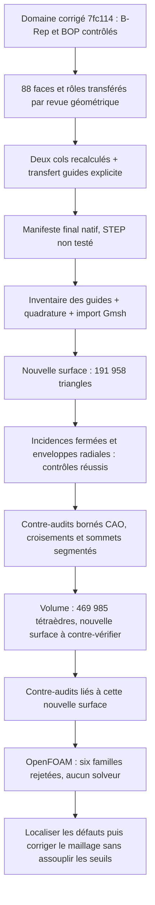

# M64 — remaillage du domaine natif à continuité segmentée

## Résultat actuel

Le domaine gazeux corrigé **`7fc114c1…` dispose maintenant d'un nouveau
maillage volumique de 469 985 tétraèdres**, calculé avec Gmsh 4.15.2 en
42,018 s. Ses onze gardes d'intégrité passent après relecture, mais
**OpenFOAM rejette sa qualité sur six familles de contrôles**. En amont,
1 343 éléments ont un SICN inférieur à 0,1, dont cinq sous 10⁻⁶.
Aucun solveur CFD n'a été lancé.

Une première passe de surface seule avait produit 191 958 triangles,
95 979 nœuds et 88 faces CAO en 8,365 s. La passe volumique a généré une
**autre surface**, comportant 191 956 triangles. Les contre-audits de la
première surface ne sont donc pas transférés à la seconde.

Les incidences d'arêtes forment une surface fermée : aucun bord ouvert,
arête surincidente, doublon de triangle ou orientation incohérente détecté.
Le contrôle des enveloppes radiales des huit portions guide–tige passe.
**Cela ne prouve pas encore l'absence de toutes les intersections ni la
conformité complète des triangles à la CAO.** Les contre-audits de
croisements, de la face 38 et des sommets/arêtes segmentés de la première
surface sont terminés dans leur portée bornée, décrite ci-dessous.
Les contrôles de croisements, de face 38 et des sommets segmentés ont été
répétés sur la surface de la passe volumique. La conservation de sa
frontière avant/après 3D est confirmée indépendamment. La revue autorisait
uniquement conversion et `checkMesh` ; elle n'a pas autorisé de solveur
et le résultat de qualité est maintenant rejeté.

Le [reçu agrégé](../twins/m64-cylinder-head/evidence/segmented-native-remesh-20260908.json)
conserve les empreintes exactes des entrées, programmes et résultats.
Les géométries, coordonnées et rapports détaillés restent privés.

## Un nouveau paquet, pas les résultats de l'ancien domaine

La [correction native](M64_CORRECTIONS_NATIVES_20260908.md) a remplacé une
arête portant trois cassures de tangente par quatre tronçons conservant
ces cassures. Elle n'a ni lissé le conduit ni redessiné la culasse.
Le paquet `7fc114c1…` contient un solide, 88 faces, 195 arêtes et
120 sommets. Son B-Rep exact et les cinq modes BOP employés passent.
La cible reste une culasse M64 biturbo quatre soupapes ; **700 PS au
vilebrequin est un objectif, pas un résultat atteint ou simulé ici**.

Les 88 faces sont réexportées depuis ce candidat. Leurs rôles sont
transférés par la correspondance indépendante des surfaces et contours,
et non par une simple réutilisation des numéros de faces. Le manifeste
préparatoire garde les contrôles locaux manquants à `null` ; seul le
manifeste final, lié aux nouvelles preuves, est admis par le profil natif.

Les deux cols d'admission ont été **réellement recalculés** : un solide
local valide chacun, BOP sans défaut détecté, sections d'extrémité
positives, absence de recouvrement avec l'autre siège et exclusion
géométrique du tronc. Le prédicat original est satisfait pour les deux ;
aucune exception C0 ni relaxation des seuils n'est employée.

La communication des prolongements annulaires de guides est une preuve
**héritée explicitement** de leur intersection avec le négatif d'admission
original, conservée par l'équivalence des surfaces et contours. Ce n'est
pas une nouvelle intersection calculée sur le gaz final. Les deux
fermetures `fixture_stem_seals` restent des joints idéalisés de banc,
sans qualification de fuite ou de joint réel.

Le [contre-contrôle Netgen antérieur](M64_NETGEN_CONTRECONTROLE_20260908.md)
concerne uniquement `3f20f4c5…`. Ses six familles de rejets OpenFOAM
restent rejetées ; aucune de ses acceptations partielles n'est attribuée
au nouveau candidat.

## Import et contrôles préalables

L'import natif Gmsh, exécuté séparément avant le maillage, conserve les
120 sommets, 195 arêtes, 88 faces et un volume. L'appariement des
88 descripteurs de faces est bijectif ; l'écart relatif d'aire globale
vaut environ 1,11×10⁻¹⁵. Aucun ajustement, changement d'échelle ou
traitement de réparation implicite n'est appliqué.

Le contrôle de volume compare des intégrations cohérentes :

| Intégration du nouveau domaine | Volume en unités de scan³ |
| --- | ---: |
| OCCT adaptative | 995 964,587087459 |
| OCCT non adaptative | 995 961,7063198228 |
| Import Gmsh observé | 995 961,706319823 |

La tolérance relative d'import reste **10⁻⁶**. L'écart entre intégrateurs
est conservé dans les reçus, pas présenté comme une déformation de la CAO.
L'ancienne référence non adaptative de `3f20f4c5…` n'est pas réutilisée.
Ces volumes ne sont pas des mm³ certifiés : l'échelle du scan reste une
hypothèse non vérifiée.

L'inventaire natif indépendant examine les 88 faces et 33 surfaces
cylindriques. Pour les sources guide–tige concernées, il couvre
14 fragments : huit portions annulaires sélectionnées et six portions
de tige hors bande, conservées dans l'inventaire avec exclusion explicite.
Ce reçu n'est pas une acceptation de maillage. Le prévol vérifie
90 fichiers d'entrée et retrouve les huit portions via l'appariement
réel Gmsh, avant tout test de leurs triangles.

## Chaîne de preuve et prochain verrou

Le mode `--segmented-native-only` du
[mailleur](../twins/m64-cylinder-head/source/flowbench-intake/mesh_gas_domain.py)
admet uniquement le paquet et l'inventaire nouveaux vérifiés. Il refuse
l'ancien avis C0 et les anciens reçus de maillage. Le registre ne contient
pas l'empreinte de son propre inventaire : les dépendances de preuve
restent acycliques. L'ancienne voie et ses gardes sont conservées.

La passe emploie `--face38-size 0.15 --guide-size 0.20 --stop-after-surface`.
Ces tailles locales sont des réglages numériques en unités de scan,
pas des tolérances de fabrication ni des garanties de taille effective.
Le programme mesure les enveloppes des triangles réellement produits,
sans transformer un réglage de taille en résultat de conformité.

## Contre-audits de la première surface

Les trois résultats ci-dessous sont liés exclusivement à la surface
`53753e6c…`, et non à la surface `006ffd46…` de la passe volumique.

Le filtre de croisements examine 992 211 paires candidates et ne confirme
aucun croisement traversant, en 26,447 s. Les cas coplanaires, à sommets
partagés et les contacts sur frontières ne sont pas classifiés par cette
méthode : ce zéro n'est **pas une preuve exhaustive de non-intersection**.

Sur la face 38, les 523 triangles sont sondés à leur barycentre et aux
trois milieux d'arêtes ; les 525 nœuds sont également examinés. Aucune
aire nulle, aire UV négative ou normale opposée n'est détectée aux sondes.
La distance maximale mesurée des sondes à la face CAO vaut
2,767×10⁻⁴ unité de scan, et l'aire triangulée est supérieure de 0,733 %.
Cependant le produit scalaire minimal des normales vaut **0,01446** :
un écart d'orientation important demeure à certaines sondes. Il ne faut
donc pas qualifier globalement la qualité de cette face comme acquise.
Sonder chaque triangle ne borne pas l'erreur sur sa facette entière.
Ce contrôle termine en 2,876 s, sans changement de géométrie ni de seuil.

L'audit des cassures retrouve les trois nouveaux sommets et leurs deux
extrémités : cinq ancres distinctes, appariées de manière unique avec
une distance mesurée nulle. Quatre chaînes de 12, 2, 2 et 2 segments
partitionnent exactement les 18 arêtes communes aux deux faces natives
adjacentes, sans omission ni double compte. L'ordre des paramètres natifs
est conservé. Ces faces sont distinctes de la face 38 analysée ci-dessus.
Ce contrôle d'incidence termine en 0,990 s ; il ne démontre ni la
classification native 1D des éléments Gmsh, ni la fidélité continue de
chaque corde à la courbe CAO. Il n'est pas une validation CFD.

## Volume obtenu et qualité OpenFOAM rejetée

Le nouveau fichier volumique `7774e94e…` contient un seul domaine
tétraédrique connexe. Aucun tétraèdre à volume direct négatif ou nul,
aucun Jacobien Gmsh non positif, ni triangle de frontière manquant ou
surajouté n'est détecté. La connectivité, les étiquettes et les comptes
d'éléments sont conservés après relecture MSH 2.2.

Son volume discrétisé présente un écart relatif d'environ **0,1012 %**
à l'intégration adaptative de la CAO, dans la garde grossière de 1 %
préexistante. Il ne faut pas confondre cette garde de discrétisation avec
la tolérance d'import CAO de 10⁻⁶. Le SICN minimal après relecture vaut
2,5073×10⁻⁷ : les cinq éléments sous 10⁻⁶ restent consignés. Les onze
gardes réussies sont des gardes d'intégrité, pas une acceptation CFD.

La seconde surface, `006ffd46…`, compte 191 956 triangles et 95 978
nœuds. Son nouveau contrôle de croisements examine 992 198 paires
candidates et ne confirme aucun croisement traversant, avec les mêmes
exclusions méthodologiques. L'audit répété de ses 523 triangles de la
face 38 retrouve les mêmes métriques numériques que sur la première
surface, notamment l'écart important des normales. Ces deux nouveaux
reçus sont liés au fichier exact de la seconde passe. L'audit des sommets
segmentés est également répété sur cette surface et passe dans sa portée
d'incidence, sans preuve supplémentaire de fidélité continue des cordes.

Le contre-audit avant/après 3D confirme exactement **95 978 nœuds et
191 956 triangles orientés, avec leurs groupes physiques et leurs
étiquettes de face**. Les identifiants de 191 472 triangles ont été
réaffectés et 484 sont conservés : cette permutation n'est pas une
modification des coordonnées ou de la connectivité géométrique. La
bijection compare aussi les valeurs ASCII, sans arrondir les coordonnées.
La revue liée au volume `7774e94e…` autorise uniquement la conversion et
`checkMesh`. Elle refuse explicitement toute autorisation de solveur CFD.

Le contrôle OpenFOAM du même fichier volumique est terminé. Les quatre
commandes `gmshToFoam`, `transformPoints`, `createPatch` et `checkMesh`
retournent chacune le code 0, mais le journal indique **six contrôles
échoués** et ne contient pas `Mesh OK`. Le superviseur termine donc avec
le code 2 ; un code de commande nul ne transforme pas ce rejet en succès.

| Famille rejetée | Nombre | Détail conservé |
| --- | ---: | --- |
| Cellules à rapport d'aspect élevé | 130 | Maximum : 23 937,1304 |
| Faces à forte distorsion (*skewness*) | 73 | Maximum : 346,4805 |
| Cellules à petit déterminant | 4 579 | Déterminant < 0,001 |
| Cellules concaves | 23 | Test par plans des faces |
| Faces à faible poids d'interpolation | 1 146 | Poids < 0,05 |
| Faces à faible rapport de volumes | 540 | Rapport < 0,01 |

Les 238 212 faces à non-orthogonalité supérieure à 70° constituent un
avertissement distinct : le contrôle correspondant reste marqué `OK`
dans ce journal, ce n'est pas une septième famille rejetée. Cinq arêtes
trop petites sont également signalées. Ces mesures ne constituent pas
une amélioration globale démontrée par rapport aux anciens maillages.

La conversion applique une seule fois le facteur de 0,001 m par unité
de scan, sous hypothèse non certifiée. Le changement de type du groupe
de paroi ne modifie pas sa géométrie ; les entrées originales restent
inchangées. Aucun solveur n'est exécuté.

## Vérification et limites

Les trois suites ciblées passent : **37 tests, zéro échec et zéro skip**.
Elles vérifient notamment les mélanges de domaines/empreintes, la
réutilisation d'un ancien reçu, les gardes manquantes et les assertions
STEP injustifiées. Le `make check` de ce nouveau lot termine avec le code
0 : 2 315 cas dans la suite principale, dont 108 ignorés, en 177,282 s.
Les cibles complémentaires terminent aussi. Le journal complet porte
l'empreinte `402e7a2df743be78765233354a5f0af2a058b3635db2b3f79fdd6e63fc8dd296`.
Ces succès logiciels ne sont pas une validation physique.

Le calcul utilise Kali ; aucune nouvelle location ou dépense Vast dans
ce lot. Les conteneurs de génération et de contrôle OpenFOAM sont terminés
et leur absence a été contrôlée par l'opérateur des calculs. Aucun solde
de compte n'est publié.

Les défauts ont ensuite été exportés sur une copie isolée du cas : dix
fichiers VTK et dix ensembles natifs de labels, en 18 s. Les six lignes
de rejet restent identiques et les fichiers géométriques de l'original
et de la copie sont inchangés. Les VTK servent à la localisation visuelle
en précision `float` ; les labels natifs, et non ces vues, font autorité
pour identifier les cellules et faces. Aucun solveur n'est exécuté.

La prochaine action est de **relier ces défauts aux surfaces fonctionnelles**,
puis modifier le maillage local ou volumique en fonction de cette analyse.
Chaque nouvel artefact devra conserver ses propres contrôles de frontières
et repasser les critères OpenFOAM. Cela n'autorise ni une modification
arbitraire de l'enveloppe de la pièce ni un relâchement des seuils.

**Le volume existe ; aucun calcul CFD, validation thermique/mécanique
ou qualification LPBF n'est acquis par cette passe.**
STEP n'a pas été testé pour ce candidat natif. L'ajustement moteur, les
interfaces et l'autorisation de fabrication restent non validés.
