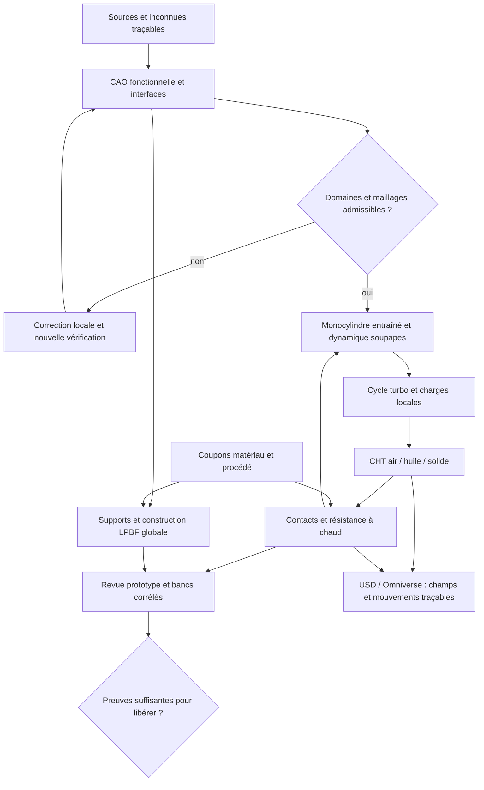

# M64 turbo : recherche, décisions et préparation des essais

Suite exécutée : [pilote de propositions CAO Qwen/Vast et contrôles natifs](M64_CAD_AGENT_PILOT_20260912.md).

Comparaison suivante exécutée : [cadrille et CAD-Recode sur une même découpe du scan](M64_CAD_SPECIALISTS_20260912.md).
Les deux reconstructions produisent un solide valide, mais omettent des perçages
et s'écartent du scan ; aucune n'est intégrée au modèle maître.

**Décision recommandée :** poursuivre la culasse quatre soupapes à enveloppe Porsche conservée, comparer air forcé seul et huile ciblée, puis sélectionner ensemble géométrie, matériau et procédé. La préparation rassemble quatre revues documentées, un répartiteur testé et une file de 24 missions de recherche. **Aucune nouvelle CAO, simulation moteur ou impression n'est réalisée par ces lecteurs documentaires.** L'exécution Vast est consignée séparément dans le [journal de recherche](research/M64_RESEARCH_VAST_RUN_20260912.md).

La cible nouvellement exprimée est **700hp**. Le dépôt conserve sa référence historique **700 PS au vilebrequin = 514,849 kW**. L'interprétation provisoire de 700 hp mécaniques donne **521,990 kW**, soit +1,387 %. Les deux conventions sont conservées ; ce n'est pas une puissance obtenue. Régime maximal, carburant, variante exacte, durée à pleine charge et norme de correction ne sont pas confirmés. Les scénarios 3,6 L/6 500 tr/min du dépôt restent des hypothèses, pas de nouvelles mesures.

## Dossier scientifique et portée

| Sujet | Livrable et usage immédiat |
|---|---|
| CAO, DAO, scan, LLM et vérificateurs | [Revue de dix publications](research/M64_CAD_LLM_REVIEW_20260912.md) : reconstruction locale éditable, conservation des interfaces, contrôle des cotes et coût des agents |
| CFD, thermique, fonctionnement et jumeaux | [Revue de dix publications](research/M64_CFD_TWINS_REVIEW_20260912.md) : cas mobiles, CHT, incertitudes, opérateurs appris et limites de généralisation |
| Procédé LPBF, huile et durabilité | [Revue de neuf publications](research/M64_LPBF_OIL_REVIEW_20260912.md) : bain local, distorsion globale, galeries, propreté et dépôts |
| Matériaux et transfert thermique | [Complément matériaux](research/M64_MATERIAL_REVIEW_20260912.md) : trois articles analysés, une piste 2026 non accessible, fiches et essais à obtenir |
| Travaux délégués | [24 missions JSON](research/m64-research-missions-20260912.json), exécutées par lots de quatre au plus ; [18 contrôles de citations réussis, six rapports refusés](research/M64_RESEARCH_VAST_RUN_20260912.md) |

Il s'agit d'une **revue ciblée**, principalement 2023–2026, arrêtée au 12 septembre 2026, complétée par les fondations et fiches utiles. Ce n'est pas une lecture exhaustive de tous les articles mondiaux. Chaque annexe distingue texte intégral, sections, résumé, notice et prépublication ; les gains publiés ne sont pas des gains mesurés sur M64. Les publications antérieures déjà traitées dans la [revue Neural Concept](M64_NEURAL_CONCEPT_20260912.md) sont réemployées, pas présentées comme une découverte nouvelle.

## Ce qui change réellement dans la stratégie

- **CAO :** essayer cadrille ou CAD-Recode sur une sous-zone documentée, contre un ajustement déterministe. Le succès d'un programme et sa ressemblance visuelle ne garantissent ni les cotes ni les tolérances. La boucle LLM décide d'opérations bornées ; le noyau CAO mesure et accepte ou refuse.
- **CFD/IA :** DoMINO/GINO servent à sélectionner des variantes après acquisition de données pertinentes. Un bon résultat intégré peut masquer une erreur locale importante : les températures aux ponts et contacts restent des sorties obligatoires. Les cas plafonnés, maillages refusés et résultats hors domaine ne sont pas des vérités d'entraînement.
- **Matériau :** garder CP1 pour la conduction, HT1 pour la résistance à chaud, AlSi10Mg comme témoin ; A20X demeure une alternative conditionnelle. Comparer les états de traitement réels et leurs courbes à chaud, pas seulement les valeurs ambiantes des brochures.
- **Fabrication :** distinguer bain local et distorsion de la pièce entière. La pluralité des lasers demande des essais de recouvrement/gaz ; elle ne qualifie pas automatiquement la pièce. Ne pas ajouter ExaCA/ExaConstit sans données permettant d'en exploiter les sorties.

Ces décisions sont des recommandations d'ingénierie issues des annexes, pas une déclaration que toutes les briques logicielles sont déjà intégrées.

## Air et huile : trois variantes, une même enveloppe

Le précédent Porsche ne démontre pas une impossibilité mathématique du quatre-soupapes à air. Swindon documente un kit M64 à air ; la puissance turbo et le procédé LPBF recherchés ne sont pas qualifiés par sa seule existence. La Porsche 935/78 employait déjà des culasses quatre soupapes **refroidies par eau** sur cylindres à air, selon Porsche. Le Singer DLS Turbo Road est aussi à culasses refroidies par eau. L'affirmation précise d'un échec Porsche dans les années 1960 n'est pas retenue sans source primaire correspondante.[^1][^2][^3]

| Variante proposée | Intervention | Compromis à calculer |
|---|---|---|
| A — air | Ailettes et carénages de référence ; distribution d'air contrôlée | Débit réel de turbine, recirculation, température des ponts, puissance absorbée |
| B — air + huile accessible | Poche ou jet ciblé vers les zones chaudes, accès de nettoyage et retour drainable | Débit disponible sans pénaliser la lubrification, échange, rétention d'huile, étanchéité |
| C — air + galeries LPBF | Quelques branches courtes en parallèle, collecteurs accessibles, sections fabricables selon orientation | Paroi résiduelle, déséquilibre des débits, rugosité, pression, dépoudrage et dépôts à chaud |

L'huile transporte la chaleur vers un échangeur ; elle ne la fait pas disparaître. Les trois variantes seront comparées avec **le même budget de puissance auxiliaire et les courbes réellement disponibles de ventilateur/pompe**, puis à conditions limites identiques pour isoler l'effet de géométrie. Les surfaces externes et interfaces restent verrouillées ; une modification n'est admise qu'avec bénéfice quantifié et preuve de compatibilité. Aucun contour ovale de substitution.

Le calcul doit inclure les ponts d'échappement et de bougie, chemins siège/guide–corps–ailettes, contacts thermiques et échauffement de l'air entre culasses. Éviter, au premier lot, les microcanaux et réseaux internes très tortueux : leur accessibilité et leur sensibilité hydraulique doivent être démontrées. Une galerie fermée sans évacuation de poudre est refusée.

### Contre-calcul élémentaire, explicitement hypothétique

\[
\dot Q_{huile}=\dot m\int_{T_e}^{T_s}c_p(T)\,dT,
\qquad P_{pompe}=\frac{\Delta p\,\dot V}{\eta}.
\]

Avec des **hypothèses illustratives**, 5 kW extraits par culasse, Cp constant 2 000 J/(kg·K), élévation d'huile 25 K et densité 850 kg/m³ : il faut 0,1 kg/s, soit **7,06 L/min par culasse**, ou **42,35 L/min pour six**. À 2 bar de perte de charge totale et rendement 0,6, la puissance de pompe correspondante serait **235 W**, hors autres consommateurs. Ces nombres ne sont ni le besoin thermique M64 calculé, ni la capacité de sa pompe, ni une consigne de montage. Ils rendent visible le besoin de vérifier le circuit complet et l'échangeur avant de dessiner des galeries.

De même, 700 hp mécaniques à 6 500 tr/min impliqueraient **766,9 N·m** et **26,77 bar de pression moyenne effective** pour un quatre-temps de 3,6 L. Cette dernière n'est **pas** la pression maximale cylindre. Les [bilans moteur existants](M64_700CH_ENGINE_RESEARCH.md) et le [cycle Cantera](M64_700PS_VARIABLE_THERMO_20260908.md) restent les témoins de départ ; aucune charge locale ne se déduit de la seule puissance.

## Plan opérationnel avec portes d'admission

| Lot | Travail préparé | Sorties exigées avant le suivant |
|---|---|---|
| G0 — contrat | Identifier variante, repères, unités ; inventaire scan/photos/cotes avec incertitudes | Tableau des interfaces et zones inconnues ; aucune cote absente inventée ; autorité du [contrat M64](../twins/m64-cylinder-head/interface-contract.json) inchangée |
| G1 — CAO/DAO | Surfaces fonctionnelles, chambre, quatre conduits/sièges/guides, bougie, porte-arbres, huile, fixations et usinage | Source éditable + STEP, coupe, plans à références fonctionnelles, nomenclature, écarts au scan, épaisseurs après usinage, accès outils/poudre/supports |
| V1 — distribution | Piston, quatre soupapes, ressorts, coupelles, demi-lunes, commande et contacts | Jeux à froid/chaud sur 720°, accélérations/efforts, compression maximale des ressorts, rebond/affolement, tenue siège/guide ; une levée imposée seule ne suffit pas |
| F1 — écoulement | Banc de flux à levées définies, puis cycle entraîné mobile | Débit/Cd, pression totale, structures d'écoulement, conservation au remaillage, fermeture des soupapes, périodicité ; comparer 2V/4V aux mêmes conditions |
| C1 — cycle turbo | Carburant et mécanisme documentés, admission/contre-pression, allumage et scénarios | p(angle), travail, résiduels, dégagement de chaleur et flux ; pression crête et cliquetis restent non établis sans modèle et corrélation adaptés |
| H1 — chauffe | Conduction/CHT et variantes A/B/C, air chaud, huile froide/chaude, transitoires et arrêt à chaud | Bilans gaz/solide/air/huile, températures et gradients locaux, débits/pression, puissance auxiliaire, températures de film ; sensibilité aux contacts et à la rugosité |
| S1 — résistance | Matériau à chaud, précharges goujons, frettage inserts, pression et champs thermiques | Équilibre efforts/moments, déformation/étanchéité, plasticité, relaxation/fluage, fatigue selon données ; cartes des points critiques, pas seulement p95 |
| P1/P2 — impression | Corriger le coupon puis activation des couches, supports, bridage, refroidissement, traitement, découpe et usinage | Aucun limiteur artificiel actif sur le domaine déclaré valide ; distorsion, contraintes résiduelles, accessibilité, nettoyage et épaisseurs finales ; recette machine identifiable |
| E1 — essais physiques | Coupons, secteur de galerie/siège, prototype et montée en charge instrumentée | Courbes débit–pression, CT/CND selon sensibilité, déformation, étanchéité, températures, pression cylindre, démontage et revue professionnelle |

Les sièges, guides, soupapes, ressorts et fixations sont des pièces d'assemblage avec matériaux/processus propres ; ils ne deviennent pas automatiquement des éléments imprimés en une pièce avec le corps. Le palier de puissance visé reste conditionnel aux limites de température, pression, vibration, lubrification et fuites définies avant essai. Une rampe au banc ne doit pas progresser simplement parce que le moteur tourne encore.

### Vérification et contre-calculs

Chaque cas recevra un budget d'erreur avant exécution. Pour les premiers témoins, des cibles **proposées**, non des normes de libération, sont un résidu de conservation inférieur à 1 % et une variation des grandeurs utiles inférieure à 5 % sous raffinement. Trois niveaux cohérents espace/temps, ordre observé lorsque pertinent et statistiques de cycles seront conservés. Les critères F50 historiques ne sont pas transférés automatiquement au corps M64.

Le contre-calcul de conduction peut être analytique puis FEM ; le bilan cycle indépendant doit contrôler énergie et travail ; le problème structural doit posséder un témoin analytique ou un second solveur sur un sous-problème identique. Deux solveurs partageant une mauvaise charge peuvent être d'accord. Un modèle appris sur le premier solveur n'est pas une méthode physique indépendante. Une preuve symbolique d'équation ne prouve pas que la pièce réelle respecte les hypothèses.

Omniverse recevra géométries, unités, mouvement, températures et contraintes **issus des solveurs**, avec empreintes et repères. Les étiquettes distingueront animation prescrite, solution numérique, modèle appris et données physiques. Le rendu ou une propriété de matériau USD ne valent pas calcul de résistance.

## Point de départ réel : ne pas refaire les échecs identiques

Le [lot q10/q20 du 12 septembre](M64_QUADRATURE_EXECUTION_20260912.md) a exécuté deux coupons à 40 µs. L'énergie retirée par le limiteur représente encore **9,8133 % / 8,8675 %** du laser absorbé ; les deux températures maximales sont censurées à 3 300 K. Cette paire ne prouve donc pas la convergence physique. Elle est distincte du coupon du 8 septembre à 109,55 µs. Corriger/calibrer source, propriétés et conditions physiques ; augmenter le plafond seul n'est pas une correction démontrée.

Le volume gazeux hybride et son pont vers un optimiseur tétraédrique restent refusés. La priorité CAO/maillage est la zone frontière et ses raccords, pas une nouvelle répétition de HXT ou un déplacement de points sur un sous-maillage incompatible. Les domaines solide, air externe et huile ne se déduisent pas de ce seul gaz d'admission.

Les [jobs 2–3–4 existants](M64_JOBS_234_20260912.md) restent la base de préparation. Leur paquet est générable localement mais n'admet pas les jobs complets à l'exécution. Les notes anciennes divergent entre MOOSE/MALAMUTE et Adamantine : un **seul témoin de distorsion commun** décidera du chemin retenu après vérification des fonctions et du coût, sans intégrer deux nouvelles chaînes complètes simultanément.

## Délégation des recherches et budget

Le pilote est terminé : 105 307 tokens traités sur Qwen/Vast, instance détruite,
baisse de crédit affichée de 0,224 USD (facture définitive non confirmée).
Les [résultats et limites du lot](research/M64_RESEARCH_VAST_RUN_20260912.md)
ne constituent pas une validation physique ni une mesure d'économie OpenAI.

Le dossier de référence est **GitHub** : `docs/research/`. Les rapports bruts des agents restent privés jusqu'à contrôle des citations, droits, informations sensibles et contradictions. Aucun token GitHub ou OpenBao n'est donné aux agents Vast ; publication depuis le poste autorisé. Le [manifeste](research/m64-research-missions-20260912.json) est consommé par un [répartiteur implémenté et testé](../twins/m64-cylinder-head/source/run_research_readers.py). Il exécute des missions indépendantes de lecture sur corpus fourni, pas des navigateurs autonomes parcourant tout le Web.

Le crédit initial relu via le wrapper OpenBao le 12 septembre est **38,2751 USD**, inventaire d'instances vide. Le plafond de campagne retenu reste 38 USD, pas 38 USD par agent. Proposition d'allocation, non un mécanisme de facturation : **8 USD maximum recherche**, **20 USD premiers pilotes CAE**, **6 USD réserve**, **4 USD non affectés** ; réduire ces montants si d'autres tâches consomment le compte. Un limiteur existant plus strict n'est pas contourné.

L'image Flash Next par digest `6b3b1790dd3140c27a5b5f85181dccef06c8d96c02f3003bb3c9b267b8758e34` a été relue dans GHCR : variante `linux/amd64` présente. Son profil documenté exige deux Blackwell 96 Go, au moins 128 Go de RAM et 300 Go de disque, pour environ 189 Go de poids. Cela n'établit ni son coût de chargement sur une offre actuelle ni le gain économique de 24 lecteurs. Un modèle public plus petit peut être comparé pour l'extraction documentaire, sans être présenté comme Flash Next ni comme son équivalent validé.

**Profil de recherche retenu :** Qwen3-Coder-30B-A3B-Instruct-FP8 public, sur une L40S, avec image vLLM et révision des poids épinglées. Il évite le transfert d'un secret HF. Le [profil borné](../deploy/vast/research/README.md) expose `research-offers`, `launch-research` et `reconcile-research` ; il ne modifie pas les anciens profils. Le collecteur a constitué 42 sources privées, dont neuf notices sans texte technique : le niveau d'accès et les SHA sont conservés. Ni le succès des tests hors ligne ni l'allocation d'une machine n'établissent que le modèle répond ; consulter le journal pour l'état réellement atteint.

Flash Next n'est pas présenté comme utilisé : le wrapper n'expose pas encore sa route dédiée et son lanceur exige un token même avec cache. L'[accès HF local vérifié](../deploy/openbao/HUGGINGFACE.md) n'établit pas un transfert sûr vers cette charge distante. L'ancien lancement avec API publique n'est pas utilisé.

Avant toute création : recette de lancement étroite, image et révision des poids épinglées, paire et association SSH vérifiées, API loopback/tunnel, bilan mémoire et coût stockage/transfert, plafond wall-clock et destruction externe vérifiée. Premier essai de **quatre missions**, puis les vingt restantes seulement si les sorties sont exploitables. Une mission rapporte au plus 800 mots, avec source, date, section, limites et application au M64. Les tokens réellement consommés sont mesurés ; aucun pourcentage d'économie OpenAI n'est inventé.

## Séquence courte et définition de « terminé »

1. **Recherche préparée :** conserver les revues, le corpus privé et la file de missions ; exploiter le pilote LLM seulement après ses contrôles réels ; figer les hypothèses et les références de la prochaine petite correction CAO.
2. **Premier lot de travail borné :** quatre agents lecteurs, une sous-zone CAO contrôlée et un diagnostic du coupon. Chaque tentative produit succès ou refus traçable ; le nombre de tentatives est limité, sans relance payante automatique.
3. **Après admission :** banc de flux, cycle entraîné puis combustion/CHT, contacts/résistance et construction LPBF globale. Le temps est estimé après un pilote sur le vrai cas ; aucune durée de calcul complète n'est garantie avant ces mesures.
4. **Clôture industrielle :** dossier editable et plans, gamme d'impression/traitements/usinage, matériau/processus qualifiés, pièces contrôlées et essais physiques corrélés avec revue professionnelle. Les moyens de calcul seuls ne remplacent pas ces éléments.

Avec le scan seul, les régions visibles peuvent être reconstruites et les inconnues encadrées pour les études. Les interfaces invisibles, la tenue réelle, la propreté interne et la qualification du lot ne peuvent pas être certifiées par multiplication de photos ou d'agents. Le statut actuel reste **préparation de recherche et d'essais, fabrication moteur non autorisée**.

## Sources constructeur et historique

[^1]: Porsche, [Porsche Heritage Moments : les variantes de la 935](https://newsroom.porsche.com/en/2026/history/porsche-heritage-moments-935-norbert-singer-timo-bernhard-42018.html), **30 mars 2026**, section 935/78. Source constructeur historique consultée, pas essai comparatif M64.
[^2]: Swindon Powertrain, [M64 24V Cylinder Head Kit](https://swindonpowertrain.com/wp-content/uploads/2025/10/M64-24V-Cylinder-Head-Kit-Product-Sheet-0923.pdf), fiche constructeur ; portée et date détaillées dans la revue LPBF/huile.
[^3]: Singer Vehicle Design, [DLS Turbo Services — Road](https://singervehicledesign.com/singer-in-the-world/featured-restoration-3/), section Engine, consultée le 12 septembre 2026. 710 HP SAE net annoncés avec culasses à eau ; ne valide pas notre architecture air/huile.
