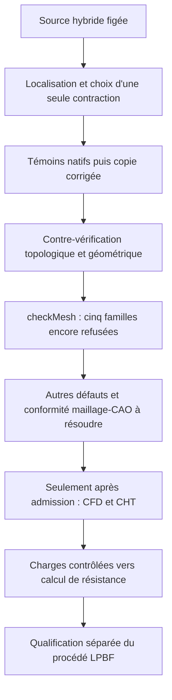

# M64 — correction contrôlée d'une très petite arête du maillage gaz

Une contraction locale est **exécutée et contre-vérifiée** sur une copie du
dernier domaine hybride. Le pire rapport d'allongement descend de 54 610 à
15 882. Le domaine reste cependant refusé sur cinq familles de qualité :
**aucune admission CFD, thermique, mécanique ou fabrication**.

Il s'agit d'une correction de discrétisation, pas d'une nouvelle forme de
culasse ni d'un gain de rendement. La CAO maîtresse n'est pas modifiée. Ce
candidat de maillage reste distinct de la référence précédente tant que sa
conformité à la CAO et les défauts restants ne sont pas résolus.

## Calcul effectivement exécuté

Base : le résultat des [57 groupes fusionnés](M64_HYBRID_PAIR_CORRECTION_20260909.md#complément--57-groupes-de-troisquatre-tétraèdres),
rapport privé `865b2e82…`. Parmi les 23 arêtes incidentes aux cinq points
signalés par OpenFOAM, deux sont sous le budget numérique de déplacement
`1e-7` dans le repère du maillage. Les quatre directions possibles passent le
contrôle local initial ; elles se recouvrent et **ne sont pas appliquées en lot**.

Un seul point de discrétisation est contracté vers un sommet existant :
`1177 → 65`, identifiants OpenFOAM de cette source seulement. Distance chargée :
`2.4139292929076296e-8` unité maillée. La mise à l'échelle antérieure
`0.001 m/unité scan` reste une hypothèse non certifiée ; aucune seconde mise
à l'échelle n'est appliquée.

La jonction concerne un cylindre de siège et une surface spline du conduit,
pas une ligne droite ou un plan présumé. Le budget numérique n'est ni une
tolérance constructeur ni une précision CAO acquise : `1e-7` unité maillée
correspondrait à `1e-4` unité scan, soit vingt fois la tolérance native de
courbe relevée de `5e-6`. Même un meilleur maillage ne lève pas cette réserve.

Le [programme C++](../twins/m64-cylinder-head/source/flowbench-intake/contract_edge/contractTetEdge.C)
reconstruit explicitement les faces des voisins survivants avec
`polyTopoChange`. Le simple déclenchement de `allowCellCollapse` dans
[edgeCollapser de Foundation 14](https://github.com/OpenFOAM/OpenFOAM-14/blob/7b05503f98a85be88af930df48623b4d152bfc35/src/polyTopoChange/polyTopoChange/edgeCollapser.C)
ne suffit pas à recoller les triangles devenus coïncidents.

Kali existante, image linux/amd64 `a233511b…`, OpenFOAM Foundation 14
`7b05503f98a8` : **17,908 s, nettoyage compris**. Plafond 4 CPU, 4 GiB,
270 s actives/300 s totales ; réseau désactivé, source montée en lecture seule.
Entrées inchangées, sortie 0, sans OOM ni timeout ; conteneur supprimé et
absence contrôlée séparément. **Aucune nouvelle location Vast pour ce pilote.**

## Résultats natifs

`checkMesh -allTopology -allGeometry -writeSets` est exécuté sur le fichier
réel sauvegardé, à précision 17. Sa sortie processus 0 ne vaut pas acceptation :
le journal se termine par `Failed 5 mesh checks.`.

| Contrôle | Avant | Après |
|---|---:|---:|
| Cellules | 785 474 | 785 472 |
| Points | 223 155 | 223 154 |
| Faces | 1 688 427 | 1 688 422 |
| Cellules trop allongées | 10 | 9 |
| Rapport d'allongement maximal | 54 610,283 | 15 881,968 |
| Cellules à faible déterminant | 1 963 | 1 961 |
| Faces à faible poids d'interpolation | 1 230 | 1 229 |
| Faces à faible rapport de volumes | 137 | 135 |
| Faces non orthogonales > 70° — avertissement | 3 448 | 3 447 |
| Faces trop obliques | 18 | 18 |
| Points sur de très petites arêtes — pas un nombre d'arêtes | 5 | 4 |

Les 67 200 hexaèdres, 384 pyramides et 309 polyèdres ne sont pas transformés.
Les 717 581 tétraèdres deviennent 717 579. Une région connectée et les trois
patches `walls`, `receiver_outlet`, `inlet` sont retrouvés.

La comparaison des neuf ensembles après correspondance des identifiants ne
trouve **aucune nouvelle entité défectueuse**. Elle distingue les suppressions
des vrais changements de classement : une image de face à faible rapport de
volumes et une image non orthogonale sortent de leurs ensembles. Le passage
de cinq à quatre points sur petites arêtes est un alias de points, pas la
disparition du défaut sur les quatre points restants.

## Contre-vérification et limites

L'auditeur séparé relit les deux maillages et reproduit les six tables de
correspondance, sans prendre les déclarations du programme C++ pour preuve.
Il retrouve deux tétraèdres retirés, trois faces dégénérées retirées et deux
paires de faces recollées. Les cinq tétraèdres locaux survivants sont
strictement positifs en arithmétique rationnelle sur les nombres chargés.
Toutes les coordonnées retenues restent identiques bit à bit.

La frontière **n'est pas déclarée identique** : son application affine
par morceaux est contrôlée, y compris les triangles aplatis en segments
effectivement présents dans la frontière candidate. La borne de distance
bidirectionnelle entre ces deux frontières discrètes est `1e-7` unité maillée.
Ce n'est pas une borne entre le maillage et la CAO.

Le delta de volume local est non nul et concorde exactement avec le delta
de volume orienté de la frontière affectée ; les valeurs rationnelles sont
conservées dans le reçu. Aucune absence globale d'intersections géométriques
ni conformité continue à la CAO n'est établie par cette opération.

Les [tests publics d'invariants](../twins/m64-cylinder-head/source/flowbench-intake/test_contract_edge_invariants.py)
passent. Avant le vrai cas, quatre témoins sont exécutés avec le binaire compilé :
une contraction de trois vers deux tétraèdres à volume exactement conservé,
puis trois refus sans écriture (distance excessive, point inexistant, paire
non arête). La suite pure comporte aussi les tests de nettoyage et de
contre-vérification. Les empreintes et résultats sont liés dans le
[registre de preuves](../twins/m64-cylinder-head/evidence/geometry-checkpoint-20260908.json),
clé `gas_short_edge_contraction`.

Bilan de vérification : **53 tests purs ciblés réussis**, quatre témoins natifs
réussis et `make check` complet, sortie 0. Certains tests natifs optionnels
du dépôt sont sautés faute de leurs runtimes ; ils ne sont pas comptés comme
réussis. Le pilote OpenFOAM décrit ici, lui, a bien été exécuté.

Reproduction du programme dans l'environnement Foundation 14 initialisé :

```sh
cd twins/m64-cylinder-head/source/flowbench-intake/contract_edge
wmake
m64ContractTetEdge -case /chemin/vers/copie-independante 1177 65 1e-7
checkMesh -case /chemin/vers/copie-independante -allTopology -allGeometry -writeSets
```

Les identifiants ci-dessus ne s'appliquent qu'à la source épinglée dans le
registre. L'utilitaire écrase **la copie** par défaut et écrit six tables dans
`contractionMaps`. Ne pas l'exécuter sur le maître, un cas avec des champs
solveur à conserver ou une autre génération de maillage. Les géométries privées
ne sont pas publiées ; les tests purs publics se lancent depuis le dossier
parent avec `python3 -B -m unittest -v test_contract_edge_invariants`.

## Suite et place de la stack photographiée



OpenFOAM, Elmer, PhysicsNeMo et Ditto/MQTT conservent les rôles distincts du
[plan multiphysique](M64_MULTIPHYSICS_EXECUTION.md#précision-du-9-septembre--calcul-ia-et-banc-séparés).
La nouvelle photo n'apporte pas de mesure de banc ni de modèle physique
qualifié. Aucun service de télémétrie, nouvel entraînement IA ou calcul
thermomécanique n'est présenté comme exécuté dans ce pilote.
