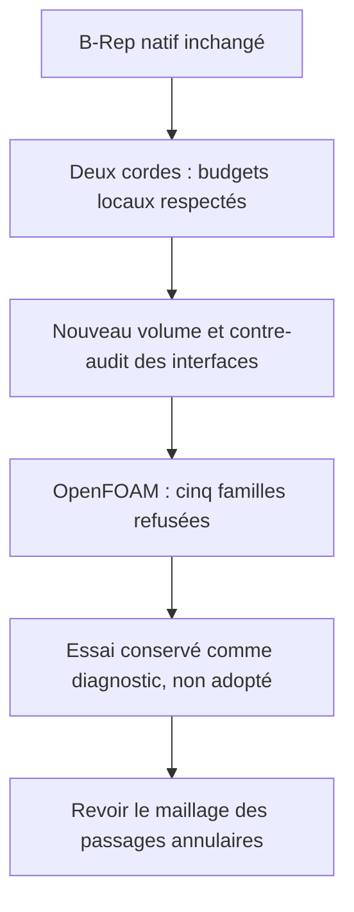

# M64 — remaillage à une corde des deux petites arêtes

**Essai réellement exécuté, non retenu : cinq familles de qualité OpenFOAM
restent refusées.** La CAO est inchangée et aucun solveur CFD n'est lancé.
Le nouveau maillage possède 401 854 tétraèdres ; réduire les deux petites
arêtes à une corde ne résout pas le problème global du maillage.

Cette suite des [bornes d'approximation](M64_NATIVE_EDGE_APPROXIMATION_20260908.md)
concerne le domaine gazeux du banc d'admission, pas une culasse métallique
complète. Référence issue du scan 935, échelle et interfaces M64 non certifiées.
La [capsule de preuves](../twins/m64-cylinder-head/evidence/native-short-edge-trial-20260908.json)
identifie sources, nouveaux maillages, contre-audits et journaux privés.

## Un changement numérique borné, pas une nouvelle forme

Le B-Rep `fab1338a…` et ses 86 faces restent bit-identiques. Sur les deux
arêtes natives 98/99 seulement, l'essai impose deux nœuds avec
[`setTransfiniteCurve`](https://gmsh.info/doc/texinfo/gmsh.html#index-gmsh_002fmodel_002fmesh_002fsetTransfiniteCurve).
Les extrémités/C0 ne sont ni déplacées ni fusionnées ; aucun passage n'est
fermé. Le rapprochement des entités repose sur leurs extrémités, faces
adjacentes et supports natifs, pas sur l'égalité supposée des numéros.

Budgets **nouveaux, déclarés avant cet essai** : Hausdorff local ≤ `2e−5`
unité de scan ; ruban remplacé / aire de la face siège ≤ `1e−6` ; flèche
radiale supplémentaire / rayon du siège ≤ `1e−8`. Ce ne sont ni des
tolérances de fabrication ni une réinterprétation de la tolérance native
`5e−6`. Le critère des jeux guide–tige reste séparément fixé à `0,0075`.

Les bornes sur les cordes réellement produites sont `1,5249863943e−5` et
`8,825649684e−6` unité, arrondies vers l'extérieur. Le ruban total est borné
par `4,12468119e−9` unité². Les tangentes natives ne sont pas exactement
représentées par ces segments. Aucune borne d'erreur de débit n'en découle.

Surface Frontal-Delaunay 6, volume Delaunay 1 et taille guide 0,20 sont
inchangés. La comparaison directe se fait avec la référence de 401 961
tétraèdres, **pas** avec les quatre faces MeshAdapt de l'essai précédent.
Onze tests unitaires passent, dont refus d'appariement ambigu, de liste
tronquée et de mauvaise classification. Ils ne remplacent pas le run natif.

## Contrôles réellement obtenus

Le mailleur Gmsh 4.15.2 termine en 35,885 s : une région, 186 364 triangles
de frontière, zéro Jacobien négatif ou nul ; les onze contrôles internes
passent. Le SICN minimal relu vaut `1,0457070e−5`, avec 515 tétraèdres sous
0,1 contre 491 dans la référence. Ce seuil SICN est diagnostique seulement.

Le contre-audit retrouve les **8 chaînes, 9 ancrages et 32 segments** du
nouveau maillage. Les surfaces pré/post3D et la frontière orientée des
tétraèdres coïncident. Les rôles des 86 faces et les trois groupes de
frontière sont revérifiés. Les huit fragments guide–tige passent le contrôle
des facettes entières ; marge radiale conservatrice minimale `0,00955030653`
unité. Cela ne prouve ni absence globale d'auto-intersections ni conformité
continue de toutes les facettes siège/conduit.

La conversion OpenFOAM repart d'un cas frais : conversion, application unique
de l'hypothèse `0,001 m/unité`, patches et `checkMesh -allTopology -allGeometry`.
Le code natif 0 n'est pas une réussite : le journal dit `Failed 5 mesh checks`,
et le superviseur retourne correctement 2. Aucun seuil OpenFOAM n'est modifié.

| Défaut natif | Référence tétraédrique | Une corde 98/99 |
|---|---:|---:|
| Rapport d'aspect excessif | 3 | 1 |
| Skewness excessive | 10 | 11 |
| Faible déterminant | 5 442 | 5 733 |
| Faible poids d'interpolation | 519 | 535 |
| Faible rapport de volumes | 149 | 141 |
| Faces non orthogonales > 70° | 262 008 | 259 035 |

La skewness maximale atteint 20,5224 ; le rapport d'aspect maximal 1 162,74.
Les comptes ne prouvent pas l'identité des cellules fautives entre maillages.
**Décision : essai non adopté**, références et essais antérieurs conservés.
L'amélioration partielle ne justifie pas de lancer la CFD. La prochaine
méthode devra traiter le raccord et la résolution des passages annulaires,
avec un contrôle neuf de leurs frontières ; une conversion polyédrique
brute ne constitue pas une correction démontrée.

## Ressources et limites

Kali x86 : quatre CPU, 4 Gio, réseau des conteneurs coupé et racines en
lecture seule. Maillage : 37 s murales supervisées, limite 300 s ; contrôle
OpenFOAM : 9 s. Les deux conteneurs sont retirés, absence vérifiée.
Aucune nouvelle location Vast par ce lot. Budget autorisé : 44 USD maximum,
sans recharge ; ce plafond n'est pas une mesure du solde restant.
Ni résistance, ni dissipation thermique, ni impression, ni 700 PS ne sont
validés par ce diagnostic de maillage.

Le checkpoint documentaire passe `make check` : 2 431 tests dans la suite
principale, dont 108 ignorés, en 178,292 s ; les autres cibles du Makefile
terminent également avec le code 0. Ce contrôle logiciel ne remplace pas les
critères natifs OpenFOAM refusés ci-dessus.
