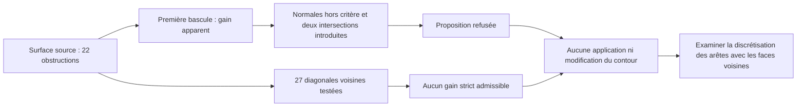

# M64 — bascules de diagonales et contacts voisins

**Aucune bascule appliquée.** La première proposition améliore certains
indicateurs, mais échoue au critère local des normales et introduit deux intersections
avec une face voisine. L'examen des 27 diagonales intérieures voisines ne trouve
aucune bascule unique strictement améliorante respectant tous les critères.

Ce calcul suit le [lissage isolé refusé](M64_SURFACE_RELOCATION_20260909.md).
Il porte sur la même surface MeshAdapt `7af7f207…`, face native 37 :
2 299 triangles, 22 obstructions au repère de borne SICN de 0,1.
Ce repère n'est pas un seuil universel CFD. Les coordonnées restent celles
du scan, sans qualification de l'échelle ou des interfaces M64.

## Première proposition : gain apparent, refus géométrique

Deux connexions de triangles sont remplacées **uniquement en mémoire**,
avec les mêmes quatre sommets. Les identifiants, coordonnées, raccordements
orientés et données hors cible restent identiques.

| Indicateur sur la face 37 | Source | Proposition non appliquée |
|---|---:|---:|
| Obstructions | 22 | 21 |
| Borne minimale | 0,0032268884 | 0,0032268884 |
| Angle minimal, degrés | 0,085767353 | 0,087457014 |

La nouvelle petite facette a un produit scalaire exact négatif avec chacune
des deux anciennes normales. Une contrelecture mathématique distincte confirme
ce résultat. Une amélioration de forme n'autorise donc pas cette bascule.

L'audit d'intersection filtre tous les éléments surfaciques par boîtes
englobantes fermées, puis contrôle **95 paires**, dont les deux paires internes
avant/après. Toutes les candidates sont des triangles ; aucun quadrilatère
ou élément inférieur orphelin ne reste à résoudre dans cette zone.

Les contacts admissibles sont limités au sommet ou à l'arête partagés par leurs
identifiants. Le calcul utilise des fractions exactes des coordonnées binary64,
sans marge géométrique ajoutée. Il trouve **zéro contact non conforme pour
les anciens triangles et deux nouveaux contacts non conformes avec la face 36**.
Les points témoins supplémentaires n'appartiennent à aucun des deux anciens
triangles : les contacts sont introduits par la proposition.

C'est une preuve sur ces facettes linéaires, pas une mesure de contact physique,
une preuve de couverture CAO continue ou un audit de toutes les paires du
maillage. Aucun raccordement CAD n'est redessiné.

## Énumération déterministe autour des 22 obstructions

Les 22 triangles touchent 46 arêtes uniques : 19 arêtes de frontière exclues,
**27 arêtes intérieures testées une fois**. Chaque proposition conserve les
sommets et remplace la diagonale de deux triangles de la même face.

Les gardes vérifient le contour orienté, l'absence d'une diagonale déjà utilisée,
les quatre produits de normales avant/après, puis les trois indicateurs
globaux : compteur non croissant, borne minimale non décroissante et angle
minimal non décroissant. Il faut au moins un gain strict. Les comparaisons de
qualité sont rationnelles ; les degrés et décimales servent à l'affichage.

| Motif de refus | Nombre de propositions concernées |
|---|---:|
| Normale locale hors critère | 14 |
| Nouvelle diagonale déjà présente | 4 |
| Aucun gain strict des trois indicateurs | 8 |
| Borne minimale dégradée | 3 |
| Angle minimal dégradé | 4 |
| Compteur aggravé | 1 |

Les motifs ne sont **pas exclusifs** ; leur somme n'est pas le nombre d'essais.
Aucune proposition ne passe. Les séquences de plusieurs bascules ou avec une
étape intermédiaire neutre ne sont pas explorées : aucune impossibilité générale
d'améliorer le maillage n'est déduite de ces 27 essais.
Les huit propositions neutres n'ont pas atteint les contrôles finaux de
topologie ; leurs UV et contacts ne sont pas vérifiés. Elles ne sont donc pas
déclarées admissibles pour une future séquence.

## Conséquence pratique et preuves conservées

La prochaine piste choisie est la discrétisation des arêtes avec remaillage
conjoint des faces raccordées. Le périmètre proposé est l'arête 82 et les
faces 30/37 ; l'arête 93, la face 36 et les 72 faces à quadrilatères restent
protégées. Un profil à 64 nœuds avec progression vers le petit segment voisin
est un paramètre d'essai numérique, pas une nouvelle cote de pièce. Il reste
à produire et contrôler. Une simple subdivision d'un long côté peut
transférer le triangle mince à côté ; elle ne suffit pas à elle seule.
Les courbes CAO et le contour Porsche restent fixes.

Le code Gmsh 4.15.2 inspecté montre que `generate(1)` efface les faces déjà
maillées. La future génération 1D doit donc précéder la réinjection du maillage
de référence ou utiliser un modèle temporaire séparé. Aucun appel 1D n'est
exécuté dans ce lot.

Les 21 tests logiciels distincts passent : sept pour le premier diagnostic,
quatre pour l'énumération et dix pour les contacts exacts. La commande générale
`make check` se termine avec le code 0 ; certains contrôles optionnels sont
signalés comme ignorés par leur environnement. Ce résultat vérifie le dépôt,
pas les performances physiques de la culasse. Les calculs purs
durent respectivement 2,292 s, 1,083 s et 0,867 s. Un travailleur de requête UV
native a été préparé mais **n'a pas été exécuté**, faute de candidat retenu.
Aucun nouvel export MSH/CAO, aucun calcul CFD/thermique/LPBF ni nouvelle
dépense Vast dans ce lot.

Les programmes, tests et reçus sont épinglés dans le
[registre de preuves](../twins/m64-cylinder-head/evidence/geometry-checkpoint-20260908.json),
entrée `gas_surface_diagonal_audit`. Les données géométriques et témoins
d'intersection détaillés restent privés. La surface de référence et le cœur
volumique diagnostique restent inchangés ; aucune aptitude à la fabrication
ou puissance moteur obtenue n'est déclarée.

