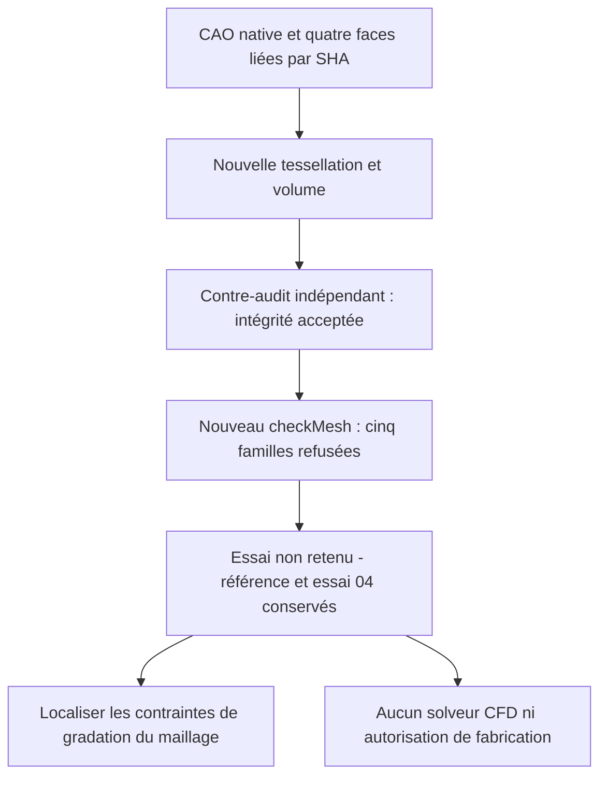

# M64 — remaillage local MeshAdapt de quatre faces natives

## Résultat : cinq refus OpenFOAM, essai non retenu

Un nouveau maillage du domaine gazeux contient **401 861 tétraèdres et
186 426 triangles de frontière**. Les contrôles internes du mailleur passent,
mais l'indicateur SICN se dégrade : **574 tétraèdres sous 0,1**, contre 491
dans la référence. Ce résultat n'est ni une amélioration globale démontrée,
ni une acceptation CFD, thermique, mécanique ou de fabrication. Le contre-audit
d'intégrité passe, mais le nouveau `checkMesh` refuse cinq familles de qualité.
**L'essai MeshAdapt n'est pas adopté ; référence et agglomération 04 sont conservées.**

Le périmètre reste le banc virtuel d'admission issu d'un scan de référence
935, pas une culasse métallique complète ou des interfaces M64 mesurées.
L'échelle absolue reste non certifiée. Ce checkpoint complète, sans le
réécrire, l'[essai d'agglomération locale](M64_AGGLOMERATION_LOCALE_20260908.md).
La [capsule de preuves](../twins/m64-cylinder-head/evidence/surface-meshadapt-trial-20260908.json)
lie les reçus privés et les résultats par leurs empreintes ; aucun maillage brut n'est publié.

## Pourquoi changer la tessellation, pas la CAO

Après l'agglomération 04, la localisation confronte réellement les identifiants
aux ensembles natifs exportés, pas seulement leurs comptes. Elle retrouve
2 886 cellules de faible déterminant, dont 2 082 touchent une frontière
annulaire ; les trois rapports d'aspect excessifs touchent la face native 37.
Les dix faces de skewness excessive se répartissent sur 28, 29 et 36.
Ces indices sont ceux de la partition native liée au domaine `fab1338a…`,
pas des tags Gmsh transférables arbitrairement à un autre corps.

Les diagnostics bornés d'union n'ont trouvé aucun groupe admissible parmi
92 candidats autour des défauts d'aspect, 478 autour des défauts de skewness
et 38 regroupements autour d'arêtes. Ces populations ne sont pas une preuve
d'impossibilité générale. Les 77 paires individuellement admissibles pour
le faible déterminant n'ont **pas été appliquées** ; leur compatibilité
collective et un maillage résultant ne sont pas démontrés.

Les arêtes natives 98 et 99 appartiennent au découpage C0, à l'interface des
faces 36 et 37 : ce ne sont pas des diagonales libres de triangulation.
La classification des nœuds est établie géométriquement sur la CAO ; le
MSH 2.2 conservé ne fournit pas les métadonnées brutes Gmsh dimension/entité
des nœuds. Aucune suppression de ces arêtes ni modification CAO n'est effectuée.

## Un seul changement de méthode

La copie privée du mailleur, source `da53681e…`, dérive de la version
`04811670…` réellement exécutée pour la référence de 401 961 tétraèdres.
Le B-Rep `fab1338a…`, le manifeste `58b8be5a…` et les aides de contrôle
restent inchangés. Quatre associations natives uniques sont vérifiées
par empreinte de face, rôle et correspondance vers le tag Gmsh :

| Faces natives | Rôle conservé | Algorithme de surface demandé |
| --- | --- | --- |
| 28, 29, 37 | Paroi de conduit | MeshAdapt 1 |
| 36 | Paroi de siège | MeshAdapt 1 |
| Les 82 autres | Rôles du manifeste conservés | Frontal-Delaunay 6 par défaut |

L'[API officielle Gmsh 4.15.2](https://gmsh.info/doc/texinfo/gmsh.html#index-gmsh_002fmodel_002fmesh_002fsetAlgorithm)
permet ce réglage par surface. Il ne garantit pas l'identité des triangles
entre deux exécutions : la nouvelle frontière doit être contrôlée séparément.
Les tailles et seuils sont inchangés : guides à 0,20 unité de scan, référence
native `815716df…`, borne de chordes/facettes 0,0075 et volume Delaunay 1.
Les contrôles réels du jeu restent actifs avant et après le maillage volumique.
Aucun traitement de réparation CAO, changement d'échelle ou fermeture de passage.

## Résultat observé du mailleur

| Mesure | Référence non qualifiée | Nouvel essai |
| --- | ---: | ---: |
| Tétraèdres | 401 961 | 401 861 |
| Triangles de frontière | 186 370 | 186 426 |
| SICN minimal après relecture | 1,29054 × 10⁻⁵ | 6,71132 × 10⁻⁶ |
| Tétraèdres de SICN inférieur à 0,1 | 491 | **574** |
| Jacobiens non positifs après relecture | 0 | 0 |

Le seuil SICN 0,1 est ici un indicateur diagnostique, pas un critère
d'acceptation CFD. Les onze gardes internes du mailleur passent, notamment
une région tétraédrique connectée, frontière complète et orientation positive.
Ils ne remplacent ni le contre-audit indépendant, ni `checkMesh`.
Le MSH est lié à `ba72d32a…`, le rapport à `e63d3693…` et le processus à
`e4956ddb…`. La source et les entrées natives sont vérifiées inchangées.

## Contre-audit réel, puis diagnostic natif refusé

Le reçu indépendant `c0ce7de8…` passe en **7,672 s** : les huit courbes
de l'interface native couvrent exactement 34/34 segments du nouveau maillage.
Les 93 213 nœuds de surface et 186 426 triangles orientés correspondent
exactement à sa frontière tétraédrique réelle. L'ancien critère limité aux
quatre chaînes C0 reste refusé (18/34) ; ce refus historique n'est pas effacé.
Ni les auto-intersections globales ni la fidélité continue de toutes les chordes
ne sont prouvées par cet audit d'incidence.

Le reçu `c46d8703…` contrôle séparément les rôles des 86 faces et les
groupes physiques effectifs : 184 973 triangles de paroi, 1 191 de sortie,
262 d'entrée, et 401 861 tétraèdres dans un volume `air`. Il autorise
seulement la conversion et `checkMesh`, pas l'exécution du solveur.

Le diagnostic OpenFOAM **14-7b05503f98a8** repart du nouveau MSH
`ba72d32a…`, dans un cas frais. Conversion, application unique de l'hypothèse
0,001 m/unité de scan et préparation des patches s'exécutent. Le journal
`d1792d84…` contient **`Failed 5 mesh checks`**, sans `Mesh OK`.
Le processus natif retourne 0, mais le superviseur rend correctement **2**
pour refus de qualité ; la séquence dure **9 s**, sans solveur.

| Critère natif | Référence tétraédrique | Agglomération 04 | MeshAdapt |
| --- | ---: | ---: | ---: |
| Rapport d'aspect excessif | 3 | 3 | 2 |
| Skewness excessive | 10 | 10 | 10 |
| Faible déterminant | 5 442 | 2 886 | **5 517** |
| Faible poids d'interpolation | 519 | 466 | **535** |
| Faible rapport de volumes | 149 | 146 | 149 |
| Faces non orthogonales à plus de 70° | 262 008 | 259 686 | 262 110 |
| Familles refusées | 5 | 5 | 5 |

MeshAdapt repart de la CAO, **pas** du maillage aggloméré : comparer son
effet direct à la référence tétraédrique. Le rapport d'aspect maximal baisse
à 1 162,02, mais la skewness maximale augmente à 13,5077. Les comptes égaux
ne prouvent pas l'identité des nouveaux labels. Aucun seuil n'est relâché.

**Décision :** conserver ce refus comme preuve, ne pas lancer la CFD et
ne pas enchaîner les 77 fusions marginales. Avant un autre essai, déterminer
les contraintes locales de gradation entre courbes natives et intérieur des faces.
Les trois segments critiques localisés sur l'agglomération 04 appartiennent
aux arêtes 98/99 ; les supprimer
sans justification changerait la géométrie. Aucune amélioration thermique,
résistance, impression ou performance moteur n'est démontrée ici.

## Ressources

Une exécution réelle de **37 s**, code de sortie 0, sur Kali x86 avec quatre
CPU et 4 Gio, réseau du conteneur désactivé et limite murale de 300 s.
Le conteneur du mailleur et celui du diagnostic sont retirés, absence vérifiée.
`make check` termine avec le code 0 : **2 425 tests principaux, 108 ignorés**,
en 178,572 s, puis suites complémentaires réussies. Ce passage utilise le
Python 3.10 de l'hôte ; les dépendances facultatives manquantes restent
signalées comme ignorées. Les 26 tests ciblés d'interface et les deux tests
du diagnostic OpenFOAM passent séparément. Aucun succès logiciel ne lève
les cinq refus de qualité du vrai maillage.

Aucune nouvelle machine Vast louée : **0 USD de nouvelle dépense Vast**,
pour un budget de projet autorisé de 44 USD. Les coordonnées, maillages et
détails du compte restent privés. Aucun solveur CFD n'a été lancé par cet essai.
