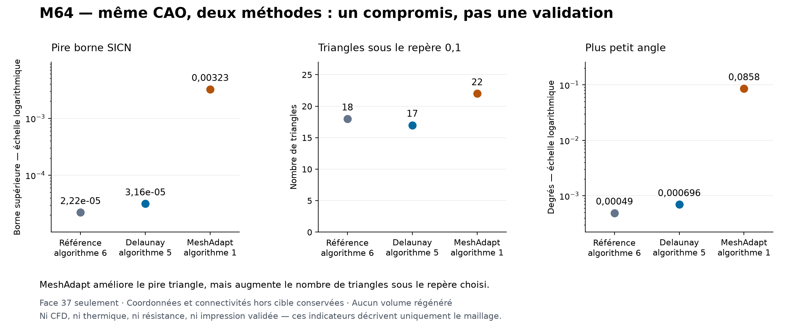
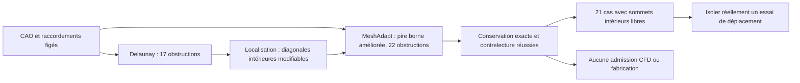

# M64 — comparaison Delaunay / MeshAdapt sur le conduit

**MeshAdapt améliore fortement le pire triangle, mais ne rend pas le maillage
admissible : 22 triangles restent sous le repère retenu, contre 17 avec
Delaunay.** Les deux essais conservent exactement les raccordements hors
cible et la même CAO. Aucun candidat n'est promu dans le maillage volumique.

Ce lot poursuit le [pilote de surface isolé](M64_GEOMETRY_CHECKPOINT_20260908.md).
Il porte sur la face gaz native 37, pas sur la culasse métallique complète.
Échelle absolue et interfaces M64 restent non certifiées. Les valeurs et
empreintes sont dans le [registre de preuves](../twins/m64-cylinder-head/evidence/geometry-checkpoint-20260908.json),
entrée `gas_surface_method_comparison`.

## Ce que la localisation a établi

Le fichier Delaunay `81bac4db…` contient 17 triangles dont la borne maximale
SICN, pour un tétraèdre positif partageant ce triangle, est sous 0,1.
La sélection utilise le test rationnel exact `S² > 841 D²`, sur les
coordonnées binary64 sauvegardées. Ce n'est ni un seuil CFD universel ni
la qualité mesurée d'un nouveau tétraèdre : aucun volume n'est généré.

Les 17 touchent une vraie arête de frontière : incidence triangulaire unique,
paire de nœuds identique à un segment MSH 1D et occurrence dans une wire CAO.
Quinze ont trois sommets classés 0D/1D ; deux ont un sommet intérieur 2D.
Une composante de 14 comprend 13 triangles incidents au nœud 1020, plus
une oreille sans ce nœud. Les diagonales de cet éventail ne sont pas des
segments 1D protégés. Des sommets fixes n'impliquent donc pas une
triangulation unique ou l'impossibilité d'insérer un sommet intérieur.

Les arêtes actuelles 98/99 sont partagées par les faces 36 (`walls_seat`)
et 37 (`walls_port`). Les 104/105 sont partagées par 37 et 41 ; la couture
répétée de 37 porte ici le numéro 101. Les numéros d'anciens B-Rep ne sont
pas transférables sans liaison vérifiée. Les faces 36, 37 et 41 ne font pas
partie des 72 faces quadrangulaires structurées.

Le plancher de taille `0,005` est supérieur à certains petits segments, mais
cela **ne suffit pas à expliquer le défaut**. La lecture de Gmsh 4.15.2
montre que Delaunay et MeshAdapt utilisent aussi les longueurs des segments
1D incidents pour définir leurs tailles locales. Une baisse aveugle du
plancher n'est donc pas retenue comme correction démontrée.

## Essai réellement exécuté

Un seul changement numérique : `setAlgorithm(2, target, 5)` devient
`setAlgorithm(2, target, 1)`. Les autres changements du travailleur sont
des libellés et noms de sorties. Entrées, paramètres de taille, tolérances,
visibilité temporaire, restauration exacte des identifiants et gardes
restent inchangés. Une seule génération 2D, aucun repli automatique,
aucune opération CAO de réparation ni appel explicite à un optimiseur.

| Indicateur, face 37 seulement | Référence, algorithme 6 | Delaunay 5 | MeshAdapt 1 |
|---|---:|---:|---:|
| Triangles | 2 289 | 2 471 | 2 299 |
| Triangles avec borne SICN < 0,1 | 18 | 17 | 22 |
| Minimum de cette borne | 0,00002223 | 0,00003157 | 0,00322689 |
| Plus petit angle, degrés | 0,000490 | 0,000696 | 0,085767 |
| Plus grand rapport côté / hauteur | 116 886 | 82 303 | 1 065 |

Le minimum de borne est environ 102 fois supérieur à celui de Delaunay,
mais le nombre sous le repère augmente. Ces métriques ne démontrent aucun
gain de débit, de température, de résistance ou de puissance moteur.

Le candidat MeshAdapt `7af7f207…` compte 85 300 nœuds, 31 896 triangles et
71 152 quadrilatères. Les neuf gardes natives et les quinze contrôles de
contrelecture passent. Les 155 segments orientés de frontière, trois cycles,
une composante et Euler −1 sont conservés. Tous les éléments hors cible
gardent leurs identifiants, connectivités, classes et coordonnées exactes.
Les deux avertissements concernant les entités 364/face 28 et 368/face 29
restent enregistrés. Ni couverture CAO continue ni absence globale
d'intersections ne sont prouvées par ces contrôles.

## Où agir ensuite

La seconde localisation recalcule les 22 cas MeshAdapt : 17 ont un sommet
intérieur 2D, quatre en ont deux et un n'en a aucun. Dix-huit touchent une
frontière, quatre sont intérieurs. Une composante contient 21 cas ; le cas
isolé conserve le triangle reliant les arêtes 82 et 93. Ces arêtes touchent
respectivement la face 30 et la face 36 en plus de 37 : les redécouper
exigerait de reprendre aussi les voisins concernés, pas seulement 36/37.

Une piste distincte est le déplacement des sommets intérieurs, sans changer
les connexions. **Ne pas lancer `optimize("Relocate2D", dimTags=[(2,37)])`
sur le modèle complet** : dans Gmsh 4.15.2, `dimTags` est ignoré et la boucle
visite toutes les faces. La visibilité et `force=False` n'isolent pas cet
appel. Il faut d'abord une représentation où seule la cible porte des
éléments 2D, puis une réintégration exactement contrôlée. L'objectif de cet
optimiseur est différent de notre compteur ; son nom ne garantit pas une
non-régression. Cet essai n'a pas été exécuté dans ce lot.

## Ressources et preuves

Kali x86, image immuable Gmsh 4.15.2 : quatre CPU, 4 Gio, réseau coupé,
entrées et CAO en lecture seule. Limite totale 300 s, dont 30 s pour le
nettoyage. MeshAdapt prend 16,16 s de travailleur, 16,86 s nettoyage inclus ;
contrelecture pure 1,70 s. Conteneur exact supprimé et absence revérifiée,
sans OOM ni timeout. Aucun nouveau coût Vast ; la liste d'instances relue
est vide. `make check` termine avec le code 0. Les tests de localisation et
de variante sont logiciels, distincts des calculs physiques à réaliser.

Le graphique est généré uniquement à partir des deux rapports natifs
épinglés et de leur référence commune, sans image de synthèse de la pièce.
Il n'expose ni scan, ni coordonnées privées. Sa création suit les règles de
visualisation : échelles logarithmiques annoncées, même référence et
limites de portée inscrites dans l'image.
