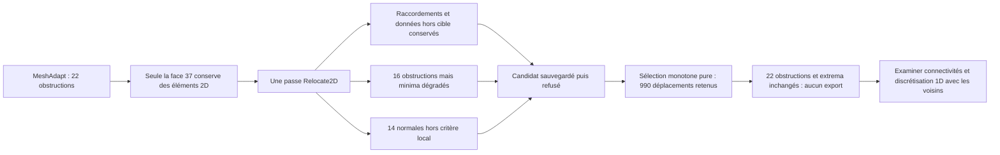

# M64 — déplacement de surface isolé, candidat refusé

**L'essai natif réduit les obstructions de 22 à 16, mais dégrade le pire
triangle et ne conserve pas l'orientation locale de 14 triangles selon le
contrôle retenu. Il est refusé.** Aucune modification du contour CAO, aucun
maillage volumique remplacé, aucune admission CFD ou fabrication.

Ce lot prolonge la [comparaison Delaunay / MeshAdapt](M64_SURFACE_METHOD_COMPARISON_20260909.md).
Il concerne uniquement la face gazeuse native 37. Les positions sont en
unités du scan, sans échelle absolue ni interfaces M64 certifiées.
Les empreintes des scripts, entrées et reçus figurent dans le
[registre de preuves](../twins/m64-cylinder-head/evidence/geometry-checkpoint-20260908.json),
entrée `gas_surface_isolated_relocation`.

## Isolation réellement exécutée

Le fichier MeshAdapt `7af7f207…` est réinjecté sur la même CAO épinglée,
avec paramètres reconstruits et contrôlés sans déplacer les coordonnées.
Tous les nœuds sont conservés. Seuls les 100 749 éléments 2D de 155 autres
faces sont temporairement retirés, par listes explicites d'identifiants dont
l'appartenance est relue avant chaque appel. La face 37 est alors la seule
portant des triangles ou quadrilatères. Les éléments 0D/1D restent présents.

Une seule passe `Relocate2D`, `niter=1`, est exécutée. Aucun appel de
génération, effacement global du maillage, reclassement ou renumérotation.
Le précontrôle vérifie l'absence de correspondances périodiques sur 291
arêtes et 156 faces ; les effets du post-traitement automatique restent
contrôlés immédiatement après l'optimisation.

Les données sont capturées **avant** la restauration des éléments retirés.
Seuls les sommets intérieurs de 37 peuvent bouger. Les éléments extérieurs
sont ensuite réinjectés avec leurs identifiants et connexions ordonnées
d'origine, sans réinjecter les nœuds ni les groupes physiques.

Les 994 déplacements observés concernent uniquement la cible. Les paramètres
des nœuds protégés restent exacts. Les 1 049 nœuds intérieurs de 37 sont
contrôlés par évaluation de leur surface native : résidu maximal
`1,3241e-13`, inférieur à la tolérance source `1e-7`, en unités du scan.
Cela ne prouve pas la couverture continue de la face par les triangles.

## Résultat et motif du refus

| Indicateur sur les mêmes 2 299 triangles | MeshAdapt source | Après une passe |
|---|---:|---:|
| Borne maximale SICN sous 0,1 | 22 | 16 |
| Minimum de cette borne | 0,0032268884 | 0,0021005109 |
| Plus petit angle, degrés | 0,085767353 | 0,046355451 |
| Plus grand rapport côté / hauteur | 1 064,805 | 1 237,641 |

Le repère 0,1 suit une obstruction à la qualité d'un tétraèdre partageant
un triangle fixé. Ce n'est ni la qualité mesurée d'un nouveau tétraèdre ni
un seuil universel d'acceptation CFD. Aucun volume n'est généré.

Les neuf gardes natives de conservation passent. La contrelecture pure,
indépendante du travailleur, passe **19 contrôles sur 20** : tous les
identifiants, classes, connexions, groupes, frontières et coordonnées hors
cible sont conservés. Le vingtième contrôle constate 14 produits scalaires
de normales avant/après non positifs, calculés exactement sur les coordonnées
binary64. Cela signifie un écart local d'au moins 90 degrés ; ce n'est pas
une preuve formelle de 14 inversions par rapport à la CAO ou d'intersections
globales. Ce contrôle conservateur suffit néanmoins à refuser le candidat.

Les trois critères de non-régression étaient fixés avant l'essai : compteur
non croissant, minimum de borne non décroissant, minimum d'angle non
décroissant. Seul le premier passe. Le contre-lecteur compare les minima
par invariants rationnels, sans marge introduite après observation :
`D²/S²` pour la borne, maximum de `cot²(angle)` aux coins aigus pour l'angle.
Les valeurs décimales du tableau ne servent qu'à l'affichage.

## Exécution, contrôles et suite

Kali x86, Gmsh 4.15.2 épinglé, quatre CPU et 4 Gio, réseau coupé et
entrées en lecture seule. Travailleur : 12,845 s ; nettoyage inclus :
13,511 s ; contrelecture : 2,649 s. La sortie normale 2 signifie le refus
qualité, pas un timeout ou un manque de mémoire. Le conteneur exact est
supprimé et son absence est vérifiée séparément. Aucune nouvelle dépense Vast.

Les 42 tests ciblés du travailleur, du contre-lecteur et du superviseur
passent, ainsi que 44 tests des bibliothèques réutilisées. Ce sont des tests
logiciels et synthétiques, pas des essais de résistance ou d'impression.
La vérification complète `make check` termine avec le code 0. Les tests
natifs ignorés par cette suite faute de dépendances locales restent ignorés ;
ce succès ne remplace pas les reçus natifs décrits ci-dessus.
Le fichier candidat est sauvegardé avant décision ; sa relecture dans le
travailleur utilise le parseur pur, pas une nouvelle importation native.

## Sélection monotone calculée, sans export

Un second calcul, **pur et non natif**, a essayé chacune des 994 propositions
une fois, par identifiant croissant, à sa position exacte proposée. Aucune
interpolation. Après chaque proposition, les normales sont comparées à la
référence et les trois indicateurs à l'état déjà accepté, pas seulement à
l'état initial. Les triangles incidents sont recalculés ; le bilan global
est également contrôlé après chaque acceptation et en fin de passe.

Le calcul accepte 990 propositions et en refuse quatre sur le critère des
normales. Mais il retrouve **exactement les trois indicateurs initiaux** :
22 obstructions, borne minimale `0,0032268884`, angle minimal `0,085767353°`.
Les extrema rationnels sont égaux, pas seulement leurs arrondis. Les vingt
contrôles de l'état final en mémoire passent. Huit tests synthétiques du
sélecteur passent ; le calcul sur les deux fichiers réels dure 8,369 s.

Le plan reste privé et **non appliqué** : aucun nouveau MSH ou B-Rep n'est
écrit. Il n'y a pas de gain sur les objectifs ciblés justifiant un effecteur
natif pour ce plan. Ce résultat n'exclut pas toutes les autres optimisations ;
il ferme cette sélection déterministe des propositions de cette unique passe.

La suite doit examiner les connectivités et la discrétisation des arêtes
avec les faces voisines concernées. Ni baisse du repère, ni répétition
aveugle du même optimiseur, ni modification des courbes CAO ne sont
autorisées par le résultat présent.

