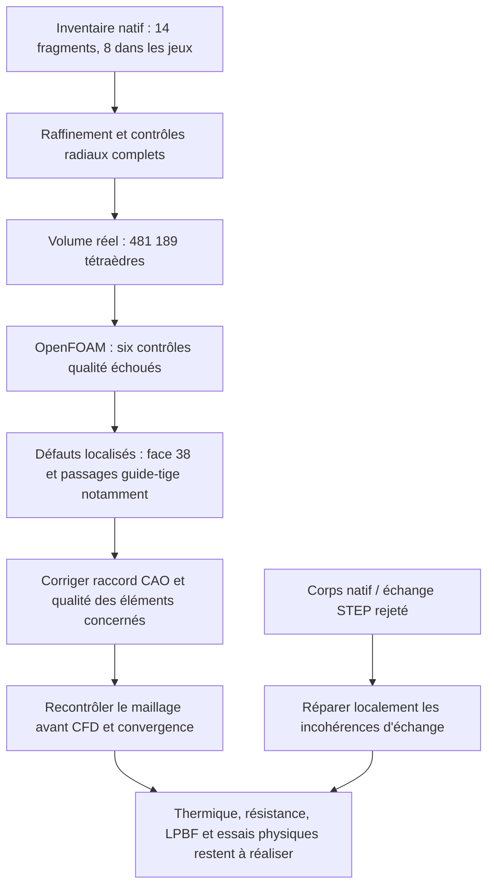

# M64 — premier volume d'admission maillé, qualité OpenFOAM rejetée

La [reprise de la représentation C0](M64_CORRECTIONS_NATIVES_20260908.md)
produit ensuite un autre candidat natif. Elle ne modifie pas le maillage
historique ni ses six rejets OpenFOAM documentés ci-dessous.

## Résultat

Le domaine gazeux natif `gas-domain-05` produit désormais **481 189 tétraèdres**.
Le défaut d'intersection qui interrompait la récupération de frontière a été
levé par le raffinement des huit portions cylindriques guide–tige. La CAO,
ses diamètres et ses tolérances n'ont pas été changés.

**OpenFOAM rejette cependant ce maillage sur six contrôles de qualité. Aucun
solveur d'écoulement n'a été lancé.** Ce lot ne valide ni la thermique, ni la
résistance, ni l'impression de la culasse.

La cible reste M64 biturbo, quatre soupapes, **700 PS au vilebrequin comme
objectif**, et non comme puissance obtenue. L'enveloppe vient toujours de la
référence 935 reconstruite ; `1 unité de scan = 1 mm` est une hypothèse non
étalonnée. Le volume d'air avec récepteur de banc ne doit pas être confondu
avec le corps métallique évidé `33375e12…`.

## Correction démontrée sur le maillage réel

L'[inventaire natif](../twins/m64-cylinder-head/evidence/native-gas-guide-eightface-inventory-20260908.json)
examine 88 faces, dont 33 cylindres. Quatorze fragments proviennent des
surfaces de guide/tige concernées : huit délimitent le jeu annulaire, six
prolongent les tiges hors guide. Ces six restent présents dans la CAO et dans
l'inventaire ; ils ne sont ni bouchés ni supprimés.

Chaque guide comporte deux portions de 12 et 23 unités. La marge radiale est
vérifiée sur **l'ensemble de chaque guide**, y compris entre subdivisions :
pire erreur d'enveloppe du guide + pire erreur de la tige, ramenées au même
repère, au plus 0,0075 pour un jeu nominal de 0,015 unité. Le minimum porte
sur toute la facette projetée, pas uniquement sur ses arêtes.

| Contrôle numérique | Admission 1 | Admission 2 |
| --- | ---: | ---: |
| Somme conservatrice des erreurs d'enveloppe | 0,00487646 | 0,00509289 |
| Jeu radial restant minoré, unités de scan | 0,01012354 | 0,00990711 |

Les bornes sont recalculées avant et après la génération 3D. Le champ local
vise `h = 0,20` sur les huit cylindres, combiné au `h = 0,15` de la face 38 ;
la taille cible n'est pas une borne garantie de longueur des cordes.

La surface préparatoire compte 191 968 triangles et 95 984 nœuds. Le balayage
des croisements ne retrouve aucun croisement strict, contre 56 dans le
dernier essai quatre-faces. Les résultats positifs éventuels sont confirmés
en arithmétique rationnelle ; **zéro résultat n'est pas une preuve exhaustive
d'absence**, notamment pour les coplanarités et contacts de bord.

Les sauvegardes de surface `2b0d0480…` et `5c3cfbed…` ont des empreintes
différentes. Elles ont donc été examinées séparément. L'image privée
`comparaison-coupe-guide-tige.png` montre une coupe réelle ancien/nouveau,
dans le même plan et à la même échelle ; ce n'est pas une carte thermique.

Un parseur indépendant compare ensuite la surface `5c3cfbed…` et la
frontière du volume final `98c6628b…` : mêmes 191 968 triangles orientés,
mêmes labels, mêmes 95 984 nœuds de frontière et **aucune différence de
coordonnée ASCII**. Le diagnostic de croisements se transmet donc à cette
frontière finale exacte, sans élargir son périmètre ni ses garanties.

## Volume et contrôle OpenFOAM

Le [reçu d'exécution](../twins/m64-cylinder-head/evidence/native-gas-eightface-volume-20260908.json)
lie les sources, entrées, maillages, contrôles et journaux. Gmsh 4.15.2
termine la génération en 48,28 s. Onze contrôles d'intégrité passent : région
unique, volumes positifs, frontière complète orientée, conservation des
groupes et connectivité après relecture, entre autres. **1 409 tétraèdres ont
un minSICN inférieur à 0,1, dont huit inférieur à 10⁻⁶.**

La sortie 2 du générateur conserve le statut « intégrité du maillage
diagnostique réussie, défaut C0 natif non résolu ». Elle ne signifie pas ici
un échec de tétraédrisation, mais n'autorise pas la CFD.

Une revue indépendante du fichier volumique `98c6628b…` confirme les 88
affectations de frontière : entrée 258 triangles, sortie 1 191, parois
190 519. Elle autorise seulement conversion et contrôle. Le
[programme de diagnostic](../twins/m64-cylinder-head/source/flowbench-intake/check_openfoam_mesh.py)
ne comporte **aucune étape de solveur**. Le même reçu est refusé par le
programme CFD, ce que vérifie un test de régression.

OpenFOAM Foundation 14 exécute `gmshToFoam`, une seule conversion d'unités
à 0,001 m/unité, `createPatch` et `checkMesh -allTopology -allGeometry`.
Les trois groupes sont conservés. Les quatre commandes retournent 0, mais
le journal dit explicitement **« Failed 6 mesh checks »** : le programme
enveloppe rejette correctement le cas, avec sortie 2.

| Contrôle échoué | Nombre détecté |
| --- | ---: |
| Cellules à grand rapport d'aspect | 139 |
| Faces très distordues (*skewness*) | 53 |
| Cellules à petit déterminant de qualité OpenFOAM | 4 243 |
| Cellules concaves selon les plans de leurs faces | 25 |
| Faces à faible poids d'interpolation | 1 200 |
| Faces à faible rapport de volumes voisins | 532 |

Le déterminant de qualité OpenFOAM n'est pas le Jacobien géométrique des
tétraèdres Gmsh. Des volumes positifs ne suffisent donc pas. Le journal
signale aussi 240 289 faces au-delà de 70° de non-orthogonalité, bien que
ce contrôle particulier soit annoncé `OK` par ses critères internes.
Aucun seuil n'a été abaissé.

Un second `checkMesh`, sur une copie inchangée, exporte les ensembles
défectueux avec `-writeSets -writeSurfaces -noFunctionObjects` et reproduit
les six rejets. La correspondance des points et des triangles de frontière
est vérifiée topologiquement, sans attribution arbitraire à la surface la
plus proche. La face 38 touche directement **69 des 139** cellules très
allongées et **17 des 25** cellules concaves ; 36 des 53 faces distordues
touchent cette région, directement ou via leurs tétraèdres adjacents.
Les petits déterminants concernent aussi les passages guide–tige.
Ces comptes de contact peuvent se recouvrir ; ils ne constituent pas des
régions disjointes. Les entités sans contact vérifiable restent non attribuées.

## Corps métallique : défaut STEP localisé, pas réparé

L'[audit STEP](../twins/m64-cylinder-head/evidence/ported-body-step-context-20260908.json)
identifie 23 faces `UnorientableShape` après import. Huit arêtes portent
aussi `InvalidCurveOnSurface` et `InvalidSameParameterFlag`, rattachées aux
faces STEP 407/408. Ces huit erreurs ne suffisent pas à expliquer les 21
autres faces rejetées.

Les 23 faces natives candidates de même index restent valides dans le
contrôle local. Leur comparaison par type et neuf points de support est
un diagnostic de correspondance, pas une preuve d'équivalence complète.
Les tolérances maximales d'arête passent de 5×10⁻⁶ dans le natif à
environ 10⁻⁷–3,85×10⁻⁷ après échange. Les vérifications directes d'orientation
des contours ne détectent pas d'erreur : retourner toutes les faces serait
donc injustifié. Il faut examiner localement les courbes paramétriques et
l'échange des tolérances, en contrôlant les écarts, sans agrandissement global.

Un premier diagnostic Mac a atteint sa limite CPU de 90 s avant son premier
résultat. Il est conservé comme incomplet. Le diagnostic STEP seul sur Kali
termine en 18,40 s, puis la comparaison locale en 0,32 s. Aucun *healing*,
réexport ou changement de géométrie n'est appliqué dans ce lot.

## Suite exécutable

Les corrections à venir doivent distinguer les défauts d'éléments intérieurs
des défauts de frontière/CAO C0. Une optimisation volumique ne réparera pas
nécessairement une frontière défectueuse. Les contrôles d'épaisseur globale,
interfaces moteur, maintien à chaud des guides, matière et procédé restent
également ouverts ; voir le [lot du corps](M64_CORPS_ADMISSION_MAILLAGE_20260908.md).

## Ressources et preuves

Calculs bornés sur Kali, sans réseau dans les conteneurs : maillage et
OpenFOAM limités à 4 CPU/4 Gio ; STEP à 2 CPU/4 Gio. Tous les conteneurs de
ces exécutions ont été supprimés après récupération, sans OOM observé.
**Aucune nouvelle dépense Vast.** Le contrôle des instances retourne une
liste vide pendant ce lot. Les données de solde restent privées.

Les tests logiciels, les observations géométriques et les résultats physiques
sont documentés séparément. Un test logiciel réussi ne qualifie pas une
culasse. Les maillages, scans et images dérivées restent privés ; GitHub
conserve le code, les diagrammes, les résultats agrégés et leurs empreintes.

### Vérification du dépôt

Le `make check` final termine avec le code 0 : suite principale de 2 291 cas,
dont 108 ignorés, sans échec ; les cibles complémentaires se terminent aussi.
Empreinte SHA-256 du journal privé complet :
`e8a60574ef85cc8c27b2eddea1b3c8fcb26d61c7b0b8967af64446d932bf29f1`.
Ce résultat porte sur le logiciel et les contrats de preuve, pas sur la
qualification mécanique ou thermique de la pièce. Le diagramme Mermaid est
fourni en source ; aucun contrôle de son rendu n'est revendiqué dans ce lot.

**Aucune autorisation d'impression fonctionnelle ou de démarrage moteur.**
