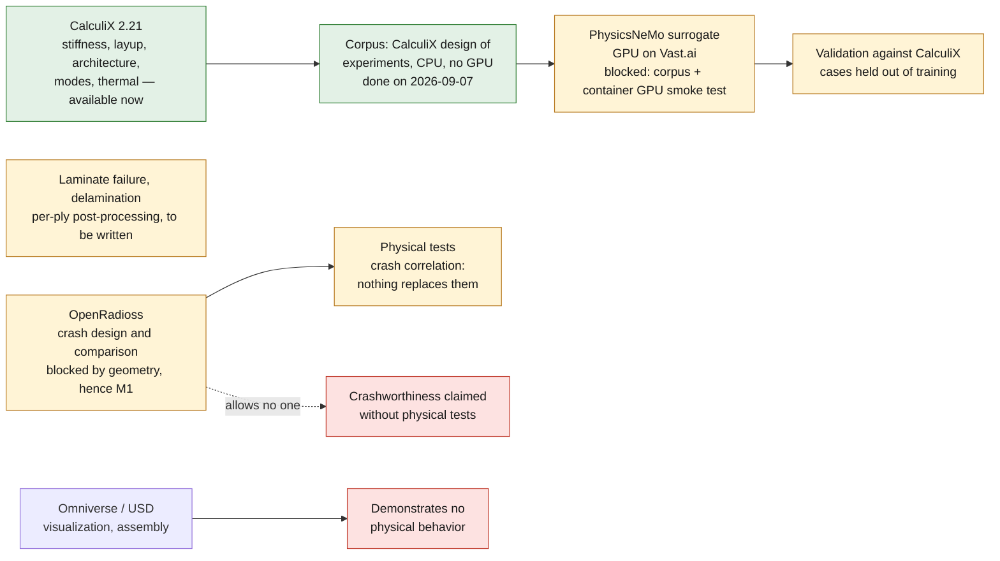

# Monocoque calculation chain: who does what, and where something else is needed

Question asked: do we need other software to calculate our alternative?
Short answer: **no for stiffness and layup, yes for crash.**

The chain at a glance (section 5 has the full sequencing):

## 1. What CalculiX does, and it is now proven

CalculiX 2.21 is the dossier's reference solver. Its composite capability was
not a given: it was established and validated on 2026-09-04.

- real multilayer laminate, `*SHELL SECTION, COMPOSITE`, one ply per layer;
- material orientation per ply and per panel family;
- orthotropic material, `*ELASTIC, TYPE=ENGINEERING CONSTANTS`;
- validation on an analytical case: uniaxial tension on a UD ply, E1 at
  0 degrees and E2 at 90 degrees recovered **to within 3 %**.

Three non-obvious constraints, recorded because they would cost a day to anyone
rediscovering them: `COMPOSITE` requires **quadratic** S6 or S8R shells; the 4th
field of a layer is an **orientation name** and not an angle; `OUTPUT=2D` is
**ignored**, the `.frd` carrying the expanded 3D model.

So it covers, without other software: torsional and bending stiffness, layup,
architecture comparison, natural modes, thermal, material and geometric
nonlinearity. That is the whole programme up to M6.

## 2. What CalculiX does not do, and what requires something else

| need | why CalculiX is not enough | tool |
|---|---|---|
| **crash, energy absorption, cell integrity** | implicit solver; crash is an explicit problem with large deformations, general contact and failure | **OpenRadioss** (open source, Altair, 2022); failing that LS-DYNA or Abaqus/Explicit |
| **laminate failure and delamination** | no built-in composite criterion: no Hashin, no Puck, no cohesive zone | per-ply stress post-processing, to be written; or a dedicated solver |
| **drapability** | a manufacturing question, not a mechanics one: a ply does not lie on an arbitrary double curvature | dedicated draping tool, all commercial |
| **high-dimensional exploration** | every calculation costs; thousands would be needed | surrogate model, see section 3 |

**Crash is the only real software lock in the programme**, and it falls exactly
on the `prohibited_pending_engineering` class.

### What actually exists in open source for crash

Verified on 2026-09-04.

| project | license | status |
|---|---|---|
| **[OpenRadioss](https://github.com/OpenRadioss/OpenRadioss)** | **AGPL-3.0** | **industrial** explicit solver, opened by Altair in September 2022. It is the same code as the commercial Radioss used in automotive crash by manufacturers. **The answer.** |
| FrontISTR | open | explicit present, much less mature in crash |
| Code_Aster, Elmer | open | rich, but they are not crash codes |
| CalculiX | open | implicit; off-topic for crash |

OpenRadioss reads its native `.rad` format, **the LS-DYNA `.k`/`.key` format
natively**, and Abaqus `.inp` through a converter. Interoperability is therefore
not an obstacle, and public human body models are usable.

**The caveat concerns composites, and it is serious.** The OpenRadioss
repository lists lightweight and composite materials as an area for
improvement, which means it is not its established strength, and the project's
issue tracker carries an open question on composite crash. Yet the crash
behavior of a carbon laminate — progressive crushing, delamination, fiber
failure — is **the hardest problem in all of crash simulation**, including in
commercial codes. It cannot be predicted without calibration on coupon tests
and crush-tube tests.

Conclusion to hold to: OpenRadioss makes it possible to **design** the
energy-absorption zones and compare architectures. It allows **no one**, neither
us nor a commercial vendor, to claim crashworthiness without physical tests.

## 3. PhysicsNeMo: where it really helps, and why not yet

PhysicsNeMo **is not a structural solver**. It is a physics-ML framework: it
produces surrogate models trained on existing calculations. It does not replace
CalculiX, it amortizes it.

Legitimate use in this programme: once the zoned layup is parameterized, the
design space has tens of dimensions — angles per zone, number of plies,
sections, ring heights. Exploring it by direct calculation is out of reach; a
surrogate trained on a few hundred CalculiX cases makes it practical.

**And NVIDIA publishes exactly this use case.** PhysicsNeMo ships a
`structural_mechanics/crash` example: a crash surrogate trained on existing
LS-DYNA simulations, read from `d3plot` files by PhysicsNeMo-Curator, with
several architectures — GeoTransolver, Transolver, MeshGraphNet, FIGConvUNet,
GeoFlare — on body-in-white, crash-absorber and bumper-beam cases.

Two lessons, and they confirm the role assigned here:

- **it is a surrogate, not a solver.** It learns from a crash code; it does not
  replace it. The chain remains solver -> corpus -> surrogate;
- **sample sizes are modest** — on the order of 121 training cases for the
  bumper beam. This is design exploration, not certification. The example
  carries its own declared limitations, moreover: incomplete normalization,
  `batch_size=1`.

Lead to verify: the example ingests LS-DYNA `d3plot`. Whether OpenRadioss output
connects to it directly, or needs a conversion, decides the cost of this
branch. To be investigated before committing to it.

**Three conditions, none met today:**

1. **A coherent corpus.** The dossier currently holds about fifteen cases,
   several with changing geometry. That is not a training set, it is a series
   of trials. Hundreds are needed, on a frozen parameterization.
2. **The repository rule.** `ROADMAP.md` puts "AI surrogate model before a
   coherent FEA/CFD corpus exists" out of scope. Condition 1 is not a
   preference, it is a written rule.
3. **The container.** `archive/917/docs/917_MODULAR_COMPUTE_STACK.md` states
   that `physicsnemo-cae-cu12` has a verified OCI lock but that **its GPU smoke
   test and its SSH transport are still false**: it is not authorized for a long
   job.

Add a hardware fact: **there is no GPU on this machine** (`nvidia-smi` absent).
All training goes through a Vast.ai rental, which
`containers/provision-vastai.sh` already provides for.

Sequencing consequence: PhysicsNeMo comes **after** corpus generation, which
needs no GPU — a CalculiX design of experiments is CPU computation, massively
parallel and runnable on any machine.

## 3bis. What is already ready for PhysicsNeMo, with no GPU or SSH

Prepared on 2026-09-04, precisely because the blocking condition — the corpus —
requires no particular hardware.

`fea/doe_corpus.py` produces the corpus by a CalculiX design of experiments:

- **frozen space**: seven architectures, eight `ASSUMED` sections swept by Latin
  hypercube, skin thickness and modulus. The plan therefore explores the
  model's uncertainty as much as the design;
- **field target, not scalar.** Each case keeps the nodal displacement field on
  its mesh. That is what justifies PhysicsNeMo: a scalar stiffness as a function
  of eight parameters could be regressed without it;
- **reproducible**: deterministic seeded sampling, parameters carried by each
  case, script digests in the manifest;
- **resumable**: rerunning completes a corpus instead of redoing it;
- **measured throughput: 2.3 s per case** at order 1. A thousand cases fit in
  40 minutes of CPU, on this machine, without renting anything.

To launch, later or now:

    python3 doe_corpus.py --smoke          # 4 cases, checks the chain
    python3 doe_corpus.py --n 1000         # training corpus

### Corpus generated on 2026-09-07

First complete corpus, seed 0, order-1 elements.

| quantity | value |
|---|---|
| cases requested / written | 1000 / **998** |
| duration | 35 min, a single core of a desktop machine |
| size | 126 MB |
| stiffness K | 365 to 26,637 N.m/deg, median 5535 |
| mass | 21.3 to 164.2 kg |
| nodes per case | 2,389 to 7,461 |
| non-finite fields, zero or negative K | **none** |

Distribution per architecture between 122 and 156 cases across seven families:
the plan is not biased. K spans a factor of 73 between the most compliant and
the stiffest case, which gives the surrogate something to learn other than
noise.

**The two lost cases are instructive.** Both are `fbtap` — the open cage:
B-pillars and sills with no windshield frame or roof to close the front.
CalculiX stops in the middle of factorization, with no message, which was first
read as the signature of a near-singular system — a near-mechanism that
computes badly because it is a near-mechanism.

**That reading was wrong**, and the enlarged corpus showed it: out of 3000
cases, eleven failures, all `fbtap` again. The message existed, but went to
`stderr`, which `run_fea.py` did not display. It says `fatal error in
GPart_makeYCmap / bad input`: it is **SPOOLES's graph partitioner** that fails,
not the system that is singular. It is deterministic, insensitive to the number
of threads, and CalculiX's iterative solver solves these same cases in about ten
seconds — which it would not do for a genuinely singular system. It remains true
that the architecture is not drawn at random: it is indeed the topology of the
open cage that trips the partitioner.

With the solver fallback, the corpus is complete: **3000 cases written, zero
failures**.

**Point for the training pass:** the number of nodes varies from case to case,
from 2,389 to 7,461. That is precisely why PhysicsNeMo's crash example works at
`batch_size=1`. Either that constraint must be accepted, or the mesh made
uniform, which would impoverish the corpus.

The `ASSUMED` sections of `build_body.py` can now be overridden through the
environment (`BODY_SILL_H`, `BODY_TUN_W`...). Without override, the published
values are unchanged: the reference case does give back 2442 N.m/deg.

### Enlarged corpus of 2026-09-07, and what its audit found

The corpus was redone at 3000 cases after the design of experiments was
corrected on two points (decoupling of G, refusal of an inconsistent resume). It
was then **audited before any training**, by `fea/corpus_audit.py`, and the
audit cost less than one minute of CPU for what it reported.

| quantity | value |
|---|---|
| cases requested / written | 3000 / **3000**, zero failures |
| duration | 1 h 48, four cores of a desktop machine |
| stiffness K | 376 to 44,242 N.m/deg, median 5826 |
| nodes per case | 2,402 to 7,530 |
| distribution across seven architectures | 394 to 442 cases, no deviation > 2 sigma |

**Three checks pass.** The exponent `d ln K / d ln t` is 1.00 on all seven
architectures: the scaling law linear in thickness is indeed in the corpus. The
sum `d ln K / d ln E + d ln K / d ln G` is 1.000 everywhere, as degree-1
homogeneity of linear elasticity requires — a check, not a fit. And the G
exponent rises from 0.364 on the bare floor pan to 0.631 on the closed cell:
the change of mechanism is present.

**One check fails, and it is the most important.** That rise in the G exponent
should start from **zero** on the bare floor pan, since `dominance_study.py`
measures +2.1 % there when doubling G. It starts from 0.364. The cause is not
the corpus but the element: the corpus is in **linear S3**, `dominance_study.py`
in **quadratic S6**, and S3 elements attribute to shear a share of the stiffness
that belongs to bending. The FEA dossier README quantifies the gap architecture
by architecture. A surrogate trained on this corpus would therefore learn, on the
open architectures, a wrong bending / shear split — the very one that decoupling
G was meant to teach it.

**The corpus also contains values that are simply wrong.** The log-linear fit
flagged an outlier; rerun, it gives 4422 N.m/deg instead of the 39,269 stored.
Of 65 cases rerun in total, two diverge — one by a factor of 9, the other by
2.4 %. The stored displacement field is consistent with the stored stiffness in
both cases: they come from the same failed solve, and **no internal check can
see them**. `fea/corpus_repair.py` reruns the corpus and replaces a value only
if two independent calculations agree against it.

**The validation set is frozen** (`corpus/split.json`, 450 cases out of 3000,
stratified by architecture, seed 20260907). It was drawn before any surrogate
existed, which is the only moment when that means anything: a test set chosen
after the fact is a grade you give yourself.

### S6 corpus, the one that will be used for training

Same seed and same plan as the S3 corpus, hence comparable case by case.

| quantity | S3 corpus | S6 corpus |
|---|---|---|
| cases written | 3000 / 3000 | **3000 / 3000** |
| element | linear S3 | **quadratic S6** |
| duration | 1 h 48 | 2 h 05, in twelve slices |
| size | 126 MB | 1.1 GB |
| nodes per case | 2,402 to 7,530 | 9,703 to 31,098 |
| K | 376 to 44,242, median 5826 | 133 to 33,455, median 3983 |
| G exponent, bare floor pan | 0.364 | **0.051** |
| G exponent, closed cell | 0.631 | 0.593 |
| thickness exponent | 1.00 | 1.14 to 1.22 |

**The check that disqualified the S3 corpus passes.** The G exponent on the
bare floor pan is 0.051 against 0.03 expected from `dominance_study.py`, versus
0.364 in S3. The bending / shear split is correct, and the surrogate can now
learn it.

**A new check must be read carefully.** The thickness exponent, exactly 1.00 in
S3, is 1.10 measured outside the corpus over five thicknesses, and 1.14 to 1.22
in the corpus's multivariate fit. The structure does not work in plate bending
— 1.10 is still very far from 3 — but the exactness of the linear law was a
property of the linear element, not of the structure. The FEA dossier README
carries the detail and the consequence for the 0.8 / 1.0 mm question.

The S3 corpus remains as a point of comparison for the effect of element order,
and for nothing else.

**The S6 corpus was rerun in full** by `fea/corpus_repair.py`: 2992 cases
confirmed to the digit, 8 replaced, none ambiguous, no failures. All eight are
among the first 360 cases, those computed while other tests were occupying the
machine; the following 2640 are all confirmed. The manifest carries the list of
replaced cases.

**The validation set is frozen**: `corpus_s6/split.json`, 450 cases out of
3000, stratified by architecture, seed 20260907. It designates exactly the same
cases as the S3 corpus's set — the draw depends only on the case numbers and
their architecture, identical from one corpus to the other — so the two corpora
are compared on the same held-out set.

**Remaining work once GPU access is available** — and none of it is blocking
today: conversion of the corpus to VTP or Zarr by PhysicsNeMo-Curator, choice
of architecture, training, and above all **validation of the surrogate against
CalculiX cases held out of training**. An unvalidated surrogate is worth no more
than a rendered image.

## 4. Omniverse: visualization and assembly, not physics

Omniverse and the SimReady chain serve for visual context, USD assembly and
rendering. **They demonstrate no physical behavior.** The 917 dossier already
states this rule word for word: « un rendu OVRTX, une photo ou un film ne
demontre ni comportement physique, ni puissance, ni tenue thermique, ni aptitude
a la fabrication » ("an OVRTX render, a photo or a film demonstrates neither
physical behavior, nor power, nor thermal performance, nor manufacturability").

It applies identically here, and more so: a beautiful image of a monocoque is
exactly the kind of evidence ZESAD does not provide, and that we have chosen not
to put up against it. Status of the images: the four `simready-*` images are not
authorized as long as their smoke tests are not green.

Useful and honest use: showing the registered datum network on the scan,
visualizing the load paths from CalculiX, presenting the assembly. Never as a
structural argument.

## 5. Sequencing

| step | tool | GPU | blocked by |
|---|---|---|---|
| stiffness, layup, architecture | CalculiX | no | nothing — **available now** |
| design of experiments, corpus | CalculiX in parallel | no | frozen parameterization |
| **corpus generation** | **CalculiX, CPU** | **no** | **done on 2026-09-07: 3000 audited S3 cases, S6 corpus in progress** |
| design surrogate | PhysicsNeMo | yes, Vast.ai | corpus + container GPU smoke test |
| crash | OpenRadioss | no | geometry, hence M1 |
| crash correlation | physical tests | — | nothing replaces them |
| visualization, assembly | Omniverse / USD | yes | image smoke tests |

**Nothing in this chain is currently blocked by missing software, except
crash.** What blocks is elsewhere: the datum network, and the absence of a
measured denominator. Adding solvers now would not advance the programme by a
single day.
