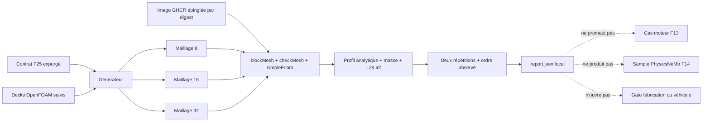

# Vérification OpenFOAM par Poiseuille — F25

## Objet

F25 vérifie uniquement que l'outil OpenFOAM de l'image CFD épinglée sait
mailler, résoudre et post-traiter un problème analytique synthétique. Ce jalon
est indépendant des cas solveur 917 F13 et du dataset PhysicsNeMo F14. Il ne
constitue ni une simulation moteur, ni une validation de conception, ni une
autorisation de fabrication.

Le contrat expurgé est
`outils/benchmarks/openfoam-poiseuille-f25/benchmark-contract-f25.json`. Il ne contient
ni chemin local absolu, ni identité de machine ou d'utilisateur, ni secret, ni
identifiant véhicule.

## Cas analytique

Le cas est un canal plan entre deux plaques immobiles, périodique dans la
direction de l'écoulement et extrudé sur une cellule. Une accélération volumique
constante `a_x` impose l'écoulement laminaire incompressible. Les conditions et
propriétés sont entièrement synthétiques :

- longueur `L = 0,1 m`, hauteur `H = 0,02 m`, profondeur `b = 0,01 m` ;
- viscosité cinématique `nu = 1e-5 m²/s` ;
- accélération `a_x = 0,01 m/s²` ;
- vitesse moyenne analytique `0,03333333333333333 m/s` ;
- Reynolds fondé sur `H` égal à `66,66666666666666` ;
- densité de référence `1,2 kg/m³`, utilisée uniquement pour convertir le
  débit volumique en métrique de masse, jamais par le solveur incompressible.

Pour `y` mesuré depuis le plan médian :

```text
u(y) = a_x / (2 nu) * (H² / 4 - y²)
Q    = a_x * b * H³ / (12 nu)
```

Les maillages uniformes comportent respectivement 8, 16 et 32 cellules dans la
hauteur. Une seule cellule périodique en longueur et une seule cellule vide en
profondeur suffisent, car la solution est pleinement développée et invariante
dans ces directions.

## Chaîne de preuve



Dans OpenFOAM 13, la commande historique `simpleFoam` présente dans l'image est
un wrapper vers `foamRun -solver incompressibleFluid`. Le rapport exige que
cette délégation, le bandeau de version 13 et le build 13 apparaissent dans
chaque log solveur. Le problème est linéaire, pleinement développé et sans
convection axiale : une correction SIMPLE suffit à résoudre le système depuis
le champ nul. La prolonger réinjecterait inutilement le bruit numérique du
couplage pression-vitesse dans un domaine entièrement périodique.

Le système de vitesse asymétrique utilise `PBiCGStab` avec préconditionnement
`DILU`. Le seuil `1e-8` porte explicitement sur le résidu final de `Ux` et le
seuil `1e-12` sur celui de `p` ; les résidus et nombres d'itérations de `Ux`,
`Uy` et `p` sont tous conservés dans la preuve et inclus dans la comparaison de
répétabilité. Le contrat n'impose pas un nombre universel d'itérations : le
rapport local doit donc toujours être lu pour ce point.

## Métriques et critères

Chaque répétition produit, pour les trois maillages :

- résultat de `checkMesh` et nombre de cellules attendu ;
- antisymétrie du débit entre les deux faces périodiques ;
- erreur locale de continuité sans dimension telle que rapportée par OpenFOAM,
  soit `deltaT × moyenne_volumique(|div(phi)|)` ;
- débit massique calculé avec la densité de référence synthétique ;
- erreurs de vitesse axiale `L2` et `Linf`, absolues et relatives ;
- vitesse transverse maximale ;
- ordre observé entre 8→16 puis 16→32 cellules.

Pour les `N` centres de cellules uniformes, avec
`e_i = Ux_i - u_analytique(y_i)`, l'analyseur utilise :

```text
L2_abs  = sqrt(sum(e_i²) / N)
L2_rel  = L2_abs / sqrt(sum(u_analytique(y_i)²) / N)
Linf_abs = max(|e_i|)
Linf_rel = Linf_abs / max(|u_analytique(y_i)|)
ordre    = log(erreur_h / erreur_h/2) / log(2)
```

Cette norme `L2` discrète est équivalente à une pondération volumique ici,
car toutes les cellules d'un maillage ont le même volume.

Le rapport global n'est `passed` que si :

- les six maillages passent `checkMesh` et les six solveurs terminent ;
- le résidu linéaire final de `Ux` reste inférieur ou égal à `1e-8` et celui
  de `p` inférieur ou égal à `1e-12` ;
- le défaut d'antisymétrie relatif des faces cycliques reste inférieur ou égal
  à `1e-10` ; ce contrôle de paire n'est pas une preuve indépendante de
  continuité locale ;
- la somme locale sans dimension de l'erreur de continuité rapportée par
  OpenFOAM (`deltaT × moyenne pondérée par le volume de |div(phi)|`) reste
  inférieure ou égale à `1e-12` ;
- sur le maillage fin, les erreurs relatives de débit, `L2` et `Linf` restent
  inférieures ou égales à `0,002` ;
- les ordres observés `L2` et `Linf` sont compris entre `1,8` et `2,2` ;
- les deux répétitions ont exactement le même SHA-256 canonique sur toutes les
  métriques comparées, y compris résidus, itérations et flags de complétion.

Les différences absolue et relative maximales restent publiées comme
diagnostics. La différence absolue agrège volontairement des grandeurs d'unités
différentes et ne doit donc pas être interprétée comme une norme physique ; le
hash canonique strict est l'autorité d'acceptation de la répétabilité.

L'agrégateur ne fait pas confiance au seul champ `report_status` des
répétitions. Il revalide leur forme, les maillages, les gates, le résidu `Ux`,
la continuité et les seuils fins, puis recalcule les ordres observés avant de
produire le claim limité de vérification d'outil. Une métrique absente, non
finie ou altérée ferme le rapport global.

Ces seuils vérifient la convergence attendue du schéma sur ce cas précis. Ils
ne qualifient aucun matériau, conduit, joint, composant ou régime moteur.

## Exécution locale

L'image est imposée par référence immuable :

```text
ghcr.io/cluster2600/3dprinting993-mesh-cfd@sha256:a1db60cbf61bbcca52c171e50cab01ed0b6ec860b227e7c5fc50f7b809659b4f
```

Depuis la racine du dépôt :

```bash
outils/benchmarks/openfoam-poiseuille-f25/run_local.sh
```

Le runner refuse d'écraser une sortie existante, impose `linux/amd64`, désactive
le réseau du conteneur et n'accepte qu'une destination sous `work/`. Chaque
conteneur ne monte que le cas qu'il traite, avec les protections suivantes :

- système de fichiers racine en lecture seule ;
- UID/GID de l'utilisateur hôte, `HOME=/tmp` et `/tmp` en `tmpfs` limité ;
- toutes les capabilities supprimées, `no-new-privileges` et 128 processus au
  maximum.

Un chemin alternatif peut être fourni, lui aussi sous `work/` :

```bash
outils/benchmarks/openfoam-poiseuille-f25/run_local.sh work/openfoam-poiseuille-f25-run-02
```

Les preuves détaillées restent locales :

```text
work/openfoam-poiseuille-f25/
├── container-image.json
├── repeat-1/
│   ├── cases/{coarse,medium,fine}/
│   └── metrics.json
├── repeat-2/
│   ├── cases/{coarse,medium,fine}/
│   └── metrics.json
└── report.json
```

Les répertoires temporels OpenFOAM, champs `U`, `p`, `C`, maillages `polyMesh`,
logs et post-traitements sont donc sous `work/`, répertoire ignoré par Git. Le
dépôt ne suit que le contrat, le générateur, l'analyseur, les decks d'entrée, le
runner, cette documentation et les tests.

L'image `mesh-cfd` historique reste une image large, construite et utilisée par
défaut comme `root` dans d'autres parcours du dépôt. F25 ne corrige pas cette
dette d'image : il confine son propre lancement avec l'utilisateur hôte, une
racine en lecture seule, un montage par cas et la réduction des privilèges. Une
future image minimale non-root constituerait une amélioration séparée, sans
modifier la portée numérique de ce benchmark.

## Limites et gates

Même avec un `report.json` à l'état `passed`, une seule assertion devient
possible : l'image épinglée a reproduit ce benchmark synthétique dans les
tolérances du contrat. Les gates suivants restent explicitement fermés :

- promotion d'un cas F13 ;
- création d'un sample PhysicsNeMo F14 ;
- claim de simulation ou de validation moteur 917 ;
- verrouillage de conception ;
- fabrication ;
- usage véhicule.
