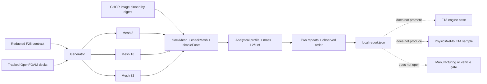

# OpenFOAM verification by Poiseuille — F25

## Purpose

F25 only verifies that the OpenFOAM tool in the pinned CFD image can
mesh, solve and post-process a synthetic analytical problem. This milestone
is independent of the 917 F13 solver cases and of the PhysicsNeMo F14 dataset.
It is neither an engine simulation, nor a design validation, nor a
manufacturing authorization.

The redacted contract is
`outils/benchmarks/openfoam-poiseuille-f25/benchmark-contract-f25.json`. It
contains no absolute local path, no machine or user identity, no secret and no
vehicle identifier.

## Analytical case

The case is a plane channel between two stationary plates, periodic in the
flow direction and extruded over one cell. A constant body acceleration `a_x`
drives the incompressible laminar flow. The conditions and properties are
entirely synthetic:

- length `L = 0.1 m`, height `H = 0.02 m`, depth `b = 0.01 m`;
- kinematic viscosity `nu = 1e-5 m²/s`;
- acceleration `a_x = 0.01 m/s²`;
- analytical mean velocity `0.03333333333333333 m/s`;
- Reynolds number based on `H` equal to `66.66666666666666`;
- reference density `1.2 kg/m³`, used only to convert the volumetric flow rate
  into a mass metric, never by the incompressible solver.

For `y` measured from the mid-plane:

```text
u(y) = a_x / (2 nu) * (H² / 4 - y²)
Q    = a_x * b * H³ / (12 nu)
```

The uniform meshes have 8, 16 and 32 cells across the height respectively. A
single periodic cell in length and a single empty cell in depth suffice,
because the solution is fully developed and invariant in those directions.

## Evidence chain


```mermaid
flowchart LR
    C[Redacted F25 contract] --> G[Generator]
    D[Tracked OpenFOAM decks] --> G
    G --> M1[Mesh 8]
    G --> M2[Mesh 16]
    G --> M3[Mesh 32]
    I[GHCR image pinned by digest] --> S[blockMesh + checkMesh + simpleFoam]
    M1 --> S
    M2 --> S
    M3 --> S
    S --> A[Analytical profile + mass + L2/Linf]
    A --> R[Two repeats + observed order]
    R --> P[local report.json]
    P -. does not promote .-> F13[F13 engine case]
    P -. does not produce .-> F14[PhysicsNeMo F14 sample]
    P -. does not open .-> FAB[Manufacturing or vehicle gate]
```

In OpenFOAM 13, the legacy `simpleFoam` command present in the image is
a wrapper around `foamRun -solver incompressibleFluid`. The report requires
this delegation, the version 13 banner and build 13 to appear in every solver
log. The problem is linear, fully developed and without axial convection: a
single SIMPLE correction is enough to solve the system from the zero field.
Extending it would needlessly reinject the numerical noise of the
pressure-velocity coupling into an entirely periodic domain.

The asymmetric velocity system uses `PBiCGStab` with `DILU`
preconditioning. The `1e-8` threshold applies explicitly to the final residual
of `Ux` and the `1e-12` threshold to that of `p`; the residuals and iteration
counts of `Ux`, `Uy` and `p` are all kept in the evidence and included in the
repeatability comparison. The contract does not impose a universal iteration
count: the local report must therefore always be read for this point.

## Metrics and criteria

Each repeat produces, for the three meshes:

- `checkMesh` result and expected cell count;
- flow-rate antisymmetry between the two periodic faces;
- dimensionless local continuity error as reported by OpenFOAM,
  i.e. `deltaT × volume_average(|div(phi)|)`;
- mass flow rate computed with the synthetic reference density;
- axial velocity errors `L2` and `Linf`, absolute and relative;
- maximum transverse velocity;
- observed order between 8→16 then 16→32 cells.

For the `N` uniform cell centers, with
`e_i = Ux_i - u_analytique(y_i)`, the analyzer uses:

```text
L2_abs  = sqrt(sum(e_i²) / N)
L2_rel  = L2_abs / sqrt(sum(u_analytique(y_i)²) / N)
Linf_abs = max(|e_i|)
Linf_rel = Linf_abs / max(|u_analytique(y_i)|)
ordre    = log(erreur_h / erreur_h/2) / log(2)
```

(`u_analytique` is the analytical velocity, `ordre` the observed order and
`erreur` the error; the symbol names are kept as used by the analyzer.)

This discrete `L2` norm is equivalent to a volume weighting here,
because all cells of a mesh have the same volume.

The global report is only `passed` if:

- the six meshes pass `checkMesh` and the six solver runs complete;
- the final linear residual of `Ux` stays less than or equal to `1e-8` and
  that of `p` less than or equal to `1e-12`;
- the relative antisymmetry defect of the cyclic faces stays less than or
  equal to `1e-10`; this pair check is not independent evidence of local
  continuity;
- the dimensionless local sum of the continuity error reported by
  OpenFOAM (`deltaT × volume-weighted average of |div(phi)|`) stays
  less than or equal to `1e-12`;
- on the fine mesh, the relative flow-rate, `L2` and `Linf` errors stay
  less than or equal to `0.002`;
- the observed `L2` and `Linf` orders lie between `1.8` and `2.2`;
- the two repeats have exactly the same canonical SHA-256 over all compared
  metrics, including residuals, iterations and completion flags.

The maximum absolute and relative differences stay published as
diagnostics. The absolute difference deliberately aggregates quantities with
different units and must therefore not be interpreted as a physical norm; the
strict canonical hash is the acceptance authority for repeatability.

The aggregator does not trust the `report_status` field of the repeats
alone. It revalidates their shape, the meshes, the gates, the `Ux` residual,
continuity and the fine-mesh thresholds, then recomputes the observed orders
before producing the limited tool-verification claim. A missing, non-finite or
altered metric closes the global report.

These thresholds verify the expected convergence of the scheme on this
specific case. They qualify no material, duct, seal, component or engine
operating point.

## Local execution

The image is imposed by immutable reference:

```text
ghcr.io/cluster2600/3dprinting993-mesh-cfd@sha256:a1db60cbf61bbcca52c171e50cab01ed0b6ec860b227e7c5fc50f7b809659b4f
```

From the repository root:

```bash
outils/benchmarks/openfoam-poiseuille-f25/run_local.sh
```

The runner refuses to overwrite an existing output, imposes `linux/amd64`,
disables the container network and only accepts a destination under `work/`.
Each container mounts only the case it processes, with the following
protections:

- read-only root file system;
- host user UID/GID, `HOME=/tmp` and `/tmp` as a limited `tmpfs`;
- all capabilities dropped, `no-new-privileges` and 128 processes at
  most.

An alternative path can be given, also under `work/`:

```bash
outils/benchmarks/openfoam-poiseuille-f25/run_local.sh work/openfoam-poiseuille-f25-run-02
```

The detailed evidence stays local:

```text
work/openfoam-poiseuille-f25/
├── container-image.json
├── repeat-1/
│   ├── cases/{coarse,medium,fine}/
│   └── metrics.json
├── repeat-2/
│   ├── cases/{coarse,medium,fine}/
│   └── metrics.json
└── report.json
```

The OpenFOAM time directories, `U`, `p`, `C` fields, `polyMesh` meshes,
logs and post-processing are therefore under `work/`, a directory ignored by
Git. The repository only tracks the contract, the generator, the analyzer, the
input decks, the runner, this documentation and the tests.

The historical `mesh-cfd` image remains a broad image, built and used by
default as `root` in other paths of the repository. F25 does not fix this
image debt: it confines its own launch with the host user, a read-only root,
one mount per case and reduced privileges. A future minimal non-root image
would be a separate improvement, without changing the numerical scope of this
benchmark.

## Limits and gates

Even with a `report.json` in the `passed` state, only one assertion becomes
possible: the pinned image reproduced this synthetic benchmark within the
contract tolerances. The following gates stay explicitly closed:

- promotion of an F13 case;
- creation of a PhysicsNeMo F14 sample;
- any 917 engine simulation or validation claim;
- design freeze;
- manufacturing;
- vehicle use.
