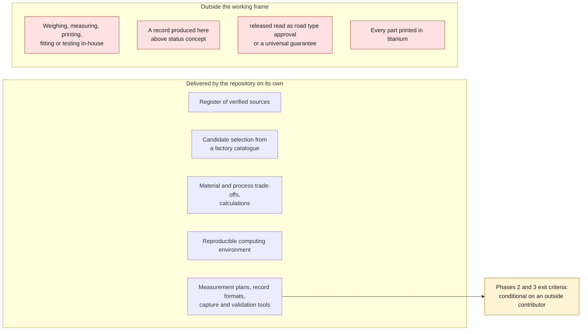

# Project charter

## Vision

Make Porsche 993 parts that have become rare, fragile or unfit for use
reproducible, by developing them in a functional digital twin built zone by
zone. The CAD sources, interfaces, measurements, uncertainties and actual
validation levels stay published and editable.

The titanium focus means the project controls the path from a measurement or a
scan to an auditable Ti-6Al-4V manufacturing request. It does not mean that
every part must be printed in titanium.

## Users

- Porsche 993 owners and restorers
- Independent workshops
- CAD designers and reverse-engineering specialists
- Polymer and metal printing service providers
- Engineers able to review calculations, processes and tests

## Deliverables

For every published part:

1. a structured, sourced record;
2. a parametric or STEP model;
3. a measurement plan;
4. a prototype file;
5. the relevant manufacturing instructions;
6. the fit and test evidence;
7. an explicit license;
8. a version and a change history.

For every zone of the twin: host geometry, reference frame, components,
interfaces, acceptance rules, accuracy, numerical report and physical
correlation.

## Success metrics

- Percentage of parts with complete license and provenance
- Percentage of parts with an editable source file
- Number of prototypes with a documented fit
- Number of sub-twins at level `F2_interface` or higher
- Gap between predicted numerical margins and physical checks
- Number of parts tested on several vehicles or variants
- Rate of defects or corrections after publication
- Number of titanium parts with material traceability and an inspection report

## Decision governance

- An issue carries the initial discussion.
- A lasting decision is summarized in `docs/decisions/`.
- A pull request changes the record and the affected files.
- Automated validation checks structure, not mechanical safety.
- A part can be downgraded immediately if new evidence contradicts its status.

## Definition of "done"

A part is done only when its record's status matches the evidence present in
the repository. `released` means ready to be reproduced within the documented
limits, not type-approved for road use nor universally guaranteed.

## Operating constraint: no physical access

The maintainer of this repository has access to no 993, no spare part and no
measuring instrument. Nothing will be weighed, measured, printed, fitted or
tested in-house.

This is not a gap to fill; it is the working frame. It has three consequences,
which act as rules:

1. **A record produced here caps at status `concept`.**
   `dimensionally_reviewed` requires measurements and `prototype_fitted` a fit:
   neither is reachable without an outside contributor.
2. **The exit criteria of phases 2 and 3 depend on a third party.** They are not
   abandoned; they are conditional. The repository prepares everything that can
   be prepared — measurement plans, record formats, capture and validation
   tools — so that a contribution is usable as soon as it arrives.
3. **The capture tools exist to validate what others send in.**
   `scripts/capture_caliper.py` and `scripts/capture_photoset.py` exist so that
   a figure from outside carries its instrument, its uncertainty and its method,
   instead of being a number on a forum.

What the repository can deliver on its own is still substantial: a register of
verified sources, candidate selection from a factory catalogue, quantified
material and process trade-offs, calculations, and a reproducible computing
environment.

