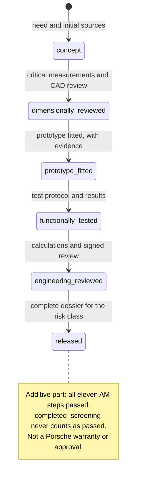

# Quality gates

| Status | Required evidence | What the status does not mean |
|---|---|---|
| `concept` | Need and initial sources | Correct dimensions |
| `dimensionally_reviewed` | Critical measurements and CAD review | Confirmed fit |
| `prototype_fitted` | Prototype fitted, with evidence | Durability in service |
| `functionally_tested` | Test protocol and results | Universal type approval |
| `engineering_reviewed` | Calculations and signed review | Validated series production |
| `released` | Complete dossier for the risk class | Porsche warranty or approval |

## Automated rules

Among other things, the validator blocks:

- a record with no source or no license;
- a generation other than 993;
- an unknown identifier or status;
- a titanium part without treatment, inspection and isolation requirements;
- a released critical part without a reviewer, evidence and inspection;
- a new LPBF/DMLS candidate part missing from the mandatory AM register;
- an additive part declared `released` without all eleven AM steps at status
  `passed`, including full-part slicing, the process, Omniverse and physical
  correlation;
- a measurement whose value does not match its own samples;
- an uncertainty finer than half the instrument's resolution;
- a reading declared as coming from an instrument when it was typed in by hand;
- an evidence level `A` without repeats or a known calibration state.

These checks ensure documentary consistency. They perform no mechanical
analysis.

The full contract for additive parts is described in
[AM_VALIDATION_PIPELINE.md](AM_VALIDATION_PIPELINE.md). `completed_screening`
never counts as `passed` and cannot open a manufacturing authorization.

## Human review

The reviewer checks:

- agreement between geometry and measurements;
- variants actually covered;
- licenses and attributions;
- material-process-environment consistency;
- visible limits and assumptions;
- no claim that goes beyond the evidence.
