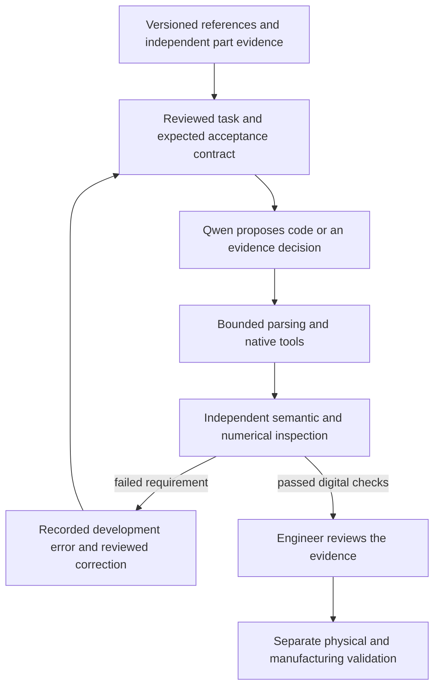

# How we trained Qwen for the Porsche 993 project

**Evidence snapshot: 2 October 2026.** This page explains the training we actually
performed, the data we used, the results we measured, and the next experiments
that could make the assistant more useful for the M64/993 programme.

We fine-tuned **Qwen2.5-Coder-1.5B-Instruct**, using a pinned 4-bit MLX conversion
and small LoRA adapters on the existing Apple Silicon Mac. We did not train a
foundation model from scratch. The training teaches bounded coding and evidence
handling tasks; measured dimensions, material properties and release decisions
still come from independent project records and engineering review.

The latest selected experimental **coding** adapter is `coding-008`, step 400.
Its final scores are **67/68 OpenUSD requests** and **42/56 PicoGK requests**.
A separate six-domain candidate, `qwen-engineering-005`, achieves **148/150** on
a filtered final partition, but remains **unqualified** because PicoGK scores
7/8, below that experiment's unchanged 95% per-domain floor. These experiments
use different tasks and selection rules. Their totals cannot rank the adapters
against each other. Neither report records a serving-default replacement.

This documentation adds no training run. The accompanying
[machine-readable evidence snapshot](QWEN_TRAINING_EVIDENCE_20261002.json)
extracts metadata from existing reports and records their source hashes.

## Contents

1. [What we are trying to teach](#1-what-we-are-trying-to-teach)
2. [The model and training method](#2-the-model-and-training-method)
3. [The actual training data](#3-the-actual-training-data)
4. [The training and evaluation pipeline](#4-the-training-and-evaluation-pipeline)
5. [Experiments and measured results](#5-experiments-and-measured-results)
6. [Mistakes, corrections and remaining limits](#6-mistakes-corrections-and-remaining-limits)
7. [What this means for the current project](#7-what-this-means-for-the-current-project)
8. [How to train it further](#8-how-to-train-it-further)
9. [A concrete next experiment](#9-a-concrete-next-experiment)
10. [Reproduction and evidence navigation](#10-reproduction-and-evidence-navigation)

## 1. What we are trying to teach

The useful target is a copilot that translates explicit requirements into
reviewable code and checked artefacts. For example, it should preserve the
connections in a supplied graph, author a USD scene with the requested variant,
recognise a failed CFD mesh, and identify which evidence is missing before a
part can advance to structural analysis.

That requires several capabilities which we measure separately:

| Capability | A useful answer | What must verify it |
|---|---|---|
| Python mechanics | A calculation expressed in the supplied parameters | Independent reference values, units and parameter perturbations |
| PicoGK/C# | Geometry implementing the requested nodes, edges and radii | Literal-code checks, compiler, native runtime and an independent semantic contract |
| OpenUSD/Python | A scene with correct units, composition, bindings and selection | Native USD checks plus comparison with the requested scene |
| OpenFOAM | Version-specific dictionaries and correct mesh-failure decisions | Contract checks; complete solver cases need additional numerical verification |
| CalculiX | A complete supported axial-bar deck | Restricted deck checks, native execution and analytical displacement |
| Engineering evidence | Correctly distinguish geometry preparation, analysis and manufacturing readiness | An independent evidence/permission contract |

The model is one component of the workflow. The compiler, solver and catalogue
checks remain independent of its confidence or explanation. See the project's
[quality gates](QUALITY_GATES.md) and [source policy](SOURCE_POLICY.md).



The arrows describe the intended checked workflow. The current benchmarks
exercise individual operations; they do not demonstrate autonomous execution
of this entire coupled chain.

## 2. The model and training method

### 2.1 Exactly which Qwen?

| Item | Recorded configuration |
|---|---|
| Original model | `Qwen/Qwen2.5-Coder-1.5B-Instruct` |
| Local conversion | `mlx-community/Qwen2.5-Coder-1.5B-Instruct-4bit` |
| Conversion revision | `b3252a2f97102b1fb1571fec2c9b27219a8536be` |
| Original-model revision | `2e1fd397ee46e1388853d2af2c993145b0f1098a` |
| Local base-weight SHA-256 | `daeab4764fb420d161721791cf2e509e2de81a7af4223646e7bed2bf82c57b58` |
| Recorded model licence | Apache-2.0 |
| Training implementation | MLX-LM 0.31.3; pinned environment records MLX 0.32.3 |
| Initial training machine | Apple M1 Max, 64 GiB unified memory |
| Initial Python | 3.12.11 |
| Initial model file size | Approximately 0.87 GB |

These pins are in the
[model manifest](https://github.com/cluster2600/porscheparts/blob/7b9853ad633e1b3847b7a363b89282d3a1d09479/training/m64-qwen/model.json)
and [dependency lock](https://github.com/cluster2600/porscheparts/blob/7b9853ad633e1b3847b7a363b89282d3a1d09479/training/m64-qwen/requirements.lock).
The [official model card](https://huggingface.co/Qwen/Qwen2.5-Coder-1.5B-Instruct)
describes a 1.54-billion-parameter, 28-layer text model with a 32,768-token
context. Our later training sequences were capped at **1,024 tokens**. The
model's advertised context does not mean we trained full engine programmes at
that length.

This is distinct from other Qwen models used or proposed elsewhere in the
project, including hosted inference and the CUDA 7B/32B training recipe.
The experiments documented here do not establish that those larger models
were fine-tuned. This model also receives text, not pixels: photographs informed
authored lessons, but we did not train a vision encoder on those photographs.

### 2.2 What did we change in the weights?

LoRA adds small trainable matrices to selected model layers while retaining the
base weights. Conceptually, an adapted linear layer uses:

```text
W_effective = W_base + c × B × A
```

`A` and `B` form a low-rank update; `c` is the implementation's scaling factor.
The experiment records use rank 8 and, where specified, **MLX scale 20**.
Keep that exact implementation setting rather than substituting another
framework's similarly named parameter. See the
[original LoRA paper](https://arxiv.org/abs/2106.09685).

Because the base checkpoint is quantised to four bits, the local workflow uses
MLX's quantised LoRA support, described as QLoRA by MLX-LM. This reduces the
base-weight memory cost while training adapter weights. It is not evidence that
we used every technique from the original CUDA QLoRA implementation, such as
NF4 or paged optimisers. Those belong to the separate larger-model recipe.
See [MLX-LM's training documentation](https://github.com/ml-explore/mlx-lm/blob/main/mlx_lm/LORA.md)
and the [QLoRA paper](https://arxiv.org/abs/2305.14314).

The first four-layer pilot trained approximately **1.319 million parameters**.
Later experiments adapted the last 16 layers. An adapter checkpoint is an
additional file loaded with the original compatible base; it is not a complete
standalone model. We keep rejected adapters for comparison and provenance.

### 2.3 What happens during supervised training?

Each example supplies a task and an authored expected answer. Training adjusts
the adapter to make that answer more likely given the task. The objective is
next-token prediction over the completion. With prompt masking, the prompt
provides context but its tokens do not contribute to the training loss.

A low loss means the model predicts these target tokens well. It does not
directly measure whether a generated graph connects the correct nodes, whether
a CFD case conserves energy, or whether a part bolts to an engine. We therefore
score those properties independently after generation.

Repeated examples provide **replay**: they keep an older capability represented
while a new domain is introduced. A replay weight of two means two training
instances of the same record, not two independently authored examples. We
report unique records and weighted instances separately.

The continuation scripts load an earlier adapter but restart optimiser state.
These are warm-start continuations, not exact resumptions of the complete
optimiser and data-loader state. A fixed seed aids reproduction; it does not
turn one run into evidence of statistical robustness across multiple seeds.

### 2.4 Representative actual settings

| Experiment | Additional steps | Batch | Adapted layers | Learning rate | Sequence cap |
|---|---:|---:|---:|---:|---:|
| Workflow pilot `run-003` | 60 | 1 | 4 | `1e-4` | 512 |
| Initial PicoGK `picogk-001` | 100 | 1 | 4 | `1e-4` | 1,024 |
| First USD `openusd-001` | 160 | 1 | 4 | `1e-4` | 1,024 |
| Retained coding `coding-003` | 600 | 1 | 4 | `5e-5` | 1,024 |
| Focused coding `coding-004` | 800 | 1 | 16 | `1e-4` | 1,024 |
| Paired-selection `coding-008` | 400 | 1 | 16 | `1e-5` | 1,024 |
| Four-domain `qwen-engineering-001` | 480 | 1 | 16 | `5e-5` | 1,024 |
| Six-domain `qwen-engineering-005` | 1,200 | 2 | 16 | `5e-6` | 1,024 |

These are stages in different lineages, not independently comparable runs from
the same starting point. The stages use seed 42 and masked prompts. Initial
PicoGK training starts from the base rather than the workflow adapter.
Experiment-specific reports identify the later parents and replay mixtures.

The six-domain run 005 records 285,004 training tokens, 5.478 GB peak training
allocation and 4,776 weighted instances. Its audited maximum complete sequence
is 632 tokens. These are training measurements, not a prediction of memory or
latency for unrestricted long-context serving.

## 3. The actual training data

### 3.1 The distinction between upstream pretraining and our corpus

Qwen arrived with pretrained coding and language capabilities. Its upstream
model card describes broad source-code and text/code training. We did not
rebuild or independently audit that upstream corpus. The counts below refer
only to the project's additional supervised examples.

Our examples were **authored synthetic tasks**, derived from project workflows,
explicit parameters, API contracts and reviewed references. The documented
pilots did not ingest raw engine scans, proprietary manuals, supplier quotes,
vehicle identifiers, secrets, complete theses or third-party benchmark rows.
Research suggested exercises and verification methods; it was not silently
copied into training targets.

The original project material is governed by the current
[repository licence](../LICENSE). The base model and third-party libraries keep
their own licences. A public download URL does not establish permission to
redistribute an external dataset or train on it.

### 3.2 Corpus growth

| Stage | Training content | Validation and test scope |
|---|---|---|
| Workflow pilot | 40 records: tool routing, units, unknown material data, rental prerequisites and supplied C# conditions | 10 validation; 20 test; different fixture families but shared rules/templates |
| Initial PicoGK | 64 graphs: struts, elbows, rectangular frames and diagonal braces | 8 validation; 16 test, including 8 unfamiliar triangle/tripod layouts |
| First USD continuation | 48 USD records plus 64 PicoGK replay records | 6 new USD validation and 12 USD test; prior PicoGK evaluation retained |
| Expanded coding | 336 USD plus 192 PicoGK records: 528 total | 54 validation; 68 final cases, mixing older regressions and fresh instances |
| Focused PicoGK addition | 512 more training graphs, reaching 704 PicoGK records while retaining 336 USD | 30 USD / 40 PicoGK validation; 24 new PicoGK final cases reserved |
| Coding-008 mixture | 720 USD plus 704 PicoGK records: 1,424 unique records | 70 validation; 68 USD / 56 PicoGK final cases |
| Four-domain engineering pilot | 384 new Python/OpenFOAM/USD/PicoGK records plus 192 replay records: 576 total | 102 validation; 32 fresh model cases reserved until eligibility |
| Engineering refinement 002 | 1,808 training records, including shuffled-node graphs, scene composition, paired selection and mechanical calculations | Extended retention evaluation and 56 reserved test records |
| Six-domain photo course | 3,224 training records, but **3,177 unique prompts** | 266 development validation; audited final evaluation uses a filtered 150-case partition |

Corpus stages overlap. Do not add these rows together as a total number of
distinct examples seen. Coding-008 repeats each USD training row twice, giving
1,440 USD plus 704 PicoGK effective instances. The six-domain curriculum and
its later replay weights are a separate experiment family.

The six-domain course adds 1,416 records to the earlier 1,808: 864 mechanical
Python calculations, 48 USD mesh-buffer tasks, 480 engineering evidence
decisions and 24 complete CalculiX axial-bar decks. A later audit found repeated
prompts inside the record counts and across partitions; section 6 explains how
that changes the interpretation of the scores.

Sources: the
[coding corpus report](https://github.com/cluster2600/porscheparts/blob/7b9853ad633e1b3847b7a363b89282d3a1d09479/training/m64-qwen/coding-results.md),
[composition report](https://github.com/cluster2600/porscheparts/blob/7b9853ad633e1b3847b7a363b89282d3a1d09479/training/m64-qwen/composition-results.md)
and [engineering evidence snapshot](QWEN_TRAINING_EVIDENCE_20261002.json).

### 3.3 What a PicoGK example teaches

A typical task supplies vertices, a requested edge list, endpoint diameters and
cap style. The answer must use the pinned `Lattice.AddBeam` API with the correct
endpoints and **radii**, so the supplied diameters must be halved.

For an illustrative synthetic triangle:

```text
Nodes: A=(0,0,0), B=(20,0,0), C=(10,15,0), in mm.
Required connections: A→B, B→C, C→A.
Endpoint diameter: 4 mm; the corresponding beam radius is 2 mm.
Acceptance: exactly the requested connections and endpoint radii.
```

This example explains the task type; it is not a Porsche measurement or an
extra record added by this documentation. A generated A→B, B→C, C→D programme
fails the requested triangle even if it compiles and exports a closed mesh.
The [pinned PicoGK API](https://github.com/leap71/PicoGK/blob/0e6cf6b6f4993ec16dbcd72d8f27f26b999980f3/Base/Lattice.cs)
provides the software contract; the task's graph provides the semantic contract.

Later examples shuffle node identifiers and ordering, vary connectivity, and
associate different radii with different endpoints. This tries to teach binding
each requirement to the correct node instead of memorising a familiar chain.
The remaining duplicated-edge error shows that this binding is still imperfect.

### 3.4 What an OpenUSD example teaches

USD tasks cover transforms, triangle/mesh buffers, visual material bindings,
references, animation and variant sets. Later curricula add three-object scenes
and matched pairs where the scene stays fixed but the requested final variant
changes between `small` and `large`.

That pairing matters: if object names or authoring order accidentally correlate
with the desired selection, the model can learn the correlation instead of the
instruction. The later targets explicitly set the requested variant at the end
of authoring. Native checks verify the resulting scene against unchanged
expectations before the revised answer enters training.

USD composition operates on supported scene layers and composition arcs.
A generic OBJ file is not automatically a usable USD layer. The engineering
course therefore teaches conversion into checked USD mesh buffers rather than
assuming an OBJ reference loaded successfully. See Pixar's
[reference tutorial](https://openusd.org/25.05/tut_referencing_layers.html).
The local audit reproduced a case where `AddReference` returned true while a
composition error remained and no points loaded. A return value alone was an
insufficient acceptance check.

### 3.5 What Python, CFD and structural examples teach

Mechanical Python targets retain expressions in the supplied variables.
Independent checks perturb parameters to catch a model that returned a
memorised numeric result. Tasks include stress, torsion, extension, heat-transfer
calculations and dimensionless ratios within explicit assumptions. A formula
exercise does not establish that its assumptions apply to an actual engine.

OpenFOAM model scoring currently covers bounded dictionary/control contracts
and failed-mesh decisions. Separate prescribed cavity and conjugate-heat-transfer
runtime witnesses show that reviewed reference cases execute. Those witnesses
must not be counted as Qwen-generated complete CFD cases or as calibrated
Porsche field predictions.

CalculiX examples use complete supported axial-bar decks with analytical
displacement `F × L / (E × A)` and consistent N–mm–MPa units. Native execution
checks that restricted task. Contact, nonlinear materials, flexible crankshaft
modes, fatigue and full-part FEA remain outside that demonstrated capability.

The evidence examples teach a different skill: decide what the supplied
information permits. A measured interface may permit preliminary geometry,
while missing material allowables still block structural qualification.
Manufacturing needs its own process and inspection evidence. A single blanket
answer can be overly permissive or unnecessarily restrictive.

## 4. The training and evaluation pipeline

### 4.1 Freeze a reviewable experiment

Before a run, the scripts record the parent adapter, source/model revisions,
dataset hashes, software identity, training settings and selection rule. The
run uses a new output directory and preserves failures instead of overwriting
earlier evidence. Disk checks retain a 2 GiB working reserve; the initial model
download requires at least 3 GiB free before starting.

The intended sequence is:

1. Author tasks with independent expected results and provenance.
2. Partition data; inspect prompt duplication and parent/family overlap.
3. Verify reference answers with the relevant native tools.
4. Freeze manifests and register the selection hypothesis.
5. Evaluate the retained comparison adapter on the fixed validation tasks.
6. Train with the registered settings and save checkpoints.
7. Choose an eligible checkpoint using validation results only.
8. Open the final model tests only after eligibility; record outcomes once.
9. Preserve the previous adapter and report selection separately from serving.

Some early acceptance corrections were development-driven rather than fully
preregistered. The reports say so. Freezing a file does not repair a flawed split
or make repeated validation-driven trials statistically independent.

### 4.2 Distinguish three kinds of data

**Training** updates the adapter. **Validation** selects checkpoints and guides
development. **Final tests** assess a selected candidate after those choices.
Once a final test's failures have informed a new curriculum, that test becomes
regression evidence for the next experiment. Renaming its fixture cannot make
it untouched again.

The original coding tests and later fresh instances are reported separately.
Even fresh instances share task grammar and API recipes with training, so their
scores support a narrow contract-following claim. Independent task-family
generalisation needs a more demanding holdout.

### 4.3 Keep generation conditions comparable

The coding evaluations use identical frozen prompts and greedy decoding for the
comparison and candidate models, with fixed output limits. They do not improve
scores by selecting the best of several generated answers or by silently
repairing a final-test answer. Output limits and supported syntax are part of
the measured contract.

This distinction matters for future repair workflows: an assistant with three
allowed compiler-feedback attempts is a different system from one-shot
generation. Both can be useful, but their success rates, tool calls and latency
must be reported separately.

### 4.4 Native checks and semantic checks

PicoGK evaluation checks allowed literal code, compiles against the real DLL,
runs bounded native geometry creation, and compares the result with the
requested beam contract. Model-supplied build files or arbitrary shell commands
are not part of that evaluation. Unsupported code is not given unrestricted
execution just because the model produced it.

USD evaluation uses a bounded API interpreter and native stages. It checks
units, up-axis, default prim, prim/attribute types, transforms, time samples,
references, bindings and variants. Valid scene authoring and matching the
requested scene are separate outcomes. Valid general Python outside the
interpreter may still be unsupported by this benchmark.

The installed USD wheel lacks shader-discovery resources, so
`ShaderPropertyTypeConformanceChecker` is explicitly excluded. Requested shader
types and binding values are checked, but complete shader-registry conformance,
rendering and Omniverse import are not established by those scores.

The coding native witness uses .NET 9.0.317, PicoGK revision
`0e6cf6b6f4993ec16dbcd72d8f27f26b999980f3` and `usd-core==25.5.1`.
Other project workers have different recorded software profiles. An engine
workflow must name its actual profile instead of assuming these versions
describe every host.

### 4.5 Retention and qualification rules

Later coding experiments require a PicoGK validation gain and preservation of
every earlier passing full-task obligation in both coding domains. An increase
in the total score does not compensate for losing a previously passing case.
Compilation is a separate metric and can regress without a full-task pass
being lost, as coding-008 demonstrates.

The six-domain refinement adds a 95% floor in **each domain** and retains the
union of earlier passing obligations. That union is a policy requirement, not
the score of a single hypothetical baseline model. Final qualification has its
own gate; passing validation only authorises opening that final evaluation.

With eight PicoGK final cases, 7/8 is 87.5%, so the 95% floor requires 8/8.
The resulting decision is unambiguous, but the small partition gives limited
evidence about reliability on a broad population of new tasks.

## 5. Experiments and measured results

### 5.1 From formatting to actual geometry

| Run | Measured outcome | Decision and interpretation |
|---|---|---|
| Workflow `run-003` | Strict JSON rises from 0/20 to 16/20; content accuracy falls from 18/20 to 16/20 | Keep base: two unit conversions regress and rental-gate questions still fail |
| `picogk-001` | 16/16 outputs compile and create geometry; 8/16 meet the graph contract; unseen layouts 0/8 | Experimental: familiar syntax learned, composition still fails |
| `openusd-001` | USD rises from 0/12 to 3/12; PicoGK stays 8/16 | Experimental: simple USD authoring improves; combined scenes remain weak |
| `coding-002` | USD validation reaches 27/30 at step 400; PicoGK drops from 8/24 to 4/24 | Reject both evaluated checkpoints for retention failure |
| `coding-003` | Final USD 28/36; PicoGK 10/32; no previous complete test pass lost | Select step 600 as the then-retained experimental coding adapter |

The first workflow adapter returned 0.31 m for 31 mm and 0.38 m for 38 mm.
Its held-out completion loss fell from 1.500 to 0.016 while those mistakes
remained. This is direct evidence that lower loss and cleaner formatting do
not establish numerical correctness. Deterministic unit conversion remains
necessary. See the
[workflow report](https://github.com/cluster2600/porscheparts/blob/7b9853ad633e1b3847b7a363b89282d3a1d09479/training/m64-qwen/results.md)
and [initial PicoGK report](https://github.com/cluster2600/porscheparts/blob/7b9853ad633e1b3847b7a363b89282d3a1d09479/training/m64-qwen/picogk-results.md).

### 5.2 Specialisation repeatedly damaged retention

| Run | USD validation | PicoGK validation | Outcome |
|---|---:|---:|---|
| Retained coding-003 comparison | 22/30 | 9/40 | Comparison point for the later focused protocol |
| Coding-004 | 17/30 | 40/40 | Reject: seven earlier USD passes lost |
| Coding-005 | 16/30 | 25/40 | Reject: seven USD and two PicoGK passes lost |
| Coding-006 | 19/30 | 7/40 | Reject: four earlier passes lost in each domain |
| Coding-007 | 27/30 | 39/40 | Reject: two earlier USD variant cases lost |
| Coding-008 | 30/30 | 31/40 | Select: every earlier full-task validation pass retained |

Coding-004 demonstrates a useful specialist improvement but fails as the
combined assistant requested by its protocol. Additional replay and a smaller
update in coding-005/006 did not solve the issue. Coding-007 added scene
composition; coding-008 then added matched variant-selection pairs. The later
success supports that targeted curriculum change as a promising direction,
but the adaptive sequence is not a controlled causal comparison.

See the
[focused report](https://github.com/cluster2600/porscheparts/blob/7b9853ad633e1b3847b7a363b89282d3a1d09479/training/m64-qwen/focused-results.md),
[retention report](https://github.com/cluster2600/porscheparts/blob/7b9853ad633e1b3847b7a363b89282d3a1d09479/training/m64-qwen/retention-results.md)
and [composition/selection report](https://github.com/cluster2600/porscheparts/blob/7b9853ad633e1b3847b7a363b89282d3a1d09479/training/m64-qwen/composition-results.md).

### 5.3 The selected coding-008 final evaluation

| Final partition | Coding-003 comparison | Coding-008 | Previous complete passes lost |
|---|---:|---:|---:|
| USD regression instances | 28/36 | 36/36 | 0 |
| USD fresh instances | 11/32 | 31/32 | 0 |
| PicoGK regression graphs | 10/32 | 24/32 | 0 |
| PicoGK fresh graphs | 1/24 | 18/24 | 0 |

Across these partitions, coding-008 reaches 67/68 USD requests (98.5%) and
42/56 PicoGK requests (75%). All 68 USD scenes pass the available native checks;
one still fails the full requested semantics. Of 56 C# answers, 54 pass the
literal-code boundary, compile and run. Two fail before compilation. The
comparison adapter compiled all 56, so compilation falls even though no
previous complete-task pass is lost. Fourteen PicoGK requests still fail full
acceptance.

The selected adapter's SHA-256 is
`09024cfb346f3dd7f8994e5fe1cd89e11976db5354b8dac9c0167d57ee7aacb6`.
The two last coding stages together trained 201,280 tokens in 1,000 steps.
Their final tests are now exposed and belong in the regression suite for any
future training attempt. Source:
[composition receipts](https://github.com/cluster2600/porscheparts/blob/7b9853ad633e1b3847b7a363b89282d3a1d09479/training/m64-qwen/composition-results.json).

### 5.4 The separate engineering continuation

The four-domain engineering pilot improves Python 0/8→8/8 and OpenFOAM
dictionary/mesh decisions 0/8→8/8 on its new validation tasks. Its new PicoGK
tasks improve 0/8→4/8. Existing validation totals also rise, but two previous
USD cases regress and the new graph threshold fails. It is rejected.

Refinement 002 still misses its Python floor at 24/32. The six-domain run 003
reaches Python 80/80, OpenFOAM 8/8, USD 44/46, PicoGK 46/48, engineering
77/80 and native CalculiX 4/4. Every domain exceeds 95%, yet two old USD passes
regress, so selection fails. Run 004 increases USD to 45/46 and PicoGK to
47/48 but drops engineering decisions to 70/80; it is also rejected.

Run 005 returns to the run-003 parent and repairs the training targets for
explicit final USD selection. It verifies 200 revised USD completions against
unchanged native scene expectations before training. Its validation result is
264/266 with no lost passing obligation, selecting step 1200 for final
evaluation.

The final partition is filtered for exact-prompt separation and registered
before final predictions. Its comparison is **engineering-003/1200 versus
engineering-005/1200**, rather than coding-008:

| Filtered final domain | Parent | Candidate 005 | Meaning of this task |
|---|---:|---:|---|
| Python mechanics | 72/72 | 72/72 | Supplied-parameter calculations |
| OpenFOAM contracts | 8/8 | 8/8 | Bounded dictionaries and mesh-failure decisions |
| OpenUSD | 14/14 | 14/14 | Checked synthetic scenes |
| PicoGK | 7/8 | 7/8 | Requested dependency graphs |
| Engineering decisions | 41/44 | 43/44 | Evidence gates within supplied fixtures |
| CalculiX | 4/4 | 4/4 | Native analytical axial-bar tasks |
| **Aggregate** | **146/150** | **148/150** | **No previous final pass lost; PicoGK floor still fails** |

The candidate's 98.7% aggregate does not override its 87.5% PicoGK score.
It remains experimental and unqualified. Its adapter hash is
`70142a4583f5c95a74b3a5dd6661d8243e85e7846dc7aba6e8b4ab3c6a3f29d4`.
The [evidence snapshot](QWEN_TRAINING_EVIDENCE_20261002.json) preserves the
local report's source identity, settings, per-domain results and corrections.

## 6. Mistakes, corrections and remaining limits

### 6.1 The carrier mistake was also a task-definition failure

The `99311502153` carrier exercise started from hypothetical geometry before
the exact engine-bracket attachment and load path had been established.
Compilation and mesh closure did not test the missing central attachment.
Supplying an incomplete task and accepting the wrong checks was an
orchestration error as well as a limitation of the generated answer.

The correction is to inventory required interfaces first: hole patterns,
axes, mating faces, datums, tolerances and load paths for the exact variant.
Unknown values remain unknown. A model-produced claim of completeness cannot
serve as its own inspection evidence. Training should teach that boundary,
while an independent checker enforces it outside the model.

### 6.2 Distinct IDs were mistaken for distinct prompts

The photo course has 3,224 record IDs but only 3,177 unique training prompts.
The audit found **33 validation rows and 44 test rows whose prompts repeat
training prompts**. Consequently, the original fresh-photo label is invalid.
Its raw 139/140 score must not be presented as an independent fresh-test score.
The legacy receipts are preserved with the correction recorded separately.

Before the later final comparison, the protocol keeps original test rows only
when their full prompt is absent from both training and validation, and removes
duplicate test prompts. The original 56 plus 140 test rows become a filtered
150-case partition: 46 rows are excluded. Selection uses identity, not model
outcomes. This repairs exact-text overlap but leaves shared formula/API/decision
recipes. It is still not an independently authored engineering-family holdout.

### 6.3 Runtime failures must not be scored as model failures

An early USD runner resolved the Python interpreter symlink and bypassed its
virtual environment. Missing `pxr` then appeared as failed model answers.
Those scores were invalid. Saved answers were rescored with the correct
interpreter, without regenerating answers or changing expected scenes.

USD also stalled in TBB cleanup during a concurrent native test. Serial tiny
witness jobs using `PXR_WORK_THREAD_LIMIT=1` resolved the observed runtime issue.
Later, a shared helper changed during an engineering run. Its final source-hash
guard failed; restoring exact registered helper copies and rescoring saved
responses reproduced every recorded outcome and response hash. Private helper
snapshots are the simpler way to prevent that ambiguity in future runs.

These corrections address execution infrastructure. They do not increase model
competence or justify quietly dropping failures.

### 6.4 The sequence-length receipt needed an audit

Run 005's original manifest reports a maximum sequence length of two because
the code counted tokenizer dictionary keys. The separate correction counts
actual input IDs and finds a maximum of 632, below the 1,024 cap. The frozen
manifest remains intact; its erroneous field is explicitly superseded by the
audited receipt. A plausible-looking manifest needs the same scrutiny as code.

### 6.5 Successful native witnesses have a limited meaning

The prescribed five-region OpenFOAM ESI v2312 CHT witness runs a 12,000-cell
mesh for five serial steps. An earlier 3,000-cell version failed three solid
mesh-quality checks despite solver completion and was rejected. The accepted
witness verifies the reviewed runtime/template; energy balance, mesh convergence
and experimental calibration remain unverified.

Similarly, a USD visual material is not a qualified alloy, a rigid crankshaft
animation is not torsional/fatigue analysis, and increased fin surface area is
not a measured cooling improvement. The model's current domain scores must keep
those distinctions.

## 7. What this means for the current project

We can use Qwen to propose bounded code and checkable intermediate artefacts,
with the review effort informed by the measured failure modes. The good USD
scores support trying controlled scene-authoring tasks. The remaining PicoGK
errors justify inspecting every connection and interface before using geometry
downstream. Neither result establishes an accurate four-valve cylinder head.

| Current workstream | Useful next contribution from the assistant | Evidence required outside training |
|---|---|---|
| Four-valve M64 head | Parameterised, staged features; explicit intake/exhaust identities; reviewed assembly metadata | Donor/exact variant, metrology, mating interfaces, thermal/load inputs and material/process data |
| Engine carrier | Attachment inventory, supplied-interface geometry and independent omission reports | Exact mounting patterns, datums, tolerances, load path and professional structural review |
| Existing OBJ assets | Checked conversion, scale/provenance metadata and USD assembly proposals | Rights, source identity, scale/orientation evidence and independent interface checks |
| Fan and cooling | Complete versioned case proposals and measurement/report extraction | Airflow/thermal boundary conditions, mesh convergence, conservation and bench evidence |
| Turbo/lubrication systems | Source-linked topology, explicit missing inputs and bounded calculations | Compressor maps, pressure/temperature conditions, interfaces and verified operating data |
| Manufacturing | Preparation of an evidence checklist and documented process proposal | Approved material/process, supports, depowdering, heat treatment, machining, inspection and release |

Existing OBJ refinement and assembly should preserve their provenance. New
PicoGK geometry should begin with supplied requirements, rather than trying to
replace every existing CAD path. The catalogue remains authoritative for part
status; a training score never promotes a record to fitted, safe or released.

## 8. How to train it further

The priorities below are **proposed experiments**, inferred from the measured
errors. No new dataset, training job, default change or paid compute is claimed.

### 8.1 Fix the information and supervision before adding iterations

First identify what is actually missing. No amount of fine-tuning can recover
an unmeasured engine attachment or an unknown fatigue allowable reliably.
Acquire those facts, store their provenance, and supply them through reviewed
retrieval or explicit task inputs. Train the model to preserve their units,
scope and unknowns instead of asking it to memorise changing project facts.

For reusable behaviour, improve the targets. Coding-008 and engineering-005
both show why explicit final selection and matched counterexamples matter.
Review targets for hidden defaults, accidental naming correlations and
incomplete instructions before spending time on another warm-start run.

### 8.2 Train graph binding and real interface completeness

Add training families where identical coordinates appear with different edge
sets, radii remain associated with node identity after permutation, and a
duplicated edge must not replace a required connection. Include disconnected
components, cycles, branches, reversed directions and controlled graph edits.
Then progress to independently checked holes, axes, mating faces and datums.

Use metamorphic checks: renaming or reordering nodes should preserve the graph;
changing one edge should change only that required connection. Derive expected
connectivity from the task specification, never from the model's own emitted
manifest. Reserve whole topology/feature families for final testing.

Keep the present literal-beam benchmark as a regression suite. Full parametric
C#, loops, booleans, hollows and export need separately bounded execution and
new acceptance contracts. Expanding the syntax allowlist alone does not create
a valid geometry benchmark.

### 8.3 Separate preliminary geometry from material and release decisions

Create matched evidence tasks which change one condition at a time: interfaces
unknown versus measured; load path unknown versus reviewed; material proposed
versus qualified. The outputs should distinguish permission to prepare
preliminary geometry, perform a bounded calculation, qualify structural
performance and manufacture.

This addresses both dangerous invention and the overly conservative final
failure. It does not require weakening the existing manufacturing gate.
Adversarial tasks should contain confident but unsupported claims that the
independent checker rejects even if the model repeats them.

### 8.4 Move from solver snippets to complete generated cases

For CFD, start with a small complete, version-pinned case having known reference
behaviour. Include every required field, mesh input, dictionary, boundary
condition, region mapping and invocation. Score mesh quality, completed
execution, finite fields, mass/energy balances and a registered mesh-refinement
study. Only then add multi-region CHT or a supplied engine coupon.

Keep Foundation and OpenCFD/ESI profiles separate. The local witnesses use ESI
v2312; the larger-model guide proposes Foundation 13. A solver name or dictionary
from one distribution cannot silently substitute for the other. Consult the
[versioned Foundation guide](https://doc.cfd.direct/openfoam/user-guide-v13/contents)
when authoring that profile.

For structural training, expand the existing analytical bar to separately
verified beam, shell and thermal fixtures before contact or full-part analysis.
Check constraints, units, reactions and mesh sensitivity. Keep the solver's
exit code, numerical verification and physical applicability as separate
acceptance fields.

### 8.5 Learn diagnosis and repair from development traces

Collect allowed development-task failures with the original specification,
generated code, compiler/solver diagnostic, reviewed correction and independent
pass result. Train concise repairs that address the observed cause. Preserve
unsuccessful repairs and correct stop/request-evidence decisions as examples.

A future bounded repair benchmark should measure first-attempt and eventual
success separately, with a fixed attempt budget and unchanged checks. Do not
use exposed final-test solutions as training targets while still calling the
same final partition unseen.

### 8.6 Design a more credible evaluation

Deduplicate before splitting. Group by parent geometry, topology, formula
recipe, solver case and source document. Keep all variants of a parent in the
same partition when the claim concerns new-family generalisation. Exact prompt
hashes catch duplicates; canonical graph/program signatures help identify
cosmetic renaming. Have independent authors review the final tasks and expected
results before model predictions.

Freeze the final partition and its grader before training. Preserve old exposed
cases as regression obligations, report fresh families separately, and record
unsupported output versus native failure versus semantic failure. Broaden the
eight-case graph final subset before claiming high reliability; do not change
its old threshold retrospectively. Use repeated seeds when the next comparison
needs evidence that a gain persists beyond one training trajectory.

### 8.7 Handle retention explicitly

Use the retained coding-008 adapter as the comparison for a new coding trial,
and the engineering family’s recorded parent for a new specialist trial.
Evaluate both on the same newly registered tasks if the objective is to compare
them. Their existing headline totals do not make that comparison.

Start with a small, balanced continuation and a fixed per-case retention gate.
If one domain repeatedly damages another, test separate specialist adapters
with explicit routing and independent qualification. Keep that candidate
separate from the combined adapter until it passes its own tests. The observed
40/40 focused validation score alone cannot qualify a deployed specialist.

More replay, additional layers and a smaller learning rate have already failed
in some trials. Treat them as hypotheses to measure, rather than guaranteed
improvements. Avoid accumulating new configuration knobs without a registered
failure they are intended to address.

### 8.8 Compare a larger model after the benchmark is ready

The existing
[7B/32B engineering runbook](https://github.com/cluster2600/porscheparts/blob/7b9853ad633e1b3847b7a363b89282d3a1d09479/training/m64-engineer/README.md)
and [CUDA training script](https://github.com/cluster2600/porscheparts/blob/7b9853ad633e1b3847b7a363b89282d3a1d09479/training/m64-engineer/finetune.py)
already provide a route to a larger Qwen2.5-Coder model. Reuse them after checking
the source/runtime pins. Compare an unadapted 7B baseline and an adapted 7B
against 1.5B on identical frozen tasks and decoding conditions.

Measure semantic passes, retention, memory, latency and tool-call cost. A larger
model may help code reasoning and longer outputs; it does not fix contaminated
tests or missing engineering evidence. Inventory actual available hardware and
disk first. Do not assume Kali hosts have suitable CUDA GPUs. Rental or model
publication needs its own authorisation; this roadmap starts with local work.

### 8.9 Keep imported data small, licensed and relevant

The source registry considered external CAD/code datasets, but the documented
corpora imported no third-party rows. Future candidates need revision, licence,
attribution, input/output modality and contamination checks. A vision-conditioned
CAD dataset is not directly a text-only instruction corpus. A repository's code
licence may differ from its dataset or upstream geometry rights.

Prefer a small reviewed development sample with executable answers over a bulk
download. Keep public benchmark tasks for evaluation when that is their role.
Literature reading can guide a better experiment without being a training run.
The [evidence snapshot](QWEN_TRAINING_EVIDENCE_20261002.json) records the local
research register's identity; future licence checks must use current primary
sources before importing data.

## 9. A concrete next experiment

**Recommended first increment:** a graph-binding and attachment-evidence
curriculum, followed by a new family-separated holdout. This directly targets
the unresolved PicoGK edge error and the carrier's interface failure, with less
scope than immediately training a complete autonomous CFD/FEA assistant.

| Step | Concrete deliverable | Acceptance before proceeding |
|---|---|---|
| 1. Register the hypothesis | A protocol naming comparison weights, graph/evidence failures and fixed gates | Protocol and final-task identity frozen before predictions |
| 2. Author the cases | Counterfactual graph pairs and staged interface/material decisions | Provenance, prompt deduplication and family grouping reviewed |
| 3. Verify the targets | Independent graph/feature checks and bounded native reference runs | Every admitted target satisfies its contract |
| 4. Establish the baseline | Retained model results on fixed validation and regression partitions | Same grader, coverage and decoding conditions recorded |
| 5. Run one bounded continuation | Existing MLX runner, fresh output directory and preserved parent | No truncation, source drift or overwritten evidence |
| 6. Select on validation | Per-domain improvement plus preservation of every required prior pass | No gate relaxed after observing the score |
| 7. Open the fresh final families | One final evaluation of an eligible candidate | Graph, evidence and retention results reported separately |
| 8. Decide the next increment | Accept experimental candidate or keep comparison; record remaining errors | Serving/default and engineering status remain explicit separate decisions |

Then add one complete generated CFD family and one independently verified
structural family. Validate each software capability before combining the
geometry→mesh→solver→USD reporting chain. The head, carrier and cooling work
provide realistic development tasks once their required inputs are established.

The success criterion is a measurable gain on new task families, with retained
old behaviour and preserved engineering evidence boundaries. More iterations,
lower loss or a higher pooled score are insufficient success criteria.

## 10. Reproduction and evidence navigation

### 10.1 Where the sources live

The coding implementation and reports are published on the training branch of
[draft PR 104](https://github.com/cluster2600/porscheparts/pull/104), inspected at
commit `7b9853ad633e1b3847b7a363b89282d3a1d09479`. At the main-branch snapshot
used for this page, those training files are not present on `main`. The links
in this page therefore use immutable commits rather than promising that a
relative `training/` path works on every branch.

| Source | What to inspect |
|---|---|
| [Local pilot README](https://github.com/cluster2600/porscheparts/blob/7b9853ad633e1b3847b7a363b89282d3a1d09479/training/m64-qwen/README.md) | Initial setup, corpus admission and default-selection behaviour |
| [Initial runner](https://github.com/cluster2600/porscheparts/blob/7b9853ad633e1b3847b7a363b89282d3a1d09479/training/m64-qwen/run.py) | Download pins, freezing, baseline, training and comparison |
| [Coding continuation runner](https://github.com/cluster2600/porscheparts/blob/7b9853ad633e1b3847b7a363b89282d3a1d09479/training/m64-qwen/improve.py) | Replay, warm starts, retention gate and final-test opening |
| [PicoGK runner/scorer](https://github.com/cluster2600/porscheparts/blob/7b9853ad633e1b3847b7a363b89282d3a1d09479/training/m64-qwen/picogk.py) | Literal-code boundaries, native compilation and graph checks |
| [USD authoring/scoring](https://github.com/cluster2600/porscheparts/blob/7b9853ad633e1b3847b7a363b89282d3a1d09479/training/m64-engineer/openusd.py) | Reviewed reference generation and bounded native scene checks |
| [Coding-008 detailed JSON](https://github.com/cluster2600/porscheparts/blob/7b9853ad633e1b3847b7a363b89282d3a1d09479/training/m64-qwen/composition-results.json) | Per-case outcomes, manifests, source/data/adapter hashes |
| [This page's evidence snapshot](QWEN_TRAINING_EVIDENCE_20261002.json) | Selected coding metadata plus the locally verified engineering-005 summary |

The engineering-refinement source reports were inspected in a separate local
checkout at `bf62ab7`; they are not claimed to be published with PR 104. The
snapshot includes each relevant file's last-modifying commit and SHA-256 and
publishes a scoped summary. It does not upload that whole source branch,
private run directories or raw model responses.

During preparation of this page, the coding-008 adapter hash matched its
reported value. All 16 checked engineering-005 files—including the candidate
weights and the saved receipt set—were present and matched their reported
hashes. This is an integrity check of existing evidence, not a new inference,
native solver run or independent replication of the training results.

### 10.2 Reproduce the initial training pilot

Use a separate checkout at the published source commit. These commands describe
reproduction; this documentation task has not executed a new training run.
The setup requires Apple Silicon, `uv`, Python 3.12, network access for the
initial public model download, and the recorded disk reserve. Native coding
experiments additionally require the matching Pixar and PicoGK runtimes.

```sh
# Run from an existing checkout containing the published commit.
# Choose a new directory; preserve all existing worktrees and ignored weights.
git worktree add --detach ../porscheparts-qwen-reproduction \
  7b9853ad633e1b3847b7a363b89282d3a1d09479
cd ../porscheparts-qwen-reproduction

uv venv --python 3.12 work/m64-qwen/venv
uv pip sync --python work/m64-qwen/venv/bin/python \
  training/m64-qwen/requirements.lock
python3 -m unittest discover -s tests -p 'test_m64_qwen.py' -v
work/m64-qwen/venv/bin/python training/m64-qwen/run.py \
  --output work/m64-qwen/run-documentation-reproduction
```

This runs the small workflow pilot, not coding-008 or engineering-005. Exact
later continuation needs the appropriate local parent adapters, reviewed data,
native runtimes and manifests. Their reports provide the commands and lineage.
Weights remain in ignored `work/` directories and were not uploaded to a model
hub, so a reader can inspect the published code and reports without possessing
every historical checkpoint needed for a byte-for-byte continuation.

Do not archive a training checkout before preserving its required ignored
weights and receipts. A Git snapshot alone does not preserve ignored `work/`.
Further training needs new output directories and a newly registered final
partition; rerunning an exposed test does not restore its untouched status.

### 10.3 A small runnable check of this summary

From the repository root, this standard-library check verifies the published
headline counts and the reason the engineering candidate remains unqualified:

```sh
python3 - <<'PY'
import json
from pathlib import Path

d = json.loads(Path('docs/QWEN_TRAINING_EVIDENCE_20261002.json').read_text())
c = d['coding_008']['final']
assert (c['usd']['all']['after_passed'], c['usd']['all']['total']) == (67, 68)
assert (c['picogk']['all']['after_passed'], c['picogk']['all']['total']) == (42, 56)
e = d['engineering_005']['final_comparison']
assert (e['before_passed'], e['after_passed'], e['total']) == (146, 148, 150)
assert sum(v['passed'] for v in e['per_domain'].values()) == e['after_passed']
assert sum(v['total'] for v in e['per_domain'].values()) == e['total']
assert not e['regressions']
p = e['per_domain']['picogk']
assert p['passed'] / p['total'] < 0.95 and not e['eligible']
assert not d['coding_008']['default_inference_changed']
assert not d['engineering_005']['physical_validation']
print('Documented result counts and qualification decision agree.')
PY
```

This checks summary consistency. The original graders and private receipts are
needed to audit the individual model answers. Neither this check nor the wider
repository software suite establishes fitment, calibrated physics or approval
to manufacture a Porsche part.
