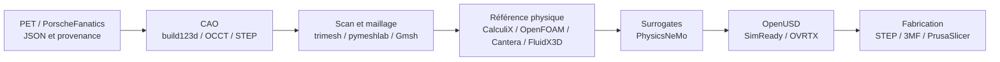

# Stack logicielle du jumeau numérique

Cette page décrit la stack retenue au **8 septembre 2026**, à partir du commit
`b36ddca175897795f63e98e2826083da1376c725` de `main`. Elle distingue les
outils vérifiés des briques seulement définies ou encore bloquées.

## Socle

| Couche | Stack | Rôle |
| --- | --- | --- |
| Données | JSON, schémas JSON, Markdown | `catalog/parts/*.json` est la source de vérité |
| Automatisation | Python standard library, GNU Make | Génération, validation et `make check` |
| Versionnement | Git, GitHub, GitHub Actions | Revue, CI et preuves de build |
| Conteneurs | Docker, Buildx, GHCR | Images `linux/amd64` par digest immuable |
| Secrets/location | wrappers OpenBao, CLI Vast.ai | Accès borné, singleton, récupération et destruction |
| Formats maîtres | build123d, `.FCStd`, OpenSCAD, STEP | Géométrie éditable et dimensionnelle |
| Formats dérivés | STL, 3MF, OBJ, PLY, OpenUSD | Impression, scan, assemblage et visualisation |

Voir aussi [TOOLCHAIN.md](TOOLCHAIN.md),
[COMPUTE_ENVIRONMENT.md](COMPUTE_ENVIRONMENT.md) et
[AI_DIGITAL_TWIN_STACK.md](AI_DIGITAL_TWIN_STACK.md).

## CAO, scan et métrologie

- CAO qualifiée : Python 3.12.14, build123d 0.11.1 et OCCT 7.9.3.1
  dans `cad-author-f28` ; sortie BREP/STEP.
- Scan qualifié : NumPy 2.5.2, SciPy 1.18.1, trimesh 5.1.0,
  pymeshlab 2025.7.post1 et Rtree 1.4.1 dans `scan-mesh-f17`.
- Image générale `mesh-cfd` : Blender, Gmsh, OpenFOAM 13, build123d,
  meshio et manifold3d.
- FreeCAD et OpenSCAD servent à l'auteur/revue humaine ; STEP reste le format
  d'échange dimensionnel et STL/3MF restent des dérivés.

L'image `mesh-cfd` est native sur le X1 `amd64`. Sur le Mac Apple Silicon, son
exécution `amd64` utilise QEMU et Blender n'est pas fiable ; les gros scans
partent donc sur le X1 ou une machine louée.

## Solveurs physiques

| Domaine | Stack retenue | Limite actuelle |
| --- | --- | --- |
| Maillage | Gmsh | La convergence reste à démontrer par cas |
| Structure/thermique | CalculiX `ccx` | Pas de validation physique automatique |
| CFD | OpenFOAM 13 ; OpenFOAM 14 + ICengines/AATE au commit `c0f75f953d67cd325d28d1300672d14288f22934` | Un build ne valide pas un moteur |
| Thermochimie/réseaux | Cantera 3.2.0, NumPy 2.5.2 | Fixtures et modèles non corrélés |
| Contre-calcul LBM | FluidX3D au commit `aba941305a2cc67b0953ba1d2ba177b590dcccc3` | Licence non commerciale |
| Post-traitement | meshio, PyVista, ParaView, `ccx2paraview` | Inspection et conversion des champs |

## IA et PhysicsNeMo

PhysicsNeMo **n'est pas un LLM** et ne remplace pas le solveur de référence.
La stack qualifiée hors GPU est :

- NVIDIA PhysicsNeMo 2.2.1 ;
- Python 3.12.3 ;
- PyTorch 2.10.0 + CUDA 12.8, torchvision 0.25.0 ;
- PyTorch Geometric 2.8.0.post1 ;
- imports vérifiés : DoMINO, GeoTransolver et MeshGraphNet.

Le build, le pull public par digest et les smokes hors GPU sont verts. Un smoke
GPU PhysicsNeMo 2.2.0/PyTorch 2.10.0+cu129 a aussi été exécuté sur le worker du
piston le 8 septembre 2026. Il prouve seulement l'accès CUDA et les opérations
tensor ; l'entraînement, le holdout/OOD et la corrélation physique restent
bloqués.

La voie LLM documentée prévoit Qwen3-Coder-30B-A3B-Instruct pour le code/CAO et
Qwen3-VL-8B-Instruct pour la lecture multimodale, servis par vLLM. L'image
`simready-local-ai` définit aussi Qwen2.5-VL-7B-Instruct au commit
`cc594898137f460bfe9f0759e9844b3ce807cfb5`, vLLM 0.26.0+cu129 et
PyTorch 2.11.0 CUDA 12.9. Cette variante est définie, pas qualifiée comme
runtime courant. Codex orchestre le travail mais n'est jamais une preuve CAE.

PicoGK 2.3.0 avec le runtime natif `picogk.26.2` est maintenant exécuté sur le
X1 amd64. Un balayage de six variantes du piston CP1 F0 a atteint `1,60 %`
d'allègement brut au mieux, mais aucune variante ne satisfait la marge
mécanique provisoire et tous les STL bruts échouent l'intégrité manifold.
PicoGK est donc qualifié comme générateur géométrique de criblage, pas comme
optimiseur physique ni comme source d'une pièce libérée.

CalculiX 2.21 a ensuite exécuté, hors réseau sur le X1, six cas du master piston
sain : statique froide et température–déplacement séquentiel à `5`, `3,5` et
`2,5 mm`. Le niveau fin compte `139 924` nœuds et `81 861` C3D10. Le p95 passe
de `112,17 MPa` à froid à `323,46 MPa` à chaud dans l'enveloppe synthétique ; le
ratio face aux `297 MPa` publiés à l'ambiante tombe à `0,918`. Cette exécution
qualifie la chaîne numérique, mais rejette le dessin F0 et ne fournit ni
admissible CP1 chaud, ni fatigue, ni validation moteur.

## Omniverse et SimReady

L'image Ubuntu 24.04/Python 3.12 isole OVRTX, Material Agent et Physics Agent :

- NVIDIA Content Agents : commit `36dbf3f274f8e256637230a05a085853f65cc175` ;
- SimReady Foundation : commit de l'image `0ed0dfbc539c9de99289771bd6848effe3ef5779` ;
- workflow isolé du passage embout : SimReady Foundation
  `a1e9dd68ee2d107f74dc6cd6da875b54ad3f8fd3` et `usd-convert-cad`
  `208fe2c1cd71ae2bb7bd825daf712617000ae028` ;
- `usd-convert-cad` 0.2.0 ;
- base `simready-workflow` : digest
  `sha256:0562c69276c0d3065990cb9b1b8641dcd29355d0dccb9082dcf266fa2d22e90a` ;
- base `simready-local-ai` : digest workflow
  `sha256:41ddde8e527fcc17a3f29ac90183bd1326c330388240baf2004f99de980d6ebe`.

Le Mac ne porte toujours pas tous ces runtimes. Sur un worker Vast.ai
`linux/amd64`, le piston CP1 F0 passe désormais OpenUSD minimum, NVIDIA Asset
Validator, Geometry, Physics, `Prop-Robotics-Neutral 1.0.0` et les rendus OVRTX.
Cette preuve est bornée à un accessoire d'inspection isolé ; l'assemblage moteur
et le véhicule restent non validés. Voir
[le résumé SimReady](../twins/993-m64-60-piston-gallery-f0/evidence/simready-f0/simready-validation-summary.json).

Le second passage, sur l'embout ovale IN625 F0, passe les mêmes validateurs et
le profil SimReady après suppression des propriétés physiques inventées. La
scène EOS M 290 et les rendus OVRTX sont validés comme préparation visuelle,
pas comme simulation de procédé ou preuve d'installation.

## Simulation d'impression métal

Le pipeline ajoute maintenant un tranchage géométrique générique de chaque
couche LPBF, un écran d'épaisseur, un contrôle de volume fermé et une enveloppe
conservative de supports. Le premier passage réel sur le piston compte 2 390
couches à 50 µm. CalculiX reste le solveur de distorsion de référence et
AdditiveFOAM le solveur local du bain de fusion, mais ils ne doivent être
exécutés comme preuve que lorsqu'une carte matière-machine-procédé cohérente est
disponible. Pour le CP1/Sapphire, cette carte complète manque encore.

Le second passage réel compte `3 702` couches à `40 µm` pour l'embout IN625 sur
une enveloppe EOS M 290. Cette route possède une fiche matière-machine-procédé
cohérente de criblage, mais ni trajectoires EOSPRINT, ni supports fournisseur,
ni carte constitutive calibrée de construction complète.

La politique et les onze étapes obligatoires sont dans
[AM_VALIDATION_PIPELINE.md](AM_VALIDATION_PIPELINE.md). Le validateur suit les
25 fiches qui proposent LPBF ou DMLS et empêche leur libération si une étape est
contournée.

## Images OCI verrouillées

| Image | Digest SHA-256 | Preuve actuelle |
| --- | --- | --- |
| `obj-metrology-f15` | `827e639cd126441dfa98fc097d4c8b09a01a28e25545de62ca3a01da963b959a` | Smoke CPU hors réseau |
| `scan-mesh-f17` | `b48f23d64ceab9c2e6b7b7474cdd81011d27b8a584f7af6b50b6cc05823c5189` | Smoke CPU synthétique |
| `boundary-review-f23` | `860fb1c481a8a4b72cf14d9f1d15d65b9adf327cf268ebbcc26da127427126c9` | Smoke CPU hors réseau |
| `topology-context-f26` | `41764d6d6ed935a763a6b1e07524c68961555b2724e67bbf48a2f261c35a3b10` | Smoke CPU hors réseau |
| `cad-author-f28` | `18dbfa559306a31c909480695acf0e89a9bc904c83d280065c1d9d29036fec57` | STEP synthétique, SBOM, provenance |
| `air-oil-cycle-f34b` | `369d51ee12c259e844d01817702d8debedcf400087ab9b289b8e59671d296664` | Prévol et fixture Cantera non moteur |
| `physicsnemo-cae-cu12` | `045e8bc3151e0938d0f339aceb74c8583878effe5d0e316715e10818a018598a` | Pull public et smoke hors GPU |

Les images générales `recon`, `cadsim`, `mesh-cfd`, `physicsml`, `simready`,
`simready-workflow` et `simready-local-ai` sont définies mais n'ont pas toutes
un lock équivalent. Les tags expérimentaux locaux absents de `main` sont exclus.

## Infrastructure observée

| Nœud | Stack observée | Rôle |
| --- | --- | --- |
| Mac Apple Silicon | macOS 27.0, `arm64`, 10 CPU, 64 Gio ; Docker 29.7.2, Compose 5.4.0, Python 3.10.11 | Contrôleur, catalogue, tests et revue |
| X1 | Kali Rolling, `x86_64`, 12 CPU, 15 Gio ; Docker 28.5.2, Buildx 0.29.1, Compose 2.40.3, Python 3.13.14 | Worker Docker CPU natif `linux/amd64` |
| Vast.ai | conteneurs `linux/amd64` par digest sur GPU NVIDIA loué à la demande | Reconstruction CUDA, PhysicsNeMo, Omniverse |

Les adresses privées, comptes et clés ne sont pas publiés. Les scripts de
[`deploy/vast/simready/`](../deploy/vast/simready/) contrôlent l'instance,
transfèrent une allowlist, récupèrent les résultats et vérifient la destruction.
Le wrapper GHCR installé correspond au dépôt. Le wrapper Vast.ai répond à son
contrôle de lecture mais diffère de la copie versionnée ; il doit être
resynchronisé avant toute location payante.

## Gates avant calcul GPU payant

1. Image `linux/amd64` verte et référencée par digest immuable.
2. Pull GHCR, clé SSH et smoke GPU vérifiés.
3. Entrées et SHA-256 figés, sans secret ni donnée interdite.
4. Coût et unicité de l'instance contrôlés.
5. Récupération et destruction préparées avant le lancement.

Le runbook est [917_VAST_SIMREADY_NATIVE.md](917_VAST_SIMREADY_NATIVE.md).
Une sortie verte valide la chaîne logicielle, jamais la précision d'une pièce,
la physique d'un moteur ou une autorisation de fabrication.
